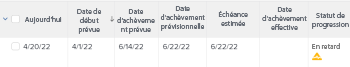
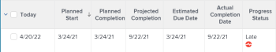
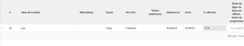

# Vue d’ensemble du statut de la progression d’un projet

<!--Audited: 12/2023-->

Adobe Workfront détermine le statut de progression d’un projet en examinant la progression du projet tout au long de sa chronologie. Vous pouvez configurer Workfront pour qu’il détermine la condition d’un projet en fonction de la valeur du statut de progression des tâches. Pour plus d’informations sur la configuration de la condition du projet, voir l’article [Vue d’ensemble de la condition du projet et du type de condition](../../../manage-work/projects/manage-projects/project-condition-and-condition-type.md).

Voici les statuts de progression des projets dans Workfront :

<table style="table-layout:auto"> 
 <col> 
 <col> 
 <tbody> 
  <tr> 
   <td>À l’heure</td> 
   <td> Le statut de progression d’un projet est <strong>À l’heure</strong> si :<ul><li>Si les dates d’achèvement estimées et projetées sont toutes deux antérieures ou égales à la date d’achèvement prévue du projet.</li></ul> 
  
 </td> 
  </tr> 
  <tr> 
   <td>En danger</td> 
   <td> Le statut de progression d’un projet est <strong>En danger</strong> si <strong>tous</strong> les éléments suivants sont vrais :<ul><li>Les dates d’achèvement estimées et projetées se situent toutes deux dans le futur.</li><li> La date d'achèvement estimée est postérieure à la fois à la date d'achèvement prévue et à la date d'achèvement prévisionnelle </li></ul>
  
 </td> 
  </tr> 
  <tr> 
   <td>En retard</td> 
   <td> Le statut de progression d’un projet est <strong>Retardé</strong> si <strong>tous</strong> les éléments suivants sont vrais :<ul><li>Les dates d’achèvement estimées et projetées se situent toutes deux dans le futur.</li><li> Les dates d’achèvement estimées et projetées sont toutes deux postérieures à la date d’achèvement prévue du projet.</li><li> La date d’achèvement estimée n’est pas postérieure à la date d’achèvement projetée.</li></ul> 
  
 </td> 
  </tr> 
  <tr> 
   <td>En retard</td> 
   <td> 
     Le statut de progression d’un projet est <strong>En retard</strong> si <strong>l’un</strong> des éléments suivants est vrai :<ul><li>Le projet est achevé et la date d’achèvement réelle est postérieure à la date d’achèvement prévue. 
  
 </li> 
     <li> 
Le projet n’est pas achevé et la date d’achèvement prévue est dépassée. 
  
 </li> 
    </ul> </td> 
  </tr> 
 </tbody> 
</table>

Tenez compte des points suivants :

* La date d’achèvement projetée du projet est déterminée par la tâche du chemin critique dont la date d’achèvement projetée est la plus tardive.
* La date d’achèvement estimée du projet est déterminée par la tâche du chemin critique dont la date d’achèvement estimée est la plus tardive.

Pour plus d’informations sur le chemin critique du projet, voir [Vue d’ensemble du chemin critique du projet](../../../manage-work/tasks/manage-tasks/critical-path.md).

Pour plus d’informations sur les dates d’achèvement projetées, voir [Vue d’ensemble de la date d’achèvement prévue pour les projets, les tâches et les problèmes](../../../manage-work/projects/planning-a-project/project-projected-completion-date.md).
