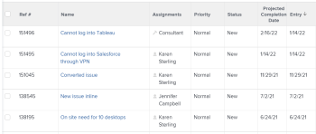

# Vue d’ensemble de la date d’achèvement prévue pour les projets, les tâches et les problèmes

<!-- Audited: 1/2024 -->

La date d’achèvement prévisionnelle est un indicateur calculé en temps réel de la date d’achèvement du projet, de la tâche ou du problème. Lorsque le projet, la tâche ou le problème est marqué comme terminé, la date d’achèvement prévisionnelle devient la date d’achèvement effective.

Les sections suivantes décrivent comment la date d&#39;achèvement prévisionnelle est déterminée pour les projets, tâches et événements, et comment la localiser.

## Conditions d’accès

+++ Développez pour afficher les exigences d’accès aux fonctionnalités de cet article. 

<table style="table-layout:auto"> 
 <col> 
 <col> 
 <tbody> 
  <tr> 
   <td role="rowheader">Package Adobe Workfront</td> 
   <td> 
Tous
 </td> 
  </tr> 
  <tr> 
   <td role="rowheader">Licence Adobe Workfront</td> 
   <td> 
   <ul><li>
Contributeur ou contributrice ou supérieur pour afficher la date d’achèvement prévisionnelle dans un rapport
</li> <li>
Une licence standard pour créer un rapport
</li> </ul>
   Ou
   <ul><li>
Révision ou supérieur pour afficher la date d’achèvement prévisionnelle dans un rapport
</li> 
   <li>
Une licence de plan pour créer un rapport
 </li></ul>
      </td> 
  </tr> 
  <tr> 
   <td role="rowheader">Niveau d’accès</td> 
   <td> 
Accès en affichage ou supérieur aux projets
 
Modifier l’accès aux rapports, tableaux de bord et calendriers pour créer un rapport
 
Modifier l’accès aux filtres, vues, regroupements pour créer un rapport ou modifier une vue de liste
  </td> 
  </tr> 
  <tr> 
   <td role="rowheader">Autorisations d’objet</td> 
   <td> 
Autorisations d’affichage ou de niveau supérieur sur un projet
 </td> 
  </tr> 
 </tbody> 
</table>

Pour plus d’informations, voir [Conditions d’accès dans la documentation Workfront](/help/quicksilver/administration-and-setup/add-users/access-levels-and-object-permissions/access-level-requirements-in-documentation.md).

+++

## Comment Adobe Workfront détermine-t-il la date d’achèvement prévisionnelle ?

La date d’achèvement prévisionnelle est un champ calculé et ne peut pas être modifié manuellement.

Les critères utilisés pour déterminer la date d&#39;achèvement prévisionnelle varient en fonction de l&#39;objet que vous consultez :

* **Projets :** la date d’achèvement prévisionnelle pour les projets correspond à la date d’achèvement prévisionnelle de la dernière tâche du projet.

  Par exemple, un pourcentage terminé plus élevé rapproche la date d’achèvement prévisionnelle de la tâche de la journée actuelle. Si le statut de la tâche est nouveau et que la date d’achèvement prévue de la tâche est proche ou dépassée, la date d’achèvement prévisionnelle s’éloigne dans le futur.

* **Tâches :** la date d’achèvement prévisionnelle pour les tâches est déterminée sur la base des critères suivants :

   * **Mises à jour de l’avancement effectuées sur la tâche par la personne désignée pour la tâche :** les mises à jour de l’avancement incluent les modifications du pourcentage terminé et les modifications du statut de la tâche.
   * **Date d’engagement :** si la personne cessionnaire de la tâche spécifie une date d’engagement, la date d’achèvement prévisionnelle est modifiée pour correspondre à la date d’engagement.

     Pour plus d’informations sur les dates d’engagement, consultez l’article [Présentation des dates d’engagement](../../../manage-work/projects/updating-work-in-a-project/overview-of-commit-dates.md).

   * **Tâches antérieures :** en l&#39;absence de retard pour les tâches antérieures, la date d&#39;achèvement prévisionnelle doit correspondre à la date d&#39;achèvement prévue. Au fur et à mesure des retards, les tâches dépendantes affichent une date d’achèvement prévisionnelle de plus en plus ultérieure à la date d’achèvement prévue.

     Pour plus d’informations sur la date d’achèvement prévue des tâches, voir [Vue d’ensemble de date d’achèvement prévue de la tâche](../../../manage-work/tasks/task-information/task-planned-completion-date.md).

  >[!IMPORTANT]
  >
  >Lorsque le prédécesseur d’une tâche a une date d’achèvement effective, les tâches dépendantes reçoivent une date d’achèvement prévisionnelle comme décrit dans le scénario suivant :
  >
  >
  >Si le projet a la Tâche A, la Tâche B et la Tâche C et que la Tâche B est le successeur de la Tâche A, la Tâche C est le successeur de la Tâche B et une Date d&#39;achèvement effective est ajoutée à la Tâche A, la Date d&#39;achèvement prévisionnelle est automatiquement recalculée pour la Tâche B (à condition que le **Type de mise à jour** du projet soit défini sur Automatique et en cas de modification), mais elle ne sera pas recalculée pour la Tâche C. Actuellement, Workfront calcule la Date d&#39;achèvement prévisionnelle pour les tâches qui sont à un niveau au-dessus ou au-dessous de la Tâche mise à jour, pour des raisons de performances.

* **Problèmes :** la date d’achèvement prévisionnelle du problème est initialement définie pour correspondre à la date d’achèvement prévue du problème.

  Si la personne cessionnaire du problème spécifie une date d’engagement, la date d’achèvement prévisionnelle et la date d’achèvement prévue sont modifiées pour correspondre à la date d’engagement.

  Pour plus d’informations sur les dates d’engagement, voir l’article [Vue d’ensemble de la date d’engagement](../../../manage-work/projects/updating-work-in-a-project/overview-of-commit-dates.md).

## Afficher la date d’achèvement prévisionnelle

Vous pouvez afficher la date d’achèvement prévisionnelle des projets, des tâches et des problèmes dans les rapports. Vous pouvez consulter la date d’achèvement prévisionnelle des projets et des tâches dans d’autres zones de Workfront.

### Afficher la date d&#39;achèvement prévisionnelle d&#39;un projet {#view-the-projected-completion-date-of-a-project}

1. Accédez au projet pour lequel vous souhaitez consulter la date d’achèvement prévisionnelle.
1. Cliquez sur **Détails du projet** dans le panneau de gauche.
1. Localisez le champ **Date d’achèvement prévisionnelle** dans la section **Vue d’ensemble** > **Dates du projet**.

### Afficher la date d&#39;achèvement prévisionnelle d&#39;une tâche {#view-the-projected-completion-date-of-a-task}

1. Accédez à la tâche pour laquelle vous souhaitez afficher la date d’achèvement prévisionnelle.
1. Cliquez sur **Détails de la tâche** dans le panneau de gauche.
1. Localisez le champ **Date d’achèvement prévisionnelle** dans la section **Vue d’ensemble** > **Dates et contrainte de tâche**.

### Afficher la date d&#39;achèvement prévisionnelle d&#39;un événement {#view-the-projected-completion-date-of-an-issue}

Vous pouvez afficher la date d’achèvement prévisionnelle pour les problèmes uniquement dans un rapport de problème ou une vue de liste. La création d’une vue de liste est similaire à celle d’une vue dans un rapport.

Pour créer un rapport de problème qui inclut la date d’achèvement prévisionnelle :

1. Créez un rapport de problème, comme décrit dans l’article [Créer un rapport personnalisé](../../../reports-and-dashboards/reports/creating-and-managing-reports/create-custom-report.md).
1. Sélectionnez l’onglet **Colonnes (Vue)**.
1. Cliquez sur **Ajouter une colonne**, et commencez à saisir la **Date d’achèvement prévisionnelle** dans le champ **Afficher dans cette colonne :**.

1. Sélectionnez-le lorsqu’il apparaît dans la liste, sous l’objet **Problème**.
1. Cliquez sur **Enregistrer + Fermer**.

   La colonne **Date d’achèvement prévue** du rapport est renseignée.

   
