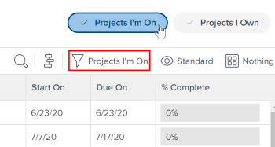

# Vue d’ensemble de l’équipe d’un projet

Les utilisateurs associés à un projet dans une certaine capacité forment l’équipe du projet. Les utilisateurs répertoriés sous la zone Personnes d’un projet sont les utilisateurs qui constituent l’équipe du projet. Par exemple, les utilisateurs qui sont affectés au projet ou le propriétaire du projet font partie de l’équipe du projet.

## Membres de l’équipe de projet

Vous pouvez affecter des utilisateurs à une équipe de projet manuellement ou automatiquement. Pour plus d’informations, voir la section &quot;Ajout d’utilisateurs à une équipe de projet&quot; dans l’article [Gérer l’équipe de projet](../../../manage-work/projects/planning-a-project/manage-project-team.md).

Lorsque vous ajoutez manuellement des utilisateurs à l’équipe de projet, ils reçoivent les autorisations d’affichage du projet ainsi que les tâches, problèmes et documents du projet.

## Notifications aux membres de l’équipe de projet

Selon les notifications par e-mail activées par votre administrateur Adobe Workfront, les utilisateurs d’une équipe de projet sont informés de diverses actions sur un projet. Pour plus d&#39;informations sur l&#39;activation des notifications par e-mail, voir [Configuration des notifications d&#39;événement pour tous les membres du système](../../../administration-and-setup/manage-workfront/emails/configure-event-notifications-for-everyone-in-the-system.md).

>[!NOTE]
>
>Veillez à mettre à jour l’appartenance à l’équipe de projet afin d’éviter d’envoyer des notifications aux utilisateurs qui n’ont pas besoin d’informations sur un projet.

## Approbations basées sur les rôles

Pour utiliser les approbations basées sur les rôles sur un projet, les utilisateurs doivent être affectés à l’équipe du projet et avoir le rôle de tâche approprié affecté dans leur profil utilisateur.

Pour plus d’informations sur l’ajout d’un utilisateur à l’équipe de projet et sur l’affectation d’un rôle de tâche, reportez-vous aux articles suivants :

* [Gérer l’équipe de projet](../../../manage-work/projects/planning-a-project/manage-project-team.md)
* [Modifier le profil d’un utilisateur ou d’une utilisatrice](../../../administration-and-setup/add-users/create-and-manage-users/edit-a-users-profile.md)

Si vous ne souhaitez pas que l’utilisateur soit membre de l’équipe du projet pour les approbations basées sur les rôles, vous pouvez le contrôler dans les paramètres d’approbation. Pour plus d’informations, voir [Configuration des paramètres d’approbation globale](../../../administration-and-setup/customize-workfront/configure-approval-milestone-processes/establish-approval-settings.md).

## Filtre Projets actifs

Si un utilisateur est répertorié dans la zone Personnes d’un projet, ce projet s’affiche lorsqu’il applique le filtre Projets actifs dans une liste de projets ou un rapport de projet.

Vous pouvez voir si le filtre Projets actif est sélectionné dans l’en-tête de la zone Projets . Vous pouvez l’appliquer à partir du panneau Filtres ou de l’en-tête.

>[!NOTE]
>
>Si vous êtes l’auteur d’un projet, celui-ci reste répertorié dans la liste Projets auxquels je suis inscrit, même si votre nom n’apparaît pas dans la zone Personnes du projet ou si votre nom a été supprimé de cette liste.
