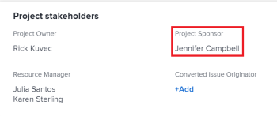

# Mettre à jour les propriétaires et les sponsors du projet

<!--Audited: 07/2024-->

Lorsque vous créez un projet dans Adobe Workfront, vous devenez automatiquement propriétaire du projet. Vous pouvez mettre à jour ce champ avec un autre utilisateur ou une autre utilisatrice. Vous pouvez également mettre à jour le champ Sponsor du projet d’un projet.

Pour plus d’informations sur les propriétaires et les sponsors du projet, voir [Vue d’ensemble des propriétaires et des sponsors du projet](../../../manage-work/projects/planning-a-project/project-owners-and-sponsors.md).

>[!TIP]
>
>Vous pouvez identifier un ou une propriétaire et un sponsor pour un modèle. Lorsque vous créez un projet à partir de ce modèle, le ou la propriétaire du modèle devient propriétaire du projet et le sponsor du modèle devient sponsor du projet.
>
>Si le modèle ne comporte pas de propriétaire, la personne qui crée le projet à partir du modèle devient propriétaire du projet.
>
>Pour plus d’informations sur la modification de modèles, voir [Modifier des modèles de projet](../../../manage-work/projects/create-and-manage-templates/edit-templates.md).

## Conditions d’accès

+++ Développez pour afficher les exigences d’accès aux fonctionnalités de cet article. 

<table style="table-layout:auto"> 
 <col> 
 <col> 
 <tbody> 
  <tr> 
   <td role="rowheader">Package Adobe Workfront</td> 
   <td> 
Tous
 
  
 </td> 
  </tr> 
  <tr> 
   <td role="rowheader">Licence Adobe Workfront</td> 
   <td>
Standard
 
   
Plan
 </td> 
  </tr> 
  <tr> 
   <td role="rowheader">Configurations des niveaux d’accès</td> 
   <td> 
Accès en modification aux projets
 </td> 
  </tr> 
  <tr> 
   <td role="rowheader">Autorisations d’objet</td> 
   <td> 
Modifier les autorisations d’un projet
 </td> 
  </tr> 
 </tbody> 
</table>

Pour plus d’informations, voir [Conditions d’accès requises dans la documentation Workfront](/help/quicksilver/administration-and-setup/add-users/access-levels-and-object-permissions/access-level-requirements-in-documentation.md).

+++

<!--
Old:

<table style="table-layout:auto"> 
 <col> 
 <col> 
 <tbody> 
  <tr> 
   <td role="rowheader">Adobe Workfront plan</td> 
   <td> 
Any
 
  
 </td> 
  </tr> 
  <tr> 
   <td role="rowheader">Adobe Workfront license*</td> 
   <td>
New: Standard
 
   
Current: Plan 
 </td> 
  </tr> 
  <tr> 
   <td role="rowheader">Access level configurations*</td> 
   <td> 
Edit access to Projects
 </td> 
  </tr> 
  <tr> 
   <td role="rowheader">Object permissions</td> 
   <td> 
Edit permissions to a project
 </td> 
  </tr> 
 </tbody> 
</table>
-->

## Mettre à jour le ou la propriétaire d’un projet

Lorsque vous ajoutez une personne en tant que propriétaire de projet, Workfront lui accorde automatiquement des autorisations pour afficher le projet.

1. Accédez au projet que vous souhaitez mettre à jour.
1. Cliquez sur **Détails du projet** dans le panneau de gauche.
1. Cliquez sur l’icône **Modifier**  dans le coin supérieur droit de la zone Détails du projet, puis cliquez sur **Aperçu**.

1. Indiquez le nom d’un utilisateur ou d’une utilisatrice pour le champ **Propriétaire du projet**.

   Seules les personnes actives peuvent être spécifiées en tant que propriétaires du projet.

1. Cliquez sur **Enregistrer les modifications**.

   Le ou la propriétaire du projet est mis à jour dans l’en-tête du projet et dans la zone Détails du projet.

   

## Mettre à jour le sponsor du projet

Lorsque vous ajoutez une personne en tant que sponsor du projet, Workfront lui accorde automatiquement des autorisations d’affichage du projet.

>[!TIP]
>
>Si la personne que vous ajoutez en tant que sponsor du projet fait partie de l’équipe d’administration système, elle n’est pas ajoutée à la liste de partage du projet.

1. Accédez au projet que vous souhaitez mettre à jour.
1. Cliquez sur **Détails du projet** dans le panneau de gauche.
1. Cliquez sur l’icône **Modifier**  dans le coin supérieur droit de la zone Détails du projet, puis cliquez sur **Aperçu**.

1. Indiquez le nom d’une personne pour le champ **Sponsor du projet**.

   Seules les personnes actives peuvent être spécifiées en tant que sponsors du projet.

1. Cliquez sur **Enregistrer les modifications**.

   Le sponsor du projet est mis à jour dans la zone Détails du projet.

   
