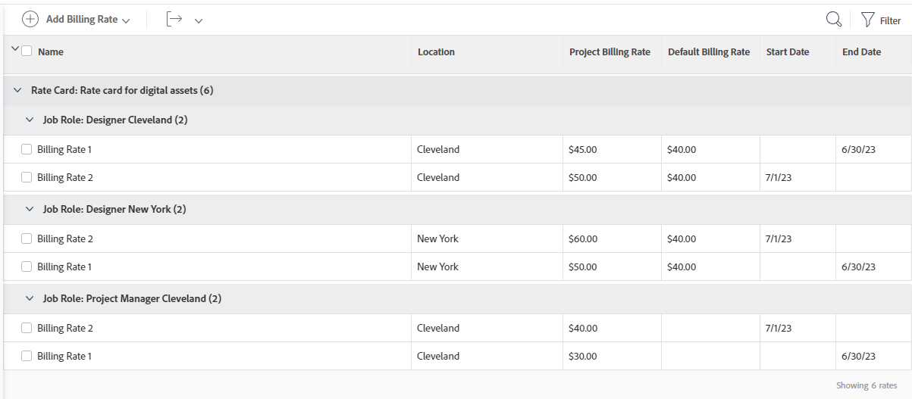

# Joindre une carte tarifaire à un projet

{{highlighted-preview-article-level}}

Les cartes tarifaires stockent plusieurs taux de facturation par fonction, selon l’emplacement. Vous pourriez par exemple avoir une fonction de concepteur ou conceptrice basé à Paris et une seconde fonction de concepteur ou conceptrice basé à New York, avec des taux de facturation différents chacun. Toutefois, il n’est pas nécessaire d’indiquer un emplacement pour les fonctions figurant sur une carte tarifaire. Un taux de facturation pour une fonction (et éventuellement un emplacement) sur une carte tarifaire peut également inclure des dates d’entrée en vigueur.

Lorsque vous joignez une carte tarifaire à un projet, tous les rôles par emplacement et leurs taux de facturation associés sont ajoutés au projet.

>[!NOTE]
>
>Le fait de joindre une carte tarifaire remplace les taux de facturation existants sur le projet.

Vous pouvez modifier les taux de facturation à partir de la carte tarifaire directement dans le projet. Cela n’affecte pas les taux enregistrés sur la carte tarifaire par défaut.

Pour plus d’informations sur la création de cartes tarifaires, voir [Gérer les cartes tarifaires](/help/quicksilver/administration-and-setup/set-up-workfront/configure-system-defaults/manage-rate-cards.md).

Pour des informations générales sur la modification des taux de facturation des fonctions pour les projets et le calcul des revenus d’un projet, voir [Vue d’ensemble de la modification des taux de facturation des fonctions et du calcul des revenus d’un projet](/help/quicksilver/manage-work/projects/project-finances/override-role-billing-rates-and-calculate-project-revenue.md).

## Conditions d’accès

+++ Développez pour afficher les exigences d’accès aux fonctionnalités de cet article.

Vous devez disposer des accès suivants pour effectuer les étapes décrites dans cet article :

<table style="table-layout:auto"> 
 <col> 
 <col> 
 <tbody> 
  <tr> 
   <td role="rowheader">Formule Adobe Workfront</td> 
   <td>Tous</td> 
  </tr> 
  <tr> 
   <td role="rowheader">Licence Adobe Workfront</td> 
   <td>
   
Nouveau : Standard

   
ou

   
Actuel : formule
</td> 
  </tr> 
  <tr> 
   <td role="rowheader">Configurations des niveaux d’accès</td> 
   <td> 
Accès en modification aux projets et aux données financières
 
Accès administratif aux fonctions
</td> 
  </tr> 
  <tr> 
   <td role="rowheader">Autorisations d’objet</td> 
   <td>Autorisations de gestion pour le projet avec les autorisations de gestion financière </td> 
  </tr> 
 </tbody> 
</table>

Pour plus de détails sur les informations contenues dans ce tableau, consultez [Conditions d’accès préalables dans la documentation Workfront](/help/quicksilver/administration-and-setup/add-users/access-levels-and-object-permissions/access-level-requirements-in-documentation.md).

+++

## Joindre une carte tarifaire à un projet

1. Accédez au projet.
1. Cliquez sur **Taux de facturation** dans le panneau de gauche.
1. Cliquez sur **Ajouter un taux de facturation > Joindre une carte tarifaire**.

   La page Joindre une carte tarifaire s’ouvre. Pour plus d’informations, voir [Gérer les cartes tarifaires](/help/quicksilver/administration-and-setup/set-up-workfront/configure-system-defaults/manage-rate-cards.md).

1. Sélectionnez la carte tarifaire à ajouter au projet et cliquez sur **Joindre**.

   La carte tarifaire et tous ses taux des fonctions sont ajoutés à la liste des taux de facturation.

   

   >[!NOTE]
   >
   >Dans la liste des taux de facturation, vous pouvez supprimer une ou plusieurs fonctions provenant d’une carte tarifaire. La suppression d’un taux de facturation d’une fonction dans le projet ne le supprime pas de la carte tarifaire par défaut.
