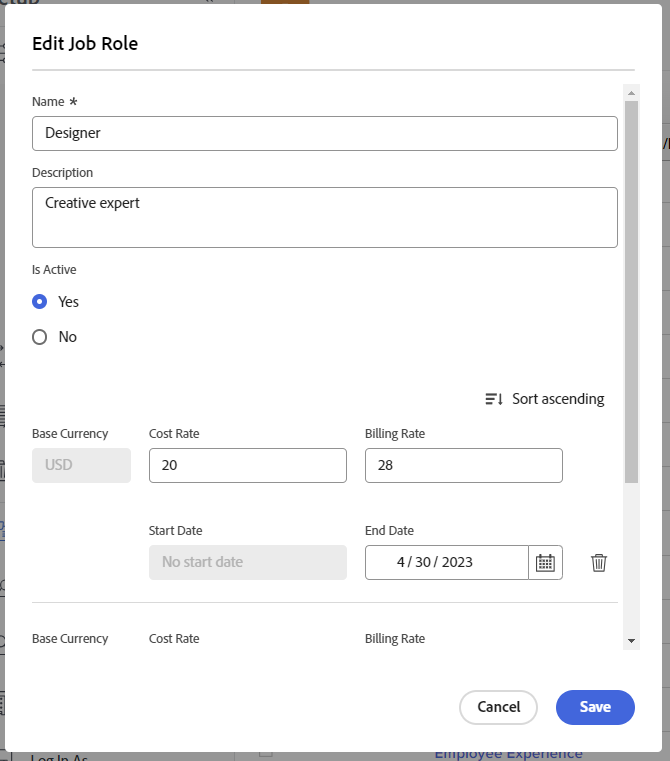

# Vue d’ensemble de la facturation et des revenus

<!-- Audited: 1/2024 -->

{{highlighted-preview}}

En tant que personne responsable de projet, vous pouvez utiliser les taux de facturation pour générer des revenus sur vos projets.

Cet article décrit le suivi des revenus pour les projets. Les revenus sont calculés différemment dans le rapport d’utilisation. Pour plus d’informations sur le calcul des revenus dans le rapport d’utilisation, voir [Afficher les informations sur l’utilisation des ressources](../../../resource-mgmt/resource-utilization/view-utilization-information.md).

## Vue d’ensemble des taux de facturation

Tenez compte des éléments suivants lorsque vous travaillez avec des taux de facturation :

* Vous avez besoin d’un plan ou d’une licence Standard avec accès aux données financières pour gérer les taux de facturation.\
  Pour plus d’informations sur l’octroi de l’accès aux données financières, voir [Octroyer l’accès aux données financières](../../../administration-and-setup/add-users/configure-and-grant-access/grant-access-financial.md).

* Les taux de facturation sont des montants de revenus par unité de travail associés à des fonctions ou à des utilisateurs et utilisatrices.

  En multipliant les taux par les heures de travail, vous générez des revenus pour vos projets.

* Après avoir établi vos taux de facturation, vous pouvez suivre les revenus en créant des enregistrements de facturation pour enregistrer ce qui a été facturé et ce qui ne l’a pas été.

  >[!TIP]
  >
  >Lorsque vous marquez un enregistrement de facturation comme étant facturé, il ne peut jamais être modifié. C’est important lorsque vos taux varient et que vous souhaitez verrouiller les informations relatives aux revenus et aux dépenses de votre projet. Le fait de les ajouter à un enregistrement de facturation et de les marquer comme facturées les empêche d’être mises à jour lorsque les taux sont actualisés dans votre système.

  Pour plus d’informations sur la création d’enregistrements de facturation, voir l’article [Créer des enregistrements de facturation](../../../manage-work/projects/project-finances/create-billing-records.md).

* Vous pouvez créer des taux de facturation pour les utilisateurs et utilisatrices, les fonctions, ou vous pouvez avoir un taux de facturation unique pour un projet ou une tâche.

>[!IMPORTANT]
>
>Les taux qui calculent les revenus appartiennent à l’utilisateur ou à l’utilisatrice qui consigne le temps ou à sa fonction.

* [Taux de facturation des utilisateurs et utilisatrices](#user-billing-rates)
* [Taux de facturation des fonctions](#job-role-billing-rates)
* [Taux de facturation fixes pour les projets ou les tâches](#fixed-billing-rates-for-projects-or-tasks)
* [Remplacer les taux de facturation](#override-billing-rates)

### Taux de facturation des utilisateurs et utilisatrices {#user-billing-rates}

En tant qu’administrateur ou administratrice des utilisateurs et utilisatrices, lorsque vous créez un utilisateur ou une utilisatrice, vous pouvez l’associer à des taux de facturation avec date d’entrée en vigueur en spécifiant des valeurs pour les champs Facturation à l’heure et les dates des taux.

Pour plus d’informations sur la création d’utilisateurs et d’utilisatrices, voir l’article [Ajouter des utilisateurs et utilisatrices](../../../administration-and-setup/add-users/create-and-manage-users/add-users.md).

### Taux de facturation des fonctions {#job-role-billing-rates}

En tant qu’administrateur ou administratrice Adobe Workfront, lorsque vous créez une fonction, vous pouvez l’associer à des taux de facturation avec date d’effet en spécifiant des valeurs pour les champs Facturation à l’heure et les dates des taux.

Vous pouvez définir la valeur du taux de facturation d’une fonction en utilisant la devise de base de votre système Workfront ou une autre devise personnalisée.

Pour plus d’informations sur la création de fonctions et la modification de leur devise, voir l’article [Créer et gérer des fonctions](../../../administration-and-setup/set-up-workfront/organizational-setup/create-manage-job-roles.md).

### Taux de facturation fixes pour les projets ou les tâches {#fixed-billing-rates-for-projects-or-tasks}

Outre les taux horaires pour les utilisateurs, les utilisatrices et les fonctions, vous pouvez également appliquer les taux de facturation fixes suivants :

* Montant fixe pour le type de revenu Fixe par heure
* Montant fixe pour le type de revenu Revenus fixes

Pour plus d’informations sur la manière dont les taux de facturation fixes sont utilisés pour calculer les revenus, voir [Vue d’ensemble des types de revenus des tâches](#overview-of-task-revenue-types).

### Remplacer les taux de facturation {#override-billing-rates}

>[!IMPORTANT]
>
>Vous pouvez remplacer les taux de facturation associés aux fonctions. Vous ne pouvez pas remplacer les taux de facturation des utilisateurs et utilisatrices ou les taux fixes.

Vous pouvez modifier les taux de facturation des fonctions pour les éléments suivants :

* Entreprise spécifique

  Pour plus d’informations sur la création de taux de facturation de fonctions spécifiques à une entreprise, voir [Créer et modifier des entreprises](../../../administration-and-setup/set-up-workfront/organizational-setup/create-and-edit-companies.md).

* Projet spécifique

  Pour plus d’informations sur la création de taux de facturation de fonctions spécifiques à un projet, voir l’article [Vue d’ensemble du remplacement des taux de facturation des fonctions et du calcul des revenus sur un projet](../../../manage-work/projects/project-finances/override-role-billing-rates-and-calculate-project-revenue.md).

## Suivre les montants des revenus

Workfront peut suivre automatiquement les revenus prévus lorsque des tâches sont créées en fonction du nombre d’heures prévues de ces tâches.

Il peut également suivre automatiquement les revenus réels lorsque les heures effectives sont consignées pour les tâches, les problèmes et le projet.

Le tableau suivant présente les types de revenus associés aux tâches, aux problèmes et aux projets.

<table style="table-layout:auto"> 
 <col> 
 <col> 
 <tbody> 
  <tr> 
   <td role="rowheader">Revenus prévus</td> 
   <td> 
Pour les tâches, il s’agit des revenus associés au nombre d’heures prévues. Les heures prévues pour toutes les tâches sont ajoutées aux heures prévues pour le projet, pour contribuer au calcul des heures prévues pour le projet. 
 
Pour plus d’informations sur les heures prévues dans Workfront, voir la section <a href="../../../manage-work/tasks/task-information/planned-hours.md" class="MCXref xref">Vue d’ensemble des heures prévues</a>. 
 <ul><li>
Workfront calcule les revenus prévus pour les tâches à l’aide de cette formule :

   
<code>Task Planned Revenue = Planned Hours * Billing hourly rate</code>
 
<strong>NOTE</strong>  Le taux horaire facturé dans la formule tient compte de toute modification du taux à la date d’entrée en vigueur.
 </li><li>
Workfront calcule les revenus prévus pour les projets à l’aide de la formule suivante :
 
<code>Project Planned Revenue = SUM (All tasks Planned Revenue) + Fixed Revenue</code>

   
<b>NOTE</b>

Les revenus prévus pour le projet, qui s’affichent dans la zone Détails du projet et dans les rapports de projet, diffèrent des revenus prévus qui s’affichent dans le rapport d’utilisation. 
</li></ul> 
Les revenus prévus dans la zone Détails du projet reflètent les revenus de la tâche associés aux heures prévues pour la tâche ainsi que les revenus fixes du projet. Les revenus prévus dans le rapport d’utilisation affichent les revenus prévus associés uniquement aux heures prévues des affectations de tâches sur le projet. 
 
     
Example: </b>"> 
      
Si le projet comporte une tâche de 10 heures, affectée à une personne externe au taux horaire de 20 $ et que le projet a des revenus fixes de 100 $, le rapport d’utilisation affiche 200 $ pour les revenus prévus (les revenus prévus associés aux heures de la tâche). La section Détails du projet affiche 300 $ (les revenus prévus de la tâche et les revenus fixes du projet). 
 
     
 
 
Les revenus prévus pour la tâche sont calculés en utilisant les taux horaires de facturation des utilisateurs et utilisatrices ou des fonctions affectées aux tâches. Le type de revenu des tâches influence le taux (utilisateur, utilisatrice ou rôle) utilisé pour calculer les revenus prévus. Pour plus d’informations, voir les sections suivantes de cet article :
 
    <ul> 
     <li> 
<a href="#overview-of-task-revenue-types" class="MCXref xref">Vue d’ensemble des types de revenus des tâches</a> 
 </li> 
     <li> 
<a href="#revenue-calculations-for-tasks-based-on-user-and-role-assignments" class="MCXref xref">Calculer des revenus pour les tâches en fonction de l’affectation des utilisateurs et utilisatrices et des rôles</a> 
 </li> 
    </ul> 
Pour plus d’informations sur le calcul des revenus planifiés dans le rapport d’utilisation, voir la section <a href="../../../resource-mgmt/resource-utilization/view-utilization-information.md" class="MCXref xref">Afficher les informations sur l’utilisation des ressources</a>. 
 </td> 
  </tr> 
  <tr> 
   <td role="rowheader">Revenus réels*</td> 
   <td> 
Revenus associés aux heures effectives des tâches, des problèmes et des projets. 
 
En général, Workfront calcule les revenus réels à l’aide de cette formule :
 
<code>Actual Revenue = Actual Hours * Billing rate</code> 
 
<strong>NOTE</strong>  Le taux horaire facturé dans la formule tient compte de toute modification du taux à la date d’entrée en vigueur.
 
Pour plus d’informations sur le calcul des revenus réels dans le rapport d’utilisation, voir la section <a href="../../../resource-mgmt/resource-utilization/view-utilization-information.md" class="MCXref xref">Afficher les informations sur l’utilisation des ressources</a>. 
 
<b>CONSEIL</b>

Vous ne pouvez pas afficher les revenus réels au niveau du problème, mais les revenus associés aux heures effectives sur les problèmes contribuent aux revenus réels du projet. 
 </td>
</tr> 
 </tbody> 
</table>

* Pour les heures effectives, les taux de l’utilisateur ou de l’utilisatrice concernent toujours la personne qui consigne les heures ou les taux de ses fonctions. Pour savoir à quel moment Workfront utilise les taux de l’utilisateur ou de l’utilisatrice et à quel moment où il utilise les taux de ses fonctions, voir la section [Calculs de revenus](#revenue-calculations) dans cet article.

<!--Note from the table for Planned Revenue line: 
     
(the note below is duplicated in this article: /Content/Resource Mgmt/Resource utilization/view-utilization-information.htm and in the glossary)

    -->

Par exemple, si une tâche ayant un Type de revenus horaires de l’utilisateur ou de l’utilisatrice est prévue pour une durée de 2 heures et que la personne qui y est affectée a un taux horaire de 30 $, les revenus prévus de la tâche sont de 60 $. Lorsque la tâche est terminée, si l’utilisateur ou l’utilisatrice ne consigne que 1,5 heure comme temps réel passé sur la tâche, le montant des revenus réels est de 45 $. Si une autre personne, non affectée à la tâche, consigne le temps, les revenus réels sont calculés sur la base de ses taux de facturation.

Vous pouvez enregistrer les revenus de la manière suivante :

* En définissant le type de revenu de vos tâches et en associant les utilisateurs et utilisatrices ou les rôles affectés aux éléments de travail à des taux de facturation. Cette opération calcule les revenus en fonction du nombre d’heures prévues ou effectives des éléments de travail. Vous pouvez fixer une limite au montant maximum facturé pour les tarifs horaires, ou non.\
  Pour plus d’informations sur la spécification du type de revenu d’une tâche, voir l’article [Modifier les tâches](../../../manage-work/tasks/manage-tasks/edit-tasks.md).

* En facturant un taux de revenu fixe forfaitaire pour les tâches ou les projets.\
  Si vous disposez de tâches avec des revenus fixes, le montant des revenus fixes sera ajouté aux revenus prévus d’une tâche ou d’un projet, et les revenus prévus d’une tâche pourront être ajoutés à un enregistrement de facturation en tant que revenus fixes.
* En fixant un taux de revenu fixe forfaitaire pour la facturation d’un projet, puis en fixant les taux horaires pour les tâches du projet. Workfront ajoute les taux horaires des tâches au taux forfaitaire du projet.\
  Par exemple, un mécanicien utilisant Workfront peut saisir le coût des pièces comme revenu fixe pour le projet, puis facturer à l’heure le temps passé à réparer une voiture. Les revenus fixes des projets ou des tâches sont alors réalisés à l’achèvement de l’événement.

Vous pouvez également marquer vos tâches comme « non facturables », auquel cas aucun revenu prévu ni réel ne leur est associé.

## Vue d’ensemble des types de revenus des tâches {#overview-of-task-revenue-types}

Par défaut, le type de revenu de toutes les nouvelles tâches est défini en fonction des préférences de tâche et de problème spécifiées par votre équipe d’administration Workfront ou de groupes.\
Pour plus d’informations sur la définition des préférences de tâches et de problèmes pour votre instance Workfront, voir l’article [Configurer les préférences de tâches et de problèmes à l’échelle du système](../../../administration-and-setup/set-up-workfront/configure-system-defaults/set-task-issue-preferences.md).

La personne propriétaire du projet peut modifier le type de revenu des tâches et les revenus fixes des projets.\
Pour plus d’informations sur la spécification des revenus fixes d’un projet, voir l’article [Modifier les projets](../../../manage-work/projects/manage-projects/edit-projects.md).\
Pour plus d’informations sur la spécification du type de revenu d’une tâche, voir l’article [Modifier les tâches](../../../manage-work/tasks/manage-tasks/edit-tasks.md).

Vous pouvez appliquer les types de revenus suivants à vos tâches ou projets :

<table border="1" cellspacing="15"> 
 <col> 
 <col> 
 <thead> 
  <tr> 
   <th> 
<strong>Type de revenu</strong> 
 </th> 
   <th> 
<strong>Description</strong> 
 </th> 
  </tr> 
 </thead> 
 <tbody> 
  <tr> 
   <td> 
Revenus fixes
 </td> 
   <td> 
Ce type peut être utilisé pour les projets et les tâches. 
 
Lorsqu’un modèle est joint à un projet, le revenu fixe du modèle est ajouté au revenu fixe du projet. Pour plus d’informations, voir <a href="../../../manage-work/projects/create-and-manage-templates/attach-template-to-project-overview.md" class="MCXref xref">Vue d’ensemble de l’attachement d’un modèle à un projet</a>. 
 
Pour les tâches, quelle que soit les affectations de la tâche, le revenu de la tâche est toujours calculé à l’aide du montant fixe spécifié dans la tâche. 
 
Les revenus fixes des tâches enfant sont répercutés sur les revenus de la tâche parent, puis sur les revenus du projet. Si un montant fixe est défini sur la tâche parent et/ou le projet, le montant est ajouté aux revenus prévus cumulés de toutes les tâches enfant.
 
Le montant des revenus fixes sur les tâches peut être inclus dans un enregistrement de facturation sur le projet.
 </td> 
  </tr> 
  <tr> 
   <td> 
Utilisateur, par heure
 </td> 
   <td> 
Ce type ne peut être utilisé que pour les tâches. 
 
Le taux de facturation que vous avez défini pour une personne spécifique multiplié par le nombre d’heures prévues pour cette tâche devient le montant des revenus prévus de la tâche. Le taux de facturation que vous avez défini pour une personne spécifique multiplié par le nombre d’heures que la personne consigne pour la tâche est le montant des revenus réels de la tâche.  Par exemple, vous créez un utilisateur ou une utilisatrice et vous définissez 20 $ pour son champ Facturation par heure. Si la personne consigne 5 heures pour une tâche sur la feuille de temps, le montant de la facturation réelle de la tâche est de 100 $.

   
Un profil d’utilisateur ou d’utilisatrice peut contenir plusieurs taux de facturation avec des dates d’entrée en vigueur. Par exemple, le premier taux de facturation de 20 $ se termine le 30 avril 2023 et le deuxième taux de facturation de 25 $ commence le 1er mai 2023. Si la personne consigne 2 heures le 28 avril et 3 heures le 2 mai pour une tâche, le montant de facturation réel de la tâche est de 40 $ + 75 $ = 115 $.

   
<b>CONSEIL</b>

Il s’agit du type de revenu par défaut lorsque vous créez une tâche.
 </td>
</tr> 
  <tr> 
   <td> 
Rôle par heure
 </td> 
   <td> 
Ce type ne peut être utilisé que pour les tâches.
 
Ce type est similaire au taux par heure de l’utilisateur ou de l’utilisatrice mais il utilise les taux de la fonction plutôt que les taux de l’utilisateur ou de l’utilisatrice.
 
<strong>NOTE</strong>  Une fonction peut également avoir plusieurs taux de facturation avec des dates d’entrée en vigueur.
</td> 
  </tr> 
  <tr> 
   <td> 
Personne, par heure avec limite
 </td> 
   <td> 
Ce type ne peut être utilisé que pour les tâches.
 
Les tâches sont facturées à l’heure comme pour Personne, par heure mais elles ont un montant limite maximum que vous pouvez spécifier.  Par exemple, si le taux de facturation d’une personne est de 25 $, mais que le montant limite de la tâche est de 20 $, et que la personne consigne une heure, le revenu réel de la tâche est de 20 $. 
 </td> 
  </tr> 
  <tr> 
   <td> 
Rôle, par heure avec limite
 </td> 
   <td> 
Ce type ne peut être utilisé que pour les tâches.
 
Ce type est similaire à Personne, par heure avec limite, mais il utilise les taux de la fonction plutôt que les taux de l’utilisateur ou de l’utilisatrice. 
 </td> 
  </tr> 
  <tr> 
   <td> 
Utilisateur, par heure plus fixe
 </td> 
   <td> 
Ce type ne peut être utilisé que pour les tâches. 
 
Les tâches sont facturées à l’heure comme pour Personne, par heure, mais elles sont assorties d’un montant fixe que vous pouvez ajouter au tarif de l’utilisateur ou de l’utilisatrice. Le montant fixe spécifié dans la tâche peut être inclus dans les enregistrements de facturation du projet. Le montant fixe n’est pas multiplié par les heures consacrées à la tâche. Seul le taux de facturation de l’utilisateur ou de l’utilisatrice le fait. 
 </td> 
  </tr> 
  <tr> 
   <td> 
Rôle par heure plus fixe
 </td> 
   <td> 
Ce type ne peut être utilisé que pour les tâches. 
 
Les tâches sont facturées à l’heure comme Rôle, par heure, mais elles sont assorties d’un montant fixe supplémentaire que vous pouvez ajouter au taux du rôle. Le montant fixe spécifié dans la tâche peut être inclus dans les enregistrements de facturation du projet. Le montant fixe n’est pas multiplié par les heures consacrées à la tâche. Seul le taux de facturation de la fonction le permet. 
 </td> 
  </tr> 
  <tr> 
   <td> 
Fixe par heure
 </td> 
   <td> 
Ce type ne peut être utilisé que pour les tâches.
 
La limite ou le montant fixe que vous avez défini pour la tâche, multiplié par le nombre d’heures saisies pour la tâche (indépendamment de la personne ou de sa fonction), constitue le montant de la facturation.
 </td> 
  </tr> 
  <tr> 
   <td> 
Non facturable
 </td> 
   <td> 
Ce type ne peut être utilisé que pour les tâches.
 
Ce type de revenu n’a aucun effet sur les revenus. 
 
Si un objet parent dispose de ce paramètre, les tâches enfant ayant un type de facturation s’appliqueront toujours normalement.
 
Lorsqu’une personne n’ayant pas accès aux données financières ou n’ayant pas d’autorisations financières sur un modèle crée un projet à partir de ce modèle, il s’agit du type de revenu par défaut pour les tâches du projet.
 
Pour plus d’informations sur l’accès aux données financières, voir l’article <a href="../../../administration-and-setup/add-users/configure-and-grant-access/grant-access-financial.md" class="MCXref xref">Octroyer l’accès aux données financières</a>. Pour plus d’informations sur les autorisations financières relatives aux objets, voir l’article <a href="../../../workfront-basics/grant-and-request-access-to-objects/sharing-permissions-on-objects-overview.md" class="MCXref xref">Vue d’ensemble du partage des autorisations sur les objets</a>. Pour plus d’informations sur la création de projets à partir de modèles, voir l’article <a href="../../../manage-work/projects/create-projects/create-project-from-template.md" class="MCXref xref">Créer un projet à l’aide d’un modèle</a>. 
 </td> 
  </tr> 
 </tbody> 
</table>

## Vue d’ensemble des revenus pour les tâches parent

Si vous transformez une tâche autonome contenant des informations de facturation en une tâche parent, la nouvelle tâche parent conserve toutes les informations de facturation qui lui ont été précédemment appliquées, ainsi que les heures précédemment appliquées. Toutes les informations de facturation provenant des heures enregistrées dans les tâches enfant seront répercutées en tant que revenus réels dans la nouvelle tâche parent.

Les revenus prévus des tâches enfant sont également répercutés sur la tâche parent.

## Vue d’ensemble des revenus pour les problèmes

Les problèmes n’ont pas de montants pour les revenus prévus ou réels, mais ils peuvent avoir des coûts réels.

Si vous consignez des heures pour un problème et que vous utilisez un type d’heure marqué « Comptabiliser comme revenu », Workfront calcule un coût réel en fonction du taux de la personne qui consigne le temps. Ce nombre est ajouté au coût réel du projet. Les heures peuvent également être incluses dans un enregistrement de facturation.

Pour plus d’informations sur le suivi des coûts, voir l’article [Suivre les coûts](../../../manage-work/projects/project-finances/track-costs.md).

Pour plus d’informations sur les types d’heures, voir l’article [Gérer les types d’heures](../../../administration-and-setup/set-up-workfront/configure-timesheets-schedules/hour-types.md).

## Calcul des revenus

* [Calcul des revenus pour les tâches en fonction de l’affectation des utilisateurs et utilisatrices et des rôles](#revenue-calculations-for-tasks-based-on-user-and-role-assignments)

### Calcul des revenus pour les tâches en fonction de l’affectation des utilisateurs et utilisatrices et des rôles {#revenue-calculations-for-tasks-based-on-user-and-role-assignments}

Lors du calcul des revenus d’une tâche, tenez compte des points suivants :

* Si un utilisateur ou une utilisatrice ou une fonction indique un taux de 0,00 $, Workfront le lit comme un montant valable et le multiplie par le nombre d’heures relatives à la tâche pour calculer le revenu. Si vous souhaitez n’afficher aucun revenu pour vos tâches, assurez-vous que le champ du taux de facturation pour l’utilisateur ou l’utilisatrice ou la fonction est vide.
* Lorsque les taux de facturation des fonctions s’appliquent, Workfront utilise le taux de remplacement au niveau du projet, au lieu du taux de facturation pour ce rôle, défini au niveau du système, chaque fois qu’il existe un taux de remplacement sur le projet.
* Pour les revenus réels, si l’utilisateur ou l’utilisatrice ou la fonction présente plusieurs taux de facturation avec des dates d’entrée en vigueur, le revenu de la tâche correspond à la somme des revenus de chaque période au cours de laquelle l’utilisateur ou l’utilisatrice a consigné du temps. Les revenus prévus sont basés sur les heures prévues pour les périodes.
* En cas d’affectations multiples sur les tâches, les scénarios décrits ci-dessous s’appliquent à chaque personne cessionnaire.

Il existe une hiérarchie des taux utilisés pour le calcul des revenus en fonction des affectations de tâches.

Si votre équipe d’administration Workfront a activé le paramètre **Affecter manuellement des fonctions à des saisies d’heures** dans la zone Préférences de feuilles de temps et d’heures, et que la personne qui consigne le temps sur le projet sélectionne un rôle différent à associer à ces heures, les revenus réels de la tâche ou du projet sont toujours calculés en fonction du rôle associé à la saisie des heures. Pour plus d’informations sur l’activation de la consignation du temps pour une fonction spécifique, voir l’article [Configurer les préférences de feuilles de temps et d’heures](../../../administration-and-setup/set-up-workfront/configure-timesheets-schedules/timesheet-and-hour-preferences.md).

Les scénarios suivants existent lors du calcul des revenus des tâches sur la base du type de revenu et de la nature de l’affectation des tâches :

* **Le type de revenu de la tâche est Personne, par heure.**

  <table style="table-layout:auto"> 
   <col> 
   <col> 
   <col> 
   <col> 
   <tbody> 
    <tr> 
     <td role="rowheader">Facturation par heure</td> 
     <td>Aucune affectation</td> 
     <td>Affectation de l’utilisateur ou de l’utilisatrice</td> 
     <td>Affectation de la fonction</td> 
    </tr> 
    <tr> 
     <td role="rowheader">Taux de facturation par heure pour les revenus prévus</td> 
     <td>0,00 $</td> 
     <td> Si une personne affiche un taux de facturation dans son profil, c’est ce taux qui est utilisé pour calculer les revenus prévus. Dans le cas contraire, c’est le taux de facturation du système correspondant à sa fonction principale qui est utilisé.  
<b>NOTE</b> La personne peut être affectée à la tâche avec l’une de ses fonctions secondaires, mais c’est le taux de la fonction principale qui est utilisé ici.

Si le rôle de l’utilisateur ou l’utilisatrice a changé au cours de l’affectation, les taux corrects sont appliqués lorsque les finances du projet sont recalculées.
</td> 
     <td>
Si une carte tarifaire est jointe au projet, les revenus prévus sont calculés sur la base de la fonction à partir de la carte tarifaire.
 
Les taux de facturation peuvent être modifiés au niveau du projet.
</td> 
    </tr> 
    <tr> 
     <td role="rowheader">Taux de facturation par heure pour les revenus réels</td> 
     <td>Si l’utilisateur ou l’utilisatrice qui consigne les heures a un taux de facturation dans son profil, c’est ce taux qui est utilisé. 
      Lorsque le temps est consigné pour un utilisateur, une utilisatrice ou une fonction qui a une affectation spécifique au lieu dans les affectations avancées, c’est le taux du lieu qui est utilisé.
 Dans le cas contraire, c’est le taux de facturation de sa fonction principale qui est utilisé. Si aucun taux de facturation n’est associé à l’utilisateur ou à l’utilisatrice ou à sa fonction principale, les revenus réels sont de 0,00 $.  
<b>NOTE</b>

  Seuls les taux associés à l’utilisateur ou à l’utilisatrice qui consigne les heures sont pris en compte pour le calcul, même si une autre personne est affectée à la tâche.
</td>
  <td>Si l’utilisateur ou l’utilisatrice qui consigne les heures a un taux de facturation dans son profil, c’est ce taux qui est utilisé.  Lorsque les heures sont consignées pour un utilisateur ou une utilisatrice ou une fonction qui a une affectation spécifique à l’emplacement dans les affectations avancées, le taux de l’emplacement est utilisé. Dans le cas contraire, c’est le taux de facturation de leur fonction principale qui est utilisé. Si aucun taux de facturation n’est associé à l’utilisateur ou à l’utilisatrice ou à sa fonction principale, les revenus réels sont de 0,00 $.  
<b>NOTE</b>

  Seuls les taux associés à l’utilisateur ou à l’utilisatrice qui consigne les heures sont pris en compte pour le calcul, même si une autre personne est affectée à la tâche.
</td>
  <td>Si l’utilisateur ou l’utilisatrice qui consigne les heures a un taux de facturation dans son profil, c’est ce taux qui est utilisé. Dans le cas contraire, c’est le taux de facturation de sa fonction principale qui est utilisé. 
<b>NOTE</b>

  Si la personne qui consigne ses heures n’est pas associée à un taux de facturation et qu’elle n’a pas de fonction ou de taux de facturation pour sa fonction, c’est le taux de la fonction associée à la tâche qui est utilisé. S’il n’y a pas de taux de facturation pour cette fonction, les revenus sont de 0,00 $.
</td>
  </tr> 
   </tbody> 
  </table>

* **Le type de revenu de la tâche est Rôle par heure.**

  <table style="table-layout:auto"> 
   <col> 
   <col> 
   <col> 
   <col> 
   <tbody> 
    <tr> 
     <td role="rowheader">Facturation par heure</td> 
     <td>Aucune affectation</td> 
     <td>Affectation de l’utilisateur ou de l’utilisatrice</td> 
     <td>Affectation de la fonction</td> 
    </tr> 
    <tr> 
     <td role="rowheader">Taux de facturation par heure pour les revenus prévus</td> 
     <td>0,00 $</td> 
     <td>
Workfront examine la fonction que l’utilisateur ou l’utilisatrice remplit dans la tâche pour calculer les revenus prévus.  Si l’utilisateur ou l’utilisatrice n’a aucune fonction associée dans la tâche, les revenus sont de 0,00 $.
 
<strong>NOTE</strong>  Si la fonction de l’utilisateur ou de l’utilisatrice a changé pendant l’affectation, les taux corrigés sont appliqués lorsque les finances du projet sont recalculées.
 </td> 
     <td>
Si une carte tarifaire est jointe au projet, les revenus prévus sont calculés sur la base de la fonction à partir de la carte tarifaire.
 
Les taux de facturation peuvent être modifiés au niveau du projet.
</td> 
    </tr> 
    <tr> 
     <td role="rowheader">Taux de facturation par heure pour les revenus réels</td> 
     <td>Workfront utilise le taux de facturation de la fonction principale de l’utilisateur ou de l’utilisatrice qui consigne les heures.  Lorsque les heures sont consignées pour un utilisateur ou une utilisatrice ou une fonction qui a une affectation spécifique à l’emplacement dans les affectations avancées, le taux de l’emplacement est utilisé.  Si l’utilisateur ou l’utilisatrice qui consigne le temps n’a aucune fonction associée, ou si la fonction principale n’a pas de taux de facturation, les revenus réels sont de 0,00 $. </td> 
     <td> Si la personne qui consigne les heures est affectée à la tâche, le taux de facturation de la fonction qui lui est associée sur la tâche est utilisé pour calculer les revenus réels.  Lorsque les heures sont consignées pour un utilisateur ou une utilisatrice ou une fonction qui a une affectation spécifique à l’emplacement dans les affectations avancées, le taux de l’emplacement est utilisé.  Dans le cas contraire, c’est le taux de facturation de leur fonction principale qui est utilisé. Si l’utilisateur ou l’utilisatrice n’a pas de fonction principale ou si sa fonction principale n’a pas de taux de facturation, les revenus réels sont de 0,00 $. </td> 
     <td>Si l’une des fonctions de l’utilisateur ou de l’utilisatrice qui consigne les heures est affectée à la tâche, le taux de cette fonction est utilisé. Si la fonction affectée à la tâche n’est pas associée à l’utilisateur ou à l’utilisatrice qui consigne les heures, le taux de facturation de la fonction principale de l’utilisateur ou de l’utilisatrice est utilisé pour calculer les revenus réels. Si l’utilisateur ou l’utilisatrice n’a pas de fonction ou si aucun taux n’est associé à sa fonction principale, c’est le taux de la fonction affectée à la tâche qui est utilisé. </td> 
    </tr> 
   </tbody> 
  </table>

<!--

Ideal table but does not come across Markdown

<table style="table-layout:auto">
<col>
<col>
<col>
<col>
<col>
<col>
<col>
<tbody>
<tr>
<td colspan="3">Revenue Type = User Hourly</td>
<td colspan="4">Revenue Type = Role Hourly</td>
</tr>
<tr>
<td> 
 
 </td>
<td> 
<strong>No Assignment</strong> 
 </td>
<td> 
<strong>User Assignment</strong> 
 </td>
<td> 
<strong>Job Role Assignment</strong> 
 </td>
<td> 
<strong>No Assignment</strong> 
 </td>
<td> 
<strong>User Assignment</strong> 
 </td>
<td> 
<strong>Job Role Assignment</strong> 
 </td>
</tr>
<tr>
<td> 
<strong>Billing per hour rate for Planned Revenue</strong> 
 </td>
<td> 
$0.00
 </td>
<td> 
 If a user has a billing rate in their profile, then that rate is used to calculate Planned Revenue. Otherwise, the system billing rate of their primary job role is used.  <note type="note">
The user can be assigned to the task with one of their secondary job roles, but the rate of the primary job role is used here instead.
</note>
 </td>
<td> 
 The system billing rate of the job role assigned to the task is used to calculate Planned Revenue. 
 </td>
<td> 
$0.00
 </td>
<td> 
Workfront looks at the job role that the user fulfills on the task to calculate the Planned Revenue.  If the user is not associated with any role on the task, the Revenue is $0.00. 
 </td>
<td> 
The billing rate of the job role assigned to the task is used to calculate Planned Revenue. 
 
 
 
 
 </td>
</tr>
<tr>
<td> 
<strong>Billing per hour rate for Actual Revenue</strong> 
 </td>
<td colspan="2"> 
If the user logging the hours has a billing rate in their profile, that rate is used.  Otherwise, the billing rate of their primary job role is used. If there is no billing rate associated with the user or their primary role, the Actual Revenue is $0.00.  <note type="note">
Only the rates associated with the user logging the time are taken into account for the calculation, even when another user is assigned to the task.
</note>
 </td>
<td> If the user logging the hours has a billing rate in their profile, that rate is used. Otherwise, the billing rate of their primary job role is used. <note type="note">
If the user logging time has no billing rate associated with them, and they do not have a job role or a billing rate for their job role, then the rate from the job role associated with the task is used. If there is no billing rate for this role, the revenue is $0.00
</note></td>
<td> 
Workfront uses the billing rate of the primary job role of the user logging the time.  If the user logging the time has no job role associated with them, or if the primary job role has no billing rate, the Actual Revenue is $0.00. 
 </td>
<td> 
 If the user logging the time is assigned to the task, the billing rate of the job role associated with the user on the task is used to calculate the Actual Revenue. Otherwise, the billing rate of their primary job role is used. If the user has no primary job role or if their primary job role has no billing rate, the Actual Revenue is $0.00. 
 </td>
<td> 
If one of the job roles of the user logging the time is assigned to the task, that job role rate is used. If the job role assigned to the task is not associated with the user logging the time, then the billing rate of the primary role of the user is used to calculate the Actual Revenue. If the user does not have a job role or there is no rate associated with their primary job role, then the rate of the job role assigned to the task is used. 
 </td>
</tr>
</tbody>
</table>

-->

### Calcul des revenus pour les projets

Vous pouvez suivre les types de revenus suivants pour les projets :

* Les revenus prévus d’un projet sont calculés à l’aide de la formule suivante :

  `Project Planned Revenue = SUM(Task Planned Revenue)+ Fixed Revenue`

  Pour plus d’informations sur le mode de calcul des revenus prévus des tâches, voir la section [Calculs des revenus des tâches basés sur les affectations d’utilisateurs et d’utilisatrices et de fonctions](#revenue-calculations-for-tasks-based-on-user-and-role-assignments) de cet article.

* Les revenus réels d’un projet sont calculés à l’aide de la formule suivante :

  `Project Actual Revenue = SUM (Task Actual Revenue) + (Hours logged for the project x User Billing per Hour Rate) + SUM (Hours logged for the issues x User Billing per Hour rate)`

Pour plus d’informations sur la manière dont les revenus réels des tâches sont calculés, voir la section [Calculs des revenus des tâches basés sur les affectations d’utilisateurs et d’utilisatrices et de fonctions](#revenue-calculations-for-tasks-based-on-user-and-role-assignments) de cet article.

Pour les revenus réels associés aux heures enregistrées directement sur le projet ou les problèmes, Workfront utilise le taux de facturation de l’utilisateur ou de l’utilisatrice qui consigne les heures sur le projet. Si l’utilisateur ou l’utilisatrice n’a pas de taux de facturation associé à son profil, Workfront utilise le taux de facturation de sa fonction principale. Si les deux taux sont nuls, les revenus réels associés aux heures consignées sur le projet ou les problèmes sont nuls.
