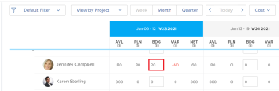

# Comprendre le coût budgété de la main-d’œuvre et les heures budgétées pour les projets

<!--
<(NOTE: Keep the structure of this article similar to Calculating Budgeted Cost)

-->

Vous pouvez allouer un budget à vos ressources pour travailler à l’aide du planificateur de ressources Adobe Workfront.

Lorsque vous planifiez vos ressources pour le travail sur les projets, Workfront calcule le coût de la main-d’oeuvre budgété pour les rôles, les projets et les utilisateurs en fonction des valeurs de coût par heure.

Le Coût de la main-d’oeuvre budgété du planificateur de ressources d’un projet est un calcul entre le coût associé aux rôles de travail affectés pour terminer le travail sur le projet et le nombre d’heures estimé (Heures budgétaires du planificateur de ressources) qui peuvent nécessiter chaque rôle pour terminer le travail.

>[!IMPORTANT]
>
>Le coût de la main-d’oeuvre budgété du planificateur de ressources pour les utilisateurs n’a aucune incidence sur celui du projet. Seul le coût du travail pour les rôles de tâche affecte le coût du projet.

## Présentation du coût de la main-d’oeuvre budgété pour les rôles de tâche et le projet

Workfront utilise le coût de la main-d’oeuvre budgétisée des rôles sur le projet pour calculer le coût de la main-d’oeuvre budgétisée du projet.

>[!TIP]
>
>Le Coût de la main-d’oeuvre budgété d’un projet dans l’Analyse de cas affiche le Coût de la main-d’oeuvre budgété du planificateur de ressources dans les rapports et les listes.

Le **Coût de la main-d’oeuvre budgété** (ou Coût de la main-d’oeuvre budgété du planificateur de ressources) d’un projet est calculé à l’aide de la formule suivante :

`Resource Planner Budgeted Labor Cost = SUM ( Resource Planner Budgeted Hours for each job role on the project * Cost per Hour rate of each job role on the project)`

Les champs utilisés dans le calcul ci-dessus se réfèrent aux éléments suivants :

* Heures budgétées pour les rôles de tâche dans la zone Ressource de la planification du projet ou du planificateur de ressource.

  Pour plus d’informations sur la planification des ressources dans le planificateur de ressources, consultez la section &quot;Ressources de planification budgétaire dans le planificateur de ressources&quot; de l’article [Présentation de Resource Planner](../../../resource-mgmt/resource-planning/get-started-resource-planner.md).

  Pour plus d’informations sur la budgétisation des ressources dans la zone Ressource de l’Analyse de cas, voir [Ressources budgétaires dans l’Analyse de cas](../../../manage-work/projects/define-a-business-case/budget-resources-in-business-case.md).

* Le **taux de coût par heure d’un rôle de tâche** dans le calcul ci-dessus fait référence au coût associé à chaque rôle de tâche sur le projet.\
  Pour plus d’informations sur la création et la gestion des rôles de tâche et leur association aux taux de coût, consultez l’article [Créer et gérer des rôles de tâche](../../../administration-and-setup/set-up-workfront/organizational-setup/create-manage-job-roles.md).

>[!NOTE]
>
>Workfront calcule toutes les informations de coût à l’aide de la devise du projet. Si vous définissez des Heures budgétées pour vos ressources dans le planificateur de ressources, l’option permettant de modifier la devise du projet est désactivée.\
>Pour plus d’informations sur la modification de la devise d’un projet, consultez l’article [Modification de la devise du projet](../../../manage-work/projects/project-finances/change-project-currency.md).

## Présentation du coût de la main-d’oeuvre budgétisée pour les utilisateurs

<!--

(NOTE: Update the following section in the Create a Business Case article, as well, when you update it here.)

-->

>[!IMPORTANT]
>
>Le coût de la main-d’oeuvre budgété par l’utilisateur n’a aucune incidence sur le coût de la main-d’oeuvre budgétisée du projet. Seul le coût de main-d’oeuvre des rôles de tâche sur un projet affecte le coût de main-d’oeuvre budgété du planificateur de ressources du projet.
> 
>Le total de tous les coûts de main-d’oeuvre de tous les utilisateurs peut ou non correspondre au coût de main-d’oeuvre budgété du planificateur de ressources des rôles de travail associés aux utilisateurs.
>
>Si vous estimez les heures budgétées pour les utilisateurs dans le planificateur de ressources, les coûts qui y sont associés sont ceux des rôles de travail associés aux utilisateurs. Ce ne sont pas des coûts associés aux utilisateurs ou à leurs taux.

Si les utilisateurs sont associés aux rôles de tâche sur le projet et que leurs heures sont budgétisées dans le planificateur de ressources, leur Coût de la main-d’oeuvre budgété s’affiche sous les noms suivants, selon l’emplacement où vous les affichez dans Workfront :

* [!UICONTROL **Coût de la main-d’oeuvre budgété**] : la zone Budget des ressources de l’analyse de performances sous leurs rôles respectifs.

  

* [!UICONTROL **BDG**] : planificateur de ressources lors de l’affichage des informations dans la vue Projet et Rôle par coût.

  

Les utilisateurs s’affichent dans la zone Ressource/Budget de l’analyse de cas sous leurs rôles respectifs ou dans le planificateur de ressources s’ils répondent aux exigences suivantes :

* Ils sont associés à l’un des rôles de tâche du projet.
* Ils disposent des Heures budgétées spécifiées dans le planificateur de ressources.
* Un taux de coût par heure est associé à leur profil.

  Pour plus d’informations sur l’ajout de tarifs par heure aux utilisateurs, consultez l’article [Modification du profil d’un utilisateur](../../../administration-and-setup/add-users/create-and-manage-users/edit-a-users-profile.md).

* L’utilisateur fait partie de l’un des groupes de ressources associés au projet.

Le Coût de la main-d&#39;oeuvre budgétisée d&#39;un utilisateur est calculé selon la formule suivante :

`User Budgeted Labor Cost = Budgeted hours for the user on the project * Cost per Hour rate of the user`

## Localisation du coût de la main-d’oeuvre budgétisée d’un projet

Le Coût de la main-d’oeuvre budgété tel qu’il est reflété dans la zone Budget des ressources de l’Analyse de cas ou du planificateur de ressources s’affiche dans les zones suivantes de Workfront sous les noms suivants :

<table style="table-layout:auto"> 
   <col> 
   <col> 
   <tbody> 
    <tr> 
     <td><strong>Nom d’affichage Coût de la main-d’oeuvre budgété</strong></td> 
     <td><strong>Zone de Workfront</strong></td> 
    </tr> 
    <tr> 
     <td>Coût budgété de la main-d'œuvre</td> 
     <td>Domaine Ressource et budget de l’analyse de cas</td> 
    </tr> 
    <tr> 
     <td>Coût budgété</td> 
     <td>
Vue Coût du rapport d'utilisation

Pour plus d’informations, voir <a href="../../../resource-mgmt/resource-utilization/view-utilization-information.md">Affichage des informations d’utilisation</a> .
</td> 
    </tr> 
    <tr> 
     <td>BDG </td> 
     <td>Resource Planner Project ou Role views, par coût</td> 
    </tr> 
    <tr> 
     <td>Coût de la main-d’oeuvre budgété du planificateur de ressources</td> 
     <td> 
Rapport Projet
 
Rapport Projet (données financières)
 
Rapport Tâches
 
Rapport sur les problèmes
 
Rapport Heure budgétisée
 
Pour plus d’informations sur la création d’un rapport, reportez-vous à l’article <a href="../../../reports-and-dashboards/reports/creating-and-managing-reports/create-custom-report.md" class="MCXref xref">Créer un rapport personnalisé</a>.
 </td> 
    </tr> 
   </tbody> 
  </table>

>[!NOTE]
>
>Si vous utilisez le planificateur de scénario Adobe Workfront pour budgétiser les ressources du projet, le coût de la main-d’oeuvre budgétisée dans la zone Budget des ressources de l’analyse de cas client est le même que le coût de la main-d’oeuvre de l’initiative liée au projet. Le planificateur de scénarios n’est disponible que dans la nouvelle expérience Adobe Workfront et nécessite une licence supplémentaire. Pour plus d’informations sur le planificateur de scénario Workfront, consultez la [présentation du planificateur de scénario](../../../scenario-planner/scenario-planner-overview.md). Pour plus d’informations sur la planification des ressources à l’aide du planificateur de scénario, voir [Ressources de budget dans l’analyse de cas à l’aide du planificateur de scénario](../../../manage-work/projects/define-a-business-case/budget-resources-in-business-case-use-scenario-planner.md).

## Recherche des heures budgétisées d’un projet

<!--
(NOTE: Keep the structure of this article similar to Calculating Budgeted Cost)
-->

Les heures budgétisées affectent la valeur du coût de la main-d’oeuvre budgétisée (ou du coût budgété du planificateur de ressources) du projet.

Le coût de la main-d’oeuvre budgétisée d’un projet est le coût associé aux rôles de travail affectés pour terminer le travail sur le projet et le nombre d’heures estimé (heures budgétisées) qui peuvent prendre chaque rôle pour terminer le travail.

Vous pouvez afficher les Heures budgétisées dans Workfront dans les champs répertoriés dans le tableau ci-dessous.

>[!NOTE]
>
>Toute autre mention de &quot;Heures budgétées&quot; dans Workfront fait référence aux heures budgétisées à l’aide de fonctionnalités obsolètes qui ont été supprimées de Workfront. Il s’agit de champs en lecture seule qui ne sont pas mis à jour avec les informations actuelles lorsque vous utilisez les outils de budget des ressources actuelles.

Les heures budgétées dans la zone Ressource de la planification des affaires ou du planificateur de ressources s’affichent dans les zones suivantes de Workfront et sous les noms suivants :

* **Hours** : zone de budget des ressources de l’analyse de cas
* **BDG** : planificateur de ressources affiché par heures
* **Hours budgétés** : vue des heures du rapport d’utilisation
Pour plus d’informations, voir [ Affichage des informations sur l’utilisation des ressources ](../../../resource-mgmt/resource-utilization/view-utilization-information.md).
* **Bud. Hours** : rapport Heure planifiée

  L’objet Heure budgétée du rapport Heure budgétée fait référence à des informations relatives à un outil de gestion des ressources obsolète. Seul le &quot;Bud&quot;. Le champ &quot;Heures&quot; de ce rapport fait référence aux heures budgétées dans le planificateur de ressources ou la zone Budget des ressources de l’analyse de cas du projet.

  Pour plus d’informations sur la création d’un rapport, consultez l’article **Créer un rapport personnalisé**.
* **Resource Planner Budget Hours** : dans les rapports suivants :

   * Rapport Projet
   * Rapport Projet (données financières)
   * Rapport Tâches
   * Rapport sur les problèmes
   * Rapport Heure budgétisée
