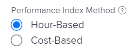

# Calculer le coût budgété du travail effectué (BCWP)

## Vue d’ensemble du coût budgété du travail effectué (BCWP)

Appellé également Valeur acquise, le coût budgété du travail effectué (BCWP) est une mesure de performances de projet qui représente la quantité de la tâche qui a été réellement terminée au moment où cette mesure est calculée.

Adobe Workfront calcule le coût budgété du travail effectué (BCWP) pour les projets et les tâches.

Tenez compte de ce qui suit lorsque vous passez en revue les valeurs du BCWP sur une tâche ou un projet :

* Workfront calcule le BCWP d’une tâche en fonction de votre configuration pour la méthode d’indice de performances (PIM) du projet.

  Vous pouvez configurer votre projet pour calculer la PIM en heures ou en coûts, et le BCWP est également calculé à l’aide des mêmes valeurs.

  Pour plus d’informations sur la configuration du mode de calcul du BCWP, voir la section [Configurer le calcul du BCWP](#configure-how-bcwp-is-calculated) de cet article.

* Workfront calcule le BCWP d’un projet en ajoutant toutes les valeurs du BCWP de toutes les tâches parent et des tâches individuelles du projet.

  Les valeurs des tâches enfant ne sont pas ajoutées au BCWP du projet.

## Conditions d’accès

+++ Développez pour afficher les exigences d’accès aux fonctionnalités de cet article.

<table style="table-layout:auto"> 
 <col> 
 <col> 
 <tbody> 
  <tr> 
   <td>Package Adobe Workfront</td> 
   <td>Tous</td> 
  </tr> 
  <tr> 
   <td>Licence Adobe Workfront</td> 
   <td>
   <p>Standard</p>
   <p>Plan</p></td> 
  </tr> 
  <tr> 
   <td>Configurations des niveaux d’accès</td> 
   <td>Accès en modification aux projets</td> 
  </tr> 
  <tr> 
   <td>Autorisations d’objet</td> 
   <td>Autorisations de gestion pour le projet</td> 
  </tr> 
 </tbody> 
</table>

Pour plus d’informations, voir [Conditions d’accès requises dans la documentation Workfront](/help/quicksilver/administration-and-setup/add-users/access-levels-and-object-permissions/access-level-requirements-in-documentation.md).

+++

## Configurer le calcul du BCWP {#configure-how-bcwp-is-calculated}

Vous pouvez configurer le calcul du BCWP en heures ou en coûts en configurant le calcul de la méthode d’indice de performances (PIM) du projet.

1. Accédez à un projet et développez **Détails du projet** dans le panneau de gauche.
1. Dans la zone **Finance**, recherchez le champ **Méthode d’indice de performances** et double-cliquez dessus pour le modifier.

   

1. Sélectionnez l’une des options suivantes :

   | Option | Exécution du calcul |
   |---|---|
   | Basé sur les heures | Workfront calcule le BCWP à l’aide du nombre d’heures prévues des tâches. |
   | Basé sur les coûts | Workfront calcule le BCWP à l’aide du coût prévu des tâches. |

1. Cliquez sur **Enregistrer les modifications**.

Le BCWP des tâches du projet est calculé en heures ou en coûts.

## Calculer le BCWP

Workfront calcule le coût budgété du travail effectué (BCWP) d’une tâche ou d’un projet à l’aide des formules suivantes :

```
Task BCWP = Actual Percent Complete x Task Budget
```

```
Project BCWP = SUM(BCWP values of all parent and individual tasks)
```

Les valeurs suivantes sont utilisées dans ce calcul :

| Valeur utilisée | Description de la valeur utilisée |
|---|---|
| Pourcentage terminé réel | Il s’agit du pourcentage terminé réel de la tâche tel qu’il apparaît dans Workfront. |
| Budget de la tâche | Il s’agit de la valeur du nombre d’heures prévues ou du coût prévu de la tâche. |

Par exemple, si le pourcentage terminé réel de la tâche est de 25 % et que le budget de la tâche ou le coût prévu est de 10 000 $, le BCWP de la tâche est de :

```
BCWP = 25% x $10,000 = $2,500
```

## Localiser le BCWP d’un projet ou d’une tâche

Vous pouvez afficher la valeur du coût budgété du travail effectué dans un rapport ou une liste en ajoutant la colonne BCWP à votre vue.

1. Accédez à une liste de tâches ou de projets.
1. Développez le menu **Vue** et sélectionnez **Nouvelle vue** ou **Personnaliser la vue**.

1. Cliquez sur **Ajouter une colonne**.
1. Dans le champ **Afficher dans cette colonne :**, commencez à saisir **BCWP** et cliquez dessus pour le sélectionner lorsqu’il s’affiche dans la liste.

   

1. Cliquez sur **Enregistrer la vue**.
1. Le champ BCWP s’affiche dans la vue.
