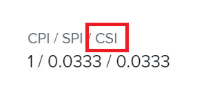

# Calculer l’Indice Coûts Horaire Performances (CSI)

<!-- Audited: 6/2025 -->

<!--

(NOTE: Linked to the product. Do not change link.) 

-->

## Vue d’ensemble de l’Indice Coûts Horaire Performances (CSI)

L’Indice Coûts Horaire Performances (CSI) est un calcul automatique qui combine l’Indice Coûts Performance (ICP) et l’Indice Horaire Perdormances (SPI) en une mesure générale qui équilibre les coûts et le planning. Si vous multipliez ces valeurs, une seule mesure peut expliquer un planning prolongé à un budget réduit ou vice versa. Les personnes gestionnaires de projet peuvent l’utiliser pour déterminer l’intégrité générale du projet ou de la tâche lorsque le coût est sacrifié pour respecter le planning à mi-parcours du projet.

>[!TIP]
>
>Adobe Workfront calcule l’ICH pour les tâches et les projets, mais pas pour les événements.

Vous ne pouvez bénéficier des informations fournies par cette mesure que si les scénarios suivants existent au sein de votre organisation :

* Vos utilisateurs consignent le temps nécessaire au travail qu’ils ont terminé. Le CSI sera calculé en fonction des heures.
* Vos utilisateurs ou fonctions sont associés à des taux de coût par heure. Le CSI sera calculé en fonction des coûts.

## Calcul de l’Indice Coûts Horaire Performances (CSI) par Workfront

Workfront calcule l’Indice Coûts Horaire Performances (CSI) d’un projet ou d’une tâche à l’aide de la formule suivante :

`CSI = CPI x SPI`

Pour plus d’informations sur l’ICP, voir l’article [Calculer l’Indice Coûts Performances (ICP)](../../../manage-work/projects/project-finances/calculate-cpi.md).

Pour plus d’informations sur le SPI, voir l’article [Calcul de l’Indice Horaire Performances (SPI)](../../../manage-work/projects/project-finances/calculate-spi.md).

Le CSI a les trois valeurs possibles suivantes :

* 1 = Suit le plan général.
* \>1 = Est inférieur à la combinaison du planning et des coûts.
* &lt;1 = Est supérieur à la combinaison du planning et des coûts.

## Localiser l’Indice Coûts Horaire Performances (CSI)

>[!CAUTION]
>
>Vous devez avoir accès à Afficher les données financières dans votre niveau d&#39;accès et disposer des autorisations pour Afficher le projet ou la tâche afin d&#39;afficher la valeur CSI d&#39;un projet ou d&#39;une tâche.

Vous trouverez le CSI dans les zones suivantes de Workfront :

* Zone Finance dans la section Détails du projet.
* Zone Finance dans la section Détails de la tâche.
* Vue de projet ou de tâche.
* Rapport sur les projets ou les tâches.
