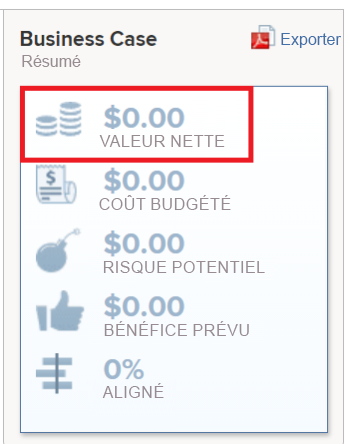

# Calculer la valeur nette

La valeur nette d’un projet correspond à la valeur totale attendue du projet après avoir calculé ses avantages et supprimé les coûts.

## Vue d’ensemble de la valeur nette des projets

Adobe Workfront calcule la valeur nette d&#39;un projet à partir de la formule suivante :

```
Project Net Value = Planned Benefit - Budgeted Cost - Potential Risk Cost
```

Les champs suivants peuvent affecter la valeur nette d’un projet :

* **Bénéfice prévu** : il s’agit d’une entrée manuelle spécifiée par la personne propriétaire du projet lors du remplissage de la zone **Informations sur le projet** du business case.\
  Pour plus d’informations sur le bénéfice prévu d’un projet, voir la section [Informations sur le projet](../../../manage-work/projects/define-a-business-case/areas-of-business-case.md#project-info) de l’article [Vue d’ensemble des zones du business case](../../../manage-work/projects/define-a-business-case/areas-of-business-case.md).

* **Coût budgété** : il s’agit du coût total associé au projet tel qu’estimé lorsque vous lancez le projet pour la première fois.

  Le **Coût budgété** utilise la valeur **Coût budgété de la main-d&#39;œuvre** qui est calculée dans la zone de budgétisation des ressources de l&#39;analyse de rentabilité et qui prend en compte les heures budgétées pour vos fonctions dans la planification des ressources et le taux de coût par heure de chaque fonction.\
  Le coût budgété affecte la **valeur nette** du projet. Pour plus d&#39;informations sur le calcul du coût budgété, voir [Calculer le coût budgété](../../../manage-work/projects/project-finances/budgeted-cost.md).

* **Coût potentiel des risques** : il s’agit du coût associé aux risques du projet, tels qu’ils sont définis dans le business case ou dans l’onglet Risques du projet.\
  Pour plus d’informations sur le calcul du coût potentiel des risques d’un projet, voir l’article [Calculer le coût potentiel des risques](../../../manage-work/projects/project-finances/potential-risk-cost.md).


## Localiser la valeur nette du projet

Vous pouvez trouver la valeur nette d’un projet dans les zones suivantes de Workfront :

* Dans la section Résumé de l&#39;analyse de rentabilité, reportez-vous à la section Analyse de rentabilité\
  Pour plus d’informations sur la zone Synthèse de l’analyse de rentabilité, reportez-vous à la section « Présentation de la synthèse de l’analyse de rentabilité » de l’article [Création d’une analyse de rentabilité pour un projet](../../../manage-work/projects/define-a-business-case/create-business-case.md) [Création d’une analyse de rentabilité pour un projet](../../../manage-work/projects/define-a-business-case/create-business-case.md).

  

* Dans Portfolio Optimizer, si le projet est associé à un portfolio.

  >[!TIP]
  >
  >Le total des valeurs nettes de tous les projets est la valeur nette du portfolio.

  Pour plus d’informations sur l’optimisateur de portfolio, voir [Vue d’ensemble de l’optimisateur de portfolio](../../../manage-work/portfolios/portfolio-optimizer/portfolio-optimizer-overview.md).

* Dans le champ Valeur nette du projet des listes et états suivants :

   * Projet
   * Tâche
   * Problème
   * Projet (données financières)

  Pour plus d’informations sur la création d’un rapport, voir l’article [Créer un rapport personnalisé](../../../reports-and-dashboards/reports/creating-and-managing-reports/create-custom-report.md).
