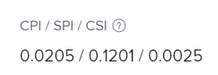

# Calculer l’indice de performances de planification (SPI)

<!--
<p data-mc-conditions="QuicksilverOrClassic.Draft mode">(NOTE: Linked to the product. Do not change link.)</p>
-->

L’indice de performance du planning (SPI) décrit la relation entre le planning prévu et le planning réel. Adobe Workfront calcule le SPI au niveau du projet et des tâches. Les responsables de projet examinent cette mesure pour déterminer si les tâches ou les projets sont actuellement en avance ou en retard sur le planning.

## Conditions d’accès

+++ Développez pour afficher les exigences d’accès aux fonctionnalités de cet article.

<table style="table-layout:auto"> 
 <col> 
 <col> 
 <tbody> 
  <tr> 
   <td>Package Adobe Workfront</td> 
   <td>Tous</td> 
  </tr> 
  <tr> 
   <td>Licence Adobe Workfront</td> 
   <td>
   <p>Léger ou supérieur</p>
   <p>Révision ou supérieur</p></td>  
  </tr> 
  <tr> 
   <td>Configurations des niveaux d’accès</td> 
   <td>Afficher l’accès aux projets et aux données financières</td> 
  </tr> 
  <tr> 
   <td>Autorisations d’objet</td> 
   <td>Autorisations Afficher ou supérieures pour le projet avec les autorisations Afficher Finance</td> 
  </tr> 
 </tbody> 
</table>

Pour plus d’informations, voir [Conditions d’accès requises dans la documentation Workfront](/help/quicksilver/administration-and-setup/add-users/access-levels-and-object-permissions/access-level-requirements-in-documentation.md).

+++

## Vue d’ensemble de l’indice de performance du planning (SPI)

* [Ce que la valeur du SPI indique](#what-the-spi-value-shows)
* [Calcul du SPI par Workfront](#how-workfront-calculates-spi)

### Ce que la valeur de la SPI indique {#what-the-spi-value-shows}

Les chefs de projet comprennent qu’une valeur d’IHP égale à 1 signifie que le projet respecte le plan ou le calendrier.  Les valeurs supérieures à 1 indiquent qu’un projet est en avance sur le calendrier et les valeurs inférieures à 1 signifient qu’un projet est en retard.  Plus on s’éloigne de la valeur 1, plus on s’éloigne du plan initial.

| **Valeur de SPI** | **Indication de « Dans les temps »** |
|---|---|
| 1 | À l’heure prévue ou planifiée |
| > 1 (supérieur à 1) | En avance sur le planning |
| &lt; 1 (inférieur à 1) | En retard sur le planning |

{style="table-layout:auto"}

### Calcul du SPI par Workfront  {#how-workfront-calculates-spi}

Workfront calcule le SPI selon la formule suivante :

```
SPI = (Total Planned Hours x % Complete) / Planned Hours Scheduled to Date*
```

*&#42;Si le nombre d’heures prévues planifiées pour la date = 0, SPI = 1*.

Heures planifiées La planification à ce jour est calculée à la minute où vous effectuez les calculs. Il affiche le nombre d’heures planifiées par rapport à la date actuelle. Il peut être recalculé automatiquement lorsque vous modifiez vos données financières pour qu’elles soient exactes. Aucun champ dans Workfront n’indique cette valeur.

Par exemple, dans le cas d&#39;un projet comportant 1 tâche et comportant 10 heures prévues et une durée de 10 jours, le nombre d&#39;heures prévues planifiées à ce jour le 5e jour est de 5.

## Localiser le SPI dans un projet ou une tâche

1. Accédez au projet ou à la tâche où vous souhaitez afficher le SPI.
1. Selon que vous souhaitez afficher le SPI sur un projet ou une tâche, effectuez l’une des opérations suivantes :

   1. Cliquez sur **Détails du projet** dans le panneau de gauche, puis affichez la zone **Finances**.

   1. Cliquez sur **Détails de la tâche** dans le panneau de gauche, puis affichez la zone **Finances**.

      

1. Recherchez le champ **IPC/SPI/CSI**.
