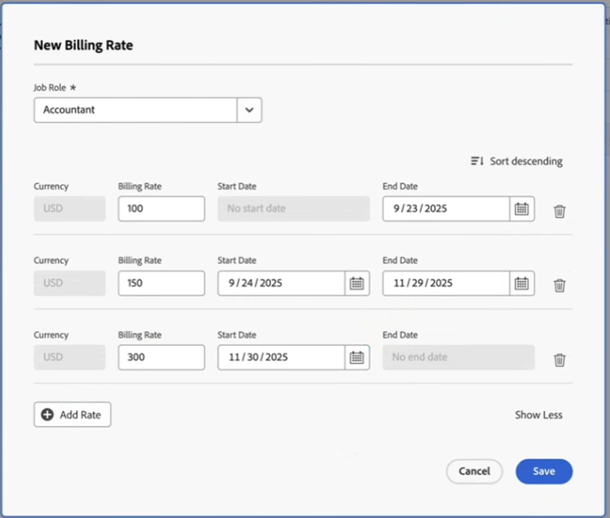

# Remplacer les taux de facturation des fonctions au niveau du projet

{{highlighted-preview}}

En tant que personne gestionnaire de projet, vous pouvez spécifier le taux de facturation d’une fonction sur un projet spécifique. Ce taux de facturation au niveau du projet remplace le taux de facturation au niveau du système pour cette fonction. Workfront utilise le taux de facturation au niveau de la fonction pour calculer les revenus, au lieu d’utiliser le taux de facturation au niveau du système.

Cet article décrit comment vous pouvez remplacer les taux de facturation des fonctions au niveau du système pour un projet.

Pour obtenir des informations générales sur le remplacement des taux de facturation des fonctions pour les projets et le calcul des revenus du projet, consultez la section [Vue d’ensemble du remplacement des taux de facturation des fonctions et calcul des revenus sur un projet](../../../manage-work/projects/project-finances/override-role-billing-rates-and-calculate-project-revenue.md).

Pour plus d’informations sur la fonction utilisée pour calculer les revenus du projet, consultez dans l’article [Vue d’ensemble de la facturation et des revenus](../../../manage-work/projects/project-finances/billing-and-revenue-overview.md) la section « Comprendre les calculs de revenus pour les tâches en fonction des affectations d’utilisateurs et d’utilisatrices et de rôles ».

>[!NOTE]
>
>Pour les revenus réels, les taux de facturation des heures ajoutées à un enregistrement de facturation marqué comme « Facturé » ne doivent pas être affectés par les remplacements de taux de facturation intervenant après la facturation de cet enregistrement.

## Conditions d’accès

+++ Développez pour afficher les exigences d’accès aux fonctionnalités de cet article.

Vous devez disposer des accès suivants pour effectuer les étapes décrites dans cet article :

<table style="table-layout:auto"> 
 <col> 
 <col> 
 <tbody> 
  <tr> 
   <td role="rowheader">Formule Adobe Workfront</td> 
   <td>Tous</td> 
  </tr> 
  <tr> 
   <td role="rowheader">Licence Adobe Workfront</td> 
   <td>
   
Nouveau : Standard

   
ou

   
Actuel : formule
</td> 
  </tr> 
  <tr> 
   <td role="rowheader">Configurations des niveaux d’accès</td> 
   <td> 
Accès en modification aux projets et aux données financières
 
Accès administratif aux fonctions
</td> 
  </tr> 
  <tr> 
   <td role="rowheader">Autorisations d’objet</td> 
   <td>Gérer les autorisations du projet qui inclut Modifier les données financières </td> 
  </tr> 
 </tbody> 
</table>

Pour plus de détails sur les informations contenues dans ce tableau, consultez [Conditions d’accès préalables dans la documentation Workfront](/help/quicksilver/administration-and-setup/add-users/access-levels-and-object-permissions/access-level-requirements-in-documentation.md).

+++

## Remplacer les taux de facturation des fonctions au niveau du projet

Vous pouvez remplacer le taux de facturation d’une fonction dans un projet des manières suivantes :

* Une fois, en sélectionnant un nouveau taux pour la fonction.\
  Le nouveau taux est utilisé pour calculer les revenus pour toute la durée du projet.

* Plusieurs fois, en sélectionnant plusieurs nouveaux taux pour des périodes spécifiques.\
  Un autre taux peut être utilisé au cours de chaque période spécifiée.

* Vous pouvez ajouter de nouveaux taux de facturation à un modèle de projet, lesquels deviennent des taux de facturation du projet lorsque vous créez le projet à partir de ce modèle. Pour plus d’informations sur la modification de modèles, voir [Modifier des modèles de projet](/help/quicksilver/manage-work/projects/create-and-manage-templates/edit-templates.md).

>[!TIP]
>
>Pour un projet, les taux de facturation des utilisateurs et des utilisatrices ne peuvent pas être remplacés.

Pour remplacer un taux de facturation dans un projet, procédez comme suit :

1. Accédez au projet dont vous souhaitez remplacer les taux de facturation.
1. Cliquez sur **Taux de facturation** dans le panneau de gauche.
1. Cliquez sur **Ajouter un taux de facturation** > **Nouveau taux de facturation**.

   La zone « Nouveau taux de facturation » apparaît.

1. Sélectionnez dans le champ **Fonction** la fonction dont vous souhaitez modifier le taux de facturation.

   Le champ **Taux de facturation par défaut** affiche le taux pour cette fonction au niveau du système.

1. Dans le champ **Taux de facturation 1**, saisissez le taux de facturation de remplacement à utiliser une fois, puis cliquez sur **Enregistrer** pour remplacer le taux de facturation.

   Ou

   Cliquez sur **Ajouter un taux** pour remplacer d’autres taux de facturation.

1. (Le cas échéant) Si vous effectuez plus d’un remplacement de taux de facturation, indiquez les informations suivantes :

   * **Taux de facturation 1** : valeur du taux de facturation depuis le début du projet jusqu’à la date du premier remplacement. Il s’agit généralement du même montant que le **Taux par défaut**.
   * **Date de début** : il s’agit de la date à laquelle la validité du taux par défaut se termine.
   * **Date de fin**: il s’agit de la date à laquelle le remplacement du nouveau de taux de facturation se termine.

   Exemple d’image dans l’environnement de prévisualisation :
   

   Exemple d’image dans l’environnement de production :
   

1. Le fuseau horaire des dates que vous sélectionnez s’affiche au bas de la zone Nouveau taux de facturation. Il s’agit du fuseau horaire associé à votre instance Workfront, comme indiqué dans la zone Infos client de la configuration. Pour plus d’informations, voir [Configurer les informations de base pour votre système](../../../administration-and-setup/get-started-wf-administration/configure-basic-info.md).
1. Workfront applique le taux de fonction de remplacement aux heures qui se produisent pendant les périodes spécifiées lors du calcul des revenus du projet.
1. Il ne doit pas y avoir d’écart entre les périodes de deux taux de remplacement. La **Date de début** d’un taux de remplacement doit être le jour suivant la **Date de fin** de la date de remplacement précédente.

1. Vous ne pouvez pas spécifier de Date de début pour le premier taux de remplacement, ni de Date de fin pour le dernier taux de remplacement.\
   Nous vous recommandons d’utiliser le taux par défaut pour le premier taux de remplacement.\
   Workfront suppose que le premier taux de remplacement est appliqué pour toutes les heures dont la date est antérieure à la date de fin du premier remplacement et que le dernier est appliqué pour toutes les heures dont la date est plus récente que la date de début du dernier remplacement.\
   Si une heure est enregistrée avant la date de début de début prévue du projet, le premier taux de facturation est utilisé.\
   Si une heure est consignée après la date d’achèvement prévue du projet, le dernier taux de facturation est utilisé.

1. Cliquer sur **Enregistrer**.
