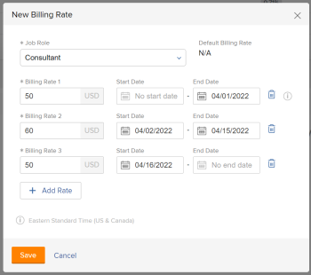

# Remplacer les taux de facturation des rôles de tâche au niveau du projet

En tant que chef de projet, vous pouvez spécifier le taux de facturation d’un rôle de tâche sur un projet spécifique. Ce taux de facturation au niveau du projet remplace le taux de facturation au niveau du système pour ce rôle de tâche. Workfront utilise le taux de facturation au niveau du projet du rôle de tâche pour calculer les recettes, au lieu d’utiliser le taux de facturation au niveau du système.

Cet article décrit comment vous pouvez remplacer les taux de facturation des rôles système pour un projet.

Pour obtenir des informations générales sur le remplacement des taux de facturation des rôles de tâche pour les projets et le calcul des recettes du projet, voir [Présentation du remplacement des taux de facturation des rôles de tâche et calcul des recettes sur un projet](../../../manage-work/projects/project-finances/override-role-billing-rates-and-calculate-project-revenue.md).

Pour plus d’informations sur le rôle de tâche utilisé pour calculer les recettes du projet, voir la section &quot;Présentation des calculs de recettes pour les tâches basées sur les affectations d’utilisateurs et de rôles&quot; de l’article. [Présentation de la facturation et des recettes](../../../manage-work/projects/project-finances/billing-and-revenue-overview.md).

>[!NOTE]
>
>Dans le cas des Recettes réelles, les taux de facturation appliqués aux heures ajoutées à un enregistrement de facturation marqué comme Facturé ne doivent pas être affectés par les remplacements de taux de facturation qui surviennent après la facturation de l’enregistrement de facturation.

## Exigences d’accès

Vous devez disposer des accès suivants pour effectuer les étapes de cet article :

<table style="table-layout:auto"> 
 <col> 
 <col> 
 <tbody> 
  <tr> 
   <td role="rowheader">Formule Adobe Workfront*</td> 
   <td> 
Tous
 </td> 
  </tr> 
  <tr> 
   <td role="rowheader">Licence Adobe Workfront*</td> 
   <td> 
Plan 
 </td> 
  </tr> 
  <tr> 
   <td role="rowheader">Paramétrages du niveau d'accès*</td> 
   <td> 
Modifier l’accès aux projets et aux données financières
 
Accès administratif pour les rôles de tâche
 
Remarque : Si vous n’avez toujours pas accès à , demandez à votre administrateur Workfront s’il définit des restrictions supplémentaires à votre niveau d’accès. Pour plus d’informations sur la façon dont un administrateur Workfront peut modifier votre niveau d’accès, voir <a href="../../../administration-and-setup/add-users/configure-and-grant-access/create-modify-access-levels.md" class="MCXref xref">Création ou modification de niveaux d’accès personnalisés</a>.
 </td> 
  </tr> 
  <tr> 
   <td role="rowheader">Autorisations d’objet</td> 
   <td> 
Gérer les autorisations du projet qui inclut la modification des données financières 
 
Pour plus d’informations sur la demande d’accès supplémentaire, voir <a href="../../../workfront-basics/grant-and-request-access-to-objects/request-access.md" class="MCXref xref">Demande d’accès aux objets </a>.
 </td> 
  </tr> 
 </tbody> 
</table>

&#42;Pour connaître le plan, le type de licence ou l’accès dont vous disposez, contactez votre administrateur Workfront.

## Remplacer les taux de facturation des rôles de tâche au niveau du projet

Vous pouvez remplacer le taux de facturation d’un rôle de tâche sur un projet de la manière suivante :

* Une fois, en sélectionnant un nouveau taux pour le rôle de tâche.\
   Le nouveau taux est utilisé pour toute la durée du projet, afin de calculer les recettes.

* Plusieurs fois, en sélectionnant plusieurs nouveaux taux pour des périodes spécifiques.\
   Un autre taux peut être utilisé au cours de chaque période spécifiée.

>[!TIP]
>
>Vous ne pouvez pas remplacer les taux de facturation des utilisateurs pour un projet.

Pour remplacer un taux de facturation pour un projet :

1. Accédez au projet pour lequel vous souhaitez remplacer les taux de facturation.
1. Cliquez sur **Taux de facturation** dans le panneau de gauche. Vous devrez peut-être d’abord cliquer sur **Afficher plus**.
1. Cliquez sur **Ajouter le taux de facturation** > **Nouveau taux de facturation**.

   La boîte Nouveau taux de facturation s’affiche.

1. Dans le **Rôle de tâche** , sélectionnez le rôle de tâche pour lequel vous souhaitez modifier le taux de facturation.

   

   Le **Taux de facturation par défaut** affiche le taux au niveau du système pour ce rôle de tâche.

1. Dans le **Taux de facturation 1** , saisissez le remplacement du taux de facturation unique, puis cliquez sur **Enregistrer** pour remplacer le taux de facturation une fois

   Ou

   Cliquez sur **Taux d’ajout** pour ajouter d’autres remplacements de taux de facturation.

1. (Conditionnel) Si vous ajoutez plusieurs remplacements de taux de facturation, indiquez les informations suivantes :

   * **Taux de facturation 1**: la valeur du taux de facturation du début du projet à la première date du premier remplacement. Il s’agit généralement du même montant que la variable **Taux par défaut**.
   * **Date de début**: il s’agit de la date de fin du taux par défaut.
   * **Date de fin**: date à laquelle le nouveau remplacement de taux de facturation se termine.

   

1. Le fuseau horaire des dates que vous sélectionnez s’affiche au bas de la zone Nouveau taux de facturation . Il s’agit du fuseau horaire associé à votre instance Workfront, comme indiqué dans la zone Informations sur le client de la configuration. Pour plus d’informations, voir [Configuration des informations de base pour votre système](../../../administration-and-setup/get-started-wf-administration/configure-basic-info.md).
1. Workfront applique le taux de rôle de remplacement aux heures survenues pendant les périodes spécifiées lors du calcul des recettes du projet.
1. Il ne doit pas y avoir d’écart entre les périodes de deux taux de remplacement. Le **Date de début** d’un taux de remplacement doit être le jour suivant immédiatement la **Date de fin** de la date de remplacement précédente.

1. Vous ne pouvez pas spécifier de Date de début pour le premier taux de remplacement, ni de Date de fin pour le dernier taux de remplacement.\
   Nous vous recommandons d’utiliser le taux par défaut pour le premier taux de remplacement.\
   Workfront suppose que le premier taux de remplacement est appliqué pour toutes les heures dont la date est antérieure à la date de fin du premier remplacement et que le dernier est appliqué pour toutes les heures dont la date est plus récente que la date de début du dernier remplacement.\
   Si une heure est enregistrée avant la date de début planifiée du projet, le premier taux de facturation est utilisé.\
   Si une heure est enregistrée après la date d’achèvement planifiée du projet, le dernier taux de facturation est utilisé.

1. Cliquer sur **Enregistrer**.
