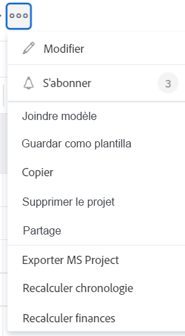

# Recalculer les finances d’un projet

Les finances sont calculées sur un projet à mesure que des modifications se produisent dans les heures consignées pour le projet ou dans les taux utilisés pour calculer les coûts et les revenus.

## Conditions d’accès

Vous devez disposer des accès suivants pour effectuer les étapes décrites dans cet article :

<table style="table-layout:auto"> 
 <col> 
 <col> 
 <tbody> 
  <tr> 
   <td role="rowheader">Formule Adobe Workfront*</td> 
   <td> 
Tous
 </td> 
  </tr> 
  <tr> 
   <td role="rowheader">Licence Adobe Workfront*</td> 
   <td> 
Plan 
 </td> 
  </tr> 
  <tr> 
   <td role="rowheader">Configurations du niveau d’accès*</td> 
   <td> 
Accès en modification aux projets et aux données financières
 
Remarque : si vous n’avez toujours pas d’accès, demandez à votre équipe d’administration Workfront s’il existe des restrictions supplémentaires à votre niveau d’accès. Pour plus d’informations sur la façon dont un administrateur ou une administratrice Workfront peut modifier votre niveau d’accès, voir <a href="../../../administration-and-setup/add-users/configure-and-grant-access/create-modify-access-levels.md" class="MCXref xref">Créer ou modifier des niveaux d’accès personnalisés</a>.
 </td> 
  </tr> 
  <tr> 
   <td role="rowheader">Autorisations d’objet</td> 
   <td> 
Autorisations de gestion pour le projet avec les autorisations de gestion financière
 
Pour plus d’informations sur les demandes d’accès supplémentaire, voir <a href="../../../workfront-basics/grant-and-request-access-to-objects/request-access.md" class="MCXref xref">Demander l’accès à des objets</a>.
 </td> 
  </tr> 
 </tbody> 
</table>

&#42;Pour connaître le forfait, le type de licence ou l’accès dont vous disposez, contactez votre administrateur ou administratrice Workfront.

## Considérations relatives au calcul des finances dans Adobe Workfront

Les finances sont calculées dans l’analytique améliorée de la manière suivante :

* Vous pouvez recalculer manuellement les coûts et les revenus d’un projet à l’aide de l’option Recalculer les finances d’un projet.
* En outre, certaines actions déclenchent un nouveau calcul automatique.

Lorsque le taux d’une personne ou d’un rôle change au cours de la vie d’un projet, les événements suivants peuvent se produire :

* Lorsque la modification est effectuée, le taux mis à jour est utilisé à partir de ce moment lorsque les heures sont consignées et les informations financières sont calculées. La modification du taux n’affecte pas la façon dont les éléments ont été calculés avant que la modification ne soit effectuée. Pour toutes les heures existantes consignées, l’ancien taux est utilisé pour calculer les informations financières.
* Vous pouvez forcer Adobe Workfront à utiliser le nouveau taux rétroactivement pour toutes les heures enregistrées jusqu’à présent, à l’aide de l’option Recalculer les finances. Cela oblige Workfront à recalculer rétroactivement toutes les heures, les coûts prévus et les revenus saisis précédemment, conformément aux nouvelles informations sur les taux.

Le type de rapport Projet (Données financières) ne recalcule pas automatiquement avant de charger les données. Pour mettre à jour les données de ce type de rapport, vous devez recalculer manuellement les finances des différents projets.

>[!CAUTION]
>
>Avant de recalculer manuellement les finances d’un projet donné, vous souhaiterez peut-être conserver toutes les données financières déjà calculées à un taux précédent. Nous vous recommandons d’utiliser l’option Recalculer les finances uniquement lorsque vous savez que vous n’apportez pas de modifications aux informations existantes, ou uniquement lorsque de telles modifications sont souhaitées.
>
>Notez que l’exécution d’un rapport Projet (données financières) effectue un nouveau calcul de vos données financières. Vous devez donc tenir compte des mêmes considérations avant d’exécuter le rapport.

## Préserver les données financières pour les tâches avec des heures existantes {#preserve-financial-data-for-tasks-with-existing-hours}

Lorsque les données financières d’un projet sont recalculées, Workfront recalcule rétroactivement toutes les heures précédemment consignées, les coûts prévus, les coûts réels et les revenus prévus et réels, conformément à toute information financière nouvelle ou mise à jour.

* [Conserver les revenus du projet](#preserve-project-revenue)
* [Conserver le coût du projet](#preserve-project-cost)

### Conserver les revenus du projet  {#preserve-project-revenue}

Les taux de revenu peuvent changer pendant la durée de vie d’un projet.

Pour plus d’informations sur les taux de facturation et les revenus, consultez l’article [Vue d’ensemble de la facturation et des revenus](../../../manage-work/projects/project-finances/billing-and-revenue-overview.md).

Les taux de revenu peuvent changer aux niveaux suivants :

* Au niveau du système (pour les fonctions)\
  Pour plus d’informations sur la création de fonctions avec des taux de facturation au niveau du système, voir l’article [Créer et gérer des fonctions](../../../administration-and-setup/set-up-workfront/organizational-setup/create-manage-job-roles.md).

* Niveau utilisateur ou utilisatrice\
  Pour plus d’informations sur la modification des informations de taux de facturation sur les utilisateurs et utilisatirces, voir l’article [Modifier le profil d’un utilisateur ou d’une utilisatrice](../../../administration-and-setup/add-users/create-and-manage-users/edit-a-users-profile.md).

* Au niveau de l’entreprise (pour les fonctions)\
  Pour plus d’informations, voir [Remplacer les taux de facturation des fonctions au niveau de l’entreprise](../../../administration-and-setup/set-up-workfront/organizational-setup/override-job-role-billing-rates-company-level.md).

* Au niveau du projet (pour les fonctions)\
  Pour plus d’informations sur le remplacement des taux des fonctions au niveau du projet, voir l’article [Vue d’ensemble du remplacement des taux de facturation des fonctions et calcul des revenus sur un projet](../../../manage-work/projects/project-finances/override-role-billing-rates-and-calculate-project-revenue.md).

Par exemple, le taux de facturation d’une personne varie au cours d’un projet de 50 $ à 75 $ de l’heure et vous souhaitez que toutes les données existantes restent calculées selon l’ancien taux (50 $ de l’heure). Cependant, lorsque les finances du projet sont recalculées, les revenus des tâches qui contiennent déjà des données financières seront mises à jour pour refléter le nouveau taux de facturation (de 75 $ de l’heure).

* [Conserver les revenus d’un projet en créant un enregistrement de facturation](#preserve-project-revenue-by-creating-a-billing-record)
* [Préserver les revenus du projet en utilisant plusieurs remplacements de taux de facturation](#preserve-project-revenue-by-using-multiple-billing-rate-overrides)

#### Conserver les revenus du projet en créant un enregistrement de facturation {#preserve-project-revenue-by-creating-a-billing-record}

Lorsque les taux de facturation changent à n’importe quel niveau mentionné ci-dessus, vous pouvez conserver les revenus existants, déjà calculés sur le projet, en évitant d’utiliser l’option manuelle Recalculer finances ou en verrouillant la durée enregistrée sur le projet et calculée à l’aide de l’ancien taux dans un enregistrement de facturation ayant le statut Facturé.

Lorsque vous ne recalculez pas le financement du projet ou lorsque vous verrouillez les heures consignées dans un enregistrement de facturation facturé, les heures consignées après le changement de taux sont calculées avec le nouveau taux et les heures consignées avant le changement de taux restent calculées à l’ancien taux.

Pour plus d’informations sur la création d’enregistrements de facturation, voir l’article [Créer des enregistrements de facturation](../../../manage-work/projects/project-finances/create-billing-records.md).

#### Préserver les revenus du projet en utilisant plusieurs remplacements de taux de facturation {#preserve-project-revenue-by-using-multiple-billing-rate-overrides}

Lorsque les taux de facturation changent pour les fonctions au niveau du projet, vous pouvez conserver les revenus existants, déjà calculés sur le projet, en utilisant plusieurs remplacements de taux de facturation qui sont verrouillés au cours d’une période spécifiée.

Pour plus d’informations sur l’utilisation de plusieurs remplacements de taux de facturation, voir l’article [Vue d’ensemble du remplacement des taux de facturation des fonctions et du calcul des revenus sur un projet](../../../manage-work/projects/project-finances/override-role-billing-rates-and-calculate-project-revenue.md).

>[!NOTE]
>
>Cela ne s’applique qu’aux taux de facturation des fonctions qui sont modifiés au niveau du projet.

### Conserver le coût du projet {#preserve-project-cost}

Les taux de dépenses peuvent changer aux niveaux suivants :

* Niveau système (pour les fonctions)\
  Pour plus d’informations sur la création de fonctions avec des taux de dépenses au niveau du système, voir l’article [Créer et gérer des fonctions](../../../administration-and-setup/set-up-workfront/organizational-setup/create-manage-job-roles.md).

* Niveau d’utilisation\
  Pour plus d’informations sur la modification des informations de taux de dépenses pour les utilisateurs et utilisatrices, voir l’article [Modifier un profil d’utilisation](../../../administration-and-setup/add-users/create-and-manage-users/edit-a-users-profile.md).

Lorsque les taux de facturation changent à n’importe quel niveau mentionné ci-dessus, vous pouvez conserver les coûts existants, déjà calculés sur le projet, en verrouillant la durée enregistrée sur le projet et calculée à l’aide de l’ancien taux dans un enregistrement de facturation ayant le statut Facturé. Pour plus d’informations sur la création d’enregistrements de facturation, voir l’article [Créer des enregistrements de facturation](../../../manage-work/projects/project-finances/create-billing-records.md).

Vous pouvez également éviter d’utiliser l’option manuelle Recalculer le financement si vous ne souhaitez pas créer d’enregistrement de facturation, comme décrit dans la section [Recalculer manuellement le financement d’un projet](#manually-recalculate-finances-for-a-project) dans cet article.

Lorsque vous ne recalculez pas le financement du projet ou lorsque vous verrouillez les heures consignées dans un enregistrement de facturation facturé, les heures consignées après le changement de taux sont calculées avec le nouveau taux et les heures consignées avant le changement de taux restent calculées à l’ancien taux.

## Recalculer manuellement le financement d’un projet {#manually-recalculate-finances-for-a-project}

Si les taux changent au cours d’un projet et que vous souhaitez que vos calculs de coûts et de revenus reflètent les nouveaux taux, vous devez recalculer manuellement le financement du projet.

>[!NOTE]
>
>Vous pouvez empêcher la mise à jour de la valeur des revenus sur les nouveaux taux lorsque vous recalculez manuellement le financement en suivant les étapes de la section [Préserver les données de financement pour les tâches avec les heures existantes](#preserve-financial-data-for-tasks-with-existing-hours) de cet article. Les valeurs des dépenses sont toujours mises à jour pour prendre en compte les nouveaux taux lorsque vous recalculez manuellement le financement d’un projet.

Vous pouvez recalculer le financement des projets dans Workfront à partir de la page du projet, d’une liste de projets ou d’un rapport.

Vous pouvez recalculer le financement lors de leur modification en masse. Pour plus d’informations, voir la section [Recalculer manuellement le financement en masse](#manually-recalculate-finances-in-bulk) dans cet article.

1. Accédez au projet dans lequel vous souhaitez recalculer le financement et cliquez sur l’icône **Plus**  à droite du nom du projet.

   

   Ou

   Dans une liste de projets ou un rapport, sélectionnez un ou plusieurs projets, puis cliquez sur l’icône **Plus**  en haut de la liste.

   

   >[!TIP]
   >
   >En fonction de la complexité de vos projets, nous vous recommandons de ne pas sélectionner un grand nombre de projets lors du re-calcul du financement en masse afin d’assurer des performances optimales. Un projet peut être trop complexe s’il comporte de multiples dépendances ou affectations ou un grand nombre de champs personnalisés.

1. Cliquez sur **Recalculer finances**.

   Tous les coûts et revenus prévus pour le projet sont recalculés avec d’éventuelles nouvelles informations.

   Une confirmation devrait s’afficher en haut du navigateur pour vous indiquer que le financement du projet a été recalculé.
Les valeurs des dépenses existantes et certaines valeurs de revenus qui n’ont pas été verrouillées sont mises à jour pour prendre en compte les nouveaux taux.

## Recalculer manuellement le financement en masse{#manually-recalculate-finances-in-bulk}

Vous pouvez recalculer manuellement le financement de plusieurs projets en les modifiant en masse. Les revenus des projets sont alors recalculés rétroactivement.

>[!IMPORTANT]
>
>Vous pouvez empêcher la mise à jour des valeurs des revenus pour refléter les nouveaux taux lorsque vous recalculez manuellement le financement en suivant les étapes de la section [Préserver les données financières pour les tâches avec les heures existantes](#preserve-financial-data-for-tasks-with-existing-hours) de cet article. Les valeurs des dépenses sont toujours mises à jour pour prendre en compte les nouveaux taux lorsque vous recalculez manuellement le financement des projets.

Pour recalculer manuellement le financement de plusieurs projets, procédez comme suit :

1. Accédez à une liste de projets.
1. Sélectionnez plusieurs projets dans la liste, puis cliquez sur l’icône **Plus**  en haut de la liste.

   

   >[!TIP]
   >
   >En fonction de la complexité de vos projets, nous vous recommandons de ne pas sélectionner un grand nombre de projets lors de leur modification en bloc afin d’assurer des performances optimales. Un projet peut être trop complexe s’il comporte de multiples dépendances ou affectations ou un grand nombre de champs personnalisés.

1. Cliquez sur **Recalculer finances**.

   L’ensemble des coûts et des revenus prévus sur les projets sélectionnés sont recalculés avec les nouvelles informations.

   Une confirmation devrait apparaître en haut du navigateur, indiquant que le financement des projets a été recalculé.

## Actions déclenchant un nouveau calcul automatique du financement

Les actions suivantes déclenchent un nouveau calcul financier des projets dans Workfront :

* Modifier le statut des tâches
* Déplacer une tâche avec des heures vers un autre projet
* Passer le statut d’un projet de Terminé à Actif

>[!NOTE]
>
>Lorsque vous modifiez le statut d’un projet, seules les valeurs prévues sont recalculées.

Vous pouvez également recalculer manuellement le financement dans le menu **Plus**  au niveau du projet, en cliquant sur **Recalculer finances**.
