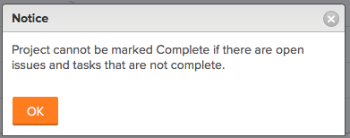

# Questions fréquentes sur les projets

Vous trouverez ci-dessous les questions fréquentes relatives aux projets.

## Pourquoi l’option Insérer la tâche au-dessus/en-dessous est-elle manquante lorsque je clique avec le bouton droit sur une tâche dans la liste des tâches ?

### Réponse

Pour utiliser les options d’insertion, la liste des tâches doit être triée par nombre. Pour trier la colonne par nombre, cliquez sur **#** dans l’en-tête de colonne à gauche du **nom de la tâche** pour trier la tâche par nombre.

## Qu’est-ce que la date d’achèvement réelle ?

### Réponse

La date d’achèvement réelle représente la date et l’heure auxquelles le travail est terminé. Pour plus d’informations, voir [Vue d’ensemble de la date d’achèvement réelle d’un projet](../../../manage-work/projects/planning-a-project/project-actual-completion-date.md).

## Pourquoi le bouton retrait/alinéa est-il absent ?

### Réponse

Pour utiliser le bouton Retrait/Alinéa, vérifiez que les tâches sont triées par numéro de tâche et qu’aucun Regroupement n’est appliqué.

## Pourquoi est-ce que je n’arrive pas à faire passer le statut d’un projet sur Terminé ?

J’obtiens le message d’erreur suivant lorsque j’essaie de marquer mon projet comme terminé :

### Réponse

Vous ne pouvez pas modifier le statut d’un projet pour qu’il se termine si vous avez l’un des éléments suivants dans votre projet :

* Tâches ou problèmes incomplets
* Tâche ou problèmes en attente d’approbation

## Pourquoi ne puis-je pas modifier le statut du projet de Terminé à En cours ?

### Réponse

Si le mode d’achèvement du projet est défini sur Automatique, une fois toutes les tâches et tous les problèmes terminés, le statut du projet passe automatiquement à Terminé et vous ne pouvez pas le modifier vers un autre statut. Le mode d&#39;achèvement du projet doit être défini sur Manuel pour pouvoir transformer un projet complet en projet actuel. Pour plus d’informations, voir [Le statut du projet ne passe pas de Terminé à Actif](../../../manage-work/projects/tips-tricks-and-troubleshooting/project-status-does-not-change-from-complete-to-current.md).

## Pourquoi ne puis-je pas ajouter un projet à un portfolio alors que je dispose des autorisations appropriées pour le faire ?

Bien que je dispose des autorisations appropriées, le bouton Ajouter des projets est manquant dans l’onglet Projets du portfolio.

### Réponse

Cela est dû au fait que le statut du portfolio est Inactif. Pour modifier le statut du portfolio :

1. Cliquez sur **Détails du portfolio > Vue d’ensemble**.
1. Modifiez le **Statut** sur **Actif**.

1. Cliquer sur **Enregistrer**.\
   Le bouton **Ajouter des projets** doit maintenant être visible sur l’onglet **Projets**.

## Quel accès reçoit un ou une gestionnaire de ressources lors de son ajout à un projet ?

### Réponse

Les gestionnaires de ressources reçoivent automatiquement l’accès Gérer aux projets. La suppression d’une personne du rôle Gestionnaire de ressources ne supprime pas son accès Gérer le partage.

## Pourquoi le statut du projet change-t-il lorsque j’ajoute un groupe ?

### Réponse

Les statuts du projet changent en raison des statuts par défaut du Groupe. Lorsque vous ajoutez un groupe à un projet, la liste des statuts devient les statuts par défaut définis pour le groupe.

Pour plus d’informations, voir l’article [Créer ou modifier un statut](../../../administration-and-setup/customize-workfront/creating-custom-status-and-priority-labels/create-or-edit-a-status.md).

## En quoi consiste le statut du budget ?

### Réponse

Le statut du budget indique si le projet est actuellement ajouté ou non au planificateur de capacités et si le calcul du budget a été terminé.

Voici les statuts du budget :

* Non inclus : le projet n’est pas ajouté au planificateur de capacités.
* Inclus mais non calculés : le projet est ajouté au planificateur de capacités, mais il est exclu du calcul du budget.
* Inclus et calculé : le projet est ajouté au planificateur de capacités et inclus dans le calcul du budget.

## Pourquoi ne puis-je pas partager avec une équipe un projet dont je suis propriétaire et pour lequel je dispose d’autorisations de gestion ? Je ne parviens tout simplement pas à trouver l’équipe dans la boîte de dialogue de partage du projet.

### Réponse

L’administrateur ou l’administratrice d’Adobe Workfront a limité votre niveau d’accès à afficher les entreprises, les groupes et les équipes auxquels vous appartenez. L’équipe que vous recherchez n’est pas l’une des équipes auxquelles vous appartenez.

Pour plus d’informations sur l’activation d’une personne afin qu’elle puisse voir toutes les équipes du système, voir la section [Créer ou modifier des niveaux d’accès personnalisés](../../../administration-and-setup/add-users/configure-and-grant-access/create-modify-access-levels.md).
