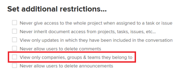

# Questions fréquentes sur les projets

Vous trouverez ci-dessous des questions fréquentes sur les projets.

## Pourquoi l’option Insérer la tâche au-dessus/en-dessous est-elle manquante lorsque je clique avec le bouton droit sur une tâche dans la liste des tâches ?

### Réponse

Pour utiliser les options d&#39;insertion, la liste des tâches doit être triée par nombre. Pour trier la colonne par nombre, cliquez sur **#** dans l’en-tête de colonne à gauche de **Task Name** pour utiliser la tâche par son numéro.

## Qu’est-ce que la date d’achèvement réelle ?

### Réponse

La date d’achèvement réelle représente la date et l’heure auxquelles le travail est terminé. Pour plus d’informations, voir [Présentation du projet Date d’achèvement réelle](../../../manage-work/projects/planning-a-project/project-actual-completion-date.md).

## Pourquoi le bouton retrait / retrait est-il absent ?

### Réponse

Pour utiliser le bouton Retrait/Retrait, vérifiez que les tâches sont triées par numéro de tâche et qu&#39;aucun Regroupement n&#39;est appliqué.

## Pourquoi ne puis-je pas modifier l’état du projet en Terminé ?

J’obtiens le message d’erreur suivant lorsque j’essaie de marquer mon projet comme terminé :

### Réponse

Vous ne pouvez pas modifier l’état d’un projet pour qu’il se termine si vous avez l’un des éléments suivants dans votre projet :

* Tâches ou problèmes incomplets
* Tâche ou problèmes en attente de validation

## Pourquoi ne puis-je pas modifier l’état du projet de Terminé à Actuel ?

### Réponse

Si le mode d’exécution du projet est défini sur Automatique, une fois toutes les tâches et tous les problèmes terminés, l’état du projet passe automatiquement à Terminé et vous ne pouvez pas le modifier dans un autre état. Le mode d’achèvement du projet doit être défini sur Manuel pour pouvoir activer un projet complet. Pour plus d’informations, voir [L’état du projet ne passe pas de Terminé à Actif](../../../manage-work/projects/tips-tricks-and-troubleshooting/project-status-does-not-change-from-complete-to-current.md).

## Pourquoi ne puis-je pas ajouter un projet à un Portfolio alors que je dispose des autorisations appropriées pour le faire ?

Bien que je dispose des autorisations appropriées, le bouton Ajouter des projets est manquant dans l’onglet Projets du Portfolio.

### Réponse

Cela est dû au fait que l’état du Portfolio est inactif. Pour modifier le statut du Portfolio :

1. Cliquez sur **Détails du Portfolio > Aperçu**.
1. Modifiez la variable **État** to **Actif.**

1. Cliquer sur **Enregistrer**.\
   La variable **Ajouter des projets** doit maintenant être visible sur la balise **Projets** .

## Quel accès reçoit un gestionnaire de ressources lorsqu’il est ajouté à un projet ?

### Réponse

Les gestionnaires de ressources reçoivent automatiquement l’accès Gérer aux projets. La suppression de l’utilisateur du rôle Gestionnaire de ressources ne supprime pas son accès Gérer le partage.

## Pourquoi le statut du projet change-t-il lorsque j’ajoute un groupe ?

### Réponse

Les états du projet changent en raison des états par défaut du Groupe. Lorsque vous ajoutez un groupe à un projet, la liste des états devient les états par défaut définis pour le groupe.

Pour plus d’informations, voir l’article [Création ou modification d’un état](../../../administration-and-setup/customize-workfront/creating-custom-status-and-priority-labels/create-or-edit-a-status.md).

## En quoi consiste l’état du budget ?

### Réponse

L&#39;état du budget indique si le projet est actuellement ajouté ou non au planificateur de capacité et si le calcul du budget a été terminé.

Voici les états du budget :

* Non inclus : le projet n’est pas ajouté au planificateur de capacité.
* Inclus mais non calculés : le projet est ajouté au gestionnaire de capacité, mais il est exclu du calcul du budget.
* Inclus et calculés : le projet est ajouté au gestionnaire de capacité et inclus dans le calcul du budget.

## Pourquoi ne puis-je pas partager un projet dont je suis le propriétaire et pour lequel je dispose des autorisations de gestion avec une équipe ? Je ne parviens tout simplement pas à trouver l&#39;équipe dans la boîte de dialogue de partage du projet.

### Réponse

L’administrateur d’Adobe Workfront vous a limité à l’affichage des entreprises, groupes et équipes auxquels vous appartenez dans votre niveau d’accès du . L&#39;équipe que vous recherchez n&#39;est pas l&#39;une des équipes auxquelles vous appartenez.

Pour plus d’informations sur l’activation d’un utilisateur pour afficher toutes les équipes du système, voir [Création ou modification de niveaux d’accès personnalisés](../../../administration-and-setup/add-users/configure-and-grant-access/create-modify-access-levels.md).
