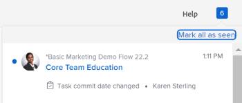

# Vue d’ensemble de la date d’engagement

<!--Audited: 05/2025-->

<!-- The highlighted information on this page refers to functionality not yet generally available. It is available only in the Preview environment for all customers, or in the Production environment for customers who enabled fast releases.

For information about fast releases, see [Enable or disable fast releases for your organization](/help/quicksilver/administration-and-setup/set-up-workfront/configure-system-defaults/enable-fast-release-process.md).

For information about the current release, see [Third Quarter 2024 release overview](/help/quicksilver/product-announcements/product-releases/24-q3-release-activity/24-q3-release-overview.md).-->

La date d’engagement correspond à la date à laquelle un utilisateur affecté à une tâche ou à un événement s’engage à terminer la tâche ou l’événement. Cette date diffère de la date d’achèvement prévue d’une tâche ou d’un événement, car il s’agit d’une estimation plus réaliste de la date d’achèvement fournie uniquement par l’utilisateur ou l’utilisatrice en charge du travail.

Pour plus d’informations sur la date d’achèvement prévue, voir [Vue d’ensemble de la date d’achèvement prévue de la tâche](../../../manage-work/tasks/task-information/task-planned-completion-date.md).

## Vue d’ensemble de la date d’engagement

Tenez compte des points suivants lorsque vous travaillez avec des dates d’engagement :

* Seules les tâches et les problèmes ont une date d’engagement.
* Les dates d’engagement ne sont pas automatiquement définies par Adobe Workfront. Lorsque vous créez une tâche ou un événement, aucune date de validation ne lui est affectée.
* Si on vous affecte une tâche ou un problème, vous pouvez définir la date d’engagement en effectuant l’une des opérations suivantes :

   * Laissez Workfront définir la date d’engagement de sorte qu’elle corresponde à la date d’achèvement prévue existante de la tâche ou du problème en cliquant sur Travailler sur ce projet, Démarrer le problème ou Démarrer la tâche sur la tâche ou le problème. Pour plus d’informations, voir [Remplacer le bouton « Travailler sur ce projet » par un bouton Démarrer](../../../people-teams-and-groups/create-and-manage-teams/work-on-it-button-to-start-button.md).
   * Définissez vous-même manuellement la date d&#39;engagement en fonction du moment auquel vous pensez que la tâche ou l&#39;événement sera terminé. Il s’agit de votre estimation et de votre engagement, en tant que personne désignée, envers le chef de projet, selon lesquels la tâche ou l’événement sera terminé à une date donnée. Pour plus d’informations, consultez la section [Mettre à jour les dates d’engagement pour les tâches et les problèmes](/help/quicksilver/manage-work/projects/updating-work-in-a-project/update-commit-date-on-tasks-and-issues.md).

>[!NOTE]
>
>Pour modifier la date d’engagement, vous devez être la personne propriétaire de la tâche. Les utilisateurs suivants ne peuvent pas modifier la date d&#39;engagement d&#39;une tâche :
>
>* Propriétaire du projet
>* Sponsor du projet
>* Gestionnaire des ressources
>* Administrateur ou administratrice système
>* Toute autre personne cessionnaire pour la tâche.
>* Tout autre utilisateur disposant d’autorisations sur la tâche
>
>Pour plus d’informations sur la personne propriétaire de la tâche, consultez la section [Modifier les tâches](../../../manage-work/tasks/manage-tasks/edit-tasks.md).

## Localiser la date d’engagement des tâches et des problèmes

La date d’engagement des tâches et des événements figure dans les sections suivantes de Workfront :

* La page de détails
* Le panneau Résumé après qu’un administrateur de Workfront ou de groupes l’a ajouté à votre modèle de disposition. Pour plus d’informations, voir [Personnaliser le panneau Résumé à l’aide d’un modèle de disposition](/help/quicksilver/administration-and-setup/customize-workfront/use-layout-templates/customize-home-summary-layout-template.md).
* L’en-tête d’une tâche ou d’un événement après qu’un administrateur de Workfront ou de groupes l’a ajouté à votre modèle de disposition. Pour plus d’informations, voir [Personnaliser les en-têtes d’objets à l’aide d’un modèle de mise en page](/help/quicksilver/administration-and-setup/customize-workfront/use-layout-templates/customize-object-headers.md).

## Notifications et mises à jour déclenchées en modifiant la date d’engagement {#notifications-and-updates-triggered-by-changing-the-commit-date}

Lorsqu’une personne cessionnaire d’une tâche ou d’un problème sélectionne une date d’engagement différente de la date d’achèvement prévue définie par la personne propriétaire du projet, un certain nombre de notifications et de mises à jour alertent la personne propriétaire du projet et d’autres utilisateurs et utilisatrices de cette modification.

>[!NOTE]
>
>Les modifications apportées à la date d&#39;engagement ne modifient pas automatiquement les dates prévues, de même que les modifications apportées aux dates prévues ne modifient pas automatiquement la date d&#39;engagement.

La définition manuelle de la date d’engagement d’une tâche ou d’un problème déclenche les modifications suivantes :

* La modification de la date d&#39;engagement est indiquée dans les onglets Activité du système et Tous de la section Mise à jour de la tâche ou de l&#39;événement.

  

  La modification de la date d’engagement s’affiche dans la zone Mises à jour de la tâche ou de l’événement lorsque l’administrateur Workfront active cette mise à jour dans la zone Flux de mises à jour de la configuration.Pour plus d’informations, voir [Mises à jour suivies par le système](../../../administration-and-setup/set-up-workfront/system-tracked-update-feeds/system-tracked-update-feeds.md).

  Si un propriétaire de projet ne souhaite pas accepter la modification, nous lui recommandons de renvoyer un commentaire à l’utilisateur proposant une nouvelle date à l’aide de l’onglet Commentaires de la section Mises à jour , de lui demander de rétablir la date prévue d’origine de la date d’engagement ou de sélectionner une nouvelle date.

  Si un propriétaire de projet accepte la modification, il peut ajuster manuellement la date d&#39;achèvement prévue pour qu&#39;elle corresponde à la date d&#39;engagement proposée par l&#39;utilisateur affecté à l&#39;élément en modifiant la tâche ou l&#39;événement.

  Vous devez disposer d’un accès en gestion à la tâche ou au projet pour le modifier.

  >[!TIP]
  >
  >Vous pouvez demander à l’administrateur de votre système ou de votre groupe d’ajouter le champ Date d’engagement à votre panneau ou en-tête de Résumé pour faciliter la mise à jour.
  >
  >Pour plus d’informations, consultez les articles suivants :
  >
  >* [Vue d’ensemble du résumé](/help/quicksilver/workfront-basics/the-new-workfront-experience/summary-overview.md)
  >* [Personnalisation du panneau Résumé à l’aide d’un modèle de mise en page](/help/quicksilver/administration-and-setup/customize-workfront/use-layout-templates/customize-home-summary-layout-template.md)
  >* [Personnaliser les en-têtes d’objets avec un modèle de mise en page](/help/quicksilver/administration-and-setup/customize-workfront/use-layout-templates/customize-object-headers.md)

<!--this is no longer possible: 
>[!NOTE]
>
>If you want to see how the timeline of the project is affected by accepting to change the Planned Completion Date of the task, click **Project Timeline**. This opens the task list where you can evaluate the date changes and the project timeline.
>
>
>  >
>
-->

* La date d&#39;achèvement prévisionnelle de la tâche ou de l&#39;événement est fixée à la même date car la tâche a désormais une indication plus précise de la date d&#39;achèvement probable.

  Pour plus d’informations, voir [Vue d’ensemble de la date d’achèvement prévisionnelle pour les projets, les tâches et les problèmes](../../../manage-work/projects/planning-a-project/project-projected-completion-date.md).

  

* Le propriétaire du projet est averti, dans la zone des Notifications , qu&#39;une date d&#39;engagement pour une tâche ou un événement a changé.

  

  <!--
  
(NOTE: the tip below is actually wrong and the updates feeds should not control this setting, but at this time it does, according to this issue in Hub: https://hub.workfront.com/issue/61e1aa5e0002a186fdd0a73a10db0fc3/updates?email-source=comm

  -->

  >[!TIP]
  >
  >La notification indiquant que la date d’engagement a changé est envoyée à la personne propriétaire du projet uniquement lorsque l’administrateur ou l’administratrice Workfront active l’affichage de la date d’engagement dans la zone Flux de mise à jour de Configuration. Pour plus d’informations, voir [Mises à jour suivies par le système](../../../administration-and-setup/set-up-workfront/system-tracked-update-feeds/system-tracked-update-feeds.md).

Pour plus d&#39;informations sur les fonctionnalités supplémentaires disponibles lors de la mise à jour d&#39;un élément de travail, voir [Mettre à jour le travail](../../../workfront-basics/updating-work-items-and-viewing-updates/update-work.md).

Pour plus d’informations sur la mise à jour des dates d’engagement pour les tâches et les problèmes, voir [Mettre à jour les dates d’engagement pour les tâches et les problèmes](../../../manage-work/projects/updating-work-in-a-project/update-commit-date-on-tasks-and-issues.md).

<!--

<h2>Update Commit Dates on tasks and issues</h2>

(NOTE: moved to its own article) 

Updating the Commit Date is identical for tasks and issues.

<ol>
<li value="1"> 
Go to a task or issue that you are assigned to as the <strong>Task Owner</strong>.
 
For more information about finding out who the Task Owner for an issue or task is, see the section <a href="../../../manage-work/tasks/manage-tasks/edit-tasks.md#assignments" class="MCXref xref">Edit tasks</a> in the article <a href="../../../manage-work/tasks/manage-tasks/edit-tasks.md" class="MCXref xref">Edit tasks</a>.
 </li>
<li value="2"> 
Click Work on it in the task or issue header
 
Or
 
Click <strong>Start Task</strong> or <strong>Start Issue</strong> if the Work on it button has been customized in your environment to indicate that you are now working on the work item. 
 
At this time, the Commit Date and the Planned Completion Date of the task or issue are the same.
 </li>
<li value="3"> 
(Optional) If you clicked Start Task or Start Issue, click <strong>Undo</strong> in the lower-left corner of the screen. The Commit Date is removed. 
 
For information about replacing the Work On It button with a Start button, see <a href="../../../people-teams-and-groups/create-and-manage-teams/work-on-it-button-to-start-button.md" class="MCXref xref">Replace the Work On It button with a Start button</a>.
 <note type="tip">
The option to undo your selection to start your work is not available when you click
Work on it.
</note> </li>
<li value="4"> 
 Expand the <strong>This will be done by</strong> date picker, and select a new Commit Date.

Click <strong>Updates</strong> in the left panel, then click the <strong>Start a new update</strong>><strong>Commit Date</strong>

Or

Click <strong>Task Details</strong> or <strong>Issue Details</strong> in the left panel, then double click <strong>Commit Date</strong> and select a new date from calendar. 

The Commit Date and the Planned Completion date are no longer the same.

Instead, the Commit Date and the Projected Completion Date of the task or issue become the same.

The changes are saved automatically.

The Project Owner is notified that you have suggested a new Commit Date for the task or issue and can, at this time, update the Planned Completion Date of the task or issue to match the Commit Date you suggested. For information about the notifications and updates that are triggered by this change, see the section <a href="#notifications-and-updates-triggered-by-changing-the-commit-date" class="MCXref xref">Notifications and updates triggered by changing the Commit Date</a> in this article.

 </li>
</ol>

-->
