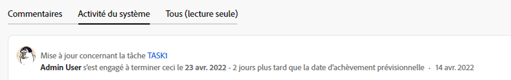

# Présentation de la date de validation

La date de validation est la date à laquelle un utilisateur affecté à une tâche ou à un problème s’engage à terminer la tâche ou le problème. Cette valeur est différente de la date d’achèvement prévue, car il s’agit d’une estimation plus réaliste de la date d’achèvement donnée uniquement par l’utilisateur responsable du travail. Pour plus d’informations sur la date d’achèvement prévue, voir [Présentation de la date d’achèvement planifiée de la tâche](../../../manage-work/tasks/task-information/task-planned-completion-date.md).

## Présentation de la date de validation

Tenez compte des points suivants lorsque vous utilisez des dates de validation :

* Seules les tâches et les problèmes ont une date de validation.
* Les dates de validation ne sont pas définies automatiquement par Adobe Workfront.\
   Lorsque vous créez une tâche ou un problème, aucune date de validation n’est affectée à la tâche ou au problème.
* Si une tâche ou un problème vous est assigné, vous pouvez définir la Date de validation en effectuant l’une des opérations suivantes :

   * Laissez Workfront définir la date de validation de sorte qu’elle corresponde à la date d’achèvement planifiée existante de la tâche ou de la question en cliquant sur Travailler dessus, Démarrer le problème ou Démarrer la tâche sur la tâche ou la tâche. Pour plus d’informations sur le remplacement du bouton Travailler dessus par un bouton Démarrer , voir  [Remplacez le bouton Travailler dessus par un bouton Démarrer](../../../people-teams-and-groups/create-and-manage-teams/work-on-it-button-to-start-button.md).
   * Définissez manuellement vous-même la date de validation en fonction du moment où vous pensez que la tâche ou le problème peut être terminé. Il s’agit de votre estimation et de votre engagement, en tant que personne désignée, envers le chef de projet, à ce que la tâche ou le problème soit terminé à une date spécifique.

>[!NOTE]
>
>Pour modifier la date de validation, vous devez être le propriétaire d’une tâche. Les utilisateurs suivants ne peuvent pas modifier la date de validation d’une tâche :
>
>* Propriétaire du projet
>* Sponsor du projet
>* Gestionnaire des ressources
>* Administrateur système
>* Toute autre personne désignée pour la tâche
>* Tout autre utilisateur disposant d’autorisations sur la tâche.
>
>Pour plus d’informations sur le propriétaire de la tâche, voir la section [Modifier les tâches](../../../manage-work/tasks/manage-tasks/edit-tasks.md#assignments) dans l’article [Modifier les tâches](../../../manage-work/tasks/manage-tasks/edit-tasks.md).

## Notifications et mises à jour déclenchées en modifiant la date de validation {#notifications-and-updates-triggered-by-changing-the-commit-date}

Lorsqu’une tâche ou un responsable d’émission sélectionne une date de validation différente de la date d’achèvement planifiée définie par le propriétaire du projet, un certain nombre de notifications et de mises à jour alertent le propriétaire du projet et d’autres utilisateurs de cette modification.

>[!NOTE]
>
>Les modifications apportées à la date de validation ne modifient pas automatiquement les dates planifiées et les modifications apportées aux dates planifiées ne modifient pas automatiquement la date de validation. 

La définition de la date de validation d’une tâche ou d’un problème déclenche les modifications suivantes :

* La date de validation est renseignée dans le flux de mise à jour de la tâche ou du problème.

   

   Le changement de la date de validation s’affiche dans la zone Mises à jour de la tâche ou lorsque l’administrateur Workfront active cette mise à jour dans la zone Flux de mises à jour de la configuration. Pour plus d’informations, voir [Mises à jour suivies par le système](../../../administration-and-setup/set-up-workfront/system-tracked-update-feeds/system-tracked-update-feeds.md).

* La date de fin prévue de la tâche ou du problème est définie sur la même date, car la tâche a maintenant une indication plus précise du moment où elle sera probablement terminée.

   Pour plus d’informations sur la date d’achèvement prévue, voir [Présentation de la date d’achèvement prévue pour les projets, tâches et problèmes](../../../manage-work/projects/planning-a-project/project-projected-completion-date.md).

   

* Le propriétaire du projet est informé, dans la zone de notifications et dans l’onglet Mises à jour de la tâche, de l’impact de cette modification sur la chronologie du projet.

   

   <!--
  
(NOTE: the tip below is actually wrong and the updates feeds should not control this setting, but at this time it does, according to this issue in Hub: https://hub.workfront.com/issue/61e1aa5e0002a186fdd0a73a10db0fc3/updates?email-source=comm

  -->

   >[!TIP]
   La notification indiquant que la date de validation a changé est envoyée au propriétaire du projet uniquement lorsque l’administrateur Workfront active l’affichage de la date de validation dans la zone Flux de mise à jour de la configuration. Pour plus d’informations, voir [Mises à jour suivies par le système](../../../administration-and-setup/set-up-workfront/system-tracked-update-feeds/system-tracked-update-feeds.md).

   Si un propriétaire de projet ne souhaite pas accepter la modification, nous lui recommandons de faire part de ses commentaires à l’utilisateur qui propose une nouvelle date afin de lui demander de redéfinir la date de validation sur la date planifiée d’origine, ou de sélectionner une nouvelle date. Si un propriétaire de projet accepte la modification, il peut ajuster manuellement la date d’achèvement planifiée afin qu’elle corresponde à la date de validation proposée par l’utilisateur affecté à l’élément.

   Le propriétaire du projet peut utiliser la date de validation pour réinitialiser la date d’achèvement planifiée. Pour cela, sélectionnez l&#39;option Définir la date planifiée sur dans l&#39;onglet Mises à jour de la tâche. Vous devez avoir accès à la gestion de la tâche et du projet pour accepter cette modification.

   >[!NOTE]
   Si vous souhaitez voir l’impact de la chronologie du projet en acceptant de modifier la date d’achèvement planifiée de la tâche, cliquez sur **Chronologie du projet**. Le diagramme de Gantt s’ouvre, où vous pouvez évaluer les changements de date.
     >

Pour plus d’informations sur les fonctionnalités supplémentaires disponibles lors de la mise à jour d’un élément de travail, voir  [Mise à jour du travail](../../../workfront-basics/updating-work-items-and-viewing-updates/update-work.md). 

Pour plus d’informations sur la mise à jour des dates de validation pour les tâches et les problèmes, voir [Mise à jour des dates de validation pour les tâches et les problèmes](../../../manage-work/projects/updating-work-in-a-project/update-commit-date-on-tasks-and-issues.md).

<!--

<h2>Update Commit Dates on tasks and issues</h2>

(NOTE:&nbsp;moved to its own article) 

Updating the Commit Date is identical for tasks and issues.

<ol>
<li value="1"> 
Go to a task or issue that you are assigned to as the <strong>Task Owner</strong>.
 
For more information about finding out who the Task Owner for an issue or task is, see the section <a href="../../../manage-work/tasks/manage-tasks/edit-tasks.md#assignments" class="MCXref xref">Edit tasks</a> in the article <a href="../../../manage-work/tasks/manage-tasks/edit-tasks.md" class="MCXref xref">Edit tasks</a>.
 </li>
<li value="2"> 
Click Work on it in the task or issue header
 
Or
 
Click <strong>Start Task</strong> or <strong>Start Issue</strong> if the Work on it button has been customized in your environment to indicate that you are now working on the work item. 
 
At this time, the Commit Date and the Planned Completion Date of the task or issue are the same.
 </li>
<li value="3"> 
(Optional) If you clicked Start Task or Start Issue, click <strong>Undo</strong> in the lower-left corner of the screen. The Commit Date is removed. 
 
For information about replacing the Work On&nbsp;It button with a Start button, see <a href="../../../people-teams-and-groups/create-and-manage-teams/work-on-it-button-to-start-button.md" class="MCXref xref">Replace the Work On It button with a Start button</a>.
 <note type="tip">
The option to undo your selection to start your work is not available when you click
Work on it.
</note> </li>
<li value="4"> 
 Expand the <strong>This will be done by</strong> date picker, and select a new Commit Date.

Click <strong>Updates</strong> in the left panel, then click the <strong>Start a new update</strong>><strong>Commit Date</strong>

Or

Click <strong>Task Details</strong> or <strong>Issue Details</strong> in the left panel, then double click&nbsp;<strong>Commit Date</strong> and select a new date from calendar. 

The Commit Date and the Planned Completion date are no longer the same.

Instead, the Commit Date and the Projected Completion Date of the task or issue become the same.

The changes are saved automatically.

The Project Owner is notified that you have suggested a new Commit Date for the task or issue and can, at this time, update the Planned Completion Date of the task or issue to match the Commit Date you suggested. For information about the notifications and updates that are triggered by this change, see the section <a href="#notifications-and-updates-triggered-by-changing-the-commit-date" class="MCXref xref">Notifications and updates triggered by changing the Commit Date</a> in this article.

 </li>
</ol>

-->
