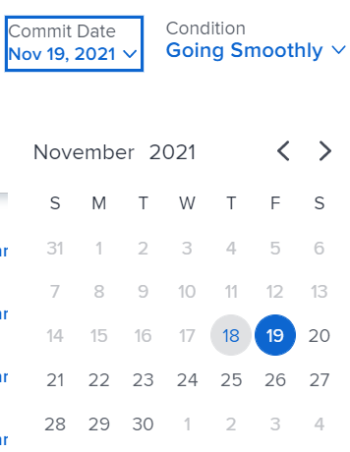

# Mise à jour des dates de validation pour les tâches et les problèmes

Vous pouvez mettre à jour manuellement la date de validation d’une tâche ou d’un problème auquel vous êtes affecté. Pour plus d’informations sur les dates de validation dans Adobe Workfront, voir [Présentation de la date de validation](../../../manage-work/projects/updating-work-in-a-project/overview-of-commit-dates.md).

## Exigences d’accès

<!--drafted for P&P

<table style="table-layout:auto"> 
 <col> 
 <col> 
 <tbody> 
  <tr> 
   <td role="rowheader">Adobe Workfront plan*</td> 
   <td> 
Any
 </td> 
  </tr> 
  <tr> 
   <td role="rowheader">Adobe Workfront license*</td> 
   <td> 
   For the current licenses:
   <ul>
   <li>
Standard for tasks
 </li>
   <li>
Contributor or higher for issues
</li>
   </ul>
   For legacy licenses:
<ul>
   <li>
Work or higher for tasks
</li> 
   <li>
Request or higher for issues
</li>
</ul>

   </td> 
  </tr> 
  <tr> 
   <td role="rowheader">Access level configurations*</td> 
   <td> 
Edit access to Tasks and Issues
 
<b>NOTE</b>
   
   If you still don't have access, ask your Workfront administrator if they set additional restrictions in your access level. For information on how a Workfront administrator can modify your access level, see <a href="../../../administration-and-setup/add-users/configure-and-grant-access/create-modify-access-levels.md" class="MCXref xref">Create or modify custom access levels</a>.
 </td> 
  </tr> 
  <tr> 
   <td role="rowheader">Object permissions</td> 
   <td> 
Manage permissions on the task or issue
 
For information on requesting additional access, see <a href="../../../workfront-basics/grant-and-request-access-to-objects/request-access.md" class="MCXref xref">Request access to objects </a>.
 </td> 
  </tr> 
 </tbody> 
</table>
-->

Vous devez disposer des accès suivants pour effectuer les étapes de cet article :

<table style="table-layout:auto"> 
 <col> 
 <col> 
 <tbody> 
  <tr> 
   <td role="rowheader">Formule Adobe Workfront*</td> 
   <td> 
Tous
 </td> 
  </tr> 
  <tr> 
   <td role="rowheader">Licence Adobe Workfront*</td> 
   <td> 
Travail ou plus pour les tâches
 
   
Demande ou version ultérieure pour les problèmes

   </td> 
  </tr> 
  <tr> 
   <td role="rowheader">Paramétrages du niveau d'accès*</td> 
   <td> 
Modifier l’accès aux tâches et aux problèmes
 
<b>NOTE</b>

Si vous n’avez toujours pas accès à , demandez à votre administrateur Workfront s’il définit des restrictions supplémentaires à votre niveau d’accès. Pour plus d’informations sur la façon dont un administrateur Workfront peut modifier votre niveau d’accès, voir <a href="../../../administration-and-setup/add-users/configure-and-grant-access/create-modify-access-levels.md" class="MCXref xref">Création ou modification de niveaux d’accès personnalisés</a>.
 </td>
</tr> 
  <tr> 
   <td role="rowheader">Autorisations d’objet</td> 
   <td> 
Gérer les autorisations sur la tâche ou le problème
 
Pour plus d’informations sur la demande d’accès supplémentaire, voir <a href="../../../workfront-basics/grant-and-request-access-to-objects/request-access.md" class="MCXref xref">Demande d’accès aux objets </a>.
 </td> 
  </tr> 
 </tbody> 
</table>

&#42;Pour connaître le plan, le type de licence ou l’accès dont vous disposez, contactez votre administrateur Workfront.

## Conditions préalables

Avant de commencer, vous devez être affecté à la tâche ou au problème pour lequel vous devez mettre à jour la date de validation.

## Mise à jour des dates de validation pour les tâches et les problèmes

La mise à jour de la date de validation est identique pour les tâches et les problèmes.

1. Accédez à une tâche ou à un problème auquel vous êtes affecté en tant que **Propriétaire de la tâche**.

   Pour plus d’informations sur la définition du propriétaire de la tâche pour un problème ou une tâche, consultez la section . [Modifier les tâches](../../../manage-work/tasks/manage-tasks/edit-tasks.md#assignments) dans l’article [Modifier les tâches](../../../manage-work/tasks/manage-tasks/edit-tasks.md).

1. Cliquez sur Travailler sur l’en-tête de la tâche ou du problème.

   Ou

   Cliquez sur **Tâche de début** ou **Problème de début** si le bouton Travailler dessus a été personnalisé dans votre environnement pour indiquer que vous travaillez maintenant sur l’élément de travail.

   Actuellement, la date de validation et la date d’achèvement planifiée de la tâche ou du problème sont identiques.

1. (Facultatif) Si vous avez cliqué sur Démarrer la tâche ou Démarrer le problème, cliquez sur **Annuler** dans le coin inférieur gauche de l’écran. La date de validation est supprimée.

   Pour plus d’informations sur le remplacement du bouton Travailler dessus par un bouton Démarrer , voir  [Remplacez le bouton Travailler dessus par un bouton Démarrer](../../../people-teams-and-groups/create-and-manage-teams/work-on-it-button-to-start-button.md).

   >[!TIP]
   >
   >L’option permettant d’annuler la sélection pour commencer votre travail n’est pas disponible lorsque vous cliquez sur **Travailler dessus**.

1. Cliquez sur **Mises à jour** dans le panneau de gauche, puis cliquez sur le bouton **Démarrer une nouvelle mise à jour** >**Date de validation**

   Ou

   Cliquez sur **Détails de la tâche** ou **Détails du problème** dans le panneau de gauche, puis double-cliquez sur **Date de validation** et sélectionnez une nouvelle date dans le calendrier, puis cliquez sur **Enregistrer les modifications**.
   

   Les éléments suivants se produisent après avoir apporté cette modification : 

   * La date de validation et la date d’achèvement planifiée ne sont plus les mêmes.

      Au lieu de cela, la date de validation et la date d’achèvement prévue de la tâche ou du problème sont identiques.

      

   * Les modifications sont automatiquement enregistrées lorsque vous sélectionnez une nouvelle date dans la zone Mises à jour .
   * Le propriétaire du projet est informé que vous avez suggéré une nouvelle date de validation pour la tâche ou le problème et que vous pouvez, à ce stade, mettre à jour la date d’achèvement planifiée de la tâche ou du problème pour qu’elle corresponde à la date de validation que vous avez suggérée.

      

      Pour plus d’informations sur les notifications et les mises à jour déclenchées par cette modification, voir la section [Notifications et mises à jour déclenchées en modifiant la date de validation](../../../manage-work/projects/updating-work-in-a-project/overview-of-commit-dates.md#notifica) dans l’article [Présentation de la date de validation](../../../manage-work/projects/updating-work-in-a-project/overview-of-commit-dates.md).
