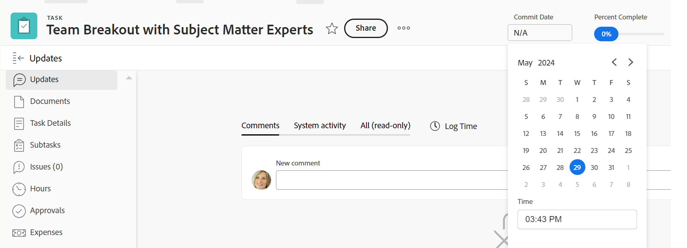

# Mettre à jour les dates d’engagement pour les tâches et les problèmes

Les informations mises en surbrillance sur cette page font référence à des fonctionnalités qui ne sont pas encore disponibles de manière générale. Elles sont disponibles uniquement dans l’environnement de prévisualisation pour toutes les clientes et tous les clients ou dans l’environnement de production pour les clientes et les clients qui ont activé les versions rapides.

Pour plus d’informations sur les versions rapides, voir [Activer ou désactiver le versions rapides pour votre entreprise](/help/quicksilver/administration-and-setup/set-up-workfront/configure-system-defaults/enable-fast-release-process.md).

Pour plus d’informations sur la version actuelle, voir [Présentation de la version du troisième trimestre 2024](/help/quicksilver/product-announcements/product-releases/24-q3-release-activity/24-q3-release-overview.md).

Vous pouvez mettre à jour manuellement la date d’engagement d’une tâche ou d’un problème qui vous incombe. Pour plus d’informations sur les dates d’engagement dans Adobe Workfront, voir [Vue d’ensemble des dates d’engagement](../../../manage-work/projects/updating-work-in-a-project/overview-of-commit-dates.md).

## Conditions d’accès

<!--Audited: 01/2024-->

Vous devez disposer des accès suivants pour effectuer les étapes de cet article :

<table style="table-layout:auto"> 
 <col> 
 <col> 
 <tbody> 
  <tr> 
   <td role="rowheader">Forfait Adobe Workfront</td> 
   <td> 
N’importe quelle
 </td> 
  </tr> 
  <tr> 
   <td role="rowheader">Licence Adobe Workfront*</td> 
   <td> 
   Pour les nouvelles licences :
   <ul>
   <li>
Standard pour les tâches
 </li>
   <li>
Contributeur ou supérieur pour les problèmes
</li>
   </ul>
   Pour les licences actuelles :
<ul>
   <li>
Travail ou supérieur pour les tâches
</li> 
   <li>
Requête ou supérieure pour les problèmes
</li>
</ul>

</td> 
  </tr> 
  <tr> 
   <td role="rowheader">Configurations du niveau d’accès</td> 
   <td> 
Accès en modification aux tâches et problèmes
 </td> 
  </tr> 
  <tr> 
   <td role="rowheader">Autorisations d’objet</td> 
   <td> 
Gérer les autorisations liées à la tâche ou au problème
 </td> 
  </tr> 
 </tbody> 
</table>

* Pour connaître le forfait, le type de licence ou l’accès dont vous disposez, contactez votre administrateur ou administratrice Workfront. Pour plus d’informations, consultez les [Conditions d’accès dans la documentation de Workfront](/help/quicksilver/administration-and-setup/add-users/access-levels-and-object-permissions/access-level-requirements-in-documentation.md).

## Conditions préalables

Avant de pouvoir modifier la date de validation d’une tâche ou d’un problème, vous devez être affecté à la tâche ou au problème dont vous devez mettre à jour la date de validation.

## Mettre à jour les dates d’engagement pour les tâches et les problèmes

Vous pouvez mettre à jour la date de validation d’une tâche ou d’un problème dans les zones suivantes de Workfront :

* La section Détails d’une tâche ou d’un problème
* En-tête de tâche ou de problème

  L’administrateur de Workfront ou de votre groupe doit ajouter la date de validation à l’en-tête de tâche ou de problème de votre modèle de mise en page pour l’afficher à partir de la tâche ou de la page de publication.
Pour plus d’informations, voir [Personnalisation des en-têtes d’objet à l’aide d’un modèle de mise en page](/help/quicksilver/administration-and-setup/customize-workfront/use-layout-templates/customize-object-headers.md).

La mise à jour de la date d’engagement est identique pour les tâches et les problèmes.

>[!NOTE]
>
>Vous pouvez demander à votre administrateur ou administratrice système ou de groupe d’ajouter le champ Date d’engagement à votre panneau Résumé, afin de faciliter sa mise à jour dans différentes zones de Workfront.
>
>Pour plus d’informations, consultez les articles suivants :
>
>* [Vue d’ensemble du résumé](/help/quicksilver/workfront-basics/the-new-workfront-experience/summary-overview.md)
>* [Personnaliser la page d’accueil et le résumé à l’aide d’un modèle de disposition](/help/quicksilver/administration-and-setup/customize-workfront/use-layout-templates/customize-home-summary-layout-template.md).

1. Accédez à une tâche ou à un problème affectés à vous-même en tant que **Propriétaire**.

   Pour plus d’informations sur la définition du ou de la propriétaire de la tâche pour un problème ou une tâche, voir la section [Modifier les tâches](../../../manage-work/tasks/manage-tasks/edit-tasks.md#assignments) dans l’article [Modifier les tâches](../../../manage-work/tasks/manage-tasks/edit-tasks.md).

1. (Conditionnel et facultatif) Si votre administrateur Workfront ou de groupe a ajouté la date de validation à l’en-tête de la tâche ou du problème, cliquez sur l’icône **Date de validation** dans l’en-tête, puis sélectionnez une date dans le calendrier. Si la date de validation ne figure pas dans l’en-tête, procédez comme suit. 

   

1. Cliquez sur **Détails de la tâche** ou **Détails du problème** dans le panneau de gauche.
1. Cliquez sur **Vue d’ensemble** pour l’étendre.
1. Mettez à jour le champ **Date d’engagement**.

   

1. Cliquez sur **Enregistrer les modifications**.

   Ce qui suit se produit après avoir apporté cette modification :

   * La date d’engagement et la date d’achèvement prévue de la tâche ou du problème ne sont plus les mêmes.

     Au lieu de cela, la date d’engagement et la date d’achèvement projetée de la tâche ou du problème sont identiques.

     

   * Le ou la propriétaire du projet reçoit une notification intégrée à Workfront, selon laquelle vous avez suggéré une nouvelle date d’engagement pour la tâche ou le problème.
   * Le propriétaire du projet est informé, dans la section Mises à jour, que vous avez suggéré une nouvelle date de validation et qu’il peut, à ce stade, mettre à jour la date d’achèvement planifiée de la tâche ou du problème pour qu’elle corresponde à la date de validation que vous avez suggérée.

     

     <!---->

     Pour plus d’informations sur les notifications et les mises à jour déclenchées par cette modification, voir la section Notifications et mises à jour déclenchées en modifiant la date d’engagement de l’article [Vue d’ensemble des dates d’engagement](/help/quicksilver/manage-work/projects/updating-work-in-a-project/overview-of-commit-dates.md).

<!--at the Production update stream when removing legacy - replace the last bullet with: The Project Owner is notified in the Systems Activity and the All tabs of the Updates section that you have suggested a new Commit Date. They can then update the Planned Completion Date accordingly by editing the task or the issue.-->