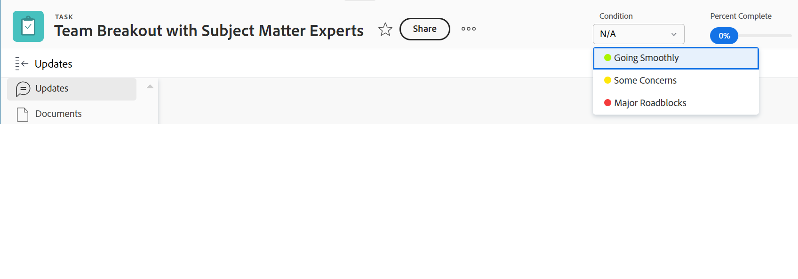

# Mettre à jour la condition des tâches et des problèmes

<!--Audited: 07/2024-->

<!--The highlighted information on this page refers to functionality not yet generally available. It is available only in the Preview environment for all customers, or in the Production environment for customers who enabled fast releases.

For information about fast releases, see [Enable or disable fast releases for your organization](/help/quicksilver/administration-and-setup/set-up-workfront/configure-system-defaults/enable-fast-release-process.md).

For information about the current release, see [Third Quarter 2024 release overview](/help/quicksilver/product-announcements/product-releases/24-q3-release-activity/24-q3-release-overview.md).-->

La condition d’une tâche ou d’un problème est un indicateur qui y est placé pour indiquer comment elle ou il se déroule. Il s’agit d’un statut différent de celui de l’élément de travail, qui indique l’étape actuelle du développement de l’élément.

Vous pouvez définir la condition d’une tâche ou d’un problème automatiquement ou manuellement.

Les valeurs de condition auxquelles nous faisons référence dans cet article sont disponibles par défaut dans Workfront. Votre administrateur ou administratrice Adobe Workfront peut créer des conditions personnalisées pour votre environnement, comme décrit dans [Créer ou modifier une condition personnalisée](../../../administration-and-setup/customize-workfront/create-manage-custom-conditions/create-edit-custom-conditions.md).

## Conditions d’accès {#access-requirements}

+++ Développez pour afficher les exigences d’accès aux fonctionnalités de cet article.

<table style="table-layout:auto"> 
 <col> 
 <col> 
 <tbody> 
  <tr> 
   <td role="rowheader">Forfait Adobe Workfront</td> 
   <td> 
N’importe quelle
 </td> 
  </tr> 
  <tr> 
   <td role="rowheader">Licence Adobe Workfront*</td> 
   <td> 
   Nouveau :
   <ul><li>
Standard pour les tâches
</li>
   <li>
Contributeur ou supérieur pour les problèmes
</li></ul>
   Actuel :
   <ul><li>
Travail ou supérieur pour les tâches
</li>
   <li>
Requête ou supérieure pour les problèmes
</li></ul>
    </td> 
  </tr> 
  <tr> 
   <td role="rowheader">Configurations du niveau d’accès</td> 
   <td> 
Accès en affichage ou supérieur pour les projets
 
Accès en modification aux tâches et problèmes 
</td> 
  </tr> 
  <tr> 
   <td role="rowheader">Autorisations d’objet</td> 
   <td> 
Autorisations d’affichage ou supérieures sur les tâches et les problèmes pour afficher leur condition

   
Autorisations Contribute sur les tâches et problèmes pour mettre à jour la condition

  </td> 
  </tr> 
 </tbody> 
</table>

*Pour plus d’informations, voir [Exigences d’accès dans la documentation Workfront](/help/quicksilver/administration-and-setup/add-users/access-levels-and-object-permissions/access-level-requirements-in-documentation.md).

+++

## Conditions préalables

Une tâche ou un problème doit vous être affecté pour pouvoir mettre à jour manuellement sa condition.

## Localiser la condition de tâches et de problèmes

Les conditions s’affichent sous la forme d’un indicateur associé à des tâches ou des problèmes. Elles peuvent également être associées à un numéro qui peut s’afficher dans les rapports au lieu du libellé. Pour plus d’informations sur l’association de conditions à des numéros, voir [Créer ou modifier une condition personnalisée](../../../administration-and-setup/customize-workfront/create-manage-custom-conditions/create-edit-custom-conditions.md).

Vous pouvez retrouver la condition des tâches et des problèmes dans les zones suivantes de Workfront :

* La page Détails , une fois qu’un administrateur de Workfront ou de groupe l’a ajoutée à votre modèle de mise en page. Pour plus d’informations, voir [Personnaliser la vue Détails à l’aide d’un modèle de disposition](/help/quicksilver/administration-and-setup/customize-workfront/use-layout-templates/customize-details-view-layout-template.md).

* L’en-tête d’une tâche ou d’un problème, après qu’un administrateur de Workfront ou de groupe l’ait ajoutée à votre modèle de mise en page. Pour plus d’informations, voir [Personnaliser les en-têtes d’objet à l’aide d’un modèle de mise en page](/help/quicksilver/administration-and-setup/customize-workfront/use-layout-templates/customize-object-headers.md).

* Panneau Résumé, une fois qu’un administrateur ou une administratrice Workfront ou de groupes l’a ajouté à votre modèle de mise en page. Pour plus d’informations, voir [Personnaliser l’accueil et le résumé à l’aide d’un modèle de mise en page](/help/quicksilver/administration-and-setup/customize-workfront/use-layout-templates/customize-home-summary-layout-template.md).

* Les rapports et les listes lorsque vous affichez le champ Condition dans une vue ou un regroupement.

  >[!NOTE]
  >
  >Lorsque le mot « condition » s’affiche dans le champ Nom du champ d’un rapport Entrée du journal, cela indique que la condition d’un élément a été mise à jour. Lorsque le champ Condition est suivi dans les rapports Entrées du journal, les valeurs Nouveau et Ancien numéro affichent le numéro associé à la condition au lieu de son nom. Si une condition n’est pas définie à l’origine pour une tâche ou un problème et que vous la mettez à jour ultérieurement, l’entrée du journal qui capture la mise à jour affichera la valeur Ancien numéro du champ Condition comme suit : -2,147,483,648.

## Mettre automatiquement à jour la condition en mettant à jour le statut

Lorsqu’une tâche ou un problème vous est affecté et que vous cliquez sur **Travailler sur ce projet**, Démarrer la tâche ou Démarrer le problème, ou que vous mettez à jour son statut, la condition de la tâche ou du problème passe automatiquement à la condition par défaut associée à **Tout est en ordre**.

Pour plus d’informations sur l’utilisation d’une condition personnalisée comme condition par défaut, voir les articles [Définir une condition personnalisée par défaut pour les tâches et les problèmes](../../../administration-and-setup/customize-workfront/create-manage-custom-conditions/set-custom-condition-default-tasks-issues.md) et [Définir une condition personnalisée par défaut pour les projets](../../../administration-and-setup/customize-workfront/create-manage-custom-conditions/set-custom-condition-default-projects.md).

Pour plus d’informations sur la modification du statut de la tâche, voir [Mettre à jour le statut de la tâche](../../../manage-work/projects/updating-work-in-a-project/update-task-status.md).

Pour plus d’informations sur la modification du statut du problème, voir [Mettre à jour le statut du problème](../../../manage-work/projects/updating-work-in-a-project/update-issue-status.md).

Pour plus d’informations sur la définition du bouton Travailler sur ce projet sur un bouton Démarrer la tâche ou Démarrer le problème, voir [Remplacer le bouton Travailler sur ce projet par un bouton Démarrer](../../../people-teams-and-groups/create-and-manage-teams/work-on-it-button-to-start-button.md).

## Mettre à jour manuellement la condition

Vous devez être affecté à une tâche ou au problème ou disposer des autorisations de gestion sur celle-ci ou celui-ci pour pouvoir définir sa condition.

Vous pouvez mettre à jour manuellement la condition d’une tâche ou d’un problème dans un rapport de tâche ou de problème ou une liste lorsque vous affichez le champ Condition dans la vue.

>[!NOTE]
>
>Vous pouvez demander à votre administrateur système ou de groupe d’ajouter le champ Condition à votre panneau Résumé, ou l’en-tête de la tâche ou du problème ou les pages Détails.
>
>Pour plus d’informations, consultez les articles suivants :
>
>* [Vue d’ensemble du résumé](/help/quicksilver/workfront-basics/the-new-workfront-experience/summary-overview.md)
>* [Personnaliser la page d’accueil et le résumé à l’aide d’un modèle de disposition](/help/quicksilver/administration-and-setup/customize-workfront/use-layout-templates/customize-home-summary-layout-template.md).

<!--old Condition update - in the commenting stream: 
Updating the Condition of a task or issue differs depending on whether you are assigned to it or not:

* If you are using the legacy commenting experience, you can update the Condition in the Updates tab or in a list of tasks or issues if you are assigned to them. This is not supported in the new commenting experience. For information, see [New commenting experience](/help/quicksilver/product-announcements/betas/new-commenting-experience-beta/unified-commenting-experience.md). 
* You can update the Condition in a list of tasks or issues if you are not assigned to them, only if you have Manage permissions to them. In this case, you cannot update the Condition in the Update tab of the task or issue. -->

Vous pouvez mettre à jour manuellement la condition des tâches et des problèmes dans différentes zones de Workfront. Les sections suivantes décrivent comment mettre à jour manuellement la condition des tâches et des problèmes.

### Mettre à jour la condition d’une tâche ou d’un problème dans l’en-tête de la tâche ou du problème

1. (Le cas échéant) Si votre administrateur ou administratrice Workfront ou de groupes a ajouté le champ Condition à l’en-tête de la tâche ou du problème de votre modèle de mise en page, cliquez sur le champ **Condition** dans l’en-tête et sélectionnez l’une des options suivantes :
   * Tout est en ordre
   * Certaines inquiétudes
   * Obstacles majeurs

   
1. Cliquez sur Entrée pour enregistrer la condition.

### Mettre à jour la condition d’une tâche ou d’un problème dans la section Détails de la tâche ou du problème

1. (Le cas échéant) Si votre administrateur ou administratrice Workfront ou de groupes a ajouté le champ Condition à la section Détails d’une tâche ou d’un problème dans votre modèle de mise en page, cliquez sur **Détails** dans le panneau de gauche, puis cliquez sur **Condition de tâche** ou **Condition de problème** et sélectionnez l’une des options suivantes :
   * Tout est en ordre
   * Certaines inquiétudes
   * Obstacles majeurs
1. Cliquez sur Enregistrer les modifications. **** La condition de la tâche ou du problème est mise à jour.

### Mettre à jour la condition d’une tâche ou d’un problème dans un rapport ou une liste

1. Accédez à la liste des tâches ou des problèmes sur lesquels vous disposez d’autorisations de gestion. Assurez-vous que le champ **Condition** est visible dans la vue de la liste.

1. Mettez à jour la **condition** du problème ou de la tâche en ligne, en double-cliquant sur la condition existante et en sélectionnant une nouvelle valeur dans le menu déroulant.

   

   >[!NOTE]
   >
   >Les conditions peuvent être personnalisées pour votre environnement. Vous pouvez donc trouver plus de trois options pour la condition dans votre environnement. Les noms des conditions peuvent être différents de ceux répertoriés ci-dessus. Pour plus d’informations sur la personnalisation des conditions dans Workfront, voir [Créer ou modifier une condition personnalisée](../../../administration-and-setup/customize-workfront/create-manage-custom-conditions/create-edit-custom-conditions.md).

1. Appuyez sur **Entrée** sur votre clavier ou cliquez en dehors du champ Condition pour enregistrer la nouvelle condition de la tâche ou du problème.

<!--   
<li>
(NOTE: drafted because I can't do this anymore)

If you have Manage permissions to the task or issue but are not assigned to it, perhaps as a project manager, add the <strong>Condition</strong> column to any view you use in a task or issue list, then set the <strong>Condition</strong> in inline edit and press Enter.

For information about adding a column to a view, see <a href="../../../reports-and-dashboards/reports/reporting-elements/views-overview.md">Views overview in Adobe Workfront</a>.
</li>   
     -->

