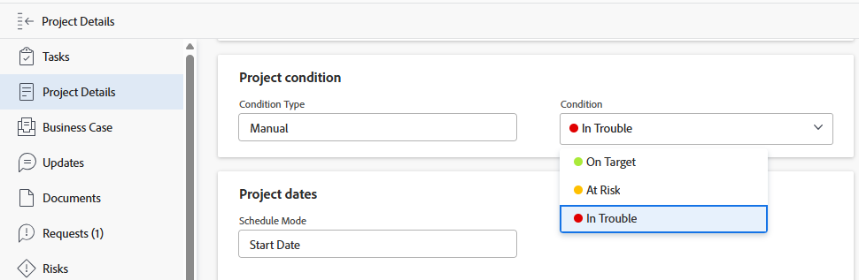

# Mettre à jour la condition d’un projet

La condition d’un projet est un indicateur placé sur celui-ci pour indiquer si le travail associé à ce projet se déroule sans problème ou si vous avez rencontré des difficultés. Cette donnée est différente du statut du projet, qui indique si vous travaillez activement ou non sur le projet.

Vous pouvez définir la condition d’un projet automatiquement ou manuellement. Pour modifier manuellement le statut d&#39;un projet, vous devez être le propriétaire du projet ou disposer des droits de gestion sur celui-ci.

L’équipe d’administration d’Adobe Workfront peut créer des conditions personnalisées pour votre environnement, comme décrit dans la section [Créer ou modifier une condition personnalisée](../../../administration-and-setup/customize-workfront/create-manage-custom-conditions/create-edit-custom-conditions.md).

## Conditions d’accès

+++ Développez pour afficher les exigences d’accès aux fonctionnalités de cet article. 

<table style="table-layout:auto"> 
 <col> 
 <col> 
 <tbody> 
  <tr> 
   <td role="rowheader">Package Adobe Workfront</td> 
   <td>
Tous
 </td> 
  </tr> 
  <tr> 
   <td role="rowheader">Licence Adobe Workfront</td> 
   <td> 
  
Standard

   
Plan

    </td> 
  </tr> 
  <tr> 
   <td role="rowheader">Configurations des niveaux d’accès</td> 
   <td> 
Accès en affichage ou supérieur aux projets
 
Accès en modification aux tâches et aux problèmes 
 </td> 
  </tr> 
  <tr> 
   <td role="rowheader">Autorisations d’objet</td> 
   <td> 
Autorisations d’affichage ou supérieures sur les tâches et les problèmes afin de visualiser leur condition

   
Autorisations de gestion sur les tâches et les problèmes pour mettre à jour la condition

     </td> 
  </tr> 
 </tbody> 
</table>

Pour plus d’informations, consultez la section [Conditions d’accès requises dans la documentation Workfront](/help/quicksilver/administration-and-setup/add-users/access-levels-and-object-permissions/access-level-requirements-in-documentation.md).

+++

<!--Old:

<table style="table-layout:auto"> 
 <col> 
 <col> 
 <tbody> 
  <tr> 
   <td role="rowheader">Adobe Workfront plan</td> 
   <td>
Any
 </td> 
  </tr> 
  <tr> 
   <td role="rowheader">Adobe Workfront license*</td> 
   <td> 
   
   For the new licenses:
  
Standard

   
   For current licenses:
   <ul><li>
Plan

    </td> 
  </tr> 
  <tr> 
   <td role="rowheader">Access level configurations</td> 
   <td> 
View or higher access to projects
 
Edit access to tasks and issues 
 </td> 
  </tr> 
  <tr> 
   <td role="rowheader">Object permissions</td> 
   <td> 
View or higher permissions on tasks and issues to view their Condition

   
Manage permissions on tasks and issues to update the Condition

     </td> 
  </tr> 
 </tbody> 
</table>-->

## Définir automatiquement la condition

La définition automatique de la condition d’un projet est déterminée par le type de condition du projet. Le type de condition doit être défini sur Statut de progression pour que Workfront définisse automatiquement la condition du projet.

Votre administrateur Workfront ou de groupe détermine la valeur par défaut du champ Type de condition pour les nouveaux projets de votre système lors de la définition des préférences du projet dans la zone Configuration . Pour plus d’informations, consultez la section [Configurer des préférences de projet à l’échelle du système](../../../administration-and-setup/set-up-workfront/configure-system-defaults/set-project-preferences.md).

Lorsque vous créez un projet, la condition du projet est automatiquement définie pour correspondre au statut de la progression du projet à ce moment-là. Le statut de la progression du projet est basé sur la progression des tâches du projet.

Pour plus d’informations sur les conditions du projet et leur calcul en fonction du statut de progression, consultez la section [Vue d’ensemble du statut de la progression du projet](../../../manage-work/projects/planning-a-project/project-progress-status.md).

## Mettre à jour manuellement la condition d’un projet

Si vous définissez le type de condition de votre projet sur « Manuel » au lieu de « Statut de la progression », vous pouvez mettre à jour manuellement la condition d’un projet.

1. Accédez au projet pour lequel vous souhaitez mettre à jour la condition.
1. Cliquez sur la section **Détails du projet** dans le panneau de gauche.

1. Assurez-vous que le champ **Type de condition** est défini sur **Manuel**.

   

1. Dans le champ **Condition**, sélectionnez parmi les options suivantes celle qui correspond à votre compréhension du bon déroulement du travail ou des retards :

   * **Cible**
   * **À risque**
   * **À problème**

   Pour plus d’informations sur les conditions du projet, consultez la section [Vue d’ensemble de la condition et du type de condition du projet](../../../manage-work/projects/manage-projects/project-condition-and-condition-type.md).

   >[!NOTE]
   >
   >Les conditions peuvent être personnalisées en fonction de votre environnement. Il est donc possible que vous trouviez plus de trois options pour les conditions dans votre environnement. Les noms des conditions peuvent être différents de ceux énumérés ci-dessus. Pour plus d’informations sur la personnalisation des conditions dans Workfront, consultez la section [Créer ou modifier une condition personnalisée](../../../administration-and-setup/customize-workfront/create-manage-custom-conditions/create-edit-custom-conditions.md).

1. Cliquez sur **Enregistrer les modifications**.
