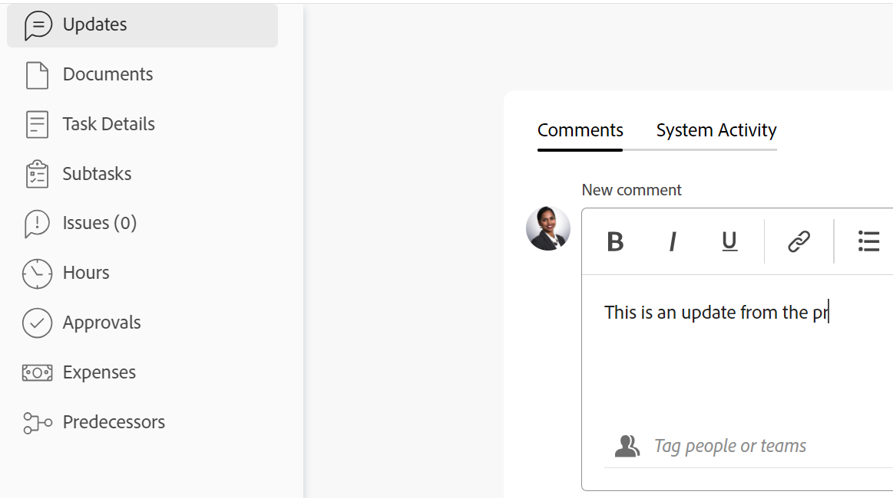

# Mettre à jour le statut des tâches

<!--Audited: 10/2024-->

Vous pouvez mettre à jour le statut d’une tâche pour informer les autres utilisateurs de l’emplacement de la tâche (et du projet dans son ensemble) et de sa progression.

Les statuts par défaut sont Nouvelle, En cours et Terminée. Votre administrateur ou administratrice Adobe Workfront peut ajouter des statuts personnalisés à votre organisation. Pour plus d’informations, consultez [Créer ou modifier un statut](../../../administration-and-setup/customize-workfront/creating-custom-status-and-priority-labels/create-or-edit-a-status.md).

Vous pouvez mettre à jour les statuts des tâches manuellement ou laisser Workfront les mettre à jour automatiquement lorsque certaines actions ont lieu.

## Conditions d’accès

+++ Développez pour afficher les exigences d’accès aux fonctionnalités de cet article. 

<table style="table-layout:auto"> 
 <col> 
 <col> 
 <tbody> 
  <tr> 
   <td role="rowheader">Package Adobe Workfront</td> 
   <td> 
Tous
 </td> 
  </tr> 
  <tr> 
   <td role="rowheader">Licence Adobe Workfront</td> 
   <td> 
Standard
 
   
Travail ou supérieur

   </td> 
  </tr> 
  <tr> 
   <td role="rowheader">Configurations des niveaux d’accès</td> 
   <td> 
Modifier l’accès aux tâches
  </td> 
  </tr> 
  <tr> 
   <td role="rowheader">Autorisations d’objet</td> 
   <td> 
Gérer les autorisations pour la tâche
 </td> 
  </tr> 
 </tbody> 
</table>

Pour plus d’informations, voir [Conditions d’accès dans la documentation Workfront](/help/quicksilver/administration-and-setup/add-users/access-levels-and-object-permissions/access-level-requirements-in-documentation.md).

+++

<!--Old:

<table style="table-layout:auto"> 
 <col> 
 <col> 
 <tbody> 
  <tr> 
   <td role="rowheader">Adobe Workfront plan</td> 
   <td> 
Any
 </td> 
  </tr> 
  <tr> 
   <td role="rowheader">Adobe Workfront license</td> 
   <td> 
New: Standard
 
   Or
   
Current: Work or higher

   </td> 
  </tr> 
  <tr> 
   <td role="rowheader">Access level configurations</td> 
   <td> 
Edit access to Tasks
  </td> 
  </tr> 
  <tr> 
   <td role="rowheader">Object permissions</td> 
   <td> 
Manage permissions to the task
 </td> 
  </tr> 
 </tbody> 
</table>-->

## Considérations relatives à la mise à jour du statut des tâches

* Lorsque vous marquez une tâche comme Terminée, le pourcentage terminé de la tâche passe à 100 %.
* Les scénarios suivants existent pour les tâches parent :
   * Vous ne pouvez pas mettre à jour le statut d&#39;une tâche parent sur Terminé lorsque le mode d&#39;achèvement du sommaire du projet est défini sur Automatique et que les sous-tâches ne sont pas terminées.
   * Vous pouvez mettre à jour le statut d’une tâche parent sur Terminée lorsque le mode d’achèvement du résumé du projet est défini sur Manuel et que les sous-tâches sont terminées ou non.

  Pour plus d’informations, consultez [Modifier des projets](../manage-projects/edit-projects.md).

## Mettre à jour manuellement le statut de la tâche

Vous pouvez mettre à jour le statut de la tâche dans les zones suivantes :

* L’en-tête de la tâche sur la page de la tâche.
* La zone Modifier la tâche permet de modifier une tâche.
* La section Détails de la tâche de la page de la tâche.
* Dans une liste de tâches ou un rapport lorsque le champ Statut est visible dans la vue.
* Dans le panneau Résumé de la tâche.

Pour mettre à jour manuellement le statut de la tâche dans l’en-tête de la tâche, procédez comme suit :

1. Accédez à une tâche dont vous souhaitez mettre à jour le statut.
1. Dans l’en-tête de la tâche, cliquez sur le champ **Statut** et sélectionnez un nouveau statut.
1. Pour fournir une indication visuelle de l’achèvement de la tâche, faites glisser la bulle sous **Pourcentage terminé** dans l’en-tête de la tâche.

   Ou

   Double-cliquez dans la bulle **Pourcentage terminé** pour saisir manuellement un nouveau pourcentage.

   

1. (Facultatif) Effectuez l’une des opérations suivantes pour fournir des informations supplémentaires sur la mise à jour :

   * Pour ajouter une note à propos de la mise à jour, accédez à la section **Mises à jour**, cliquez sur **Nouveau commentaire**, puis saisissez une note.

     

   * Pour informer certaines personnes de la mise à jour, saisissez leur nom dans le champ **Taguer des personnes ou des équipes** qui s’affiche lorsque vous saisissez un commentaire. Pour plus d’informations, voir la section [Taguer d’autres personnes sur les mises à jour](/help/quicksilver/workfront-basics/updating-work-items-and-viewing-updates/tag-others-on-updates.md).
   * Pour mettre à jour la date d’engagement de la tâche, cliquez sur **Détails de la tâche**, puis modifiez le champ **Date d’engagement**. Pour plus d’informations, voir [Modifier les tâches](/help/quicksilver/manage-work/tasks/manage-tasks/edit-tasks.md).

   >[!IMPORTANT]
   >
   >  Seules les personnes à qui des tâches sont affectées peuvent mettre à jour la date d’engagement.

<!--old functionality in old commenting: 

1. Go to a task that you are assigned to for which you want to update the status.
1. Click the **Status** field in the task header and select a new status. 
1. (Optional) Do any of the following to provide additional information about the update, then click **Update** or, if the task has the **Complete** status, click **Done:**

   * To add a note about the update, go to the **Updates** area and click **Start a new update**, then type your note.  

   * To notify certain users about the update, type their names in the **Notify** box that appears when you type a note about the update. For more information, see [Tag others on updates](../../../workfront-basics/updating-work-items-and-viewing-updates/tag-others-on-updates.md). 
   * To update the condition of the task, click **Select Condition** to the right of the **Notify** box (these appear when you type a note about the update), then select the condition that best reflects the current condition of the task.
   
   * To update the Commit Date of the task, expand the **Commit Date** drop-down calendar, and select a new Commit Date. 
   * To provide a visual indication of task completion, drag the bubble under Percent Complete or double-click it to enter a percent value.   
     ![Drag the progress bar]](assets/drag-the-progress-bar-350x155.png)-->

## Mettre à jour automatiquement le statut de la tâche

Workfront met automatiquement à jour le statut actuel d’une tâche avec un statut différent lorsque les actions énumérées dans le tableau ci-dessous se produisent.

>[!NOTE]
>
>Les statuts présentés dans le tableau suivant sont des statuts système par défaut. Votre équipe d’administration Workfront ou une équipe d’administration de groupe peut renommer les statuts de votre instance Workfront. Pour plus d’informations sur la création et la gestion des statuts dans Workfront, voir [Créer ou modifier un statut](../../../administration-and-setup/customize-workfront/creating-custom-status-and-priority-labels/create-or-edit-a-status.md).

<table style="table-layout:auto"> 
 <col> 
 <col> 
 <col> 
 <tbody> 
  <tr> 
   <td><b>Action</b></td> 
   <td><b>Statut d’origine</b></td> 
   <td><b>Nouveau statut</b></td> 
  </tr> 
  <tr> 
   <td>Mettre à jour le pourcentage terminé de la tâche à 100 %</td> 
   <td>Nouveau ou en cours</td> 
   <td>Terminé</td> 
  </tr> 
  <tr> 
   <td>Mettre à jour le pourcentage terminé de la tâche de 100 % à un nombre inférieur</td> 
   <td>Terminé</td> 
   <td>En cours</td> 
  </tr> 
  <tr data-mc-conditions=""> 
   <td>Cliquez sur le bouton Démarrer la tâche pour accepter de travailler sur une tâche qui vous a été affectée. </td> 
   <td>Nouveau </td> 
   <td> 
Tout statut associé au bouton Démarrer la tâche dans les paramètres de votre équipe interne.
 
Pour plus d’informations sur le remplacement du bouton Travailler dessus par un bouton Démarrer la tâche, voir <a href="../../../people-teams-and-groups/create-and-manage-teams/work-on-it-button-to-start-button.md" class="MCXref xref">Remplacer le bouton Travailler dessus par un bouton Démarrer</a>.
 
Conseil : Cliquer sur le bouton Annuler après avoir cliqué sur Démarrer la tâche, rétablit le statut sur Nouveau. 
 </td> 
  </tr> 
 </tbody> 
</table>
