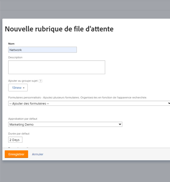

# Création de rubriques de file d’attente

Les rubriques de file d’attente fonctionnent conjointement avec les règles de routage pour affecter automatiquement le travail entrant à un utilisateur, un rôle de tâche, une équipe ou pour le placer sur un projet. Les rubriques de la file d’attente définissent les conditions nécessaires à la mise en oeuvre de la règle de routage.

Le nombre de rubriques de file d’attente pouvant être affectées à un groupe de rubriques ou à un projet n’est pas limité. Les rubriques de file d’attente sont un type d’objet à rapporter.

## Exigences d’accès

<!--drafted - replace table with P&P:

<table style="table-layout:auto"> 
 <col> 
 <col> 
 <tbody> 
  <tr> 
   <td role="rowheader">Adobe Workfront plan*</td> 
   <td> 
Any 
 </td> 
  </tr> 
  <tr> 
   <td role="rowheader">Adobe Workfront license*</td> 
   <td> 
Current license: Standard 
 
   Or
   
Legacy license: Plan 
 </td> 
  </tr> 
  <tr> 
   <td role="rowheader">Access level configurations*</td> 
   <td> 
Edit access to Projects
 
Note: If you still don't have access, ask your Workfront administrator if they set additional restrictions in your access level. For information on how a Workfront administrator can modify your access level, see <a href="../../../administration-and-setup/add-users/configure-and-grant-access/create-modify-access-levels.md" class="MCXref xref">Create or modify custom access levels</a>.
 </td> 
  </tr> 
  <tr> 
   <td role="rowheader">Object permissions</td> 
   <td> 
 Manage permissions to the project
 
For information on requesting additional access, see <a href="../../../workfront-basics/grant-and-request-access-to-objects/request-access.md" class="MCXref xref">Request access to objects </a>.
 </td> 
  </tr> 
 </tbody> 
</table>
-->

Vous devez disposer des éléments suivants :

<table style="table-layout:auto"> 
 <col> 
 <col> 
 <tbody> 
  <tr> 
   <td role="rowheader">Formule Adobe Workfront*</td> 
   <td> 
Tous 
 </td> 
  </tr> 
  <tr> 
   <td role="rowheader">Licence Adobe Workfront*</td> 
   <td> 
Plan 
 </td> 
  </tr> 
  <tr> 
   <td role="rowheader">Paramétrages du niveau d'accès*</td> 
   <td> 
Modifier l’accès aux projets
 
Remarque : Si vous n’avez toujours pas accès à , demandez à votre administrateur Workfront s’il définit des restrictions supplémentaires à votre niveau d’accès. Pour plus d’informations sur la façon dont un administrateur Workfront peut modifier votre niveau d’accès, voir <a href="../../../administration-and-setup/add-users/configure-and-grant-access/create-modify-access-levels.md" class="MCXref xref">Création ou modification de niveaux d’accès personnalisés</a>.
 </td> 
  </tr> 
  <tr> 
   <td role="rowheader">Autorisations d’objet</td> 
   <td> 
 Gestion des autorisations pour le projet
 
Pour plus d’informations sur la demande d’accès supplémentaire, voir <a href="../../../workfront-basics/grant-and-request-access-to-objects/request-access.md" class="MCXref xref">Demande d’accès aux objets </a>.
 </td> 
  </tr> 
 </tbody> 
</table>

&#42;Pour connaître le plan, le type de licence ou l’accès dont vous disposez, contactez votre administrateur Workfront.

## Création d’une rubrique de file d’attente

1. Créez une règle d’acheminement, un groupe de rubriques et un formulaire personnalisé, si vous prévoyez de les associer à votre rubrique de file d’attente.\
   Pour plus d’informations sur la création de règles de routage, de groupes de rubriques ou de formulaires personnalisés, reportez-vous aux articles suivants :

   * [Création de règles de routage](../../../manage-work/requests/create-and-manage-request-queues/create-routing-rules.md)
   * [Création de groupes de rubriques](../../../manage-work/requests/create-and-manage-request-queues/create-topic-groups.md)
   * [Création ou modification d’un formulaire personnalisé](../../../administration-and-setup/customize-workfront/create-manage-custom-forms/create-or-edit-a-custom-form.md)

1. Accédez au projet que vous avez choisi d’activer en tant que file d’attente des demandes d’aide et où vous souhaitez créer une rubrique de file d’attente.\
   Pour plus d’informations sur la désignation d’un projet en tant que file d’attente des demandes d’aide, reportez-vous à l’article suivant :\
   [Création d’une file d’attente de requête](../../../manage-work/requests/create-and-manage-request-queues/create-request-queue.md)

   Vous pouvez organiser les rubriques de file d’attente associées sous un groupe de rubriques ou directement sous le projet désigné comme file d’attente de demandes d’aide. Le demandeur disposera ainsi d’une série de menus déroulants lors de l’exécution d’une requête.\
   Vous pouvez imbriquer les rubriques de la file d’attente directement sous le projet désigné comme une file d’attente de demande d’aide, sans groupe de rubriques.

   Pour plus d’informations sur la création de groupes de rubriques, voir [Création de groupes de rubriques](../../../manage-work/requests/create-and-manage-request-queues/create-topic-groups.md).

1. Cliquez sur **Rubriques de file** dans le panneau de gauche. Vous devrez peut-être cliquer sur **Afficher plus**, puis **Rubriques de file**.
1. Cliquez sur **Nouvelle rubrique de file d’attente**.
1. Sur le **Nouvelle rubrique de file d’attente** formulaire, indiquez les informations suivantes :

   <table style="table-layout:auto"> 
    <col> 
    <col> 
    <tbody> 
     <tr> 
      <td role="rowheader"><strong>Nom</strong> </td> 
      <td> Nom de la rubrique de file d’attente.</td> 
     </tr> 
     <tr> 
      <td role="rowheader"><strong>Description</strong> </td> 
      <td>Décrivez la file d’attente des demandes. La description s’affiche lorsque les utilisateurs sélectionnent la rubrique de la file d’attente dans le processus d’envoi d’une nouvelle demande. </td> 
     </tr> 
     <tr> 
      <td role="rowheader"><strong>Ajouter au groupe sujet</strong> </td> 
      <td> S’il n’existe aucun groupe de rubriques sur le projet, le nom du projet sera défini par défaut comme groupe de rubriques. Si vous souhaitez créer d’autres groupes de rubriques à partir de cet emplacement, sélectionnez <strong>Créer un groupe de rubriques</strong> dans le menu déroulant. </td> 
     </tr> 
     <tr> 
      <td role="rowheader"><strong>Formulaires personnalisés</strong> </td> 
      <td>Sélectionnez les formulaires personnalisés à associer à la rubrique de la file d’attente. Vous devez créer des formulaires personnalisés pour les problèmes avant de pouvoir les associer aux rubriques de la file d’attente. Pour plus d’informations sur la création de formulaires personnalisés, voir <a href="../../../administration-and-setup/customize-workfront/create-manage-custom-forms/create-or-edit-a-custom-form.md" class="MCXref xref">Création ou modification d’un formulaire personnalisé</a>.</td> 
     </tr> 
     <tr> 
      <td role="rowheader">Approbation par défaut</td> 
      <td> 
Associez un processus d’approbation à cette rubrique de file d’attente. Seuls les processus d’approbation des problèmes sont visibles dans ce menu déroulant. Tous les problèmes envoyés à cette file d’attente seront associés à ce processus d’approbation. Votre administrateur Adobe Workfront doit définir des processus d’approbation au niveau du système avant de pouvoir les associer aux rubriques de la file d’attente. Un utilisateur disposant d’un accès administratif aux processus de validation peut également créer des processus de validation spécifiques à un groupe. Pour plus d’informations sur la création de processus d’approbation, voir <a href="../../../administration-and-setup/customize-workfront/configure-approval-milestone-processes/create-approval-processes.md" class="MCXref xref">Créer un processus d’approbation pour les tâches</a>. 
 
       
 
        
Important : Si le groupe du projet change, le processus d’approbation spécifique au groupe associé aux problèmes existants devient un processus d’approbation à usage unique. Pour plus d’informations sur la façon dont les modifications apportées au groupe du projet ou au processus d’approbation affectent les paramètres d’approbation, voir <a href="../../../administration-and-setup/customize-workfront/configure-approval-milestone-processes/how-changes-affect-group-approvals.md" class="MCXref xref">Comment les modifications du processus d’approbation et de groupe affectent-elles les processus d’approbation affectés ?</a>.
 
        
Tenez compte des points suivants lors de l’ajout de processus d’approbation aux rubriques de la file d’attente : 
 
        <ul style="list-style-type: circle;"> 
         <li>Seuls les principaux processus de validation s'affichent dans la liste. </li> 
         <li> 
Les processus de validation à l’échelle du système et spécifiques aux groupes s’affichent dans la liste. Un processus de validation associé à un groupe autre que celui du projet ne s’affiche pas dans la liste.
 </li> 
        </ul> 
       
 </td> 
     </tr> 
     <tr> 
      <td role="rowheader"><strong>Durée par défaut</strong> </td> 
      <td>Il s’agit de la durée par défaut de la requête. La date d’achèvement planifiée de la requête est calculée en fonction de cette valeur.</td> 
     </tr> 
     <tr> 
      <td role="rowheader"><strong>Route par défaut</strong> </td> 
      <td>Indiquez la règle de routage que vous souhaitez associer à la rubrique de la file d’attente. Vous devez créer la règle de routage avant de pouvoir la joindre à une rubrique de file d’attente.</td> 
     </tr> 
     <tr> 
      <td role="rowheader"><strong>Types de requêtes</strong> </td> 
      <td> 
Sélectionnez le type de requêtes que cette rubrique de file d’attente stocke. Les options visibles sont définies sur la variable <strong>Détails de la file</strong> de projet. Champ obligatoire. 
 
Remarque : Les types de requête s’affichent sous forme de sélection dans la zone Requêtes uniquement si le type de requête est sélectionné dans les pages Détails de la file d’attente et Rubrique de la file d’attente. Pour plus d’informations sur la configuration de la zone Détails de la file d’attente d’un projet, voir <a href="../../../manage-work/requests/create-and-manage-request-queues/create-request-queue.md" class="MCXref xref">Création d’une file d’attente de requête</a>. 
 
Choisissez parmi les types suivants :
 
       <ul> 
        <li>Rapport sur les bogues</li> 
        <li>Modifier l'ordre</li> 
        <li>Problème</li> 
        <li>Demande</li> 
       </ul> 
Votre administrateur Workfront a peut-être renommé certaines de ces options. 
 </td> 
     </tr> 
    </tbody> 
   </table>

   

1.  
1. Cliquer sur **Enregistrer**.\
   La rubrique de file d’attente est désormais disponible et est visible dans la zone Demandes de Workfront, après la sélection d’une file d’attente de requêtes et d’un groupe de rubriques.
