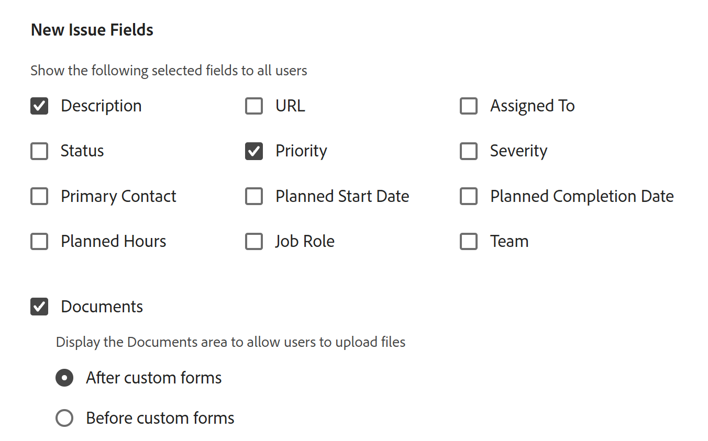

# Créer une file d’attente des demandes

<!--Audited: 12/2023-->

<!--
<THIS IS CONNECTED TO THE PRODUCT IN BLUEPRINTS. DO NOT MOVE/ CHANGE URL>
-->

<!--hide/ comment out the entire "create requests in Production" section and just edit and leave  only the preview section when it releases to Production; also remove the template blurb when the queue details is unshimmed for templates-->

<!--The highlighted information on this page refers to functionality not yet generally available. It is available only in the Preview environment for all customers. After the monthly releases to Production, the same features are also available in the Production environment for customers who enabled fast releases.    

For information about fast releases, see [Enable or disable fast releases for your organization](/help/quicksilver/administration-and-setup/set-up-workfront/configure-system-defaults/enable-fast-release-process.md). -->

Vous pouvez mettre en place une file d’attente des demandes dans laquelle les personnes peuvent saisir des demandes occasionnelles qui ne sont pas un travail prévu dans un projet. Par exemple, une file d’attente des demandes du centre d’assistance peut être mise en place pour capturer toutes les demandes des personnes qui parviennent au service informatique.

Les demandes deviennent des problèmes dans Adobe Workfront et sont ajoutées aux projets.

La configuration d’une file d’attente de demandes permet de formaliser les informations sur les problèmes qui seront ajoutés à un projet. Tous les événements soumis au projet seront soumis de la même manière et suivront le même chemin d&#39;accès vers l&#39;achèvement.

Vous pouvez configurer les objets suivants en tant que files d’attente de demandes dans Workfront :

* Projets
* Modèles. Les projets créés à partir de modèles configurés en tant que files d’attente des demandes deviendront des files d’attente des demandes.

Pour configurer un projet ou un modèle en tant que file d’attente des demandes, vous devez modifier la zone Détails de la file d’attente du projet ou du modèle.

Cet article décrit comment configurer un projet en tant que file d’attente des demandes dans laquelle les utilisateurs peuvent envoyer des demandes. La configuration des Détails de la file d’attente pour un modèle est similaire à leur configuration pour le projet.

Pour plus d’informations sur la manière de soumettre une nouvelle demande à une file d’attente, voir [Copier et soumettre des demandes](../create-requests/copy-and-submit-requests.md).

Pour plus d’informations sur la configuration d’un formulaire de demande dans Workfront Planning, voir [Création et gestion d’un formulaire de demande dans Adobe Workfront Planning](/help/quicksilver/planning/requests/create-request-form.md).

## Conditions d’accès

+++ Développez pour afficher les exigences d’accès aux fonctionnalités de cet article.

<table style="table-layout:auto"> 
 <col> 
 <col> 
 <tbody> 
  <tr> 
   <td role="rowheader">Package Adobe Workfront</td> 
   <td> 
Tous 
 </td> 
  </tr> 
  <tr> 
   <td role="rowheader">Licence Adobe Workfront</td> 
   <td> 
   
Standard 

   
Plan 
 </td> 
  </tr> 
  <tr> 
   <td role="rowheader">Configurations des niveaux d’accès</td> 
   <td> 
Accès en modification aux projets
 </td> 
  </tr> 
  <tr> 
   <td role="rowheader">Autorisations d’objet</td> 
   <td> 
 Autorisations de gestion pour le projet
 </td> 
  </tr> 
 </tbody> 
</table>

Pour plus d’informations, voir [Conditions d’accès requises dans la documentation Workfront](/help/quicksilver/administration-and-setup/add-users/access-levels-and-object-permissions/access-level-requirements-in-documentation.md).

+++

## Vue d’ensemble des files d’attente des demandes

Vous configurez une file d’attente des demandes en tant que projet. Lorsque vous désignez le projet comme file d’attente des demandes, la file d’attente devient accessible à partir de la zone Demandes d’Adobe Workfront. Lorsque vous personnalisez la file d’attente des demandes, vous personnalisez également le formulaire que les persones remplissent lorsqu’elles soumettent leurs demandes.

Cet article décrit comment créer une file d’attente des demandes à partir d’un projet existant. Toutefois, pour assurer la cohérence de votre processus de réception des demandes ou pour y ajouter plusieurs couches à des fins de reporting et d’amélioration de la gestion, vous pouvez également configurer d’autres éléments constitutifs d’une file d’attente des demandes, décrits dans le tableau suivant.

<table style="table-layout:auto"> 
 <col> 
 <col> 
 <tbody> 
  <tr> 
   <td role="rowheader">Détails de la file d'attente</td> 
   <td> 
Vous devez configurer un projet en tant que file d’attente des demandes dans la zone Détails de la file d’attente. Cette étape est obligatoire. 
 
Pour plus d’informations, voir la section <a href="#create-a-request-queue" class="MCXref xref">Céer une file d’attente des demandes</a> de cet article.
 </td> 
  </tr> 
  <tr> 
   <td role="rowheader">Groupes de sujets</td> 
   <td> 
Il s’agit de menus supplémentaires qui classent les demandes en fonction de caractéristiques communes. Par exemple, pour une file d’attente des demandes informatiques, vous pouvez avoir des groupes de rubriques « Sur site » et « À distance ». 
 
Pour plus d’informations, voir <a href="../../../manage-work/requests/create-and-manage-request-queues/create-topic-groups.md" class="MCXref xref">Créer des groupes de rubriques</a>. 
 
Ceci est facultatif.
 </td> 
  </tr> 
  <tr> 
   <td role="rowheader">Rubriques de file d'attente</td> 
   <td> 
Il s’agit de menus supplémentaires qui classent les demandes appartenant au même groupe de rubriques en fonction de caractéristiques communes. Un groupe de rubriques peut contenir plusieurs rubriques de file d’attente. 
 
Par exemple, le groupe de rubriques « Sur site » de la file d’attente des demandes informatiques peut contenir les rubriques de la file d’attente « Matériel », « Logiciel » et « Réseau ». 
 
Pour plus d’informations, voir <a href="../../../manage-work/requests/create-and-manage-request-queues/create-queue-topics.md" class="MCXref xref">Créer des rubriques de file d’attente</a>. 
 
Ceci est facultatif.
 </td> 
  </tr> 
  <tr> 
   <td role="rowheader">Règles de routage</td> 
   <td> 
Elles vous permettent de transmettre chaque demande vers une personne, une fonction, une équipe ou un projet. 
 
Pour plus d’informations, voir <a href="../../../manage-work/requests/create-and-manage-request-queues/create-routing-rules.md" class="MCXref xref">Créer des règles de transmission</a>. 
 
Ceci est facultatif.
 </td> 
  </tr> 
 </tbody> 
</table>

## Créer une file d’attente des demandes

<!--at production release on April 10, do the following: take the first sentence here out; hide/ comment out the first section (Create a Request Queue in the Production environment); remove the title of the "Create a Request Queue in the Preview environment and leave that section as the only way to create request queues; search for any visible references of production/ preview and remove them from the entire article-->

La création d’une file d’attente de demandes diffère selon l’environnement utilisé.

<!--

### Create a Request Queue in the Production environment

This section describes how you can define Queue Details for the following objects:

* A project in the Production environment
* A template in the Production or Preview environment

When you set up a project as a Request Queue, the project status must be Current in order to display in the Requests area of Workfront.

>[!TIP]
>
>Your Workfront or group administrator might assign you to a custom Layout Template that might not include some of the sections described in the following steps.

To create a Request Queue:

1. Go to the project that you want to set up as a Request Queue.
1. (Optional) Click **Project Details** in the left panel and add a **Description** to the project in the **Overview** area. This information displays on all new requests.
1. Click **Queue Details** in the left panel. 

   This opens the Queue Details section.

      

1. Specify the following information:

   * **Publish as Help Request Queue:** Select this option to identify this project as a request queue. All incoming issues are considered Requests.  
     When this option is not selected, the project behaves like a standard project in Workfront and all incoming issues are issues.
   
   * **Who can add requests to this queue:** Select which users have access to add requests to this queue. You can allow the following groups of people to see the Request Queue in their Requests area of the Global Navigation Bar when they add a new request:

     |Who can enter requests | Description|
     |---|---|
     | Anyone  |Any Workfront user with an active account can view this request queue and add requests to it |
     | People with view access to this project |Users with View permissions to the project can view and add requests to this queue |
     | People in this project's company |Users who belong to the company associated with this project can view and add requests to this queue. If there is a company associated with the project, the name of the company is listed in parentheses after this setting.  |
     | People in this project's group |Users who belong to the group associated with this project can view and add requests to this queue. If there is a group associated with the project, the name of the group is listed in parentheses after this setting, in gray font.  |

   * **Share with these links:** The following options enable you to provide direct access to the Request Queue and the forms associated with it to users outside of Workfront or to Workfront users using an external page. For information about embedding a request queue in a dashboard as an external page, see [Embed a request queue in a dashboard](../../../reports-and-dashboards/dashboards/creating-and-managing-dashboards/embed-request-queue-dashboard.md).

     Users must already have access rights to the Request Queue in order to gain direct access. Using either option described here does not automatically grant access to users.

     >[!TIP]
     >
     >Users must first log in to Workfront before gaining access to the request queue when they access the Request Queue page from another application.

      * **Direct Access URL:** When a user accesses this URL from a browser, the user is taken directly to the New Request  section in the Requests area and this request is selected by default for them.

        

        >[!NOTE]
        >
        >You can display a Request Queue in a dashboard as an external page. In this case, the request queue is preselected, but you can select any other request queue from the Request Type field. users can change the Request Type. Navigation components of the Requests also display.

      * **Embed Code:** Use this HTML code to embed the request queue form as an iframe within any HTML page.  
        If users are not already authenticated to Workfront when they view the page where the code is embedded, the Workfront login dialog box is displayed. After users log in, the Request Queue form is displayed.

        >[!NOTE]
        >
        >When displaying a Request Queue in an iframe, only the request form displays, the request name is preselected and dimmed. User cannot change the Request type. Navigation components of the Requests area do not display.

        In order for the request queue form to be displayed when using this embed code, you must enable the "Allow embedding of Workfront in an iframe" setting in your system setup. For more information about enabling embedding of Workfront in an iframe, see [Configure system security preferences](../../../administration-and-setup/manage-workfront/security/configure-security-preferences.md). If this setting is not enabled, the iframe is displayed as blank.

        You can adjust various aspects of how the embedded form is displayed, as follows:

        <table border="1" cellspacing="15"> 
         <col> 
         <col> 
         <thead> 
          <tr> 
           <th> 
<strong>Functionality</strong> 
 </th> 
           <th> 
<strong>Solution</strong> 
 </th> 
          </tr> 
         </thead> 
         <tbody> 
          <tr> 
           <td> 
Adjust the size of the frame
 </td> 
           <td> 
Modify the "width" and "height" attributes.
 
By default, the width is "500" and the height is "600"
 </td> 
          </tr> 
          <tr> 
           <td> 
Direct users to a specific Queue Topic or Topic Group
 </td> 
           <td> 
Add the "path" parameter to the src URL. You can find the path parameter by navigating to the desired Queue Topic or Topic Group in the non-embedded form and inspecting the URL.
 </td> 
          </tr> 
          <tr> 
           <td> 
Show and allow users to change the pre-configured Topic Group drop-down list
 </td> 
           <td> 
Use the "path" parameter by adding the <code>showPreSelectedOptions=true</code> parameter to the <code>src URL</code>.
 </td> 
          </tr> 
          <tr> 
           <td> 
Detect when the form has been submitted
 </td> 
           <td> 
Add a "message" event listener to your web page's window and checking if <code>event.data.type</code> is <code>requestSubmitted</code>. <code>event.data.newIssueID</code> will be set to the ID of the created issue.
 </td> 
          </tr> 
         </tbody> 
        </table>

   * **Request Types:** Select from the default options below.

     The Workfront administrator can rename the default request types. For more information about renaming the request types, see [Customize default issue types](../../../administration-and-setup/set-up-workfront/configure-system-defaults/customize-default-issue-types.md).

      * Bug Report
      * Change Order
      * Issue
      * Request

        This is a required field and you must select at least one option.

     >[!NOTE]
     >
     >Request Types display as a selection in the Requests area only if the Request Type is selected in both the Queue Details and the Queue Topic pages. For information about setting up the Queue Details area of a project, see [Create Queue Topics](../../../manage-work/requests/create-and-manage-request-queues/create-queue-topics.md).

     Each type selected here will be available on the form (you can select more than one). Selecting more than one type can help organize multiple requests coming in.  
     For example, if you are using the form on a request queue for an IT project, the following request types can come in to the queue: hardware, software, bug fixes, and issues.

   * **Default Duration:** The default duration is the length of time it typically takes to complete an issue. This becomes the default for all incoming issues and can be modified manually. Duration is generally set in hours, days, or weeks. The Default Duration of an issue is the same as the Planned Hours on the issue. The Planned Completion Date of the issue calculates based on this field.  
     The default for the issue Duration is 1 day or 8 hours. If your Workfront administrator set the Typical Hours per Work Day as less than 8 hours, the Default Duration for issues is still 8 hours. For example, if the Typical Hours per Work Day is set to 7 hours, the Default Duration for issues is 1.14 Days or 8 hours. For more information about how to set up the system Typical Hours per Work Day, see the "Timeline Calculations" section in the article [Configure system-wide project preferences](../../../administration-and-setup/set-up-workfront/configure-system-defaults/set-project-preferences.md).
   
   * **People from the same company will inherit the same permissions for all requests.:** When selected, all requests submitted to the queue are visible for users in the same company. Users can view these requests in the All Requests  section , located within the Requests area. At the time that this setting is enabled or disabled, it impacts all future requests; it does not retroactively impact information. 
   * **When someone makes a request, automatically grant:** When a user makes a request to the request queue, the user is automatically granted the level of permission that you choose to that request. Select from the following permissions levels: 

      * **View Access** 
      * **Contribute Access**. This is the default selection.
      * **Manage Access**

     For information about the Workfront permissions model, see [Overview of sharing permissions on objects](../../../workfront-basics/grant-and-request-access-to-objects/sharing-permissions-on-objects-overview.md).   
     Setting permissions here saves time, rather than having to grant permissions for each individual incoming request. Choosing this option impacts all future requests, but does not retroactively impact existing requests. 
   
   * **Default Approval**: Associate an approval process with this request queue. Only Issue Approval Processes are visible in this drop-down menu. All issues submitted to this queue will be associated with this approval process. Your Workfront administrator must define system-level approval processes before you can associate them with request queues. Users with administrative access to Approval processes can also create group-specific approval processes.

     >[!IMPORTANT]
     >
     >If the group of the project changes, the group-specific approval process attached to existing issues becomes a single-use approval process. For more information about how changes to the group of the project or changes in the approval process affect approval settings, see [How group and approval process changes affect assigned approval processes](../../../administration-and-setup/customize-workfront/configure-approval-milestone-processes/how-changes-affect-group-approvals.md).

     If you have multiple queue topics associated with a request queue, we recommend that you associate approval processes with the queue topics instead. For more information about creating queue topics, see [Create Queue Topics](../../../manage-work/requests/create-and-manage-request-queues/create-queue-topics.md). 
   
     Consider the following when adding approval processes to request queues:

      * Only active approval processes display in the list. 
      * System-wide and group-specific approval processes display in the list. An approval process associated with a group other than that of the project does not display in the list.

   * **Default Route**: Associate a Routing Rule with this request queue. Use Routing Rules to automatically assign new issues submitted to a Request Queue to the correct resource (user, job role, or team), and to the correct project. All issues submitted to this queue will be associated with this Routing Rule. You must configure Routing Rules before they display in the Queue Details section and before you can associate them with request queue.  
     If you have multiple queue topics associated with a request queue, we recommend that you associate routing rules with the queue topics instead. For more information about creating routing rules, see [Create Routing Rules](../../../manage-work/requests/create-and-manage-request-queues/create-routing-rules.md).
   
   * **New Issue Fields:** In the **Show the following selected fields to all users** section, select any fields that you want to be visible to all users who submit a request to the project or add an issue to the project or the tasks.

     >[!TIP]
     >
     >New Issue Fields selected in the Queue Details section are also associated with any new issue added to the project <!--this is confusing: or to the tasks in the Issues section-->.

<!--     When you enable any of the Assigned to, Job Role, or the Team fields, they are always renamed to Assignments in the request form, but you can only specify the type of assignment selected here.

      >[!NOTE]
      >
      >If you selected Assigned To in the Queue Details area, you can enter only users in the Assignments field on the request form. In this case, you cannot enter job roles or a team. 
   
   * **Documents**: If you select to display the Documents section in the new request form, select where the document uploading section should be positioned. Select from the following:

     <table style="table-layout:auto"> 
      <col> 
      <col> 
      <tbody> 
       <tr> 
        <td role="rowheader">After custom forms</td> 
        <td>The Documents section displays at the bottom of the request form. </td> 
       </tr> 
       <tr> 
        <td role="rowheader">Before custom forms</td> 
        <td> 
The Documents section displays between the Workfront fields and the custom fields of the request form. 
 </td> 
       </tr> 
      </tbody> 
     </table>   
   
     

   * **Show all selected and unselected fields to:** Select which users you want to see all the fields on the new request form. The following options control the access to the fields on the form.
    
      |Which users can see all fields on the request form | Description|
      |---|---|
      | All Users (Plan Licenses) |All users who have a Plan license can see the selected as well as the unselected fields. |
      | People with view access to this project (Plan License) |Those users with a Plan license that also have View rights to this project can see the selected as well as the unselected fields. The rest of the users who can submit requests to this project can see just the selected fields. |
      | No Users |No users can see the unselected fields. All users who can submit requests to this project can only see the fields selected.  |
  
   * **Custom Forms**: Select a custom form to associate with the Request Queue. Only Issue Custom Forms are available to select from this drop-down menu. All issues submitted to the Request Queue will have the selected forms associated with them. You must create issue custom forms before you can see them displayed in the Queue Details section. 
     If you have multiple Queue Topics associated with a Request Queue, we recommend that you associate custom forms with the Queue Topics instead. For more information about creating sub-sections for the Request Queue, see [Create Queue Topics](../../../manage-work/requests/create-and-manage-request-queues/create-queue-topics.md).

     

     If you have multiple custom forms associated with the Request Queue, drag and drop the forms to sort them in the desired order, in the **Reorder Forms** section.

     >[!TIP]
     >
     >Custom forms added to the Queue Details section are also associated with any new issue added to the project <!--this is confusiong: or the tasks in the Issues  section-->.

<!--1. Continue selecting information for the settings in the **Email Queue Settings** area, to allow users to email requests to the request queue project. 

    For more information, see [Enable users to email an issue into a Request Queue project](../../../manage-work/requests/create-requests/enable-email-issues-into-projects.md).

1. Click **Save**.  
   Your project has now been configured to be a Request Queue and users can now add requests to it. 

1. (Optional) To enhance the Request Queue functionality, build additional sub-sections for your queue, as well as rules to route the incoming requests to the correct team, assignee or project.

   * For information about creating sub-sections for the Request Queue, see the articles [Create Queue Topics](../../../manage-work/requests/create-and-manage-request-queues/create-queue-topics.md) and [Create Topic Groups](../../../manage-work/requests/create-and-manage-request-queues/create-topic-groups.md).  
   * For information about routing the requests to the appropriate assignee, team, and appropriate project, see [Create Routing Rules](../../../manage-work/requests/create-and-manage-request-queues/create-routing-rules.md).

   -->

### Créer une file d’attente des demandes

Lorsque vous configurez un projet en tant que file d’attente des demandes, le statut du projet doit être En cours pour qu’il s’affiche dans la zone Demandes de Workfront.

>[!TIP]
>
>Votre administrateur ou administratrice Workfront ou de groupes peut vous assigner un modèle de mise en page personnalisé qui peut ne pas inclure certaines des sections décrites dans les étapes suivantes.

Pour créer une file d’attente des demandes, procédez comme suit :

1. Accédez au projet que vous souhaitez configurer en tant que file d’attente des demandes.
1. (Facultatif) Cliquez sur **Détail du projet** dans le panneau de gauche et ajoutez une **Description** au projet dans la zone **Vue d’ensemble**. Cette information s’affiche sur toutes les nouvelles demandes.
1. Cliquez sur **Détails de la file d’attente** dans le panneau de gauche.

   La section Détails de la file d’attente s’ouvre.

   

1. Indiquez les informations suivantes :

   * **Publier en tant que file d’attente des demandes d’aide** : sélectionnez cette option pour identifier ce projet en tant que file d’attente des demandes. Tous les problèmes entrants sont considérés comme des demandes.\
     Lorsque cette option n’est pas sélectionnée, le projet se comporte comme un projet standard dans Workfront et tous les problèmes entrants sont des problèmes.

   * **Qui peut ajouter des requêtes à cette file d’attente ?** : sélectionnez les utilisateurs autorisés à ajouter des requêtes à cette file d’attente. Vous pouvez autoriser les groupes de personnes suivants à voir la file d’attente des demandes dans leur zone Demandes de la barre de navigation globale lors de l’ajout d’une nouvelle demande :

     | Qui peut saisir des demandes | Description |
     |---|---|
     | Quiconque | Toute personne utilisant Workfront et disposant d’un compte actif peut afficher cette file d’attente des demandes et y ajouter des demandes. |
     | Personnes disposant d&#39;un accès en affichage pour ce projet | Les personnes ayant des autorisation d’affichage sur le projet peuvent afficher cette file d’attente et y ajouter des demandes. |
     | Personnes de l&#39;entreprise affectées à ce projet | Les personnes qui font partie de l’entreprise associée à ce projet peuvent afficher cette file d’attente et y ajouter des demandes. Si une entreprise est associée au projet, le nom de l’entreprise est indiqué entre parenthèses après ce paramètre. |
     | Personnes du groupe affectées à ce projet | Les personnes qui appartiennent au groupe associé à ce projet peuvent afficher les demandes de cette file d’attente et en ajouter. Si un groupe est associé au projet, le nom du groupe est indiqué entre parenthèses après ce paramètre, en caractères gris. |

     {style="table-layout:auto"}

   * Utilisez les options suivantes pour fournir un accès direct à la file d’attente des demandes et aux formulaires qui y sont associés aux utilisateurs en dehors de Workfront ou aux utilisateurs de Workfront à l’aide d’une page externe incorporée.

   Pour plus d’informations sur l’intégration d’une file d’attente des demandes dans un tableau de bord en tant que page externe, voir [Intégrer une file d’attente des demandes dans un tableau de bord](../../../reports-and-dashboards/dashboards/creating-and-managing-dashboards/embed-request-queue-dashboard.md).

   Les utilisateurs et utilisatrices doivent d’abord disposer d’autorisations sur la file d’attente des demandes pour obtenir un accès direct. L’utilisation de l’une ou l’autre des options décrites ici n’octroie pas automatiquement l’accès aux personnes.

   >[!TIP]
   >
   >Les personnes doivent d’abord se connecter à Workfront avant de pouvoir accéder à la file d’attente des demandes lorsqu’elles accèdent à la page File d’attente des demandes à partir d’une autre application.

   * **URL d’accès direct :** lorsqu’une personne accède à cette URL à partir d’un navigateur, elle est directement dirigée vers la section Nouvelle demande de la zone Demandes et cette demande est sélectionnée par défaut pour elle.

     

     >[!NOTE]
     >
     >Vous pouvez afficher une file d’attente des demandes dans un tableau de bord en tant que page externe. Dans ce cas, la file d’attente des demandes est présélectionnée, mais vous pouvez sélectionner n’importe quelle autre file d’attente des demandes dans le champ Type de demande. Les utilisateurs qui soumettent la demande peuvent sélectionner un autre type de demande. Les groupes de rubriques et les rubriques de file d’attente s’affichent également.

   * **Code intégré :** utilisez ce code HTML pour intégrer le formulaire de file d’attente des demandes sous forme d’iframe dans n’importe quelle page HTML.\
     Si les personnes ne sont pas déjà authentifiées auprès de Workfront lorsqu’elles affichent la page où le code est intégré, la boîte de dialogue de connexion à Workfront s’affiche. Une fois les personnes connectées, le formulaire de la file d’attente des demandes s’affiche.

     >[!NOTE]
     >
     >Lors de l’affichage d’une file d’attente des demandes dans un iframe, seul le formulaire de demande s’affiche, le nom de la demande est présélectionné et grisé. La personne ne peut pas modifier le type de demande. Les éléments de navigation de la zone Demandes ne s’affichent pas.

     Pour que le formulaire de file d’attente de demandes s’affiche lors de l’utilisation de ce code incorporé, votre administrateur Workfront doit activer le paramètre « Autoriser l’incorporation de Workfront dans un iframe » dans la zone Configuration du système.

     Pour plus d’informations sur l’activation de l’intégration de Workfront dans un iframe, voir [Configurer les préférences de sécurité du système](../../../administration-and-setup/manage-workfront/security/configure-security-preferences.md). Si ce paramètre n’est pas activé, l’iframe est laissé vide.

     Vous pouvez régler divers aspects de l’affichage du formulaire intégré, comme suit :

     <table border="1" cellspacing="15"> 
         <col> 
         <col> 
         <thead> 
          <tr> 
           <th> 
<strong>Fonctionnalité</strong> 
 </th> 
           <th> 
<strong>Solution</strong> 
 </th> 
          </tr> 
         </thead> 
         <tbody> 
          <tr> 
           <td> 
Ajuster la taille du cadre
 </td> 
           <td> 
Modifiez les attributs « largeur » et « hauteur ».
 
Par défaut, la largeur est de « 500 » et la hauteur de « 600 ».
 </td> 
          </tr> 
          <tr> 
           <td> 
Diriger les utilisateurs et utilisatrices vers une rubrique de file d’attente ou un groupe de sujets spécifique
 </td> 
           <td> 
Ajoutez le paramètre « chemin d’accès » à l’URL src. Vous pouvez trouver le paramètre de chemin d’accès en naviguant vers la rubrique de file d’attente ou le groupe de sujets dans le formulaire non incorporé et en inspectant l’URL.
 </td> 
          </tr> 
          <tr> 
           <td> 
Afficher et autoriser les utilisateurs et utilisatrices à modifier la liste déroulante des groupes de sujets préconfigurés
 </td> 
           <td> 
Utilisez le paramètre « chemin d’accès » en ajoutant le paramètre <code>showPreSelectedOptions=true</code> à l’<code>src URL</code>.
 </td> 
          </tr> 
          <tr> 
           <td> 
Détecter l’envoi du formulaire
 </td> 
           <td> 
Ajoutez un listener d’événements « message » à la fenêtre de votre page web et vérifiez si <code>event.data.type</code> est <code>requestSubmitted</code>. <code>event.data.newIssueID</code> prendra la valeur de l’ID du problème créé.
 </td> 
          </tr> 
         </tbody> 
        </table>

   * **Types de requête :** dans la section **Propriétés de la file d’attente**, sélectionnez l’une des options suivantes :

   * Rapport sur les bogues
   * Modifier l&#39;ordre
   * Problème
   * Demande

   Ce champ est obligatoire et vous devez sélectionner au moins une option.

   L’administrateur ou administratrice Workfront peut renommer les types de demande par défaut. Pour plus d’informations sur le renommage des types de demandes, voir [Personnaliser les types de problèmes par défaut](../../../administration-and-setup/set-up-workfront/configure-system-defaults/customize-default-issue-types.md).

   >[!NOTE]
   >
   >Lorsque les utilisateurs accèdent à la file d&#39;attente des demandes à partir de la zone Demandes, les Types de demandes s&#39;affichent sous forme de sélection uniquement si le Type de demande est sélectionné à la fois dans les pages Détails de la file d&#39;attente et Rubrique de la file d&#39;attente.
   >
   >Pour plus d&#39;informations sur la configuration de la zone Rubriques de file d&#39;attente d&#39;un projet, voir [Création de rubriques de file d&#39;attente](../../../manage-work/requests/create-and-manage-request-queues/create-queue-topics.md).

   Chaque type sélectionné ici sera disponible sur le formulaire (vous pouvez en sélectionner plusieurs). Le fait de sélectionner plus d’un type de demande peut aider à organiser les demandes multiples entrantes.\
   Par exemple, si vous utilisez le formulaire dans une file d’attente des demandes pour un projet informatique, les types de demandes suivants peuvent être introduits dans la file d’attente : matériel, logiciel, correction de bug et problèmes.

   * **Durée par défaut :** saisissez un nombre pour la durée, puis sélectionnez dans le menu déroulant l’une des unités de durée suivantes :

      * Jours
      * Heures
      * Minutes
      * Semaines

   La durée par défaut est la durée nécessaire généralement pour terminer un événement soumis à cette file d’attente des demandes. Cela devient la valeur par défaut pour tous les événements entrants et peut être modifié manuellement.
La durée par défaut d’un problème est la même que celle des heures prévues pour ce problème. La date d’achèvement prévue du problème est calculée sur la base de ce champ.\
   Si rien n’est fait, la durée par défaut du problème est de 1 jour ou 8 heures.
Si votre administrateur Workfront a défini le nombre d’heures standard par jour de travail sur moins de 8 heures dans la zone Configuration , la durée par défaut pour les problèmes reste de 8 heures.
Par exemple, si le nombre d’heures standard par journée de travail est défini sur 7 heures dans la zone Configuration de Workfront, la durée par défaut pour les problèmes est de 1,14 jour ou 8 heures.
Pour plus d’informations sur la configuration du système Heures types par jour de travail, voir la section « Calculs de chronologie » dans l’article [Configurer les préférences du projet à l’échelle du système](../../../administration-and-setup/set-up-workfront/configure-system-defaults/set-project-preferences.md).

   * **Les personnes appartenant à la même entreprise hériteront d’autorisations identiques pour toutes les demandes :** : lorsque cette option est sélectionnée, toutes les demandes envoyées à la file d’attente sont visibles pour les utilisateurs de la même entreprise. Les utilisateurs et utilisatrices peuvent consulter ces demandes dans la section Toutes les demandes, située dans la zone Demandes. Au moment où ce paramètre est activé ou désactivé, il a un impact sur toutes les demandes futures ; il n’a pas d’impact rétroactif sur les informations.
   * **Lorsqu’une personne effectue une demande, accorder automatiquement... :** lorsqu’un utilisateur effectue une demande dans la file d’attente des demandes, il se voit automatiquement accorder le niveau d’autorisation que vous choisissez pour cette demande. Cliquez sur le bouton Accès pour effectuer une sélection parmi les niveaux d&#39;autorisation suivants :

      * **Accès en affichage**
      * **Accès en contribution**. Il s&#39;agit de la sélection par défaut et du nom du bouton Accès.
      * **Accès en gestion**

     Pour plus d’informations sur le modèle des autorisations de Workfront, voir [Vue d’ensemble du partage des autorisations sur les objets](../../../workfront-basics/grant-and-request-access-to-objects/sharing-permissions-on-objects-overview.md).\
     Définir des autorisations ici permet de gagner du temps, plutôt que d’avoir à accorder des autorisations individuellement, pour chaque requête entrante. Le choix de cette option a un impact sur toutes les demandes futures, mais n’a pas d’impact rétroactif sur les demandes existantes.

   * **Approbation par défaut** : cliquez sur le menu déroulant pour sélectionner un processus d’approbation pour cette file d’attente de demandes. Seuls les processus d’approbation des problèmes sont visibles dans ce menu déroulant. Tous les problèmes envoyés à cette file d’attente seront associés à ce processus d’approbation. Votre administrateur ou administratrice Workfront doit définir les processus d’approbation au niveau du système avant que vous puissiez les associer aux files d’attente. Les utilisateurs et utilisatrices disposant d’un accès administratif aux processus d’approbation peuvent également créer des processus d’approbation spécifiques à un groupe.

     >[!IMPORTANT]
     >
     >Si le groupe du projet change, le processus d’approbation spécifique au groupe lié aux problèmes existants devient un processus d’approbation à usage unique. Pour plus d’informations sur la manière dont les modifications apportées au groupe du projet ou au processus d’approbation affectent les paramètres d’approbation, voir [Comment les modifications apportées au groupe et au processus d’approbation affectent les processus d’approbation attribués](../../../administration-and-setup/customize-workfront/configure-approval-milestone-processes/how-changes-affect-group-approvals.md).

     Si plusieurs rubriques de file d’attente sont associées à une file d’attente des demandes, nous vous recommandons d’associer des processus d’approbation à ces rubriques.

     Pour plus d’informations sur la création de rubriques de file d’attente, voir [Créer des rubriques de file d’attente](../../../manage-work/requests/create-and-manage-request-queues/create-queue-topics.md).

     Tenez compte des points suivants lorsque vous ajoutez des processus d’approbation aux files d’attente des demandes :

      * Seuls les processus d&#39;approbation des événements actifs s&#39;affichent dans la liste.
      * Les processus d&#39;approbation des événements à l&#39;échelle du système et spécifiques à un groupe s&#39;affichent dans la liste. Un processus d’approbation associé à un groupe autre que celui du projet ne s’affiche pas dans la liste.

   * **Itinéraire par défaut** : cliquez sur le menu déroulant pour sélectionner une règle de routage pour cette file d’attente des demandes. Les règles de transmission affectent automatiquement les nouveaux événements soumis à une file d’attente des demandes à la ressource appropriée (utilisateur, fonction ou équipe) et au projet approprié. Tous les événements soumis à cette file d&#39;attente seront associés à cette règle de routage. Vous devez configurer les règles de transmission avant qu’elles ne s’affichent dans la section Détails de la file d’attente et avant de pouvoir les associer à une file d’attente des demandes.\
     Si plusieurs sujets de file d’attente sont associés à une file d’attente des demandes, nous vous recommandons plutôt d’associer des règles de transmission aux sujets de file d’attente. Pour plus d’informations sur la création de règles de transmission, voir [Créer des règles de transmission](../../../manage-work/requests/create-and-manage-request-queues/create-routing-rules.md).

   * **Champs Nouvel événement :** dans la section **Afficher les champs sélectionnés suivants pour tous les utilisateurs**, sélectionnez les champs que vous souhaitez afficher pour tous les utilisateurs qui soumettent une demande au projet ou ajoutent un événement à ce projet ou aux tâches du projet.

     >[!NOTE]
     >
     >* Lorsque vous activez l’un des champs Affecté à, Fonction ou Équipe , il est toujours renommé Affectations dans le formulaire de demande lorsque les utilisateurs soumettent la demande. Vous pouvez uniquement spécifier le type d’affectation dans la zone Détails de la file d’attente.
     >
     >* Si vous avez sélectionné Affecté à dans la zone Détails de la file d’attente, vous ne pouvez saisir que des utilisateurs et utilisatrices dans le champ Affectations du formulaire de demande. Dans ce cas, vous ne pouvez pas saisir de fonctions ou d’équipe.

   * **Documents** : sélectionnez cette option pour afficher la section Documents dans le nouveau formulaire de demande, puis sélectionnez l’emplacement auquel la section de chargement du document doit être positionnée. Sélectionnez l’une des options suivantes :

     <table style="table-layout:auto"> 
      <col> 
      <col> 
      <tbody> 
       <tr> 
        <td role="rowheader">Avant les formulaires personnalisés</td> 
        <td>La section Documents s’affiche au bas du formulaire de demande. </td> 
       </tr> 
       <tr> 
        <td role="rowheader">Avant les formulaires personnalisés</td> 
        <td> 
La section Documents s’affiche entre les champs Workfront et les champs personnalisés du formulaire de demande. 
 </td> 
       </tr> 
      </tbody> 
     </table>

     

   * **Afficher tous les champs sélectionnés et non sélectionnés à :** sélectionnez les utilisateurs qui doivent voir tous les champs du nouveau formulaire de demande. Les options suivantes contrôlent l’accès aux champs du formulaire.

     | Utilisateurs et utilisatrice pouvant voir tous les champs du formulaire de demande | Description |
     |---|---|
     | Tous les utilisateurs et utilisatrices (licence Plan) | Toutes les personnes disposant d’une licence Plan peuvent voir les champs sélectionnés et non sélectionnés. |
     | Personnes disposant d&#39;un accès en affichage pour ce projet (licence de plan) | Les utilisateurs et utilisatrices disposant d’une licence Plan et ayant également des droits d’affichage pour ce projet peuvent voir les champs sélectionnés et non sélectionnés. Les autres utilisateurs et utilisatrices pouvant soumettre des demandes pour ce projet ne peuvent voir que les champs sélectionnés. |
     | Aucun utilisateur | Personne ne peut voir les champs non sélectionnés. Tous les utilisateurs et toutes les utilisatrices pouvant envoyer des demandes à ce projet ne peuvent voir que les champs sélectionnés. Il s’agit de la sélection par défaut. |

   * **Custom Forms** : sélectionnez un formulaire personnalisé à associer à la file d’attente des demandes dans le menu déroulant. Vous pouvez sélectionner plusieurs formulaires, puis les faire glisser et les déposer dans l’ordre d’affichage souhaité dans le formulaire de demande.
Seuls les formulaires personnalisés de l&#39;événement peuvent être sélectionnés dans ce menu déroulant. Les formulaires sélectionnés seront associés à tous les événements soumis à cette file d&#39;attente de demandes, ajoutés au projet ou à ses tâches.
Vous devez créer des formulaires personnalisés de problèmes avant de pouvoir les afficher dans la section Détails de la file d’attente.
Si plusieurs rubriques de file d’attente sont associées à une file d’attente des demandes, nous vous recommandons d’associer des formulaires personnalisés à ces rubriques.
Pour plus d’informations, voir [Créer des rubriques de file d’attente](../../../manage-work/requests/create-and-manage-request-queues/create-queue-topics.md).

     

1. Continuez à sélectionner les informations pour les paramètres dans la zone **Paramètres de la file d’attente des e-mails** pour permettre aux utilisateurs et utilisatrices d’envoyer des demandes par e-mail au projet de file d’attente des demandes.

   Pour plus d’informations, voir [Permettre aux utilisateurs et utilisatrices d’envoyer un problème par e-mail dans un projet de file d’attente des demandes](../../../manage-work/requests/create-requests/enable-email-issues-into-projects.md).

1. Cliquer sur **Enregistrer**.\
   Votre projet a été configuré pour être une file d’attente des demandes et les utilisateurs et utilisatrices peuvent maintenant y ajouter des demandes.

1. (Facultatif) Pour améliorer la fonctionnalité de la file d’attente des demandes, créez des sous-sections supplémentaires pour votre file d’attente, ainsi que des règles pour acheminer les demandes entrantes vers l’équipe, la personne cessionnaire ou le projet approprié.

   * Pour plus d’informations sur la création de sous-sections pour la file d’attente des demandes, consultez les articles suivants
   * [Créer des rubriques de file d’attente](../../../manage-work/requests/create-and-manage-request-queues/create-queue-topics.md)
   * [Créer des groupes de sujets](../../../manage-work/requests/create-and-manage-request-queues/create-topic-groups.md).

     Pour plus d’informations sur la transmission des demandes vers la personne cessionnaire, l’équipe et le projet appropriés, voir [Créer des règles de transmission](../../../manage-work/requests/create-and-manage-request-queues/create-routing-rules.md).

