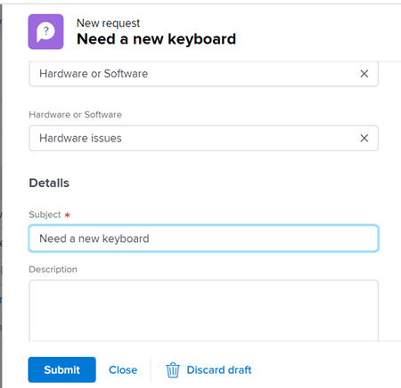

# Création et envoi de requêtes Adobe Workfront

<!--Audited: 12/2023-->

<!--

(NOTE: Linked to the UI - do not change/ remove; THIS IS NOW SPLIT IN THREE ARTICLES>> MAKE SURE THE TRANSITION TO THE OTHER TWO IS CLEAR SINCE THIS IS LINKED TO UI)

(NOTE: If they come out with templates AND drafts, consider splitting this article to keep Create in one and Working with Drafts and Requests in another??)

(NOTE: this article is linked from Submitting Workfront Requests from Salesforce) 

-->

Les tâches planifiées sont représentées dans Adobe Workfront par des projets et des tâches. Cependant, vous pouvez travailler dans un environnement où des tâches imprévues, sous la forme de demandes, peuvent intervenir à tout moment. Workfront fournit un workflow pour s’adapter à ce type d’environnement grâce à l’utilisation des files d’attente de demandes.

Après avoir créé une requête dans une file d’attente des requêtes, vous pouvez soit l’affecter à terminer, soit la convertir en tâche ou en projet.\
Pour plus d’informations sur la conversion de problèmes en tâche ou projet, reportez-vous à l’article [Présentation des problèmes de conversion dans Adobe Workfront](../../../manage-work/issues/convert-issues/convert-issues.md).

Vous pouvez créer une requête de la manière suivante :

* À partir de zéro, comme décrit dans cet article.
* Versions préliminaires. Pour plus d’informations, voir [Création de requêtes à partir de brouillons](../../../manage-work/requests/create-requests/create-requests-from-drafts.md).
* À partir d’une requête existante, en copiant et en envoyant une copie. Pour plus d’informations, voir [Copie et envoi de requêtes](../../../manage-work/requests/create-requests/copy-and-submit-requests.md).

## Exigences d’accès

<!--drafted for P&P - replace table: 

<table style="table-layout:auto"> 
 <col> 
 <col> 
 <tbody> 
  <tr> 
   <td role="rowheader">Adobe Workfront plan*</td> 
   <td> 
Any 
 </td> 
  </tr> 
  <tr> 
   <td role="rowheader">Adobe Workfront license*</td> 
   <td> 
Current license: Contributor or higher

   Or
   
Legacy license: Request or higher

    </td> 
  </tr> 
  <tr> 
   <td role="rowheader">Access level configurations*</td> 
   <td> 
Edit access to Issues
 
If you still don't have access, ask your Workfront administrator if they set additional restrictions in your access level. For information on how a Workfront administrator can change your access level, see <a href="../../../administration-and-setup/add-users/configure-and-grant-access/create-modify-access-levels.md" class="MCXref xref">Create or modify custom access levels</a>.
 </td> 
  </tr> 
 </tbody> 
</table>
-->

Vous devez disposer des accès suivants pour effectuer les étapes de cet article :

<table style="table-layout:auto"> 
 <col> 
 <col> 
 <tbody> 
  <tr> 
   <td role="rowheader">Formule Adobe Workfront*</td> 
   <td> Quelconque  </td> 
  </tr> 
  <tr> 
   <td role="rowheader">Licence Adobe Workfront*</td> 
   <td> Nouveau : contributeur ou version ultérieure
   
Ou

   
Actuel : requête ou version ultérieure

    </td> 
  </tr> 
   <td role="rowheader">Niveau d’accès*</td> 
   <td> Modifier l’accès aux problèmes 
Si vous n’avez toujours pas accès à , demandez à votre administrateur Workfront s’il définit des restrictions supplémentaires à votre niveau d’accès. Pour plus d’informations sur la façon dont un administrateur Workfront peut modifier votre niveau d’accès, voir <a href="../../../administration-and-setup/add-users/configure-and-grant-access/create-modify-access-levels.md" class="MCXref xref">Création ou modification de niveaux d’accès personnalisés</a>.
 </td> 
  </tr> 
 </tbody> 
</table>

*Pour connaître le plan, le type de licence ou l’accès dont vous disposez, contactez votre administrateur Workfront.

## Conditions préalables pour l’utilisation des files d’attente de requête

Un administrateur Workfront doit créer des files d’attente de demande et les mettre à la disposition des utilisateurs avant de pouvoir utiliser cette fonctionnalité. Un utilisateur disposant d’une licence de planificateur et disposant des autorisations Modifier les projets et Gérer pour un projet spécifique peut également créer des files d’attente de demande.

Pour plus d’informations sur la création de files d’attente de requêtes, voir l’article [Création d’une file d’attente de requête](../../../manage-work/requests/create-and-manage-request-queues/create-request-queue.md).

Un administrateur Workfront doit créer les composants suivants d’une file d’attente de requêtes :

* Projet à l’état actuel, publié en tant que file d’attente de demande d’aide.
* Rubriques de la file d’attente.\
  Pour plus d’informations, voir l’article [Création de rubriques de file d’attente](../../../manage-work/requests/create-and-manage-request-queues/create-queue-topics.md).

* Règles de routage.\
  Pour plus d’informations, voir l’article [Création de règles de routage](../../../manage-work/requests/create-and-manage-request-queues/create-routing-rules.md).

* (Facultatif) Groupes de rubriques.\
  Pour plus d’informations, voir l’article [Création de groupes de rubriques](../../../manage-work/requests/create-and-manage-request-queues/create-topic-groups.md).

* (Facultatif) Demandez un formulaire personnalisé.\
  Pour plus d’informations, voir l’article [Création ou modification d’un formulaire personnalisé](../../../administration-and-setup/customize-workfront/create-manage-custom-forms/create-or-edit-a-custom-form.md).

* (Facultatif) Processus de demande d’approbation.\
  Pour plus d’informations, voir l’article [Créer un processus d’approbation pour les tâches](../../../administration-and-setup/customize-workfront/configure-approval-milestone-processes/create-approval-processes.md).

## Création de requêtes et génération de brouillons dans l’application web Workfront

Lorsque vous créez une requête dans l’application web Workfront, Workfront l’enregistre en tant que brouillon avant de l’envoyer. Workfront crée un brouillon dès que vous sélectionnez votre file d’attente de requêtes et que vous commencez à saisir des informations à son sujet.

Vous pouvez continuer à soumettre la demande ou compléter autant d’informations que vous le souhaitez et quitter le formulaire pour la terminer ultérieurement. Workfront enregistre la demande en version préliminaire que vous avez lancée dans le dossier Brouillons.

>[!IMPORTANT]
>
>Tenez compte des points suivants lorsque vous utilisez des brouillons :
>
>* Workfront ne crée pas de brouillons de requêtes lorsque vous les envoyez à partir d’une application tierce, par exemple en les envoyant par courrier électronique dans Workfront, ou en les créant à l’aide d’une autre application. Lorsque vous envoyez une demande en dehors de l’application web Workfront, la demande est enregistrée dans la section Envoyé .
>* Si la structure d’une file d’attente de requêtes change, vous ne pouvez plus accéder aux brouillons existants. Par exemple, si une rubrique de file d’attente est supprimée ou qu’un groupe de rubriques est ajouté, les brouillons enregistrés ne sont plus accessibles.
>

Pour plus d’informations sur la création de requêtes à partir de brouillons existants, voir [Création de requêtes à partir de brouillons](../../../manage-work/requests/create-requests/create-requests-from-drafts.md). Pour plus d’informations sur la suppression des brouillons de requêtes, voir également [Suppression d’un brouillon de requête](../../../manage-work/requests/create-requests/delete-request-draft.md).

Pour créer une requête dans l’application web Workfront :

1. Cliquez sur le bouton **[!UICONTROL Menu Principal]** icon  dans le coin supérieur droit d’Adobe Workfront, ou (le cas échéant), cliquez sur le bouton **[!UICONTROL Menu Principal]** icon  dans le coin supérieur gauche.

   <!--
   <MadCap:conditionalText data-mc-conditions="QuicksilverOrClassic.Draft mode">
   </MadCap:conditionalText>
   -->

1. Cliquez sur  **Demandes**, puis cliquez sur **Nouvelle requête** dans le coin supérieur droit de la page.

   >[!TIP]
   >
   >* Vous pouvez accéder à l’option Nouvelle requête à partir de n’importe quelle section de la zone Demandes .
   >* L’option Nouvelle requête est grisée lorsque vous n’avez pas accès à la création de problèmes.

1. (Conditionnel) Cliquez dans le **Type de requête** et effectuez l’une des opérations suivantes :

   * Dans la **Chemins récents** , sélectionnez un chemin que vous avez récemment utilisé pour ouvrir une file d’attente de requêtes. Un chemin d’accès inclut la file d’attente des demandes, les groupes de rubriques et la rubrique de la file d’attente que vous avez récemment envoyée. Les trois derniers chemins s’affichent par défaut.

     >[!NOTE]
     >
     >Workfront enregistre un chemin uniquement lorsque vous lui avez effectivement envoyé une requête. Il ne crée pas de chemins pour les demandes en brouillon.

     

   * Dans la **Files d’attente de demandes** , sélectionnez une file d’attente de requêtes.
   * Saisissez un mot-clé appartenant à un chemin d’accès précédemment utilisé pour rechercher une file d’attente de requêtes.

     Par exemple, si vous disposez d’une file d’attente de demandes nommée &quot;Service d’assistance&quot; avec un groupe de rubriques nommé &quot;Emplacement&quot; et une rubrique de file d’attente nommée &quot;À distance&quot;, vous pouvez saisir &quot;à distance&quot; et toutes les files d’attente de demandes contenant &quot;à distance&quot; dans n’importe quel élément de leur chemin d’accès s’affichent.

     >[!TIP]
     >
     >Lorsque vous saisissez un nom contenant un caractère spécial, la file d’attente des demandes, la rubrique de la file d’attente ou le groupe de rubriques s’affichent même lorsque vous omettez de saisir le caractère.

     

     La liste des files d’attente de requêtes disponibles et les chemins récents sont mis à jour dynamiquement afin d’inclure uniquement les chemins contenant le mot-clé mis en surbrillance dans les résultats.

     Les résultats de la recherche s’affichent dans les zones suivantes :

     <table style="table-layout:auto"> 
      <col> 
      <col> 
      <tbody> 
       <tr> 
        <td role="rowheader">Files d’attente des demandes</td> 
        <td>Files d’attente de demandes dont le nom contient le mot-clé</td> 
       </tr> 
       <tr> 
        <td role="rowheader">Chemins d’accès aux demandes</td> 
        <td> 
Chemins (qui incluent des files d’attente de requêtes, des groupes de rubriques, des rubriques de file d’attente) contenant le mot-clé dans l’un des noms de leurs éléments
 </td> 
       </tr> 
      </tbody> 
     </table>

   >[!TIP]
   >
   >* Les 200 premières files d’attente de requête s’affichent par défaut, dans l’ordre alphabétique.
   >* Le nom de la file d’attente des demandes est le nom du projet qui a été publié en tant que file d’attente des demandes d’aide.
   >* La description du projet configuré comme la file d’attente de demandes sélectionnée s’affiche à droite du nom de la file d’attente de demandes.
   >   
   >Pour plus d’informations sur la publication d’un projet en tant que file d’attente des demandes d’aide, consultez l’article . [Création d’une file d’attente de requête](../../../manage-work/requests/create-and-manage-request-queues/create-request-queue.md).

1. Dans le **Nouvelle requête** formulaire, effectuez l’une des opérations suivantes :

   * (Conditionnel) Sélectionnez un brouillon disponible dans le message de notification affiché sous le champ Type de demande .

     Cette zone s’affiche uniquement si vous avez déjà enregistré des brouillons sans les envoyer.

     Les trois derniers brouillons de trois rubriques de file d’attente différentes s’affichent par défaut.

     

   * Commencez à saisir une nouvelle requête dans la file d’attente sélectionnée.

     Un nouveau brouillon vous enregistre automatiquement dans la section Brouillons après avoir saisi les informations de la nouvelle requête et avoir donné un nom à la requête dans le champ Objet .

1. (Facultatif) Si la file d’attente des demandes comprend des groupes de rubriques, sélectionnez le nom du groupe de rubriques dans le premier champ déroulant. Sinon, sélectionnez une rubrique de file d’attente.

   >[!TIP]
   >
   >Lorsque vous passez la souris sur un groupe de rubriques ou une rubrique de file d’attente, le champ Description s’affiche à droite. Contient des informations supplémentaires sur le groupe de rubriques ou la rubrique de file d’attente.
   >
   >
   >   >
   >

   Vous pouvez intégrer jusqu’à 10 niveaux de groupes de rubriques dans votre file d’attente de requêtes.\
   Pour plus d’informations sur la création de groupes de rubriques, voir l’article [Création de groupes de rubriques](../../../manage-work/requests/create-and-manage-request-queues/create-topic-groups.md). Pour plus d’informations sur la création de rubriques de file d’attente, voir l’article [Création de rubriques de file d’attente](../../../manage-work/requests/create-and-manage-request-queues/create-queue-topics.md).

   >[!TIP]
   >
   >Si vous avez sélectionné un brouillon ou un chemin précédent, les groupes de rubriques et les rubriques de la file d’attente sont déjà sélectionnés. Vous pouvez en sélectionner un autre, si nécessaire.

1. Selon les champs activés par l’administrateur Workfront dans la variable **Nouveaux champs de problème** de la **Détails de la file** sous-onglet du projet, vous pouvez trouver l’un des champs suivants lorsque vous envoyez une nouvelle demande :

   <table style="table-layout:auto"> 
    <col> 
    <col> 
    <tbody> 
     <tr> 
      <td role="rowheader"><strong>Objet</strong> </td> 
      <td>Indiquez un nom pour votre requête. Ce champ est obligatoire.</td> 
     </tr> 
     <tr> 
      <td role="rowheader"><strong>Description</strong> </td> 
      <td>Spécifiez une description pour votre requête.</td> 
     </tr> 
     <tr> 
      <td role="rowheader"><strong>URL</strong> </td> 
      <td> 
Spécifiez une URL pouvant être liée à votre requête.
 </td> 
     </tr> 
     <tr> 
      <td role="rowheader"><strong>Priorité</strong> </td> 
      <td> 
Spécifiez une priorité pour votre requête. La priorité doit définir la vitesse à laquelle vous pensez que cette requête doit être résolue. Les options par défaut sont les suivantes : 
 
       <ul> 
        <li>Aucun</li> 
        <li>Faible </li> 
        <li>Normal</li> 
        <li>Élevé</li> 
        <li>Urgent</li> 
       </ul> 
Votre administrateur système peut modifier les noms des priorités.
 </td> 
     </tr> 
     <tr> 
      <td role="rowheader"><strong>Gravité</strong> </td> 
      <td> 
Spécifiez un niveau de gravité pour votre requête. La gravité doit définir l’impact de cette requête sur votre travail s’il n’est pas résolu à temps. Les options par défaut sont les suivantes :
 
       <ul> 
        <li>Décoratif</li> 
        <li>Cause de la confusion</li> 
        <li>Bogue qui a une solution</li> 
        <li>Bogue sans solution</li> 
        <li>Erreur fatale</li> 
       </ul> 
Votre administrateur système peut modifier les noms des statistiques.
 </td> 
     </tr> 
     <tr> 
      <td role="rowheader"><strong>Contact Principal</strong> </td> 
      <td>Le contact par Principal d’une requête vous est transmis par défaut, dans la mesure où vous êtes la personne qui répond à toutes les questions relatives à la requête. Cependant, vous pouvez modifier ce paramètre pour n’importe quel autre utilisateur Workfront.</td> 
     </tr> 
     <tr data-mc-conditions="QuicksilverOrClassic.Quicksilver"> 
      <td role="rowheader"><strong>Affectations</strong> </td> 
      <td> 
Indiquez le nom d’un utilisateur, d’un rôle de tâche ou d’une équipe actif auquel la requête doit être affectée. 
 
Vous ne pouvez spécifier qu’une seule équipe.

   
 Selon la configuration de la file d’attente des demandes, vous pouvez n’affecter qu’un ou deux types de ressources à la demande, au lieu des trois (par exemple, vous pouvez uniquement affecter la demande aux utilisateurs).

   
Si une règle de routage est également associée à la file d’attente des demandes et qu’elle achemine automatiquement la demande vers un autre type de ressource (par exemple, une équipe), votre demande est affectée à la fois à l’entité que vous spécifiez manuellement lors de l’envoi de la demande (utilisateurs) et à la ressource spécifiée dans la règle de routage (l’équipe). 

   
 Pour plus d’informations, voir les articles suivants :
 
      <ul> 
      <li> 
<a href="../../../manage-work/requests/create-and-manage-request-queues/create-request-queue.md" class="MCXref xref">Création d’une file d’attente de requête</a> 
 </li> 
      <li> 
<a href="../../../manage-work/requests/create-and-manage-request-queues/create-routing-rules.md" class="MCXref xref">Création de règles de routage</a>   
 </li> 
      </ul> 

   
Nous vous recommandons d’utiliser des règles de routage pour vos files d’attente de requêtes afin qu’elles puissent être automatiquement acheminées vers les ressources appropriées. 
 </td> 
     </tr>

   <tr> 
      <td role="rowheader"><strong>Heures planifiées</strong> </td> 
      <td> 
Estimez le nombre d’heures nécessaire à l’exécution de cette requête.
 </td> 
     </tr> 
     <tr> 
      <td role="rowheader"><strong>Date de début planifiée</strong> </td> 
      <td> 
Indiquez la date à laquelle le travail sur cette requête doit commencer.
 </td> 
     </tr> 
     <tr> 
      <td role="rowheader"><strong>Date d’achèvement prévue</strong> </td> 
      <td>Indiquez la date à laquelle vous souhaitez que cette requête soit résolue.</td> 
     </tr> 
     <tr> 
      <td role="rowheader"><strong>État</strong> </td> 
      <td>L’état par défaut d’une nouvelle requête est "Nouveau". L’administrateur système a peut-être modifié le nom de cet état. Vous pouvez également modifier l’état pour autre chose à partir de ce menu déroulant.</td> 
     </tr> 
     <tr> 
      <td role="rowheader"><strong>Documents</strong> </td> 
      <td> 
Ajoutez des documents à votre requête. 
 
 Selon la configuration de la file d’attente des demandes, la section Documents peut s’afficher avant ou après les champs personnalisés. 
 
Les documents que vous téléchargez vers Workfront sont stockés pendant 24 heures dans une demande préliminaire. Ensuite, vous devez les joindre à nouveau lorsque vous revenez à la modification et envoyez le brouillon. Les documents liés à partir d’autres lecteurs sont enregistrés de manière permanente sur le brouillon. 
 </td> 
     </tr> 
    </tbody> 
   </table>

1. (Facultatif) Si votre administrateur Workfront a associé un formulaire personnalisé à la file d’attente des demandes ou à la rubrique de la file d’attente, spécifiez les champs dans le formulaire personnalisé.\
   Les formulaires personnalisés sont différents pour chaque instance Workfront.
1. (Facultatif et conditionnel) À tout moment lors de la saisie de la requête, cliquez sur [!UICONTROL **Ignorer le brouillon**] si vous souhaitez supprimer le brouillon automatiquement créé. Cette opération supprime le brouillon qui ne peut pas être récupéré. Un message de confirmation s’affiche pour confirmer la suppression du brouillon.

1. (Facultatif) Cliquez sur [!UICONTROL **Annuler**] dans le message de confirmation si vous souhaitez annuler votre action et conserver le brouillon.

1. Utilisez l’une des méthodes suivantes :

   * Cliquez sur **Envoyer** si vous êtes prêt à envoyer la demande. La demande est enregistrée dans la section Envoyé . Selon la règle de routage de la file d’attente des requêtes, cette requête peut être acheminée vers un projet différent de celui désigné comme file d’attente des requêtes. Pour plus d’informations sur les règles de routage, voir [Création de règles de routage](../../../manage-work/requests/create-and-manage-request-queues/create-routing-rules.md).

     Ou

     Cliquez sur **Fermer** si vous n’êtes pas tout à fait prêt à le soumettre et que vous pourriez revenir et le terminer plus tard. Votre demande est enregistrée dans la section Brouillons et vous sera disponible la prochaine fois que vous soumettrez une demande pour cette file d’attente de demandes.

     

   Lorsque vous envoyez la demande, le brouillon est automatiquement supprimé et ne peut pas être restauré.

   Pour plus d’informations sur le traitement des requêtes entrantes, voir l’article [Gérer les requêtes de travail et d’équipe](../../../people-teams-and-groups/work-with-team-requests/manage-work-and-team-requests.md).

   Pour plus d’informations sur la localisation des requêtes envoyées ou en version préliminaire, voir également [Recherche des requêtes envoyées](../../../manage-work/requests/create-requests/locate-submitted-requests.md).

## Création de requêtes en dehors de Workfront

Vous pouvez partager un lien direct vers une file d’attente de requêtes lorsque vous soumettez une nouvelle requête et l’incorporer dans d’autres applications. Les utilisateurs qui accèdent à ce lien à partir du Web ou d’autres applications doivent également être connectés avec un compte Workfront actif pour pouvoir accéder à cette file d’attente et lui envoyer des requêtes. Pour plus d’informations, voir [Partage d’un lien vers une file d’attente de requêtes](../../../manage-work/requests/create-requests/share-link-to-request-queue.md).

## Créer des requêtes par courrier électronique dans Workfront

Si votre file d’attente de requêtes est activée pour recevoir des requêtes par courrier électronique, vous pouvez envoyer vos requêtes directement par courrier électronique à l’adresse électronique associée à la file d’attente de requêtes.

Le texte du corps de l’email est ajouté comme description de la requête.

>[!NOTE]
>
>La mise en forme du HTML est supprimée lorsque la requête entre dans Workfront, mais les signatures et le contenu de fil de réponse existant ne sont pas supprimés et apparaissent dans la description de la requête.

Pour plus d’informations sur la manière d’activer une file d’attente de requêtes pour recevoir des requêtes par courrier électronique, voir [Autorisation des utilisateurs à envoyer par courrier électronique un problème dans un projet de file d’attente des demandes](../../../manage-work/requests/create-requests/enable-email-issues-into-projects.md).

## Création de requêtes à l’aide du client Outlook

Vous pouvez envoyer des requêtes à l’aide du client Outlook. Vous pouvez créer une requête ou convertir un email en requête.

Pour plus d’informations sur l’envoi de requêtes à l’aide du client Outlook, consultez l’article . [Création d’une requête Adobe Workfront à partir d’un courrier électronique Outlook](../../../workfront-integrations-and-apps/using-workfront-with-outlook/create-a-wf-request-from-an-outlook-email.md).

## Création de requêtes à l’aide de l’application mobile Workfront

Vous pouvez envoyer des requêtes à l’aide de l’application mobile sur votre smartphone. Vous pouvez créer une requête et l’envoyer aux files d’attente de requête auxquelles vous avez accès dans l’application web.

Pour plus d’informations sur l’envoi de requêtes par le biais de l’application mobile, reportez-vous à la section Demandes dans les articles :

* [Adobe Workfront pour Android](../../../workfront-basics/mobile-apps/using-the-workfront-mobile-app/workfront-for-android.md#requests)
* [Adobe Workfront pour iOS](../../../workfront-basics/mobile-apps/using-the-workfront-mobile-app/workfront-for-ios.md#requests)

## Création de requêtes à partir d’autres applications

Vous pouvez envoyer des requêtes à l’aide de n’importe quelle application intégrée à Workfront :

* Vous pouvez créer une intégration personnalisée entre Workfront et une autre application qui vous permet d’envoyer des requêtes à Workfront à partir de l’autre application.\
  Pour plus d’informations sur les intégrations Workfront personnalisées, reportez-vous à l’article [Intégrations Adobe Workfront](../../../administration-and-setup/configure-integrations/workfront-integrations-1.md).

* Vous pouvez envoyer des requêtes de Salesforce si vous avez installé l’application Workfront pour Salesforce.\
  Pour plus d’informations sur l’envoi de requêtes de Salesforce à l’aide de notre application Workfront pour Salesforce, consultez l’article . [Envoi de requêtes Adobe Workfront à partir d’objets Salesforce](../../../workfront-integrations-and-apps/using-workfront-with-salesforce/submit-workfront-requests-from-salesforce-objects.md).

## Recherche des requêtes envoyées

Pour plus d’informations sur la localisation des requêtes envoyées ou en version préliminaire, voir [Recherche des requêtes envoyées](../../../manage-work/requests/create-requests/locate-submitted-requests.md).
