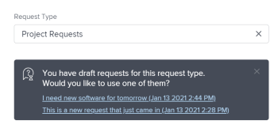

# Créer et soumettre des demandes

Les informations mises en surbrillance sur cette page font référence à des fonctionnalités qui ne sont pas encore disponibles de manière générale. Cette option n’est disponible que dans l’environnement de prévisualisation de sandbox.

<!--Audited: 12/2023-->

<!--

(NOTE: Linked to the UI - do not change/ remove; THIS IS NOW SPLIT IN THREE ARTICLES>> MAKE SURE THE TRANSITION TO THE OTHER TWO IS CLEAR SINCE THIS IS LINKED TO UI)

(NOTE: If they come out with templates AND drafts, consider splitting this article to keep Create in one and Working with Drafts and Requests in another??)

(NOTE: this article is linked from Submitting Workfront Requests from Salesforce) 

-->

Le travail prévu est représenté dans Adobe Workfront par des projets et des tâches. Cependant, il se peut que vous travailliez dans un environnement où du travail non prévu, sous forme de demandes, peut arriver à tout moment. Workfront fournit un workflow permettant de répondre à ce type d’environnement grâce à l’utilisation de files d’attente des demandes.

Après avoir créé une demande dans une file d’attente, vous pouvez soit l’assigner pour qu’elle soit complétée, soit la convertir en tâche ou en projet.\
Pour plus d’informations sur la conversion des problèmes en tâches ou en projets, voir l’article [Vue d’ensemble de la conversion des problèmes dans Adobe Workfront](../../../manage-work/issues/convert-issues/convert-issues.md).

Vous pouvez créer une requête Workfront des manières suivantes :

* À partir de zéro, tel que décrit dans cet article.
* À partir de brouillons. Pour plus d’informations, voir [Créer des demandes à partir de brouillons](../../../manage-work/requests/create-requests/create-requests-from-drafts.md).
* À partir d’une demande existante, en copiant et en envoyant une copie. Pour plus d’informations, voir [Copier et envoyer des demandes](../../../manage-work/requests/create-requests/copy-and-submit-requests.md).

Vous pouvez créer entièrement une demande Workfront Planning pour créer des enregistrements dans Workfront Planning, en procédant comme suit :

* À partir d’un lien vers un formulaire de demande Workfront Planning.

* À partir d’un formulaire de demande Workfront Planning dans la zone des Demandes de Workfront.

  Votre entreprise doit acheter un package Workfront Planning. Pour plus d’informations, voir [Soumettre des demandes Adobe Workfront Planning pour créer des enregistrements](/help/quicksilver/planning/requests/submit-requests.md).

## Conditions d’accès

+++ Développez pour afficher les exigences d’accès aux fonctionnalités de cet article.

<table style="table-layout:auto"> 
 <col> 
 <col> 
 <tbody> 
 <tbody> 
  <tr> 
   <td role="rowheader">Package Adobe Workfront</td> 
   <td> 
Tous 
 </td> 
  </tr> 
  <tr> 
   <td role="rowheader">Licence Adobe Workfront</td> 
   <td> 
Contributeur ou version ultérieure

   
Requête ou supérieure

    </td> 
  </tr> 
  <tr> 
   <td role="rowheader">Configurations des niveaux d’accès</td> 
   <td> 
Modifier l’accès aux problèmes
  </td> 
  </tr> 
  <tr> 
   <td role="rowheader"> Produit</td> 
   <td> <ul><li>Adobe Workfront</li><li>Vous devez disposer d’Adobe Workfront Planning pour afficher les demandes Planning ou les formulaires de demande</td> 
  </tr> 
 </tbody> 
</table>

Pour plus d’informations, voir [Conditions d’accès requises dans la documentation Workfront](/help/quicksilver/administration-and-setup/add-users/access-levels-and-object-permissions/access-level-requirements-in-documentation.md).

+++

## Conditions préalables à l’utilisation des files d’attente des demandes

Un administrateur ou une administratrice Workfront doit créer des files d’attente des demandes et les mettre à la disposition des utilisateurs et utilisatrices avant que ceux-ci ne puissent utiliser cette fonctionnalité. Un utilisateur ou une utilisatrice disposant d’une licence de planification et d’un accès à la modification des projets et à la gestion d’un projet spécifique peut également créer des files d’attente des demandes.

Pour plus d’informations sur la création de files d’attente des demandes, voir l’article [Créer une file d’attente des demandes](../../../manage-work/requests/create-and-manage-request-queues/create-request-queue.md).

Un administrateur ou une administratrice Workfront doit créer les composants suivants d’une file d’attente des demandes :

* Un projet au statut actuel, publié en tant que file d’attente des demandes d’aide.
* Des rubriques de file d’attente.\
  Pour plus d’informations, voir l’article [Créer des rubriques de file d’attente](../../../manage-work/requests/create-and-manage-request-queues/create-queue-topics.md).

* Des règles de routage.\
  Pour plus d’informations, voir l’article [Créer des règles de routage](../../../manage-work/requests/create-and-manage-request-queues/create-routing-rules.md).

* (Facultatif) Des groupes de sujets.\
  Pour plus d’informations, voir l’article [Créer des groupes de sujets](../../../manage-work/requests/create-and-manage-request-queues/create-topic-groups.md).

* (Facultatif) Un formulaire personnalisé de demande.\
  Pour plus d’informations, voir l’article [Création d’un formulaire personnalisé](/help/quicksilver/administration-and-setup/customize-workfront/create-manage-custom-forms/form-designer/design-a-form/design-a-form.md).

* (Facultatif) Un processus d’approbation des demandes.\
  Pour plus d’informations, voir l’article [Créer un processus d’approbation pour les éléments de travail](../../../administration-and-setup/customize-workfront/configure-approval-milestone-processes/create-approval-processes.md).

## Créer des demandes et générer des brouillons dans l’application web Workfront

Lorsque vous créez une demande dans l’application web Workfront, Workfront enregistre la demande en tant que brouillon avant que vous ne l’envoyiez. Workfront crée un brouillon dès que vous sélectionnez votre file d’attente des demandes et que vous commencez à saisir des informations.

Vous pouvez continuer à soumettre la demande ou compléter les informations dont vous disposez pour le moment puis quitter la demande pour revenir la terminer plus tard. Workfront enregistre le brouillon de demande que vous avez démarré dans le dossier Brouillons ou dans la liste des demandes.

>[!IMPORTANT]
>
>Tenez compte des éléments suivants lorsque vous travaillez avec des brouillons :
>
>* Workfront ne crée pas de projets de demande lorsque vous les soumettez à partir d’une application tierce, par exemple en les envoyant par e-mail à Workfront ou en les créant à l’aide d’une autre application. Lorsque vous soumettez une demande depuis l’extérieur de l’application web Workfront, la demande est enregistrée dans la section Envoyées.
>* Si la structure d’une file d’attente des demandes est modifiée, vous ne pouvez plus accéder aux projets existants. Par exemple, si une rubrique de file d’attente est supprimée ou si un groupe de rubriques est ajouté, les brouillons sauvegardés ne sont plus accessibles.
>

Pour plus d’informations sur la création de demandes à partir de projets existants, voir [Créer des demandes à partir de brouillons](../../../manage-work/requests/create-requests/create-requests-from-drafts.md). Pour plus d’informations sur la suppression des brouillons de demande, voir également [Supprimer un brouillon de demande](../../../manage-work/requests/create-requests/delete-request-draft.md).

Pour créer une demande dans l’application web Workfront :

{{step1-to-requests}}

1. (Facultatif et conditionnel) Sélectionnez le paramètre **Passer à une nouvelle expérience** dans le coin supérieur droit de l’écran.

1. Cliquez sur **Nouvelle demande** dans le coin supérieur droit de la page.

   >[!TIP]
   >
   >* Vous pouvez accéder à l’option Nouvelle demande à partir de n’importe quelle section de la zone des Demandes .
   >* L’option Nouvelle requête est grisée lorsque vous n’avez pas accès à la création de problèmes.

   La boîte de dialogue **Nouvelle demande** s’ouvre.

1. (Conditionnel) Si vous passez à la nouvelle expérience , sélectionnez l’un des chemins d’accès ou formulaires de file d’attente des demandes Workfront, ou cliquez sur la barre de recherche.

   Lorsque vous cliquez sur la barre de recherche, une liste déroulante s’affiche, affichant d’abord les files d’attente et les formulaires les plus récemment utilisés. Sélectionnez-en un dans la liste ou commencez à saisir et sélectionnez la file d’attente ou le formulaire lorsqu’il apparaît.

   >[!NOTE]
   >
   >Tenez compte des points suivants concernant la nouvelle expérience de demande :
   >* La liste comprend les files d’attente des demandes de Workfront et les formulaires de demande de Workfront Planning.
   >* Vous pouvez filtrer la liste par type d’objet.
   >* Dans la nouvelle expérience de demande, les brouillons se trouvent dans la même liste que les demandes envoyées.

1. (Conditionnel) Si vous passez à la nouvelle expérience , sélectionnez vos groupes de rubriques et rubriques de file d’attente et continuez à mettre à jour le formulaire.

   Sinon, cliquez dans le champ **Type de requête** et effectuez l’une des opérations suivantes :

   * Dans la section **Chemins d’accès récents**, sélectionnez un chemin que vous avez utilisé récemment pour ouvrir une file d’attente des demandes. Un chemin d’accès comprend la file d’attente des demandes, les groupes de rubriques et la rubrique de file d’attente à laquelle vous avez récemment envoyé une demande. Les trois derniers chemins s’affichent par défaut.

     >[!NOTE]
     >
     >Workfront n’enregistre un chemin d’accès que lorsque vous lui avez envoyé une demande. Des chemins pour les brouillons de demande ne sont pas créés.

     

   * Dans la section **Files d’attente des demandes**, sélectionnez une file d’attente des demandes.
   * Saisissez un mot-clé appartenant à un chemin précédemment consulté pour rechercher une file d’attente des demandes.

     Par exemple, si vous avez une file d’attente des demandes nommée « Centre d’assistance » avec un groupe de rubriques nommé « Emplacement » et une rubrique de file d’attente nommée « Distant », vous pouvez saisir « distant » et toutes les files d’attente des demandes qui contiennent « distant » dans n’importe quel élément de leur chemin d’accès s’affichent.

     >[!TIP]
     >
     >Lorsque vous saisissez un nom contenant un caractère spécial, la file d’attente des demandes, la rubrique de file d’attente ou le groupe de rubriques s’affichent même si vous ne saisissez pas le caractère.

     

     La liste des files d’attente des demandes disponibles et des chemins d’accès récents est mise à jour dynamiquement pour inclure uniquement les chemins d’accès qui contiennent le mot-clé mis en surbrillance dans les résultats.

     Les résultats de la recherche s’affichent dans les zones suivantes :

     <table style="table-layout:auto"> 
      <col> 
      <col> 
      <tbody> 
       <tr> 
        <td role="rowheader">Files d’attente des demandes</td> 
        <td>Files d’attente des demandes dont le nom contient le mot-clé</td> 
       </tr> 
       <tr> 
        <td role="rowheader">Chemins d’accès aux demandes</td> 
        <td> 
Chemins (qui comprennent les files d’attente des demandes, les groupes de rubriques, les rubriques de file d’attente) qui contiennent le mot-clé dans l’un des noms de leurs éléments.
 </td> 
       </tr> 
      </tbody> 
     </table>

   >[!TIP]
   >
   >* Les 200 premières files d’attente des demandes s’affichent par défaut, par ordre alphabétique.
   >* Le nom de la file d’attente des demandes est le nom du projet qui a été publié en tant que file d’attente des demandes d’aide.
   >* La description du projet configuré comme file d’attente des demandes sélectionnée s’affiche à droite du nom de la file d’attente des demandes.
   >   
   >Pour plus d’informations sur la manière de publier un projet en tant que file d’attente des demandes d’aide, voir l’article [Créer une file d’attente des demandes](../../../manage-work/requests/create-and-manage-request-queues/create-request-queue.md).

1. Dans le formulaire **Nouvelle demande**, effectuez l’une des opérations suivantes :

   * (Le cas échéant) Sélectionnez un brouillon disponible dans le message de notification affiché dans le champ Type de demande.

     Cette zone ne s’affiche que si vous avez déjà enregistré des brouillons sans les envoyer.

     Les trois brouillons les plus récents de trois rubriques de file d’attente différentes s’affichent par défaut.

     

   * Commencez à saisir une nouvelle demande dans la file d’attente sélectionnée.

     Un nouveau brouillon est automatiquement enregistré dans la section Brouillons après que vous avez commencé à saisir des informations pour la nouvelle demande et que vous avez donné un nom à la demande dans le champ Objet.

1. (Facultatif) Si votre file d’attente des demandes comprend des groupes de rubriques, sélectionnez le nom du groupe de rubriques dans le premier champ déroulant. Sinon, sélectionnez une rubrique de file d’attente.

   >[!TIP]
   >
   >Lorsque vous pointez sur un groupe de rubriques ou une rubrique de file d’attente, le champ Description s’affiche à droite. Il contient des informations supplémentaires sur le groupe de rubriques ou la rubrique de file d’attente.
   >
   >
   >
   >

   Vous pouvez intégrer jusqu’à 10 niveaux de groupes de rubriques dans votre file d’attente des demandes.\
   Pour plus d’informations sur la création de groupes de rubriques, voir l’article [Créer des groupes de rubriques](../../../manage-work/requests/create-and-manage-request-queues/create-topic-groups.md). Pour plus d’informations sur la création de rubriques de file d’attente, voir l’article [Créer des rubriques de file d’attente de rubriques](../../../manage-work/requests/create-and-manage-request-queues/create-queue-topics.md).

   >[!TIP]
   >
   >Si vous avez sélectionné un brouillon ou un chemin précédent, les groupes de rubriques et les rubriques de file d’attente sont déjà sélectionnés. Vous pouvez en sélectionner un autre, si nécessaire.

1. En fonction des champs activés par l’administrateur ou l’administratrice Workfront dans la section **Nouveaux champs de problème** du sous-onglet **Détails de file d’attente** du projet, vous pouvez trouver l’un des champs suivants lorsque vous envoyez une nouvelle demande :

   <table style="table-layout:auto"> 
    <col> 
    <col> 
    <tbody> 
     <tr> 
      <td role="rowheader"><strong>Objet</strong> </td> 
      <td>Indiquez un nom pour votre demande. Champ obligatoire.</td> 
     </tr> 
     <tr> 
      <td role="rowheader"><strong>Description</strong> </td> 
      <td>Ajoutez une description de votre demande.</td> 
     </tr> 
     <tr> 
      <td role="rowheader"><strong>URL</strong> </td> 
      <td> 
Indiquez une URL susceptible de correspondre à votre demande.
 </td> 
     </tr> 
     <tr> 
      <td role="rowheader"><strong>Priorité</strong> </td> 
      <td> 
Indiquez une priorité pour votre demande. La priorité doit définir la vitesse à laquelle vous estimez que cette demande doit être résolue. Les options par défaut sont les suivantes : 
 
       <ul> 
        <li>Aucun</li> 
        <li>Faible </li> 
        <li>Normal</li> 
        <li>Élevé</li> 
        <li>Urgent</li> 
       </ul> 
Votre administrateur ou administratrice système peut modifier les noms des priorités.
 </td> 
     </tr> 
     <tr> 
      <td role="rowheader"><strong>Gravité</strong> </td> 
      <td> 
Indiquez le degré de gravité de votre demande. La gravité doit définir l’impact de cette demande sur votre travail si elle n’est pas résolue à temps. Les options par défaut sont les suivantes :
 
       <ul> 
        <li>Décoratif</li> 
        <li>Cause de la confusion</li> 
        <li>Bogue qui a une solution</li> 
        <li>Bogue sans solution</li> 
        <li>Erreur fatale</li> 
       </ul> 
Votre administrateur ou administratrice système peut modifier les noms des gravités.
 </td> 
     </tr> 
     <tr> 
      <td role="rowheader"><strong>Contact principal</strong> </td> 
      <td>Le contact principal d’une demande vous est attribué par défaut, car vous êtes la personne de référence pour répondre à toute question relative à la demande. Cependant, vous pouvez l’attribuer à tout autre utilisateur ou toute autre utilisatrice de Workfront.</td> 
     </tr> 
     <tr data-mc-conditions="QuicksilverOrClassic.Quicksilver"> 
      <td role="rowheader"><strong>Affectations</strong> </td> 
      <td> 
Indiquez le nom d’une personne, d’une fonction ou d’une équipe active à laquelle la demande doit être affectée. 
 
Vous ne pouvez spécifier qu’une seule équipe.

   
 Selon la façon dont la file d’attente des demandes a été configurée, il se peut que vous ne puissiez attribuer qu’un ou deux types de ressources à la demande, au lieu des trois (par exemple, vous ne pouvez attribuer la demande qu’à des personnes).

   
Si une règle de transmission est également associée à la file d’attente des demandes et qu’elle achemine automatiquement la demande vers un autre type de ressource (par exemple, une équipe), votre demande est affectée à la fois à l’entité que vous avez spécifiée manuellement lors de la soumission de la demande (les personnes) et à la ressource spécifiée dans la règle de transmission (l’équipe). 

   
 Pour plus d’informations, consultez les articles suivants :
 
      <ul> 
      <li> 
<a href="../../../manage-work/requests/create-and-manage-request-queues/create-request-queue.md" class="MCXref xref">Créer une file d’attente des demandes</a> 
 </li> 
      <li> 
<a href="../../../manage-work/requests/create-and-manage-request-queues/create-routing-rules.md" class="MCXref xref">Créer des règles de routage</a>   
 </li> 
      </ul> 

   
Nous vous recommandons d’utiliser des règles de routage pour vos files d’attente des demandes afin qu’elles puissent être automatiquement acheminées vers les ressources appropriées. 
 </td> 
     </tr>

   <tr> 
      <td role="rowheader"><strong>Nombre d’heures prévues</strong> </td> 
      <td> 
Estimer le nombre d’heures nécessaires à la réalisation de cette demande.
 </td> 
     </tr> 
     <tr> 
      <td role="rowheader"><strong>Date de début prévue</strong> </td> 
      <td> 
Indiquez la date à laquelle le travail sur cette demande doit commencer.
 </td> 
     </tr> 
     <tr> 
      <td role="rowheader"><strong>Date d’achèvement prévue</strong> </td> 
      <td>Indiquez la date à laquelle vous souhaitez que cette demande soit résolue.</td> 
     </tr> 
     <tr> 
      <td role="rowheader"><strong>Statut</strong> </td> 
      <td>Le statut par défaut d’une nouvelle demande est « Nouveau ». Votre administrateur ou administratrice système peut avoir modifié le nom de ce statut. Vous pouvez également modifier le statut à partir de ce menu déroulant.</td> 
     </tr> 
     <tr> 
      <td role="rowheader"><strong>Documents</strong> </td> 
      <td> 
Ajoutez des documents à votre demande. 
 
 En fonction de la configuration de la file d’attente des demandes, la section Documents peut s’afficher avant ou après les champs personnalisés. 
 
Les documents que vous téléchargez dans Workfront sont stockés pendant 24 heures dans une demande en préparation. Par la suite, vous devez les rattacher lorsque vous revenez pour éditer et soumettre le brouillon. Les documents liés à d’autres lecteurs sont enregistrés de manière permanente sur le brouillon. 
 </td> 
     </tr> 
    </tbody> 
   </table>

1. (Facultatif) Si votre administrateur ou administratrice Workfront a associé un formulaire personnalisé à la file d’attente des demandes ou à la rubrique de file d’attente, spécifiez les champs du formulaire personnalisé.\
   Les formulaires personnalisés sont différents pour chaque instance Workfront.
1. (Facultatif et le cas échéant) À tout moment de la saisie de la demande, cliquez sur [!UICONTROL **Ignorer le brouillon**] si vous souhaitez supprimer le brouillon créé automatiquement. Cette opération supprime le brouillon, qui ne pourra plus être récupéré. Un message de confirmation s’affiche pour confirmer la suppression du brouillon.

1. (Facultatif) Cliquez sur [!UICONTROL **Annuler**] dans le message de confirmation si vous souhaitez annuler votre action et conserver le brouillon.

1. Utilisez l’une des méthodes suivantes :

   * Cliquez sur **Soumettre** si vous voulez soumettre la demande. La demande est enregistrée dans la section Envoyé . En fonction de la règle de transmission de la file d’attente des demandes, cette demande peut être transmise vers un projet différent de celui désigné comme file d’attente des demandes. Pour plus d’informations sur les règles de transmission, voir la section [Créer des règles de transmission](../../../manage-work/requests/create-and-manage-request-queues/create-routing-rules.md).

     Ou

     Cliquez sur **Fermer** si vous ne souhaitez pas soumettre immédiatement la demande et que vous pouvez revenir la terminer plus tard. Votre demande est enregistrée dans la section Brouillons et sera disponible la prochaine fois que vous soumettrez une demande pour cette file d’attente des demandes.

     

   Lorsque vous soumettez la demande, le brouillon est automatiquement supprimé et ne peut pas être restauré.

   Les demandes envoyées sont répertoriées dans la section **Soumises** de la zone des Demandes . Si vous utilisez la nouvelle expérience , les demandes envoyées par Workfront s’affichent dans l’onglet **Workfront** de la zone des Demandes .

   Pour plus d’informations sur le traitement des demandes entrantes, consultez l’article [Gérer les demandes de travail et d’équipe](../../../people-teams-and-groups/work-with-team-requests/manage-work-and-team-requests.md).

   Pour plus d’informations sur la localisation des demandes envoyées ou rédigées, consultez également [Localiser les demandes envoyées](../../../manage-work/requests/create-requests/locate-submitted-requests.md).

## Créer des demandes en dehors de Workfront

Vous pouvez partager un lien direct vers une file d’attente des demandes lorsque vous soumettez une nouvelle demande, et l’incorporer dans d’autres applications. Les utilisateurs et utilisatrices qui accèdent à ce lien à partir du web ou d’autres applications doivent également être connectés avec un compte Workfront actif pour pouvoir accéder à cette file d’attente et y soumettre des demandes. Pour plus d’informations, consultez [Partager un lien vers une file d’attente des demandes](../../../manage-work/requests/create-requests/share-link-to-request-queue.md).

## Créer des demandes en envoyant un e-mail à Workfront

Si votre file d’attente des demandes est activée pour recevoir des demandes par e-mail, vous pouvez envoyer vos demandes directement à l’adresse e-mail associée à la file d’attente.

Le corps de texte de l’e-mail est ajouté à la description de la demande.

>[!NOTE]
>
>Le formatage HTML est supprimé lorsque la demande entre dans Workfront, mais les signatures et le contenu du fil de réponse existant ne sont pas supprimés et apparaissent dans la description de la demande.

Pour plus d’informations sur la manière d’activer une file d’attente des demandes pour recevoir des demandes par e-mail, consultez [Permettre aux utilisateurs et utilisatrices d’envoyer par e-mail un problème dans un projet de la file d’attente des demandes](../../../manage-work/requests/create-requests/enable-email-issues-into-projects.md).

## Création de requêtes à l’aide de l’application mobile Workfront

Vous pouvez soumettre des demandes en utilisant l’application mobile sur votre smartphone. Vous pouvez créer une demande et la soumettre aux files d’attente des demandes auxquelles vous avez accès dans l’application web.

Pour plus d’informations sur l’envoi de demandes via l’application mobile, consultez la section Demandes dans les articles :

* [Adobe Workfront pour Android](../../../workfront-basics/mobile-apps/using-the-workfront-mobile-app/workfront-for-android.md#requests)
* [Adobe Workfront pour iOS](../../../workfront-basics/mobile-apps/using-the-workfront-mobile-app/workfront-for-ios.md#requests)

## Créer des demandes à partir d’autres applications

Vous pouvez soumettre des demandes à l’aide de n’importe quelle application intégrée à Workfront :

* Vous pouvez créer une intégration personnalisée entre Workfront et une autre application qui vous permet de soumettre des demandes à Workfront à partir de l’autre application.\
  Pour plus d’informations sur les intégrations Workfront personnalisées, consultez l’article [Intégrations Adobe Workfront](../../../administration-and-setup/configure-integrations/workfront-integrations-1.md).

## Création de requêtes à l’aide d’un formulaire de requête Workfront Planning

Vous pouvez ajouter une demande Planning Workfront à l’aide d’un formulaire de demande Planning. L&#39;ajout de demandes Workfront Planning peut créer des enregistrements Planning, si le formulaire de demande est approuvé ou s&#39;il ne nécessite pas d&#39;approbation.

Votre entreprise doit acheter un package Workfront Planning pour pouvoir soumettre des demandes Planning.

Pour plus d’informations, voir les articles suivants :

* [Création et gestion d’un formulaire de demande dans Adobe Workfront Planning](/help/quicksilver/planning/requests/create-request-form.md).
* [Envoyez des demandes Adobe Workfront Planning pour créer des enregistrements](/help/quicksilver/planning/requests/submit-requests.md).

## Localiser les demandes envoyées

Pour plus d’informations sur la localisation des demandes envoyées ou rédigées, consultez [Localiser les demandes envoyées](../../../manage-work/requests/create-requests/locate-submitted-requests.md).
