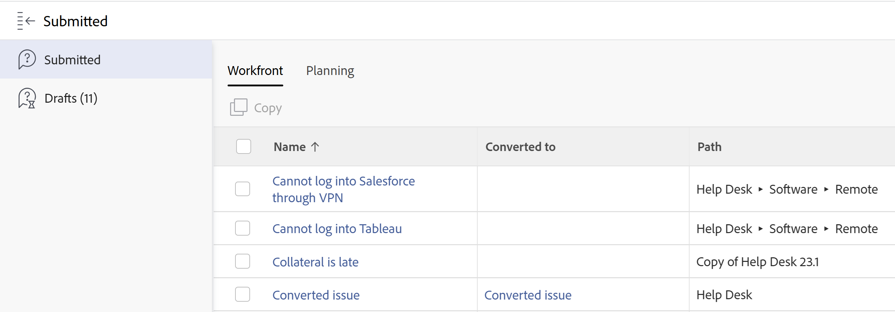
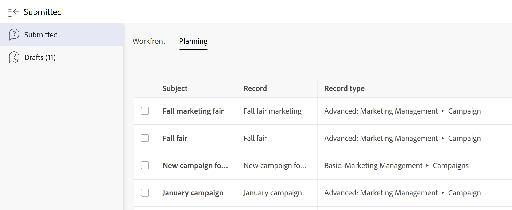

# Afficher les demandes envoyées

<!--
Remove production and preview references at release
-->

<!--

The highlighted information on this page refers to functionality not yet generally available. It is available only in the Preview environment for all customers. After the release to Preview, the same features are also available monthly in the Production environment for customers who enabled fast releases.    

For information about fast releases, see [Enable or disable fast releases for your organization](/help/quicksilver/administration-and-setup/set-up-workfront/configure-system-defaults/enable-fast-release-process.md). 

-->

Vous pouvez afficher les demandes que vous ou une autre personne avez envoyées, ou les demandes que vous avez commencées mais que vous n’avez jamais terminées. Les demandes non terminées sont enregistrées en tant que brouillons.

Les demandes envoyées se trouvent dans les zones suivantes d’Adobe Workfront :

* La zone des Demandes de Workfront
* Widget Mes requêtes dans l’Accueil

La zone des Demandes affiche les demandes suivantes, selon la manière dont vous choisissez de les afficher :

* Requêtes Workfront lorsque vous utilisez l’expérience héritée
* Workfront, ainsi que les demandes Planning lorsque vous utilisez la nouvelle expérience .

  >[!NOTE]
  >
  >* Vous pouvez uniquement afficher vos propres brouillons de demandes.
  >* Dans la nouvelle expérience de demande, les demandes envoyées et les brouillons se trouvent dans la même liste.
  >* Les brouillons créés dans l’expérience héritée ne s’affichent pas dans la nouvelle expérience Demande.

## Conditions d’accès

+++ Développez pour afficher les exigences d’accès aux fonctionnalités de cet article.

<table style="table-layout:auto"> 
 <col> 
 <col> 
 <tbody> 
  <tr> 
   <td role="rowheader">Package Adobe Workfront</td> 
   <td> 
Tout package de workflow Adobe Workfront ou Adobe
 
   
Tout package Adobe Workfront Planning

   </td> 
  </tr> 
  <tr> 
   <td role="rowheader">Licence Adobe Workfront</td> 
   <td> 
Contributeur ou supérieur

   
Requête ou supérieure

    </td> 
  </tr> 
  <tr> 
   <td role="rowheader">Configurations des niveaux d’accès</td> 
   <td>
Modifier l’accès aux problèmes
</td> 
  </tr>
  <tr>
   <td role="rowheader">Autorisations d’objet</td> 
   <td>
Autorisations d’affichage ou supérieures pour les requêtes
</td> 
  </tr> 
  <!--
  tr> 
   <td role="rowheader"> Product</td> 
   <td> <ul><li>Adobe Workfront</li><li>You must have Adobe Workfront Planning to view Planning requests or request forms</td> 
  </tr> 
  -->
 </tbody> 
</table>

Pour plus d’informations, voir [Conditions d’accès requises dans la documentation Workfront](/help/quicksilver/administration-and-setup/add-users/access-levels-and-object-permissions/access-level-requirements-in-documentation.md).

+++

## Afficher les demandes envoyées dans la zone des Demandes

Vous pouvez afficher les demandes envoyées dans la zone des Demandes ou dans le widget Mes demandes dans l’Accueil.

Pour plus d’informations sur Mes requêtes, voir [Utiliser le widget Mes requêtes](/help/quicksilver/workfront-basics/using-home/using-the-home-area/my-requests-widget.md).

L’affichage des demandes envoyées diffère selon que vous utilisez l’expérience de demande nouvelle ou héritée.

* [Afficher les demandes envoyées dans la nouvelle expérience de demande](#view-submitted-requests-in-the-new-requesting-experience)
* [Afficher les demandes envoyées dans l’expérience de demande héritée](#view-submitted-requests-in-the-legacy-requesting-experience)

### Afficher les demandes envoyées dans la nouvelle expérience de demande

>[!NOTE]
>
>* Si vous disposez de Workfront Planning, vos demandes Workfront et Planning apparaissent dans la même liste.
>     Le **type d&#39;objet** d&#39;une requête Planning est nommé selon le modèle suivant : `< Name of workspace > > < Name of record type >`. Par exemple, le type d&#39;objet d&#39;une demande Planning peut être nommé `Marketing workspace > Campaigns`.\
>     Le **type d’objet** d’une requête Workfront est `Issue`.
>* Jusqu’à 50 requêtes s’affichent par défaut dans la liste de la zone des Requêtes . Pour afficher plus de requêtes, faites défiler la liste vers le bas.

Vous pouvez afficher les demandes envoyées dans la zone des Demandes et dans le widget Mes demandes dans l’Accueil.

>[!NOTE]
>
>Les objets suivants possèdent des liens de la liste des requêtes de la zone des Requêtes et du widget Mes requêtes, lorsque vous activez la nouvelle expérience de requêtes :
>
>* Requêtes Planning et Workfront dans le champ Objet .
>* Enregistrements Planning créés à partir de demandes Planning dans le champ Objet créé .
>* Tâches et événements Workfront convertis à partir de demandes Workfront dans le champ Objet créé .

Pour afficher les requêtes que vous ou d’autres utilisateurs et utilisatrices avez envoyées dans la nouvelle expérience de requête :

{{step1-to-requests}}

1. Assurez-vous que le paramètre **Utiliser une nouvelle expérience** dans le coin supérieur droit de l’écran est activé.

   La liste des requêtes s’affiche.

1. (Facultatif) Pour rechercher une requête, commencez à saisir du texte dans la barre de recherche située dans le coin supérieur droit de la liste. Les résultats de la recherche s’affichent au fur et à mesure que vous tapez.
1. (Facultatif) Pour gérer l’affichage des informations dans la liste des demandes, mettez à jour les éléments d’affichage suivants pour la liste :

   * Afficher
   * Filtre
   * Colonnes
   * Regroupement
   * Formater les cellules
   * Hauteur de ligne

   Pour plus d’informations sur la gestion des informations dans la liste des demandes, voir [Utiliser des listes améliorées](/help/quicksilver/workfront-basics/navigate-workfront/use-lists/enhanced-lists.md).

1. (Facultatif) Vérifiez le statut d’une demande en vérifiant la colonne **Statut**.

   >[!IMPORTANT]
   >
   >Votre administrateur Workfront peut configurer certains statuts de requête Workfront dans la zone **Configuration**. Pour plus d’informations, voir [Créer ou modifier un statut](/help/quicksilver/administration-and-setup/customize-workfront/creating-custom-status-and-priority-labels/create-or-edit-a-status.md).
   >
   >Certains statuts de requête Workfront et tous les statuts de requête Planning sont codés en dur par Workfront. Vous ne pouvez pas les personnaliser, les renommer ni en ajouter d’autres du même type.

   Les statuts suivants sont disponibles dans la nouvelle expérience de demande :

   * **Nouveau** : la demande est nouvelle et personne n&#39;a commencé à y travailler.
   * **Brouillon** : cette demande n&#39;a pas encore été soumise. Ce statut est codé en dur.
   * **Révision en attente** : (Planification uniquement) cette demande a des approbateurs et aucun d&#39;entre eux n&#39;a ouvert la demande. Ce statut est codé en dur.
   * **En révision** : (Planification uniquement) cette demande a des approbateurs et au moins un approbateur a ouvert la demande, mais aucune décision n&#39;a été prise. Ce statut est codé en dur.
   * **Rejeté** : (Planning uniquement) Cette demande contient des approbateurs et a été rejetée. Cette demande ne créera pas d’enregistrement. Ce statut est codé en dur.
   * **En cours** :
      * Demandes Workfront : la demande a été convertie et le travail est en cours.
      * Demandes Planning Workfront : l’achèvement de la demande est mappé à un champ Planning spécifique et la valeur du champ ne correspond pas encore à la valeur d’achèvement.
   * **En attente** : cette option est disponible pour les requêtes Workfront. Il peut être défini manuellement par les utilisateurs.
   * **Terminé** : l&#39;enregistrement Planning qui complète la demande a été créé. (Planification uniquement)
   <!--
   This is not live yet; might be live for the unified intake process: 
   * **Canceled**: This is for Workfront requests. 
   -->

### Afficher les demandes envoyées dans l’expérience de demande héritée

Pour afficher les requêtes que vous ou d’autres utilisateurs et utilisatrices avez envoyées dans l’expérience de requête héritée :

{{step1-to-requests}}

1. (Conditionnel) Si votre organisation a acheté un package Workfront Planning, cliquez sur l’onglet **Workfront** pour afficher les requêtes Workfront.
1. Cliquez sur **Envoyées** dans le panneau de gauche pour afficher toutes les demandes envoyées.

   Vous pouvez afficher jusqu’à 2 000 demandes, qui peuvent s’afficher sur plusieurs pages.

   >[!TIP]
   >
   >Vous ne pouvez pas personnaliser les colonnes de la liste des demandes envoyées.

   

1. Les colonnes suivantes s’affichent par défaut :

   <table style="table-layout:auto"> 
      <col> 
      <col> 
      <tbody> 
      <tr> 
         <td role="rowheader">Nom</td> 
         <td> 
Nom de la demande.
 
Cliquez sur le nom de la demande pour l’ouvrir. 
 
<b>CONSEIL</b>

   Si le problème n’a pas été conservé lorsqu’il a été converti en tâche ou projet, le nom du problème est grisé et il n’est plus possible de cliquer dessus. Pour plus d’informations sur la conversion de problèmes, voir <a href="../../../manage-work/issues/convert-issues/convert-issues.md" class="MCXref xref">Vue d’ensemble des problèmes de conversion dans Adobe Workfront</a>. 
 </td>
   </tr> 
      <tr> 
         <td role="rowheader">Converti en</td> 
         <td> 
Nom de l’objet de résolution pouvant être une tâche ou un projet vers lequel la demande a été convertie. 
 
Cliquez sur le nom de la tâche ou du projet pour l’ouvrir. 
 
Si la demande n’a pas été convertie, ce champ est vide. 
 </td> 
      </tr> 
      <tr> 
         <td role="rowheader">Chemin d’accès</td> 
         <td>Nom de la file d’attente des demandes, des groupes de rubriques et des rubriques de la file d’attente où la demande a été envoyée initialement. </td> 
      </tr> 
      <tr> 
         <td role="rowheader">Statut</td> 
         <td>Statut actuel de la demande ou de l’objet de résolution (tâche ou projet)</td> 
      </tr> 
      <tr> 
         <td role="rowheader">Date d’entrée</td> 
         <td>Date d’envoi de la demande ou date de création de l’objet de résolution si la demande a été supprimée lors de la conversion. </td> 
      </tr> 
      <tr> 
         <td role="rowheader">Date de dernière mise à jour</td> 
         <td> 
Date de dernière mise à jour de la demande.
 
Par défaut, la liste des demandes envoyées est triée par ce champ. 
 </td> 
      </tr> 
      </tbody> 
      </table>

1. (Facultatif) Cliquez sur l’en-tête d’une colonne pour la trier.

   >[!TIP]
   >
   >Lorsque vous quittez la liste des demandes envoyées, l’option de tri sélectionnée est conservée.

1. (Facultatif) Sélectionnez une demande dans la liste, puis cliquez sur l’icône **Ouvrir le résumé**  pour ouvrir le panneau Résumé et afficher des informations supplémentaires sur la demande, ajouter des commentaires, des documents ou l’affecter. Pour plus d’informations sur le panneau « Résumé », consultez la section [Vue d’ensemble du résumé](../../../workfront-basics/the-new-workfront-experience/summary-overview.md).

   >[!TIP]
   >
   >* Si le panneau « Résumé » est déjà ouvert, l’icône « Ouvrir le résumé » devient « Fermer le résumé ».
   >
   >* Si votre entreprise utilise l’espace de stockage Adobe pour les documents, vous ne pouvez pas ajouter de documents aux demandes d’espace de stockage Adobe dans le panneau Résumé .
   >
   >Pour plus d’informations, voir [Présentation de la gestion des documents pour les projets et les objets associés](/help/quicksilver/manage-work/projects/manage-projects/manage-documents-on-projects.md).

1. (Facultatif et conditionnel) Cliquez sur l’icône **X** dans le coin supérieur droit ou sur l’icône **Fermer le résumé**  pour fermer le panneau de résumé.

   Si un problème a été converti en tâche ou projet et que le problème a été supprimé dans le processus de conversion, le panneau « Résumé » est vide. Pour plus d’informations sur la conversion de problèmes, consultez la section [Vue d’ensemble de la conversion de problèmes dans Adobe Workfront](../../../manage-work/issues/convert-issues/convert-issues.md).

1. Dans l’**icône Filtre**  en haut à droite de la liste, sélectionnez l’un des filtres répertoriés dans le tableau ci-dessous.

   >[!TIP]
   >
   >Vous ne pouvez pas modifier les filtres dans la section « Soumises » de la zone des « Demandes »

   <table style="table-layout:auto"> 
    <col> 
    <col> 
    <tbody> 
     <tr> 
      <td role="rowheader">Tout</td> 
      <td>Toutes les demandes soumises, indépendamment de leur statut ou de la personne qui les a soumises.</td> 
     </tr> 
     <tr> 
      <td role="rowheader">Ouvertes</td> 
      <td> 
Toutes les demandes soumises qui sont actuellement ouvertes, indépendamment de la personne qui les a soumises. Seules les demandes pour lesquelles vous disposez au moins d’une autorisation de visualisation s’affichent ici si vous ne les avez pas soumises vous-même. 
 
Les demandes sans date d’achèvement réelle ou dont l’objet de résolution ne comporte pas de date d’achèvement réelle sont répertoriées dans le sous-onglet « Ouvertes ».
 
<b>CONSEIL</b>

   Les demandes dont le statut n’équivaut pas à « Clos » sont considérées comme ouvertes.
 </td>
   </tr> 
     <tr> 
      <td role="rowheader">Mes demandes</td> 
      <td>Demandes que vous avez soumises, quel que soit leur statut. </td> 
     </tr> 
     <tr> 
      <td role="rowheader">Mes demandes ouvertes</td> 
      <td> 
Les demandes que vous avez soumises sont toujours ouvertes. 
 
Les demandes sans date d’achèvement réelle ou dont l’objet de résolution ne comporte pas de date d’achèvement réelle sont répertoriées dans le sous-onglet « Mes demandes ouvertes ». 
 
<b>CONSEIL</b>

   Les demandes dont le statut n’équivaut pas à « Clos » sont considérées comme ouvertes.
 </td>
   </tr> 
    </tbody> 
   </table>

1. (Facultatif) Cliquez sur l’icône **Filtrer la page**  en haut de la liste pour rechercher une requête par nom. La liste est mise à jour avec les résultats correspondant à vos critères de recherche.

   <!--

   1. (Conditional) To display only Workfront Request queues, search or filter for `Issue` object types.
   -->

   <!--
   <li> 
Click the <strong>Complete</strong> subtab to view requests that have been completed.
 
(NOTE: this step will stay drafted even after release. We can't see Completed at this time!)  Requests with an Actual Completion Date or whose resolving object has an Actual Completion Date are listed in the Complete subtab. Once a request receives an Actual Completion Date, it stays in the Recently Completed area for 10 business days. After that, it is moved to the Completed area.  For information about resolving and resolvable objects, see the article <a href="../../../manage-work/issues/convert-issues/resolving-and-resolvable-objects.md" class="MCXref xref">Overview of Resolving and Resolvable Objects </a>.
 </li>
   -->

   <!--
   <li>(Optional) Select an option from the <strong>Sort by</strong> drop-down menu to sort the requests by the following criteria:   (NOTE: this step will stay drafted even after release. We can't see Completed at this time!)  
   <ul>
   <li><strong>Assigned To</strong>: Requests are sorted alphabetically by the name of the assignee using the following criteria: 
   <ul>
   <li>All requests assigned to users are sorted first, in the order of the users' names.</li>
   <li>Requests assigned to job roles are sorted secondly, in the order of the job roles' names and are listed after all the requests assigned to users.</li>
   <li>Requests that are assigned to teams are sorted last, in the order of the teams' names and are listed after all the requests assigned to users and those assigned to job roles.</li>
   <li>All unassigned requests are listed last, in the order of their Entry Date. </li>
   </ul></li>
   <li><strong>Submitted On</strong>: Requests are sorted chronologically by the date when they were submitted.</li>
   <li><strong>Recently Updated</strong> (this is the default): Requests are sorted chronologically by the date of their last update.</li>
   <li><strong>Name</strong>: Requests are sorted alphabetically by name. </li>
   <li><strong>Priority</strong>: Requests are sorted in the order of their priority.</li>
   <li><strong>Queue</strong>: Requests are sorted alphabetically by the name of the requests queue where they were submitted. </li>
   <li><strong>Status</strong>: Requests are sorted alphabetically by their status. </li>
   </ul></li>
   -->

1. Cliquez sur **Brouillons** pour visualiser toutes les demandes en préparation. Workfront enregistre un nombre illimité de brouillons pour chaque file d’attente de demandes dans ce dossier. Lorsque vous saisissez une nouvelle demande pour une rubrique de file d’attente qui comporte déjà un brouillon, l’utilisation d’un brouillon existant vous est proposée. Pour plus d’informations, consultez la section [Créer des demandes à partir de brouillons](../../../manage-work/requests/create-requests/create-requests-from-drafts.md).

   <!--
   Planning tab has been removed and no longer visible in legacy Requests area: 
   (Optional and conditional) If your organization purchased a Workfront Planning package, click the **Planning** tab, then click **Submitted** in the left panel to view Workfront Planning requests. 
      Use **Filters** and **Columns** to update the information in the Planning request list. 
      
      For information, see [Submit Adobe Workfront Planning requests to create records](/help/quicksilver/planning/requests/submit-requests.md).
   -->

1. (Facultatif) Vérifiez le statut d’une demande en vérifiant la colonne **Statut**. Les statuts suivants sont disponibles dans la nouvelle expérience de demande :

   * **Brouillon**. Cette demande n&#39;a pas encore été soumise.
   * **En cours**
   * **Terminé**

