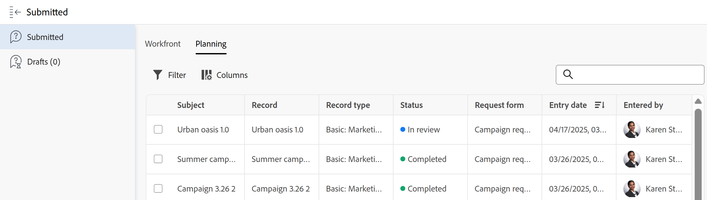

# Afficher les demandes envoyées

Les informations mises en surbrillance sur cette page font référence à des fonctionnalités qui ne sont pas encore disponibles de manière générale. Cette option n’est disponible que dans l’environnement de prévisualisation de sandbox.

Vous pouvez afficher les demandes que vous ou une autre personne avez envoyées, ou les demandes que vous avez commencées mais que vous n’avez jamais terminées. Vous pouvez localiser ces demandes dans les zones suivantes d’Adobe Workfront :

* L’onglet **Workfront** de la zone Demandes de Workfront : affichez les demandes envoyées aux files d’attente des demandes de Workfront dans les sections suivantes :
   * **Section Envoyées** : toutes les demandes que vous ou une autre personne avez envoyées et auxquelles vous avez accès à au moins en affichage.
   * **Section Brouillon** : toutes les demandes que vous avez commencées mais que vous n’avez jamais terminées et que vous n’avez jamais envoyées. Pour plus d’informations sur les brouillons des demandes, voir [Créer et envoyer des demandes Adobe Workfront](../../../manage-work/requests/create-requests/create-submit-requests.md).

  >[!NOTE]
  >
  >* Vous pouvez uniquement afficher vos propres brouillons de demandes.
  >* Dans la nouvelle expérience de demande, les demandes envoyées et les brouillons figurent dans la même liste. 
  >* Les brouillons créés dans l’expérience héritée n’apparaissent pas dans la nouvelle expérience Demande.

* L’onglet **Planning** de la zone des Demandes dans Workfront : permet d’afficher les demandes envoyées aux formulaires de demande Workfront Planning. Votre entreprise doit acheter un package Workfront Planning. Pour plus d’informations, voir les articles suivants :

   * [Création et gestion d’un formulaire de demande dans Adobe Workfront Planning](/help/quicksilver/planning/requests/create-request-form.md)
   * [Envoi de requêtes Adobe Workfront Planning pour créer des enregistrements](/help/quicksilver/planning/requests/submit-requests.md)

## Conditions d’accès

+++ Développez pour afficher les exigences d’accès aux fonctionnalités de cet article.

<table style="table-layout:auto"> 
 <col> 
 <col> 
 <tbody> 
  <tr> 
   <td role="rowheader">Package Adobe Workfront</td> 
   <td> 
Tous 
 </td> 
  </tr> 
  <tr> 
   <td role="rowheader">Licence Adobe Workfront</td> 
   <td> 
Contributeur ou version ultérieure

   
Requête ou supérieure

    </td> 
  </tr> 
  <tr> 
   <td role="rowheader">Configurations des niveaux d’accès</td> 
   <td>
Modifier l’accès aux problèmes
</td> 
  </tr>
  <tr>
   <td role="rowheader">Autorisations d’objet</td> 
   <td>
Autorisations d’affichage ou supérieures pour les requêtes
</td> 
  </tr> 
  <tr> 
   <td role="rowheader"> Produit</td> 
   <td> <ul><li>Adobe Workfront</li><li>Vous devez disposer d’Adobe Workfront Planning pour afficher les demandes Planning ou les formulaires de demande</td> 
  </tr> 
 </tbody> 
</table>

Pour plus d’informations, voir [Conditions d’accès requises dans la documentation Workfront](/help/quicksilver/administration-and-setup/add-users/access-levels-and-object-permissions/access-level-requirements-in-documentation.md).

+++

## Afficher les demandes envoyées dans la zone des Demandes

L’affichage des demandes envoyées diffère selon que vous utilisez l’expérience de demande nouvelle ou héritée.

* [Afficher les demandes envoyées dans la nouvelle expérience de demande](#view-submitted-requests-in-the-new-requesting-experience)
* [Afficher les demandes envoyées dans l’expérience de demande héritée](#view-submitted-requests-in-the-legacy-requesting-experience)

### Afficher les demandes envoyées dans la nouvelle expérience de demande

Vous pouvez afficher les demandes envoyées dans la zone Demandes qui contient des liens vers des objets créés par des demandes Planning.

Pour afficher les requêtes que vous ou d’autres utilisateurs et utilisatrices avez envoyées dans la nouvelle expérience de requête :

{{step1-to-requests}}

1. Assurez-vous que le bouton (bascule) **Utiliser une nouvelle expérience** dans le coin supérieur droit de l’écran est activé.

   La liste Demandes s’affiche.

1. (Facultatif) Pour rechercher une requête, commencez à saisir du texte dans la barre de recherche située en haut à droite de la liste. Les résultats de la recherche s’affichent au fur et à mesure que vous tapez.
1. (Facultatif) Cliquez sur **Filtres** et commencez à ajouter des conditions pour les requêtes que vous souhaitez afficher.

   Vous pouvez filtrer selon les champs suivants :

   * **Workspace** : espace de travail auquel le formulaire de demande est associé.
   * **Type d’enregistrement** : type d’enregistrement auquel le formulaire de demande est associé.
   * **Date d’entrée** : date à laquelle la demande a été soumise.
   * **Formulaire de demande** : nom du formulaire de demande utilisé pour soumettre la demande.
   * **Statut** : statut de la demande.
   * **Saisi par** : nom de l’utilisateur qui a ajouté la demande. Si la demande a été ajoutée par une personne extérieure à Workfront, le champ **Saisi par** affiche `N/A`.

   Plusieurs filtres peuvent être joints par **Et** ou **Ou**.
La liste des demandes est automatiquement filtrée à mesure que vous ajoutez les conditions de filtrage.
1. (Facultatif) Utilisez des vues pour placer le focus sur les requêtes que vous souhaitez afficher.

   Pour obtenir des instructions, voir [Création ou modification de vues dans la zone des Demandes](/help/quicksilver/manage-work/requests/create-requests/create-views-for-requests-list.md).
1. (Facultatif) Vérifiez le statut d’une demande en vérifiant la colonne Statut . Les statuts suivants sont disponibles dans la nouvelle expérience de demande :

   * Brouillon : cette demande n&#39;a pas encore été soumise.
   * En attente de révision : (Planification uniquement) cette demande a des approbateurs et aucun d&#39;entre eux n&#39;a ouvert la demande.
   * En révision : (Planning uniquement) Cette demande a des approbateurs et au moins un approbateur a ouvert la demande, mais aucune décision n&#39;a été prise.
   * Rejetée : (Planning uniquement) Cette demande a des approbateurs et a été rejetée.
   * En cours :
      * Workflow Workfront : la demande a été convertie et le travail est en cours.
      * Workfront Planning : la fin de la demande est mappée à un champ Planning spécifique et la valeur du champ ne correspond pas encore à la valeur de fin.

        Pour plus d’informations, voir [Configurer les détails de configuration](/help/quicksilver/planning/requests/create-request-form.md#set-up-configuration-details) dans l’article Création et gestion d’un formulaire de demande dans Adobe Workfront Planning.
   * Terminé : la demande est terminée.

>[!NOTE]
>
>* Si vous disposez de Workfront Planning, vos demandes Workfront et Planning apparaissent dans la même liste. Les requêtes Workfront affichent la valeur `Issue` dans la colonne Type d’objet .
>* La liste Demandes s’affiche avec 50 demandes. Pour afficher plus de requêtes, faites défiler la liste vers le bas.

### Afficher les demandes envoyées dans l’expérience de demande héritée

Pour afficher les requêtes que vous ou d’autres utilisateurs et utilisatrices avez envoyées dans l’expérience de requête héritée :

{{step1-to-requests}}

1. (Conditionnel) Si votre organisation a acheté un package Workfront Planning, cliquez sur l’onglet **Workfront** pour afficher les requêtes Workfront.
1. Cliquez sur **Envoyées** dans le panneau de gauche pour afficher toutes les demandes envoyées.

   Vous pouvez afficher jusqu’à 2 000 demandes, qui peuvent s’afficher sur plusieurs pages.

   >[!TIP]
   >
   >Vous ne pouvez pas personnaliser les colonnes de la liste des demandes envoyées.

   

1. Les colonnes suivantes s’affichent par défaut :

   <table style="table-layout:auto"> 
      <col> 
      <col> 
      <tbody> 
      <tr> 
         <td role="rowheader">Nom</td> 
         <td> 
Nom de la demande.
 
Cliquez sur le nom de la demande pour l’ouvrir. 
 
<b>CONSEIL</b>

   Si le problème n’a pas été conservé lorsqu’il a été converti en tâche ou projet, le nom du problème est grisé et il n’est plus possible de cliquer dessus. Pour plus d’informations sur la conversion de problèmes, voir <a href="../../../manage-work/issues/convert-issues/convert-issues.md" class="MCXref xref">Vue d’ensemble des problèmes de conversion dans Adobe Workfront</a>. 
 </td>
   </tr> 
      <tr> 
         <td role="rowheader">Converti en</td> 
         <td> 
Nom de l’objet de résolution pouvant être une tâche ou un projet vers lequel la demande a été convertie. 
 
Cliquez sur le nom de la tâche ou du projet pour l’ouvrir. 
 
Si la demande n’a pas été convertie, ce champ est vide. 
 </td> 
      </tr> 
      <tr> 
         <td role="rowheader">Chemin d’accès</td> 
         <td>Nom de la file d’attente des demandes, des groupes de rubriques et des rubriques de la file d’attente où la demande a été envoyée initialement. </td> 
      </tr> 
      <tr> 
         <td role="rowheader">Statut</td> 
         <td>Statut actuel de la demande ou de l’objet de résolution (tâche ou projet)</td> 
      </tr> 
      <tr> 
         <td role="rowheader">Date d’entrée</td> 
         <td>Date d’envoi de la demande ou date de création de l’objet de résolution si la demande a été supprimée lors de la conversion. </td> 
      </tr> 
      <tr> 
         <td role="rowheader">Date de dernière mise à jour</td> 
         <td> 
Date de dernière mise à jour de la demande.
 
Par défaut, la liste des demandes envoyées est triée par ce champ. 
 </td> 
      </tr> 
      </tbody> 
      </table>

1. (Facultatif) Cliquez sur l’en-tête d’une colonne pour la trier.

   >[!TIP]
   >
   >Lorsque vous quittez la liste des demandes envoyées, l’option de tri sélectionnée est conservée.

1. (Facultatif) Sélectionnez une demande dans la liste, puis cliquez sur l’icône  **Ouvrir le résumé** pour ouvrir le panneau « Résumé » et afficher des informations supplémentaires sur la demande, ajouter des commentaires, des documents ou les affecter. Pour plus d’informations sur le panneau « Résumé », consultez la section [Vue d’ensemble du résumé](../../../workfront-basics/the-new-workfront-experience/summary-overview.md).

   >[!TIP]
   >
   >Si le panneau « Résumé » est déjà ouvert, l’icône « Ouvrir le résumé » devient « Fermer le résumé ».

1. (Facultatif et le cas échéant) Cliquez sur l’icône **X** dans l’angle supérieur droit ou l’icône **Fermer le résumé** pour fermer le panneau « Résumé ».

   Si un problème a été converti en tâche ou projet et que le problème a été supprimé dans le processus de conversion, le panneau « Résumé » est vide. Pour plus d’informations sur la conversion de problèmes, consultez la section [Vue d’ensemble de la conversion de problèmes dans Adobe Workfront](../../../manage-work/issues/convert-issues/convert-issues.md).

1. Dans l’**icône Filtrer**  en haut à droite de la liste, sélectionnez l’un des filtres répertoriés dans le tableau ci-dessous.

   >[!TIP]
   >
   >Vous ne pouvez pas modifier les filtres dans la section « Soumises » de la zone des « Demandes »

   <table style="table-layout:auto"> 
    <col> 
    <col> 
    <tbody> 
     <tr> 
      <td role="rowheader">Tout</td> 
      <td>Toutes les demandes soumises, indépendamment de leur statut ou de la personne qui les a soumises.</td> 
     </tr> 
     <tr> 
      <td role="rowheader">Ouvertes</td> 
      <td> 
Toutes les demandes soumises qui sont actuellement ouvertes, indépendamment de la personne qui les a soumises. Seules les demandes pour lesquelles vous disposez au moins d’une autorisation de visualisation s’affichent ici si vous ne les avez pas soumises vous-même. 
 
Les demandes sans date d’achèvement réelle ou dont l’objet de résolution ne comporte pas de date d’achèvement réelle sont répertoriées dans le sous-onglet « Ouvertes ».
 
<b>CONSEIL</b>

   Les demandes dont le statut n’équivaut pas à « Clos » sont considérées comme ouvertes.
 </td>
   </tr> 
     <tr> 
      <td role="rowheader">Mes demandes</td> 
      <td>Demandes que vous avez soumises, quel que soit leur statut. </td> 
     </tr> 
     <tr> 
      <td role="rowheader">Mes demandes ouvertes</td> 
      <td> 
Les demandes que vous avez soumises sont toujours ouvertes. 
 
Les demandes sans date d’achèvement réelle ou dont l’objet de résolution ne comporte pas de date d’achèvement réelle sont répertoriées dans le sous-onglet « Mes demandes ouvertes ». 
 
<b>CONSEIL</b>

   Les demandes dont le statut n’équivaut pas à « Clos » sont considérées comme ouvertes.
 </td>
   </tr> 
    </tbody> 
   </table>

1. (Facultatif) Cliquez sur l’icône **Filtrer la page**  en haut de la liste pour rechercher une demande par nom. La liste est mise à jour avec les résultats correspondant à vos critères de recherche.

1. (Conditionnel) Pour afficher uniquement les files d’attente des demandes Workfront, recherchez ou filtrez les types d’objets `Issue`.

   <!--
   <li value="9" data-mc-conditions="QuicksilverOrClassic.Draft mode"> 
Click the <strong>Complete</strong> subtab to view requests that have been completed.
 
(NOTE: this step will stay drafted even after release. We can't see Completed at this time!)  Requests with an Actual Completion Date or whose resolving object has an Actual Completion Date are listed in the Complete subtab. Once a request receives an Actual Completion Date, it stays in the Recently Completed area for 10 business days. After that, it is moved to the Completed area.  For information about resolving and resolvable objects, see the article <a href="../../../manage-work/issues/convert-issues/resolving-and-resolvable-objects.md" class="MCXref xref">Overview of Resolving and Resolvable Objects </a>.
 </li>
   -->

   <!--
   <li value="10" data-mc-conditions="QuicksilverOrClassic.Draft mode">(Optional) Select an option from the <strong>Sort by</strong> drop-down menu to sort the requests by the following criteria:   (NOTE: this step will stay drafted even after release. We can't see Completed at this time!)  
   <ul>
   <li><strong>Assigned To</strong>: Requests are sorted alphabetically by the name of the assignee using the following criteria: 
   <ul>
   <li>All requests assigned to users are sorted first, in the order of the users' names.</li>
   <li>Requests assigned to job roles are sorted secondly, in the order of the job roles' names and are listed after all the requests assigned to users.</li>
   <li>Requests that are assigned to teams are sorted last, in the order of the teams' names and are listed after all the requests assigned to users and those assigned to job roles.</li>
   <li>All unassigned requests are listed last, in the order of their Entry Date. </li>
   </ul></li>
   <li><strong>Submitted On</strong>: Requests are sorted chronologically by the date when they were submitted.</li>
   <li><strong>Recently Updated</strong> (this is the default): Requests are sorted chronologically by the date of their last update.</li>
   <li><strong>Name</strong>: Requests are sorted alphabetically by name. </li>
   <li><strong>Priority</strong>: Requests are sorted in the order of their priority.</li>
   <li><strong>Queue</strong>: Requests are sorted alphabetically by the name of the requests queue where they were submitted. </li>
   <li><strong>Status</strong>: Requests are sorted alphabetically by their status. </li>
   </ul></li>
   -->

1. Cliquez sur **Brouillons** pour visualiser toutes les demandes en préparation. Workfront enregistre un nombre illimité de brouillons pour chaque file d’attente de demandes dans ce dossier. Lorsque vous saisissez une nouvelle demande pour une rubrique de file d’attente qui comporte déjà un brouillon, l’utilisation d’un brouillon existant vous est proposée. Pour plus d’informations, consultez la section [Créer des demandes à partir de brouillons](../../../manage-work/requests/create-requests/create-requests-from-drafts.md).

1. (Facultatif et conditionnel) Si votre entreprise a acheté un package Workfront Planning, cliquez sur l’onglet **Planning**, puis sur **Soumis** dans le panneau de gauche pour afficher les demandes Workfront Planning.

   Utilisez **Filtres** et **Colonnes** pour mettre à jour les informations de la liste des demandes Planning.

   

   Pour plus d’informations, voir [Soumettre des demandes Adobe Workfront Planning pour créer des enregistrements](/help/quicksilver/planning/requests/submit-requests.md).

1. (Facultatif) Vérifiez le statut d’une demande en vérifiant la colonne Statut . Les statuts suivants sont disponibles dans la nouvelle expérience de demande :

   * Brouillon : cette demande n&#39;a pas encore été soumise.
   * En cours
   * Terminé

