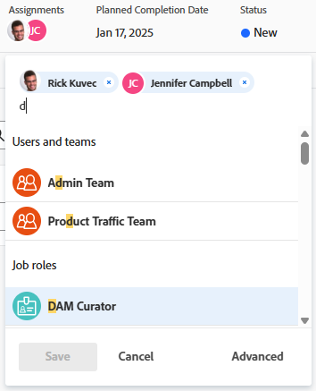

# Attribuer des tâches

<!--Audited: 10/2025-->

<!--remove production/ preview and old/ new experience references at prod-->

<!--
 

The highlighted information on this page refers to functionality not yet generally available. It is available only in the Preview environment for all customers. The same features will also be available in the Production environment for all customers starting with  a week from the Preview release.      

For more information, see [Second Quarter 2026 release overview](/help/quicksilver/product-announcements/product-releases/26-q2-release-activity/26-q2-release-overview.md). 

-->

Vous pouvez affecter des tâches aux utilisateurs et aux utilisatrices, aux fonctions ou aux équipes pour indiquer qui est responsable de l’exécution des tâches. Vous pouvez affecter une tâche à plusieurs ressources à la fois.

>[!TIP]
>
>Vous pouvez affecter plusieurs utilisateurs et utilisatrices, fonctions ou équipes. Vous pouvez affecter uniquement les utilisateurs et utilisatrices, fonctions et équipes actifs.
>
>Si une personne, une fonction ou une équipe a été affectée avant d’être désactivée, elle reste affectée à l’élément de travail. Dans ce cas, nous vous recommandons ce qui suit :
>
>* Réaffectez la tâche aux ressources actives.
>* Associez les utilisateurs et utilisatrices d’une équipe désactivée à une équipe active et réaffectez l’élément de travail à l’équipe active.
>

Le nombre d’utilisateurs et d’utilisatrices à qui une tâche a été affectée et le planning de la personne propriétaire peuvent modifier les dates prévues pour une tâche, entraînant ainsi des modifications dans la chronologie du projet. Pour plus d’informations sur l’impact de l’affectation de plusieurs utilisateurs et utilisatrices à une tâche, consultez la section [Vue d’ensemble de la modification des affectations de tâches](../../../manage-work/tasks/assign-tasks/modify-task-assignments-overview.md).

En plus de cet article, nous vous recommandons de lire les articles suivants pour plus d’informations sur l’affectation de tâches :

* [Vue d’ensemble de la modification des affectations de tâches](../../../manage-work/tasks/assign-tasks/modify-task-assignments-overview.md)
* [Vue d’ensemble des affectations intelligentes](../../../manage-work/tasks/assign-tasks/smart-assignments.md)
* [Créer des affectations intelligentes](../../../manage-work/tasks/assign-tasks/make-smart-assignments.md)
* [Créer des affectations avancées](../../../manage-work/tasks/assign-tasks/create-advanced-assignments.md)
* [Modifier plusieurs affectations d’utilisateurs et d’utilisatrices dans une liste de tâches](../../../manage-work/tasks/assign-tasks/modify-multiple-assignments-in-task-list.md)
* [Modifier des tâches](../../../manage-work/tasks/manage-tasks/edit-tasks.md)
* [Vue d’ensemble de la planification d’un projet](../../../manage-work/projects/planning-a-project/plan-project.md)
* [Vue d’ensemble de la date d’achèvement prévue de la tâche](../../../manage-work/tasks/task-information/task-planned-completion-date.md)
* [Définir la date d’achèvement prévue du projet](../../../manage-work/projects/planning-a-project/project-planned-completion-date.md)
* [Configurer les préférences du projet à l’échelle du système](../../../administration-and-setup/set-up-workfront/configure-system-defaults/set-project-preferences.md)
* [Vue d’ensemble de l’affectation de travail dans l’équilibreur de charge de travail](../../../resource-mgmt/workload-balancer/assign-work-in-workload-balancer.md)

## Conditions d’accès

+++ Développez pour afficher les exigences d’accès aux fonctionnalités de cet article.

<table style="table-layout:auto"> 
 <col> 
 <col> 
 <tbody> 
  <tr> 
   <td>Package Adobe Workfront</td> 
   <td> 
Tous
 </td> 
  </tr> 
  <tr> 
   <td>Licence Adobe Workfront</td> 
   <td> 
Standard

   
Travail ou supérieur

   </td> 
  </tr> 
  <tr> 
   <td>Configurations des niveaux d’accès</td> 
   <td> 
Modifier l’accès aux projets et tâches
 
Accès en affichage de niveau supérieur aux utilisateurs et utilisatrices
 </td> 
  </tr> 
  <tr> 
   <td>Autorisations d’objet</td>
   <td>Autorisations de contribution ou de niveau supérieur pour une tâche</td>
  </tr>
 </tbody>
</table>

Pour plus d’informations, voir [Conditions d’accès requises dans la documentation Workfront](/help/quicksilver/administration-and-setup/add-users/access-levels-and-object-permissions/access-level-requirements-in-documentation.md).

+++

## Considérations relatives à plusieurs affectations pour les fonctoins, les équipes et les utilisateurs et utilisatrices

Tenez compte des points suivants lorsque vous affectez plusieurs ressources à un élément de travail :

* Les utilisateurs et utilisatrices peuvent avoir plusieurs fonctions associées à leur profil. Pour plus d’informations sur l’affectation de fonctions à des utilisateurs et utilisatrices, consultez la section [Modifier le profil d’un utilisateur ou d’une utilisatrice](../../../administration-and-setup/add-users/create-and-manage-users/edit-a-users-profile.md).

* Si vous affectez plusieurs utilisateurs et utilisatrices à une tâche ou à un problème, la première personne sélectionnée est désignée automatiquement comme propriétaire de la tâche ou du problème.
Pour plus d’informations sur la modification de cette option, consultez les informations sur l’option « Principal » dans l’article [Créer des affectations avancées](create-advanced-assignments.md).

* Une équipe ne peut pas être une désignée comme cessionnaire principale pour une tâche ou un problème. Seules une personne ou une fonction peuvent être désignées comme cessionnaire principale sur une tâche ou un problème.

<!-- If a task is assigned to multiple teams, the primary team sees the Work On It button. waiting on team to verify if this is true. (Courtney)
You cannot make a team be a Primary on a task/ issue. (Alina) -->

* Les tâches et les problèmes d’un projet peuvent être affectés en premier à une ou plusieurs équipes ou fonctions. Lorsque le projet est prêt à démarrer, il doit ausi être affecté à des utilisateurs et des utilisatrices :

  <table>
  <col> 
  <col> 
  <tbody>
  <tr>
   <td>Équipes</td>
   <td>Si une tâche est affectée à une équipe et à un utilisateur ou une utilisatrice, la tâche reste affectée à l’équipe et à l’utilisateur ou l’utilisatrice, même si cette personne n’est pas membre de l’équipe.</td>
  </tr>
  <tr>
   <td>Fonctions</td>
   <td>
Si vous affectez une tâche ou un problème à une ou plusieurs fonctions et à un utilisateur ou à une utilisatrice, suivez les règles suivantes pour affecter cette fonction à l’utilisateur ou à l’utilisatrice supplémentaire :

     <ul>
      <li>Si une seule fonction est affectée et qu’elle correspond au rôle principal de l’utilisateur ou de l’utilisatrice (configuré dans son profil), la tâche ou le problème est affecté(e) uniquement à cet utilisateur ou à cette utilisatrice.</li>
      <li>Si plusieurs fonctions sont affectées et qu’au moins l’une d’elles correspond à une fonction de l’utilisateur ou de l’utilisatrice, la tâche ou le problème est affecté(e) à cet utilisateur ou à cette utilisatrice (la fonction est choisie de manière aléatoire s’il y a plusieurs correspondances), ainsi que tout autre fonction affectée.</li>
      <li>Si au moins une fonction est affectée et qu’aucune correspondance n’est trouvée avec les fonctions de l’utilisateur ou de l’utilisatrice, la tâche ou le problème est affecté(e) à la fois à la fonction ou aux fonctions et à l’utilisateur ou l’utilisatrice.</li>
     </ul>
   
Pour plus d’informations sur la fonction principale ou les autres fonctions d’un utilisateur ou d’une utilisatrice, consultez la section <a href="../../../administration-and-setup/add-users/create-and-manage-users/edit-a-users-profile.md">Modifier le profil d’un utilisateur ou d’une utilisatrice</a>.

   </td> 
     </tr>
  </tbody>
  </table>

<!--

<h2>Considerations for multiple user assignments and using schedules</h2>

(NOTE: moved to the Modify task assignments overview standalone article)

You can assign multiple resources to a task. When you assign a user to a task, Workfront uses the user's schedule to calculate the planned dates for the task which ultimately determine the timeline of the project. Using the schedule of the user takes into account their time off, holidays, and weekend days which are considered non-working days when task activity cannot occur. 

When you assign multiple users to a task, your Workfront administrator or a group administrator determines which one of the following schedules Workfront uses to determine the planned dates of the tasks, based on schedules: 

<ul>
<li> 
<strong>The Primary Assignee's schedule</strong>: this is the schedule associated with the user designated as the task Owner.
 
For information about associating users with schedules, see <a href="../../../administration-and-setup/add-users/create-and-manage-users/edit-a-users-profile.md" class="MCXref xref">Edit a user's profile</a>.
 </li>
<li><strong>The Project's schedule</strong>: this is the schedule associated with the project. For adding a schedule to a project, see <a href="../../../manage-work/projects/manage-projects/edit-projects.md" class="MCXref xref">Edit projects</a>.</li>
</ul>

For information about setting up which schedule a project uses in the case of multiple assignments, see <a href="../../../administration-and-setup/set-up-workfront/configure-system-defaults/set-project-preferences.md" class="MCXref xref">Configure system-wide project preferences</a>. 

-->

## Affecter une seule tâche

1. Accédez à une tâche que vous souhaitez affecter.
1. Cliquez sur **Affecter à** dans le champ **Affectations** dans l’en-tête de la tâche.

   Ou

   Cliquez sur le nom des affectations si la tâche est déjà affectée.

   

1. Utilisez l’une des méthodes suivantes :

   * Commencez à saisir le nom d’un utilisateur, d’une fonction ou d’une équipe à affecter, puis cliquez dessus lorsqu’il apparaît dans la liste.

     >[!TIP]
     >
     >Lors de l’ajout d’une affectation d’utilisateur ou d’utilisatrice, notez l’avatar, le rôle principal de l’utilisateur ou de l’utilisatrice ou son adresse e-mail, pour faire la distinction entre les utilisateurs et utilisatrices portant le même nom. Les utilisateurs et utilisatrices doivent être associés à au moins une fonction pour l’afficher à mesure que vous les ajoutez.
     >
     >Pour que les utilisateurs et utilisatrices puissent afficher les e-mails de leurs utilisateurs et utilisatrices, le paramètre Afficher les coordonnées doit être activé dans votre niveau d’accès. Pour plus d’informations, voir [Accorder l’accès aux utilisateurs et aux utilisatrices](../../../administration-and-setup/add-users/configure-and-grant-access/grant-access-other-users.md).

   * (Conditionnel) Cliquez sur l’un des noms figurant dans les listes **Utilisateurs et équipes** ou **Fonctions** lorsqu’ils s’affichent. Consultez [Vue d’ensemble des affectations intelligentes](../../../manage-work/tasks/assign-tasks/smart-assignments.md) pour en savoir plus.

     Vous pouvez commencer à saisir le nom d’un utilisateur ou d’une utilisatrice, d’une équipe, ou d’une fonction pour l’affecter à la tâche, puis sélectionner le nom lorsqu’il s’affiche dans la liste.

   * Cliquez sur **Avancé**.

     Pour plus d’informations sur la façon d’effectuer des affectations avancées, consultez la section [Créer des affectations avancées](../../../manage-work/tasks/assign-tasks/create-advanced-assignments.md).

1. Cliquer sur **Enregistrer**.
1. (Facultatif et le cas échéant) Cliquez sur l’**icône X** à côté du nom de l’affectation dans le panneau de droite de la tâche pour supprimer une affectation, si vous avez cliqué sur **Avancé**.

## Affectation d’une tâche dans une liste lors de sa modification sur la ligne

Vous pouvez affecter des tâches dans une liste ou un rapport lorsque l’un des champs d’affectation est visible dans la vue de la liste. C’est un moyen plus rapide d’affecter des tâches. Cet article décrit comment modifier des affectations pour une tâche dans une liste. Pour plus d’informations sur la modification de plusieurs affectations pour plusieurs tâches dans une liste, consultez la section [Modifier plusieurs affectations d’utilisateurs et d’utilisatrices dans une liste de tâches](../../../manage-work/tasks/assign-tasks/modify-multiple-assignments-in-task-list.md).

Selon le champ visible dans la vue, vous pouvez affecter les entités suivantes à la tâche :

| champ | Entités affectées |
|---|---|
| **Affecter à** | Affecter un utilisateur ou une utilisatrice |
| **Affecté** | Affecter un utilisateur ou une utilisatrice |
| **Affectations** | Affecter des utilisateurs et des utilisatrices, des fonctions ou des équipes |

Pour affecter des tâches dans une liste, procédez comme suit :

1. Accédez à la liste des tâches dans laquelle les champs « Affecté à », « Affecté » ou « Affectations » sont affichés.
1. (Facultatif) Cliquez sur le menu déroulant **Enregistrement automatique** et sélectionnez l’une des options suivantes :

   | Option | Description des options |
   |---|---|
   | Enregistrement automatique | Les modifications que vous apportez aux tâches sont automatiquement enregistrées et ne peuvent pas être annulées. |
   | Enregistrement manuel | Vous devez enregistrer vos modifications manuellement. Vous pouvez annuler vos modifications avant de les enregistrer. |
   | Planification chronologique | Vous devez enregistrer vos modifications manuellement. Vous pouvez annuler vos modifications avant de les enregistrer. L’enregistrement de vos modifications et de toutes les dépendances du projet est plus rapide que lors de la sélection de l’enregistrement manuel. |

   Pour plus d’informations sur l’enregistrement des tâches lorsque vous les modifiez dans une liste, voir la section [Modifier les tâches dans une liste](../../../manage-work/tasks/manage-tasks/edit-tasks-in-a-list.md).

1. Pour affecter des tâches, effectuez l’une des opérations suivantes :

   * Cliquez dans les champs **Affecté à** ou **Affecté** et commencez à saisir le nom d’une personne active que vous souhaitez affecter à la tâche, puis cliquez dessus lorsqu’il s’affiche dans la liste.
   * Cliquez dans le champ **Affectations** et commencez à saisir le nom d’une personne, d’une fonction ou d’une équipe active à affecter à la tâche, puis cliquez dessus lorsqu’il s’affiche dans la liste.

     >[!TIP]
     >
     >Lors de l’ajout d’une affectation d’utilisateur ou d’utilisatrice, notez l’avatar, le rôle principal de l’utilisateur ou de l’utilisatrice ou son adresse e-mail, pour faire la distinction entre les utilisateurs et utilisatrices portant le même nom. Les utilisateurs et utilisatrices doivent être associés à au moins une fonction pour l’afficher à mesure que vous les ajoutez.
     >
     >Pour que les utilisateurs et utilisatrices puissent afficher les e-mails de leurs utilisateurs et utilisatrices, le paramètre Afficher les coordonnées doit être activé dans votre niveau d’accès. Pour plus d’informations, voir [Accorder l’accès aux utilisateurs et utilisatrices](../../../administration-and-setup/add-users/configure-and-grant-access/grant-access-other-users.md)

     <!--When adding a job role assignment, you can search for the job role or location. Select a Job role to use the default billing rate for the assignment, or select a Rate Card job role to use the billing rate from the rate card. For more information on rate cards, see [Manage rate cards](/help/quicksilver/administration-and-setup/set-up-workfront/configure-system-defaults/manage-rate-cards.md).-->

1. (Conditionnel) Dans le champ Affectations, cliquez sur **Avancé** au bas de la liste, ou sur l&#39;**icône Personnes**  dans le coin supérieur droit de la zone Affectations, pour ouvrir la zone **Affectations avancées** et créer des affectations avancées.

   Pour plus d’informations, voir la section [Créer des affectations avancées](../../../manage-work/tasks/assign-tasks/create-advanced-assignments.md).

   >[!TIP]
   >
   >Vous ne pouvez pas créer d’affectations avancées à partir des champs Affecté à ou Affecté.

1. Après avoir ajouté les personnes cessionnaires à la tâche, appuyez sur Entrée ou cliquez n’importe où sur la page pour enregistrer vos modifications si vous avez sélectionné Enregistrement automatique. Sinon, cliquez sur **Enregistrer**.

## Affecter plusieurs tâches en bloc à partir d’une liste

1. Accédez à la liste des tâches que vous souhaitez affecter en masse.
1. (Le cas échéant) Assurez-vous que l’option **Enregistrement automatique** est sélectionnée si vous vous trouvez dans la liste des tâches d’un projet.

   >[!IMPORTANT]
   >
   >Vous ne pouvez pas modifier les tâches en masse lors de l’enregistrement manuel des tâches sur un projet.

1. Sélectionnez plusieurs tâches dans la liste des tâches.
1. Cliquez sur **Modifier**.

   La boîte de dialogue **Modifier les tâches** s’ouvre.

1. Dans la zone **Affectations**, commencez à saisir le nom des utilisateurs, des équipes ou des rôles dans le champ **Rechercher des personnes, des rôles ou des équipes** fourni, puis cliquez dessus lorsqu’ils s’affichent dans la liste

   >[!IMPORTANT]
   >
   >Si l’une des tâches est déjà affectée, les ressources que vous indiquez ici sont ajoutées aux tâches au lieu de remplacer les ressources existantes sur les tâches.

1. Renseignez les champs suivants pour les tâches sélectionnées :

   * Pointez sur le nom de l’affectation, puis cliquez sur **Créer un Principal** pour indiquer quelle personne désignée est le propriétaire de la tâche.
   * **Type de durée**

     Pour plus d’informations sur le type de durée des tâches, voir la section [Vue d’ensemble de la durée de la tâche et du type de durée](../../../manage-work/tasks/taskdurtn/task-duration-and-duration-type.md).

   * **Durée**
   * **Nombre d’heures prévues**

     Pour plus d’informations, voir [Modifier des tâches](/help/quicksilver/manage-work/tasks/manage-tasks/edit-tasks.md).

1. (Facultatif) Si vous souhaitez supprimer des personnes désignées existantes de toutes les tâches, cliquez sur le **x** en regard de leur nom dans le champ **Rechercher des personnes, des rôles ou des équipes**.

1. Cliquer sur **Enregistrer**.
1. (Facultatif et conditionnel) Lorsque les champs **Affecté à** ou **Affectations** s’affichent dans votre liste de tâches, cliquez dans l’une de ces colonnes pour une tâche, puis cliquez sur l’icône **X** en regard du nom d’une personne désignée pour la supprimer de la tâche.

<!--

<h2>Considerations about unassigning tasks</h2>

(NOTE: moved this to the new article: /Content/Manage work/Tasks/Assign tasks/modify-task-assignments-overview.htm)

You can remove assignments from one task at a time, or you can remove assignments from multiple tasks in bulk.

For more information about removing assignments from tasks in bulk, see <a href="../../../manage-work/tasks/assign-tasks/modify-multiple-assignments-in-task-list.md" class="MCXref xref">Modify multiple user assignments in a task list</a>. 

Consider the following when removing assignments from tasks: 

<ul>
<li>When you unassign a user from a task, the task remains assigned to the job role that the user fulfilled on the task.</li>
<li>When you unassign a job role or a team from a task, the task remains unassigned if it is not assigned to any other resources. </li>
</ul>

-->

<!--Assigning multiple tasks in bulk from a list differs depending on which environment you choose. 

### Assign multiple tasks in bulk from a list in the Production environment

1. Go to a list of tasks that you want to assign in bulk. 
1. (Conditional) Ensure that the **Autosave** option is selected if you are on a list of tasks under a project.

   >[!IMPORTANT]
   >
   >You cannot edit tasks in bulk when saving tasks manually on a project.

1. Select several tasks in the tasks list. 
1. Click **Edit**.

   The **Edit Tasks** dialog box opens in the new experience.

1. Continue assigning the tasks using the new experience.

   For more information, see the section [Assign multiple tasks in bulk from a list in the new experience](#assign-multiple-tasks-in-bulk-from-a-list-in-the-new-experience) in this article.

1. (Optional) Click **Switch back to old experience** at the bottom of the **Edit Tasks** box to open the old experience.

1. (Conditional) Using the old experience, in the **Assignments** area, select the **Assignee** box, then start typing the name of a user, job role, or team that you want to assign to all the tasks.

   >[!IMPORTANT]
   >
   >If any of the tasks is already assigned, the resources you indicate here are added to the tasks instead of replacing the existing resources on the tasks. 

1. (Optional) Select the radio button in the **Task Owner** column to indicate which resource is the primary assignee or the Owner of the task, when you assign more than one resource to the task. This is not available for teams. 
1. (Conditional) Specify the **Allocation %** for each resource assigned to the task if all the tasks you selected have a Duration Type of Effort Driven or Calculated Assignment. This indicates how much of their time these resources should spend on completing the task. This is only available for users and job roles.

   Or

   Specify the amount of **Hours** for each resource assigned to the task if all the tasks you selected have a Duration Type of Simple. The total of all hours for all resources should equal the number of Planned Hours for the task.

   >[!IMPORTANT]
   >
   >You cannot specify the allocation percentage or the number of hours per resource if the tasks you selected have different Duration Types or of the tasks you selected have different Duration Types.

   For information about Duration Type on tasks, see [Overview of Task Duration and Duration Type](../../../manage-work/tasks/taskdurtn/task-duration-and-duration-type.md).

1. (Optional) Select a role that the user should fulfill on the task from the **Pick a role** drop-down menu in the **Assignee's Role** column when you assign users to tasks. If you do not select a role, Workfront automatically selects the user's Primary Role. 

1. (Optional) If you want to remove existing assignees from all tasks do one of the following:

   1. Start typing the name of a user, role, or team you want to remove from the task, then select it when it appears on the list and click **Remove Assignee** to remove more assignees.
   1. Click **Remove All Existing Assignees** to remove all assignees from all selected tasks.

1. Click **Save Changes**.
1. (Optional and conditional) When the Assigned to or the Assignments fields display in your list of tasks, click inside one of these columns for a task, then click the **X icon** next to the name of an assignee to remove it from the task.

#### Assign multiple tasks in bulk from a list in the new experience

1. Go to a list of tasks that you want to assign in bulk.
1. (Conditional) Ensure that the **Autosave** option is selected if you are on a list of tasks under a project.

   >[!IMPORTANT]
   >
   >You cannot edit tasks in bulk when saving tasks manually on a project.

1. Select several tasks in the tasks list. 
1. Click **Edit**.

   The **Edit Tasks** dialog box opens.

1. In the **Assignments** area, start typing the name of users, teams, or roles in the **Search people, roles, or teams** field provided, then click them when they display in the list

   Or 

   Click **Assign to me** to assign it to yourself.

   >[!IMPORTANT]
   >
   >If any of the tasks is already assigned, the resources you indicate here are added to the tasks instead of replacing the existing resources on the tasks.

1. Click inside the **Duration Type** field and choose a Duration Type. 

   For information about Duration Type on tasks, see [Overview of Task Duration and Duration Type](../../../manage-work/tasks/taskdurtn/task-duration-and-duration-type.md).

1. (Conditional) Depending on what **Duration Type** you selected, update the following fields: 

   * Duration
   * Planned Hours

      For more information, see [Edit tasks](/help/quicksilver/manage-work/tasks/manage-tasks/edit-tasks.md). 

1. (Optional) If you want to remove existing assignees from all tasks, click the **x** next to their name in the **Search people, roles, or teams** field.

1. Click **Save**.
1. (Optional and conditional) When the **Assigned to** or the **Assignments** fields display in your list of tasks, click inside one of these columns for a task, then click the **X icon** next to the name of an assignee to remove it from the task.

### Assign multiple tasks in bulk from a list in the Preview environment
-->