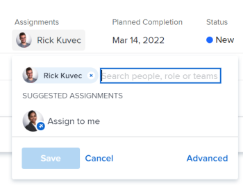

# Affecter des tâches

{{highlighted-preview}}

Vous pouvez affecter des tâches aux utilisateurs, aux rôles de tâche ou aux équipes pour indiquer qui est responsable de l’exécution des tâches. Vous pouvez affecter une tâche à plusieurs ressources à la fois.

>[!TIP]
>
>Vous pouvez affecter plusieurs utilisateurs, rôles de tâche ou équipes. Vous pouvez affecter uniquement les utilisateurs, les rôles de tâche et les équipes actifs.
>
>Si un utilisateur, un rôle de tâche ou une équipe a été affecté avant d’être désactivé, ils restent affectés à l’élément de travail. Dans ce cas, nous vous recommandons ce qui suit :
>
>* Réaffectez la tâche aux ressources actives.
>* Associez les utilisateurs d’une équipe désactivée à une équipe active et réaffectez l’élément de travail à l’équipe active.
>

Le nombre d’utilisateurs affectés à une tâche et le planning de la tâche Propriétaire peuvent modifier les dates planifiées d’une tâche, ce qui entraîne la modification de la chronologie du projet. Pour plus d’informations sur l’impact de l’affectation de plusieurs utilisateurs à une tâche, voir [Présentation de la modification des affectations de tâche](../../../manage-work/tasks/assign-tasks/modify-task-assignments-overview.md).

En plus de cet article, nous vous recommandons de lire les articles suivants pour plus d’informations sur l’affectation de tâches :

* [Présentation de la modification des affectations de tâche](../../../manage-work/tasks/assign-tasks/modify-task-assignments-overview.md)
* [Présentation des affectations intelligentes](../../../manage-work/tasks/assign-tasks/smart-assignments.md)
* [Rendre des affectations intelligentes](../../../manage-work/tasks/assign-tasks/make-smart-assignments.md)
* [Création d’affectations avancées](../../../manage-work/tasks/assign-tasks/create-advanced-assignments.md)
* [Modification de plusieurs affectations d’utilisateurs dans une liste de tâches](../../../manage-work/tasks/assign-tasks/modify-multiple-assignments-in-task-list.md)
* [Modifier les tâches](../../../manage-work/tasks/manage-tasks/edit-tasks.md)
* [Planification d’une présentation de projet](../../../manage-work/projects/planning-a-project/plan-project.md)
* [Présentation de la date d’achèvement planifiée de la tâche](../../../manage-work/tasks/task-information/task-planned-completion-date.md)
* [Définition de la date d’achèvement prévue du projet](../../../manage-work/projects/planning-a-project/project-planned-completion-date.md)
* [Configuration des préférences de projet à l’échelle du système](../../../administration-and-setup/set-up-workfront/configure-system-defaults/set-project-preferences.md)
* [Vue d’ensemble de l’affectation du travail dans l’équilibreur de charge de travail](../../../resource-mgmt/workload-balancer/assign-work-in-workload-balancer.md)

## Conditions d’accès

<!--drafted for P&P - replace table below with this:

<table style="table-layout:auto"> 
 <col> 
 <col> 
 <tbody> 
  <tr> 
   <td role="rowheader">Adobe Workfront plan*</td> 
   <td> 
Any
 </td> 
  </tr> 
  <tr> 
   <td role="rowheader">Adobe Workfront license*</td> 
   <td> 
Current license: Standard
 
   Or
   
Legacy license: Work or higher

   </td> 
  </tr> 
  <tr> 
   <td role="rowheader">Access level configurations*</td> 
   <td> 
Edit access to Projects and Tasks
 
View or higher access to Users
 
<b>NOTE</b>
   
   If you still don't have access, ask your Workfront administrator if they set additional restrictions in your access level. For information on how a Workfront administrator can modify your access level, see <a href="../../../administration-and-setup/add-users/configure-and-grant-access/create-modify-access-levels.md" class="MCXref xref">Create or modify custom access levels</a>.
 </td> 
  </tr> 
  <tr> 
   <td role="rowheader">Object permissions</td> 
   <td> 
Contribute or higher permissions to tasks
 
For information on requesting additional access, see <a href="../../../workfront-basics/grant-and-request-access-to-objects/request-access.md" class="MCXref xref">Request access to objects </a>.
 </td> 
  </tr> 
 </tbody> 
</table>

-->

Vous devez disposer des accès suivants pour effectuer les étapes de cet article :

<table style="table-layout:auto"> 
 <col> 
 <col> 
 <tbody> 
  <tr> 
   <td role="rowheader">Forfait Adobe Workfront*</td> 
   <td> 
N’importe quelle
 </td> 
  </tr> 
  <tr> 
   <td role="rowheader">Licence Adobe Workfront*</td> 
   <td> 
Travail ou plus élevé
 </td> 
  </tr> 
  <tr> 
   <td role="rowheader">Configurations des niveau d’accès*</td> 
   <td> 
Modifier l’accès aux projets et tâches
 
Affichage ou accès supérieur aux utilisateurs
 
<b>NOTE</b>

Si vous n’avez toujours pas accès, demandez à votre administrateur ou administratrice Workfront si des restrictions supplémentaires à votre niveau d’accès ont été appliquées. Pour plus d’informations sur la façon dont un administrateur ou une administratrice Workfront peut modifier votre niveau d’accès, voir <a href="../../../administration-and-setup/add-users/configure-and-grant-access/create-modify-access-levels.md" class="MCXref xref">Créer ou modifier les niveaux d’accès personnalisés</a>.
 </td>
</tr> 
  <tr> 
   <td role="rowheader">Autorisations d’objet</td> 
   <td> 
Attribution ou autorisations supérieures à des tâches
 
Pour plus d’informations sur la demande d’un accès supplémentaire, consultez <a href="../../../workfront-basics/grant-and-request-access-to-objects/request-access.md" class="MCXref xref">Demander l’accès aux objets</a>.
 </td> 
  </tr> 
 </tbody> 
</table>

* Pour connaître le forfait, le type de licence ou l’accès dont vous disposez, contactez votre administrateur ou administratrice Workfront.

## Considérations relatives à plusieurs affectations pour les rôles de tâche, les équipes et les utilisateurs

Tenez compte des points suivants lorsque vous affectez plusieurs ressources à une tâche :

* Les utilisateurs peuvent avoir plusieurs rôles de tâche associés à leur profil. Pour plus d’informations sur l’association d’utilisateurs à des rôles de tâche, voir [Modification du profil d’un utilisateur](../../../administration-and-setup/add-users/create-and-manage-users/edit-a-users-profile.md).

* Si vous affectez plusieurs utilisateurs à une tâche ou à un problème, le premier utilisateur que vous sélectionnez est désigné automatiquement comme propriétaire de la tâche ou du problème.
Pour plus d’informations sur la modification de cette option, voir les informations sur l’option Créer un Principal dans l’article . [Création d’affectations avancées](create-advanced-assignments.md).

* Une équipe ne peut pas être une personne désignée par Principal pour une tâche ou un problème. Seul un utilisateur ou un rôle de tâche peut être désigné comme Principal sur une tâche ou un problème.

<!-- If a task is assigned to multiple teams, the primary team sees the Work On It button. waiting on team to verify if this is true. (Courtney)
You cannot make a team be a Primary on a task/ issue. (Alina) -->

* Les tâches et les problèmes d’un projet peuvent être affectés en premier à une ou plusieurs équipes ou rôles de tâche. Lorsque le projet est prêt à démarrer, il doit peut-être également être affecté aux utilisateurs :

  <table>
  <col> 
  <col> 
  <tbody>
  <tr>
   <td>Équipes</td>
   <td>Si vous attribuez une tâche à une équipe et que vous affectez également un utilisateur, la tâche reste assignée à l’équipe et à l’utilisateur, même si l’utilisateur n’est pas membre de l’équipe.</td>
  </tr>
  <tr>
   <td>Fonctions</td>
   <td>
Si vous affectez une tâche ou un problème à un ou plusieurs rôles, puis que vous affectez également un utilisateur, décide quel rôle de tâche associer à l’utilisateur supplémentaire (le cas échéant), selon les règles suivantes :

     <ul>
      <li>Si un seul rôle de tâche est attribué et qu’il correspond au rôle principal de l’utilisateur (configuré dans son profil), la tâche ou le problème est attribué uniquement à cet utilisateur.</li>
      <li>Si plusieurs rôles sont affectés et qu’au moins l’un d’eux correspond à l’un des autres rôles de l’utilisateur, la tâche ou le problème est affecté à l’utilisateur (le rôle est sélectionné de manière aléatoire s’il existe plusieurs correspondances), ainsi que tout autre rôle affecté.</li>
      <li>Si au moins un rôle de tâche est attribué et qu’il n’existe aucune correspondance avec les rôles de tâche de l’utilisateur, la tâche ou le problème est affecté à la fois au rôle ou aux rôles et à l’utilisateur.</li>
     </ul>
   
Pour plus d’informations sur le rôle principal d’un utilisateur et d’autres rôles, voir <a href="../../../administration-and-setup/add-users/create-and-manage-users/edit-a-users-profile.md">Modification du profil d’un utilisateur</a>.

   </td> 
     </tr>
  </tbody>
  </table>

<!--

<h2>Considerations for multiple user assignments and using schedules</h2>

(NOTE: moved to the Modify task assignments overview standalone article)

You can assign multiple resources to a task. When you assign a user to a task, Workfront uses the user's schedule to calculate the planned dates for the task which ultimately determine the timeline of the project. Using the schedule of the user takes into account their time off, holidays, and weekend days which are considered non-working days when task activity cannot occur. 

When you assign multiple users to a task, your Workfront administrator or a group administrator determines which one of the following schedules Workfront uses to determine the planned dates of the tasks, based on schedules: 

<ul>
<li> 
<strong>The Primary Assignee's schedule</strong>: this is the schedule associated with the user designated as the task Owner.
 
For information about associating users with schedules, see <a href="../../../administration-and-setup/add-users/create-and-manage-users/edit-a-users-profile.md" class="MCXref xref">Edit a user's profile</a>.
 </li>
<li><strong>The Project's schedule</strong>: this is the schedule associated with the project. For adding a schedule to a project, see <a href="../../../manage-work/projects/manage-projects/edit-projects.md" class="MCXref xref">Edit projects</a>.</li>
</ul>

For information about setting up which schedule a project uses in the case of multiple assignments, see <a href="../../../administration-and-setup/set-up-workfront/configure-system-defaults/set-project-preferences.md" class="MCXref xref">Configure system-wide project preferences</a>. 

-->

## Attribuer une seule tâche

1. Accédez à une tâche que vous souhaitez affecter.
1. Cliquez sur **Attribuer à** dans le **Affectations** dans l’en-tête de la tâche ou du problème.

   Ou

   Cliquez sur le nom des affectations si la tâche ou le problème est déjà assigné.

   Exemple d’image dans l’environnement de production :
   

   Exemple d’image dans l’environnement Aperçu :
   

1. Utilisez l’une des méthodes suivantes :

   * Commencez à saisir le nom d’un utilisateur, d’un rôle ou d’une équipe que vous souhaitez affecter, puis cliquez dessus lorsqu’il apparaît dans la liste.

     >[!TIP]
     >
     >Lors de l’ajout d’une affectation d’utilisateur, notez l’avatar, le rôle de Principal de l’utilisateur ou son adresse électronique pour faire la distinction entre les utilisateurs portant des noms identiques. Les utilisateurs doivent être associés à au moins un rôle de tâche pour l’afficher à mesure que vous les ajoutez.
     >
     >Pour pouvoir voir les adresses e-mail des utilisateurs et utilisatrices, le paramètre Afficher les coordonnées doit être activé dans votre niveau d’accès. Pour plus d’informations, consultez [Accorder l’accès aux utilisateurs et utilisatrices](../../../administration-and-setup/add-users/configure-and-grant-access/grant-access-other-users.md).
     >
     >Lors de l’ajout d’une affectation de rôle de tâche, vous pouvez rechercher le rôle ou l’emplacement de la tâche. Sélectionnez le rôle de tâche système/par défaut pour utiliser le taux de facturation par défaut pour l’affectation ou sélectionnez un rôle de tâche Carte de taux pour utiliser le taux de facturation dans la carte de taux. Pour plus d’informations sur les cartes de taux, voir [Gestion des cartes de taux](/help/quicksilver/administration-and-setup/set-up-workfront/configure-system-defaults/manage-rate-cards.md).

   * (Conditionnel) Cliquez sur l’un des noms de la section **Affectations proposées** si cette liste s’affiche. Pour plus d’informations, voir [Présentation des affectations intelligentes](../../../manage-work/tasks/assign-tasks/smart-assignments.md).

   * Cliquez sur **Avancé**

     Pour plus d’informations sur la façon d’effectuer des affectations avancées, voir [Création d’affectations avancées](../../../manage-work/tasks/assign-tasks/create-advanced-assignments.md).

1. Cliquer sur **Enregistrer**.
1. (Facultatif et conditionnel) Cliquez sur le bouton **Icône X** en regard du nom de l’affectation dans le panneau de droite de la tâche pour supprimer une affectation, si vous avez cliqué sur **Avancé**.

## Attribuer une tâche dans une liste

Vous pouvez affecter des tâches dans une liste ou un rapport lorsque l’un des champs d’affectation est visible dans la vue de la liste. Il s’agit d’un moyen plus rapide d’affecter des tâches. Cet article décrit comment modifier des affectations pour une tâche dans une liste. Pour plus d’informations sur la modification de plusieurs affectations pour plusieurs tâches dans une liste, voir [Modification de plusieurs affectations d’utilisateurs dans une liste de tâches](../../../manage-work/tasks/assign-tasks/modify-multiple-assignments-in-task-list.md).

Selon le champ visible dans la vue, vous pouvez affecter les entités suivantes à la tâche :

| champ | Entités affectées |
|---|---|
| **Attribuer à** | Attribuer un utilisateur |
| **Attribué** | Attribuer un utilisateur |
| **Affectations** | Affectation d’utilisateurs, de rôles de tâche ou d’équipes |

Pour affecter des tâches dans une liste :

1. Accédez à la liste des tâches auxquelles les champs Affecté à, Affecté ou Affectation sont affichés dans la vue.
1. (Facultatif) Cliquez sur le **Enregistrement automatique** et sélectionnez l’une des options suivantes :

   | Option | Description des options |
   |---|---| 
   | Enregistrement automatique | Les modifications que vous apportez aux tâches sont automatiquement enregistrées et vous ne pouvez pas les annuler. |
   | Enregistrement manuel | Vous devez enregistrer vos modifications manuellement. Vous pouvez annuler vos modifications avant de les enregistrer. |
   | Planification chronologique | Vous devez enregistrer vos modifications manuellement. Vous pouvez annuler vos modifications avant de les enregistrer. L’enregistrement de vos modifications et de toutes les dépendances du projet est plus rapide que lors de la sélection de l’enregistrement manuel. |

   Pour plus d’informations sur l’enregistrement des tâches lorsque vous les modifiez dans une liste, voir [Editer les tâches dans une liste](../../../manage-work/tasks/manage-tasks/edit-tasks-in-a-list.md).

1. Pour affecter des tâches, effectuez l’une des opérations suivantes :

   * Cliquez dans le **Affecté à** ou **Attribué** et commencez à saisir le nom d’un utilisateur actif que vous souhaitez affecter à la tâche, puis cliquez dessus lorsqu’il s’affiche dans la liste.
   * Cliquez dans le **Affectations** et commencez à saisir le nom d’un utilisateur, d’un rôle de tâche ou d’une équipe actif à affecter à la tâche, puis cliquez dessus lorsqu’il s’affiche dans la liste.

     >[!TIP]
     >
     >Lors de l’ajout d’une affectation d’utilisateur, notez l’avatar, le rôle de Principal de l’utilisateur ou son adresse électronique pour faire la distinction entre les utilisateurs portant des noms identiques. Les utilisateurs doivent être associés à au moins un rôle de tâche pour l’afficher à mesure que vous les ajoutez.
     >
     >Pour pouvoir voir les adresses e-mail des utilisateurs et utilisatrices, le paramètre Afficher les coordonnées doit être activé dans votre niveau d’accès. Pour plus d’informations, voir [Accorder l’accès aux utilisateurs](../../../administration-and-setup/add-users/configure-and-grant-access/grant-access-other-users.md)
     >
     >Lors de l’ajout d’une affectation de rôle de tâche, vous pouvez rechercher le rôle ou l’emplacement de la tâche. Sélectionnez le rôle de tâche système/par défaut pour utiliser le taux de facturation par défaut pour l’affectation ou sélectionnez un rôle de tâche Carte de taux pour utiliser le taux de facturation dans la carte de taux. Pour plus d’informations sur les cartes de taux, voir [Gestion des cartes de taux](/help/quicksilver/administration-and-setup/set-up-workfront/configure-system-defaults/manage-rate-cards.md).

1. (Conditionnel) Lorsqu’elle est visible dans la variable **Affectations** , cliquez sur le champ **Personnes** dans le coin supérieur droit de la zone Affectations pour ouvrir la **Affectations avancées** et créer des affectations avancées.

   <!--
   there is a People icon in NWE but it's hard to see - you need to assign the task to at least 2 users, not roles, or teams, before it shows up

   -->

   Pour plus d’informations, voir [Création d’affectations avancées](../../../manage-work/tasks/assign-tasks/create-advanced-assignments.md).

   >[!TIP]
   >
   >Vous ne pouvez pas effectuer d’affectations avancées à partir des champs Affecté à ou Affecté .

1. Après avoir ajouté les personnes désignées à la tâche, appuyez sur Entrée ou cliquez n’importe où sur la page pour enregistrer vos modifications si vous avez sélectionné Enregistrement automatique. Sinon, cliquez sur **Enregistrer**.

## Affectation de plusieurs tâches à un utilisateur

1. Accédez à la liste des tâches que vous souhaitez affecter en bloc.
1. (Conditionnel) Assurez-vous que la variable **Enregistrement automatique** est sélectionnée si vous vous trouvez dans la liste des tâches d’un projet.

   >[!IMPORTANT]
   >
   >Vous ne pouvez pas modifier les tâches en bloc lors de l’enregistrement manuel des tâches sur un projet.

1. Sélectionnez plusieurs tâches dans la liste des tâches.
1. Cliquez sur **Modifier**.

   La variable **Modifier les tâches** s’ouvre.

1. Dans le **Affectations** , sélectionnez la zone **Cessionnaire** puis commencez à saisir le nom d’un utilisateur, d’un rôle de tâche ou d’une équipe que vous souhaitez affecter à toutes les tâches.

   >[!IMPORTANT]
   >
   >Si l’une des tâches est déjà affectée, les ressources que vous indiquez ici sont ajoutées aux tâches au lieu de remplacer les ressources existantes sur les tâches.

1. (Facultatif) Sélectionnez le bouton radio dans le **Propriétaire de la tâche** pour indiquer la ressource qui est la personne désignée principale ou le propriétaire de la tâche, lorsque vous affectez plusieurs ressources à la tâche. Cette option n’est pas disponible pour les équipes.
1. (Conditionnel) Spécifiez la variable **% d’affectation** pour chaque ressource affectée à la tâche si toutes les tâches sélectionnées ont un type de durée d’affectation pilotée par l’effort ou calculée. Cela indique le temps que ces ressources doivent consacrer à l’exécution de la tâche. Cette option n’est disponible que pour les utilisateurs et les rôles de tâche.

   Ou

   Indiquez le nombre de **Heures** pour chaque ressource affectée à la tâche si toutes les tâches que vous avez sélectionnées ont un type de durée simple. Le total de toutes les heures pour toutes les ressources doit être égal au nombre d’ Heures planifiées pour la tâche.

   >[!IMPORTANT]
   >
   >Vous ne pouvez pas spécifier le pourcentage d’allocation ou le nombre d’heures par ressource si les tâches que vous avez sélectionnées ont des types de durée différents ou si les tâches que vous avez sélectionnées ont des types de durée différents.

   Pour plus d’informations sur le type de durée sur les tâches, voir [Présentation de la durée et du type de durée de la tâche](../../../manage-work/tasks/taskdurtn/task-duration-and-duration-type.md).

1. (Facultatif) Sélectionnez un rôle que l’utilisateur doit remplir dans la tâche à partir de la fonction **Choisir un rôle** dans le menu déroulant **Le rôle du cessionnaire** lorsque vous affectez des utilisateurs à des tâches. Si vous ne sélectionnez pas de rôle, Workfront sélectionne automatiquement le rôle de Principal de l’utilisateur.

1. (Facultatif) Si vous souhaitez supprimer des personnes désignées existantes de toutes les tâches, effectuez l’une des opérations suivantes :

   1. Commencez à saisir le nom d’un utilisateur, d’un rôle ou d’une équipe à supprimer de la tâche, puis sélectionnez-le lorsqu’il apparaît dans la liste et cliquez sur **Supprimer le cessionnaire** pour supprimer d’autres personnes désignées.
   1. Cliquez sur **Supprimer tous les cessionnaires existants** pour supprimer tous les cessionnaires de toutes les tâches sélectionnées.

1. Cliquez sur **Enregistrer les modifications**.
1. (Facultatif et conditionnel) Lorsque les champs Affectés à ou Affectations s’affichent dans la liste des tâches, cliquez dans l’une de ces colonnes pour une tâche, puis cliquez sur l’icône **Icône X** en regard du nom d’une personne désignée pour la supprimer de la tâche.

<!--

<h2>Considerations about unassigning tasks</h2>

(NOTE: moved this to the new article: /Content/Manage work/Tasks/Assign tasks/modify-task-assignments-overview.htm)

You can remove assignments from one task at a time, or you can remove assignments from multiple tasks in bulk.

For more information about removing assignments from tasks in bulk, see <a href="../../../manage-work/tasks/assign-tasks/modify-multiple-assignments-in-task-list.md" class="MCXref xref">Modify multiple user assignments in a task list</a>. 

Consider the following when removing assignments from tasks: 

<ul>
<li>When you unassign a user from a task, the task remains assigned to the job role that the user fulfilled on the task.</li>
<li>When you unassign a job role or a team from a task, the task remains unassigned if it is not assigned to any other resources. </li>
</ul>

-->

