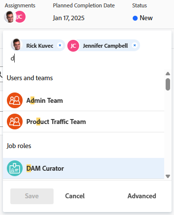
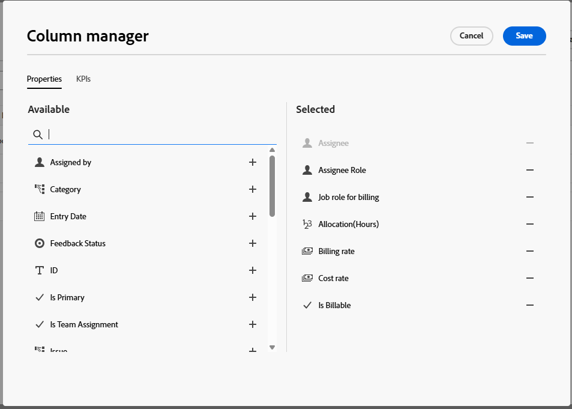

# Créer des affectations avancées

{{highlighted-preview}}

<!-- Audited: 11/2025-->

<!--remove the bullet indicated when we get rid of the new/old experience of editing tasks-->

<!--

 

The highlighted information on this page refers to functionality not yet generally available. It is available only in the Preview environment for all customers. The same features will also be available in the Production environment for all customers starting with  a week from the Preview release.      

For more information, see [Interface modernization](/help/quicksilver/product-announcements/product-releases/interface-modernization/interface-modernization.md).  

-->

Vous pouvez gérer les affectations de tâches ou d&#39;événements à l&#39;aide d&#39;affectations avancées.

Vous pouvez ajuster les informations d’affectation suivantes lors d’affectations avancées :

* Affectez des utilisateurs et utilisatrices à la tâche ou au problème (cette opération peut être réalisée en dehors d’une affectation avancée).
* Ajustez et redistribuez le nombre d’heures affecté à chaque personne cessionnaire.
* Déterminez quelle personne doit être la propriétaire ou la cessionnaire principale de la tâche ou du problème.
* Spécifiez le rôle de chaque personne lorsqu’elle travaille sur la tâche ou le problème.
* Ajouter des informations de facturation et de taux de coûts au niveau de l&#39;affectation.
* Examinez les détails suivants pour chaque affectation : heures prévues, coût total et revenu total.

>[!NOTE]
>
>Lors de l’affectation d’utilisateurs et utilisatrices au travail, leur disponibilité en fonction de leurs plannings affecte les Dates prévues et prévisionnelles des tâches et des problèmes. Pour plus d’informations sur les plannings, voir [Créer un planning](../../../administration-and-setup/set-up-workfront/configure-timesheets-schedules/create-schedules.md).

## Zones d’Adobe Workfront où vous pouvez effectuer des affectations avancées.

Cet article décrit comment accéder à des affectations avancées dans l’en-tête de la tâche ou de l’événement.

En outre, vous pouvez effectuer des affectations avancées dans les zones suivantes de Workfront :

* Dans les listes et les rapports lorsque le champ Affectations s’affiche dans la vue.
* Dans la section Affectations lors de la modification d’une tâche. Pour plus d&#39;informations, voir [Modifier les tâches](../../../manage-work/tasks/manage-tasks/edit-tasks.md). <!--When we remove the old/ new experience: take this bullet out completely; in the new Edit Task experience, this is no longer possible-->
* Dans l’en-tête de la tâche ou du problème, dans la zone Affectations.
* Dans l’équilibreur de charge de travail. Pour plus d’informations, voir [Attribuer manuellement du travail à l’aide de l’équilibreur de charge de travail](../../../resource-mgmt/workload-balancer/assign-work-in-workload-balancer-manually.md).

## Conditions d’accès

+++ Développez pour afficher les exigences d’accès aux fonctionnalités de cet article.

<table style="table-layout:auto"> 
 <col> 
 <col> 
 <tbody> 
  <tr> 
   <td>Package Adobe Workfront</td> 
   <td> 
Pour ajouter des taux de facturation et de coûts sur les affectations de tâche et utiliser la recherche avancée : Workflow Ultimate
 
Pour créer des affectations avancées : tout Workfront ou package de workflow
</td> 
  </tr> 
  <tr> 
   <td>Licence Adobe Workfront</td> 
   <td> 
Standard

   
Travail ou supérieur

   </td> 
  </tr> 
  <tr> 
   <td role>Configurations des niveaux d’accès</td> 
   <td> 
Accès en modification aux tâches et aux problèmes
  </td> 
  </tr> 
  <tr> 
   <td>Autorisations d’objet</td> 
   <td> 
Autorisations de niveau Contributeur ou supérieur pour la tâche ou l’événement
</td> 
  </tr> 
 </tbody> 
</table>

Pour plus d’informations, voir [Conditions d’accès requises dans la documentation Workfront](/help/quicksilver/administration-and-setup/add-users/access-levels-and-object-permissions/access-level-requirements-in-documentation.md).

+++

## Créer des affectations avancées - Package Ultimate de workflow

Cette disposition des affectations avancées s&#39;applique uniquement aux tâches. Pour tout problème, voir [Créer des affectations avancées - tous les autres packages](#create-advanced-assignments--all-other-packages).

1. Accédez au projet auquel vous souhaitez affecter une tâche.
1. Cliquez sur **Tâches** ou **Événements** dans le panneau de gauche, puis cliquez sur le nom d’une tâche dans la liste.

   >[!TIP]
   >
   >Vous pouvez effectuer des affectations avancées directement dans la liste des tâches. Cliquez dans le champ **Affectations** sur la même ligne que la tâche, puis cliquez sur **Avancé** au bas de la liste, ou sur l&#39;icône **Personnes** dans le coin supérieur droit de la zone Affectations, pour ouvrir la fenêtre Affectations avancées. Passez à l’étape 5 pour continuer à créer des affectations avancées.
   >

1. Cliquez sur **Affecter à** dans le champ **Affectations** dans l’en-tête de la tâche.

   Ou

   Cliquez sur l’un des noms affectés si la tâche est déjà affectée.

1. Cliquez sur **Avancé**.

   

   La fenêtre Affectations avancées s&#39;affiche.

   

1. Passez en revue les informations de durée de la tâche selon les besoins. Ces champs sont tous en lecture seule à partir des affectations avancées et vous pouvez les mettre à jour dans la tâche.

   Pour plus d&#39;informations sur la durée de la tâche, les types de durée, les unités de temps et les heures prévues, voir [Présentation de la durée de la tâche et du type de durée](/help/quicksilver/manage-work/tasks/taskdurtn/task-duration-and-duration-type.md).

   >[!NOTE]
   >
   >Si une colonne de données que vous souhaitez afficher ne s’affiche pas, vous pouvez l’ajouter. Voir [Ajouter et supprimer des colonnes dans la liste des affectations avancées](#add-and-remove-columns-on-the-advanced-assignments-list) ci-dessous.

1. (Facultatif) Sélectionnez **Heures**, **équivalent temps complet** ou **Pourcentage** pour afficher les allocations.

   Vous pouvez voir le nombre d’heures prévues affectées à un utilisateur, sous la forme d’un pourcentage de sa capacité, ou en équivalent temps complet (équivalent temps plein, échelle 0-1). Le paramètre par défaut est Heures.

   Pour plus d’informations sur l’équivalent temps complet, voir [Configurer les préférences de gestion des ressources](/help/quicksilver/administration-and-setup/set-up-workfront/configure-system-defaults/configure-resource-mgmt-preferences.md).

1. Cliquez sur **Nouvelle ligne** pour ajouter une affectation à la tâche.

1. Cliquez dans la colonne **Personne désignée** pour ajouter un utilisateur ou une équipe. Commencez à saisir le nom de l’utilisateur ou de l’équipe, puis cliquez sur le nom lorsqu’il apparaît dans la liste déroulante.

   >[!NOTE]
   >
   >Si le nom contient un caractère spécial, vous devez l’inclure dans le champ de recherche.

   Lorsque vous ajoutez un utilisateur qui possède une fonction principale, le **Rôle de personne désignée** est renseigné.

   Si des attributs sont affectés à l’utilisateur ou à l’utilisatrice dans son profil, ils sont renseignés lors de l’affectation de la tâche.

1. Pour ajouter une fonction lorsque vous ne connaissez pas l’utilisateur qui travaillera sur la tâche, cliquez dans la colonne **Rôle du destinataire**. Commencez à saisir le nom de la fonction, puis cliquez sur le nom lorsqu’il apparaît dans la liste déroulante.

   >[!NOTE]
   >
   >Si le nom contient un caractère spécial, vous devez l’inclure dans le champ de recherche.

   Si des attributs sont affectés à la fonction à partir de la carte tarifaire d’un projet, les attributs sont renseignés lors de l’affectation de la tâche.

   Lorsque vous affectez ultérieurement un utilisateur à l’aide du champ Personne désignée , la recherche de base suit cet algorithme :

   * Correspondance complète : fonction et tous les attributs
   * Correspondance partielle : fonction et certains attributs
   * Correspondance de fonction uniquement

   Pour plus d’informations sur la recherche avancée, voir [Utiliser la recherche avancée](#use-the-advanced-search) dans cet article.

1. (Facultatif) Continuez à ajouter des personnes désignées dans de nouvelles lignes pour ajouter plusieurs ressources à la tâche.

   >[!TIP]
   >
   >* Vous pouvez affecter plusieurs utilisateurs et utilisatrices, fonctions ou équipes. Vous ne pouvez affecter que des utilisateurs actifs, des fonctions et des équipes. Un maximum de 200 personnes désignées par tâche est autorisé.
   >
   >
   >* Lors de l’ajout d’une affectation d’utilisateur ou d’utilisatrice, notez l’avatar, le rôle principal de l’utilisateur ou de l’utilisatrice ou son adresse e-mail, pour faire la distinction entre les utilisateurs et utilisatrices portant le même nom.
   >Les utilisateurs et utilisatrices doivent être associés à au moins une fonction pour l’afficher à mesure que vous les ajoutez.
   >Pour que les utilisateurs et utilisatrices puissent afficher les e-mails de leurs utilisateurs et utilisatrices, le paramètre Afficher les coordonnées doit être activé dans votre niveau d’accès. Pour plus d’informations, voir [Accorder l’accès aux utilisateurs et aux utilisatrices](../../../administration-and-setup/add-users/configure-and-grant-access/grant-access-other-users.md).
   >
   >
   >* Si une personne, une fonction ou une équipe a été affectée avant d’être désactivée, elle reste affectée à l’élément de travail. Dans ce cas, nous vous recommandons ce qui suit :
   >   
   >   * Réaffectez la tâche aux ressources actives.
   >   * Associez les utilisateurs et utilisatrices d’une équipe désactivée à une équipe active et réaffectez l’élément de travail à l’équipe active.

1. Pour marquer une personne désignée comme propriétaire de la tâche, activez la case à cocher de la ligne, puis cliquez sur **Définir comme principale** dans la barre d&#39;actions située au bas de la fenêtre Affectations avancées.

   Par défaut, Workfront marque le premier utilisateur ou la première fonction que vous affectez à une tâche comme propriétaire ou affectation de Principal. Une équipe ne peut pas être désignée comme Propriétaire du Principal d&#39;une tâche.

   Si le Propriétaire du Principal de la tâche n’est pas affiché, vous pouvez ajouter la colonne **Est un Principal** au tableau.

   >[!IMPORTANT]
   >
   >Selon la manière dont votre équipe d’administration Workfront ou votre administrateur ou administratrice de groupes configure les préférences de votre projet, Workfront peut utiliser le planning de la personne propriétaire de la tâche pour calculer la chronologie de la tâche lorsque plusieurs utilisateurs et utilisatrices sont affectés à la tâche. Pour plus d’informations sur les personnes désignées à plusieurs tâches, consultez la section [Considérations relatives aux affectations multiples à des fonctions, des équipes et des utilisateurs](/help/quicksilver/manage-work/tasks/assign-tasks/assign-tasks.md#considerations-for-multiple-assignments-to-job-roles-teams-and-users) de l’article [Affecter des tâches](../../../manage-work/tasks/assign-tasks/assign-tasks.md).

1. Pour chaque utilisateur ou utilisatrice de la colonne **Personne cessionnaire**, indiquez les informations suivantes :

   * (Facultatif) **Fonction pour la facturation** : recherchez et sélectionnez la fonction pour la facturation de cette personne désignée et de cette tâche spécifiques.

     La fonction de facturation n’est utilisée que pour cette affectation et n’est pas automatiquement appliquée aux autres affectations de l’utilisateur. Par exemple, la fonction principale d’un utilisateur ou d’une utilisatrice est Designer, mais pour une tâche, il ou elle agit en tant que cadre Designer et le taux de facturation doit refléter cela. La fonction pour la facturation s’applique uniquement aux utilisateurs et ne peut pas être utilisée sur d’autres fonctions.

     Lorsqu’une fonction pour la facturation est appliquée à l’affectation de l’utilisateur, le taux associé à la fonction pour la facturation peut être utilisé à la place des taux de l’utilisateur ou de la fonction dans les calculs de facturation et de revenus.

     Une fonction au niveau du projet pour la facturation peut également être définie pour un utilisateur ou une utilisatrice, et cette valeur est utilisée dans toutes les affectations de l’utilisateur ou de l’utilisatrice pour ce projet.

     Pour plus d&#39;informations, voir [Configurer une fonction pour la facturation](/help/quicksilver/manage-work/projects/project-finances/set-up-job-role-for-billing.md).

   * **Affectation** : lorsque le type de durée d’une tâche est Simple, spécifiez le nombre d’heures auxquelles chaque utilisateur ou fonction doit être affecté à la tâche. La somme de toutes les heures affectées pour chaque utilisateur est égale au nombre dans le champ **Heures prévues** en haut de la fenêtre Affectations avancées. Dans tous les autres cas, indiquez le pourcentage de temps (ou d’affectation) que la personne désignée doit consacrer à la résolution de la tâche.

     >[!TIP]
     >
     >Après avoir modifié manuellement les allocations d’affectation sur les tâches, le nombre d’heures prévues des tâches peut se mettre à jour. Notez que vous ne pouvez pas modifier manuellement les allocations des équipes affectées à des tâches. Pour plus d’informations, voir la section [Mettre à jour le nombre d’heures prévues de la tâche lors de la gestion des allocations pour les utilisateurs et utilisatrice](/help/quicksilver/manage-work/tasks/task-information/planned-hours.md#update-task-planned-hours-when-managing-user-allocations) dans l’article [Vue d’ensemble du nombre d’heures prévues](/help/quicksilver/manage-work/tasks/task-information/planned-hours.md).

   * **Attributs** : tous les attributs disponibles pour l’utilisateur sont affichés dans les champs d’attribut. L’administrateur configure les attributs qui sont ajoutés au profil utilisateur ou associés à une fonction dans une carte tarifaire. Pour plus d’informations, voir [Définir des attributs de taux](/help/quicksilver/administration-and-setup/manage-enterprise-operations/define-rate-attributes.md) et [Modifier le profil d’un utilisateur](/help/quicksilver/administration-and-setup/add-users/create-and-manage-users/edit-a-users-profile.md).

     Les attributs sont actuellement en lecture seule sur les affectations d’utilisateurs. Ils sont modifiables pour les fonctions.

   * **Devise du taux** : La devise des taux de facturation et de coût est celle par défaut du projet, mais vous pouvez modifier la devise de cette affectation.

   * (Facultatif) **Taux de facturation** : le taux de facturation peut provenir d’autres zones du système, telles que les cartes tarifaires. Pour plus d&#39;informations, voir [Généralités sur la hiérarchie des revenus et des coûts](/help/quicksilver/manage-work/projects/project-finances/overview-revenue-cost-hierarchy.md). Vous pouvez remplacer manuellement le taux de facturation pour cette affectation spécifique dans ce champ, et il remplacera tous les autres taux pour l&#39;utilisateur dans les calculs de revenus.
   * (Facultatif) **Taux de coûts** : le taux de coûts peut provenir d’autres zones du système. Pour plus d&#39;informations, voir [Généralités sur la hiérarchie des revenus et des coûts](/help/quicksilver/manage-work/projects/project-finances/overview-revenue-cost-hierarchy.md). Vous pouvez remplacer manuellement le taux de coût pour cette affectation spécifique dans ce champ, et il remplacera tous les autres taux pour l&#39;utilisateur dans les calculs de coût.
   * **Est facturable** : sélectionnez cette option pour inclure l&#39;affectation dans les calculs financiers. Désélectionnez cette option pour exclure l&#39;affectation des calculs financiers.

     Ce champ est activé par défaut pour toutes les affectations lorsque la tâche a un type de revenu.

1. (Facultatif) Pour afficher les données d&#39;affectation par date pour un utilisateur ou un rôle, sélectionnez la ligne du tableau et cliquez sur **Afficher par dates** dans la barre d&#39;actions située au bas de la fenêtre Affectations avancées. Pour plus d’informations, voir [Afficher les données d’affectation par dates](#view-assignment-data-by-dates) dans cet article.
1. (Facultatif) Pour supprimer une ou plusieurs affectations de la liste, activez la case à cocher de chaque ligne, puis cliquez sur **Supprimer** dans la barre d&#39;actions située au bas de la fenêtre Affectations avancées.
1. Cliquez sur **Enregistrer** ou **Enregistrer et fermer** lorsque vous avez terminé de modifier les affectations avancées.

### Ajouter et supprimer des colonnes dans la liste des affectations avancées

Des champs doivent exister avant de pouvoir les ajouter à la liste.

1. Cliquez sur **+** en haut à droite de la liste pour ouvrir le **Gestionnaire de colonnes**.

   

1. Sélectionnez l’onglet **Propriétés** ou l’onglet **KPI** pour choisir le type de champ à ajouter.

   Les propriétés telles que l’emplacement ou le centre de coûts fournissent des informations contextuelles. Indicateurs de performance clés temporels tels que les valeurs de répartition du chiffre d’affaires ou des coûts sur plusieurs périodes.

1. Recherchez un champ d’objet existant dans la section **Disponible**, puis cliquez sur **+** à droite du nom du champ pour l’ajouter à la colonne **Sélectionné**.
1. Cliquez sur **-** à droite d’un champ dans la section **Sélectionné** pour le supprimer de la liste.
1. Cliquez sur **Enregistrer**.

   Pour plus d’informations sur le gestionnaire de colonnes, voir [Utilisation de listes améliorées](/help/quicksilver/workfront-basics/navigate-workfront/use-lists/enhanced-lists.md).

### Appliquer une vue à la liste des affectations avancées

Une vue est un ensemble personnalisé de dispositions de colonnes que vous pouvez appliquer à la liste.

1. Cliquez sur la liste déroulante **Vues** et sélectionnez la vue à appliquer à la liste.

   **Vues système** sont des vues ajoutées par l&#39;administrateur système et ne peuvent pas être modifiées. **Mes vues** sont des vues que vous avez créées ou qui ont été partagées avec vous.

1. Cliquez sur **Nouvelle vue** dans le menu déroulant **Vues** pour créer une vue.

   Lorsque vous ajoutez, supprimez ou réorganisez les colonnes, les modifications sont automatiquement enregistrées dans la vue. La prochaine fois que vous appliquerez cette vue, les colonnes resteront telles que vous les avez définies.

   Pour plus d&#39;informations sur les vues, voir [Utiliser des listes améliorées](/help/quicksilver/workfront-basics/navigate-workfront/use-lists/enhanced-lists.md).

### Utiliser la recherche avancée

La recherche avancée vous permet de localiser l’utilisateur ou la fonction approprié(e) à ajouter à l’affectation.

1. Pour ouvrir la fenêtre de recherche avancée, effectuez l’une des opérations suivantes :

   * Cliquez sur **Recherche avancée** en haut à droite de la fenêtre Affectations avancées.
   * Sélectionnez une ligne d&#39;affectation et cliquez sur **Recherche avancée** dans la barre d&#39;actions située en bas de la fenêtre Affectations avancées. La recherche avancée s’ouvre, et des filtres sont automatiquement appliqués pour cette affectation spécifique.

1. Sélectionnez l’onglet Utilisateurs ou Fonctions dans la fenêtre de recherche avancée.
1. Appliquez des filtres selon vos besoins :

   1. Cliquez sur **Filtrer** au-dessus de la liste.
   1. Dans la zone Filtre, cliquez sur **Ajouter une condition**.
   1. Sélectionnez un champ en fonction duquel effectuer le filtrage.
   1. Sélectionnez un modificateur de filtre, tel que « A l’un des », « N’a aucun des », « Est avant » ou « Est après ». Les options des modificateurs sont différentes selon le type de champ en fonction duquel vous effectuez le filtrage.
   1. Sélectionnez la ou les valeurs du champ. Selon le type de champ en fonction duquel vous effectuez le filtrage, vous pouvez être invité à sélectionner l’élément dans une liste, à le rechercher ou à utiliser un calendrier pour sélectionner une période.

   Le filtre est automatiquement appliqué à la liste. Pour plus d’informations sur les filtres, voir [Utiliser des listes améliorées](/help/quicksilver/workfront-basics/navigate-workfront/use-lists/enhanced-lists.md).

1. Rechercher une fonction ou un utilisateur.

   Lors de la recherche d’un utilisateur correspondant à une affectation de fonction, seules les correspondances complètes (fonction et tous les attributs) s’affichent.

1. Cliquez sur **+** pour ajouter des colonnes au tableau. Pour plus d&#39;informations, voir [Ajouter et supprimer des colonnes dans la liste Affectations avancées](#add-and-remove-columns-on-the-advanced-assignments-list).
1. Sélectionnez un ou plusieurs utilisateurs ou fonctions, puis cliquez sur **Ajouter des utilisateurs** ou **Ajouter des rôles** dans la barre d’actions située au bas de la fenêtre.

   Les affectations sont ajoutées dans la fenêtre Affectations avancées.

### Afficher les données d’affectation par dates

La fenêtre **Afficher par dates** pour les affectations avancées affiche l&#39;historique complet de l&#39;affectation en fonction de la date de validité pour un utilisateur ou un rôle spécifique. Les modifications passées et futures s’affichent.

Voici quelques exemples d&#39;éléments valides qui peuvent affecter l&#39;historique des affectations :

* Principal de l’utilisateur/autres fonctions
* Fonction au niveau du projet pour la facturation
* Taux de facturation/coûts du profil utilisateur
* Taux de facturation/coûts de remplacement du projet (utilisateur ou fonction)
* Taux des cartes tarifaires par fonction/attribut
* Attributs d&#39;utilisateur
* Planning des utilisateurs

Notez qu’il ne s’agit pas d’une liste complète et que le champ modifié n’est pas nécessairement affiché dans la table des données d’affectation, mais il affecte les taux ou attributs de facturation et de coût pour l’utilisateur ou la fonction.

Vous pouvez uniquement afficher les données d’affectation par dates pour un seul utilisateur ou rôle.

1. Sélectionnez la ligne du tableau pour un utilisateur ou un rôle, puis cliquez sur **Afficher par dates** dans la barre d&#39;actions située en bas de la fenêtre Affectations avancées.

   La fenêtre **Afficher par dates** s’affiche. Les données sont en lecture seule.

   Chaque ligne du tableau représente une modification de l’affectation ayant une date d’entrée en vigueur. Si aucune modification de date effective n&#39;a eu lieu, le tableau comporte une ligne indiquant les données actives. Les champs en surbrillance indiquent ce qui a changé et les dates de début et de fin de chaque mise à jour sont répertoriées. Par exemple, si le taux de facturation a changé de 202 le 20 août à 205 le 21 août, le taux est mis en surbrillance. Le texte entre parenthèses indique l’endroit où la modification a été apportée au taux, par exemple un projet.

   

   Une fois que vous avez terminé de vérifier les données, cliquez sur la flèche en haut à gauche pour revenir à la fenêtre Affectations avancées.

## Créer des affectations avancées - tous les autres packages

Cette disposition des affectations avancées s&#39;applique à la fois aux tâches et aux événements.

1. Accédez au projet auquel vous souhaitez attribuer une tâche ou un problème.
1. Cliquez sur **Tâches** ou **Problèmes** dans le panneau de gauche, puis sur le nom d’une tâche ou d’un problème dans la liste.

   >[!TIP]
   >
   >Vous pouvez effectuer des affectations avancées directement dans la liste des tâches ou des événements. Cliquez dans le champ **Affectations** sur la même ligne que la tâche ou l&#39;événement, puis cliquez sur **Avancé** au bas de la liste ou sur l&#39;icône **Personnes** dans le coin supérieur droit de la zone Affectations, pour ouvrir la fenêtre Affectations avancées. Passez à l’étape 5 pour continuer à créer des affectations avancées.
   >

1. Cliquez sur **Affecter à** dans le champ **Affectations** dans l’en-tête de la tâche ou du problème.

   Ou

   Cliquez sur l&#39;un des noms affectés si la tâche ou l&#39;événement est déjà affecté.

1. Cliquez sur **Avancé**.

   

1. Dans le champ **Rechercher des personnes, des rôles et des équipes**, commencez à saisir le nom d’un utilisateur, d’un rôle ou d’une équipe, puis cliquez sur le nom lorsqu’il apparaît dans la liste déroulante.

   >[!NOTE]
   >
   >Si le nom de l’utilisateur ou utilisatrice contient un caractère spécial, vous devez l’inclure dans le champ de recherche.

1. (Facultatif) Continuez à ajouter des personnes désignées dans la zone **Rechercher des personnes, des rôles et des équipes** pour ajouter plusieurs ressources à la tâche ou à l’événement.

   >[!TIP]
   >
   >* Vous pouvez affecter plusieurs utilisateurs et utilisatrices, fonctions ou équipes. Vous pouvez affecter uniquement les utilisateurs et utilisatrices, fonctions et équipes actifs.
   >
   >
   >* Lors de l’ajout d’une affectation d’utilisateur ou d’utilisatrice, notez l’avatar, le rôle principal de l’utilisateur ou de l’utilisatrice ou son adresse e-mail, pour faire la distinction entre les utilisateurs et utilisatrices portant le même nom.
   >Les utilisateurs et utilisatrices doivent être associés à au moins une fonction pour l’afficher à mesure que vous les ajoutez.
   >Pour que les utilisateurs et utilisatrices puissent afficher les e-mails de leurs utilisateurs et utilisatrices, le paramètre Afficher les coordonnées doit être activé dans votre niveau d’accès. Pour plus d’informations, voir [Accorder l’accès aux utilisateurs et aux utilisatrices](../../../administration-and-setup/add-users/configure-and-grant-access/grant-access-other-users.md).
   >
   >
   >* Si une personne, une fonction ou une équipe a été affectée avant d’être désactivée, elle reste affectée à l’élément de travail. Dans ce cas, nous vous recommandons ce qui suit :
   >   
   >   * Réaffectez la tâche aux ressources actives.
   >   * Associez les utilisateurs et utilisatrices d’une équipe désactivée à une équipe active et réaffectez l’élément de travail à l’équipe active.

1. Pour chaque utilisateur ou utilisatrice de la colonne **Personne cessionnaire**, indiquez les informations suivantes :

   * **Personne propriétaire** : passez la souris sur le nom de la personne cessionnaire et cliquez sur **Principal** dans le champ Personne propriétaire si vous souhaitez marquer la personne cessionnaire comme propriétaire de la tâche ou du problème. Une case à cocher verte indique que la personne en question est le Contact principal de la tâche ou du problème. Adobe Workfront marque la première personne ou fonction que vous affectez à une tâche ou à un problème comme propriétaire ou affectation principale. Une équipe ne peut pas être désignée comme propriétaire principal d’une tâche ou d’un problème.

     >[!IMPORTANT]
     >
     >Selon la manière dont votre équipe d’administration Workfront ou votre administrateur ou administratrice de groupes configure les préférences de votre projet, Workfront peut utiliser le planning de la personne propriétaire de la tâche pour calculer la chronologie de la tâche lorsque plusieurs utilisateurs et utilisatrices sont affectés à la tâche. Pour plus d’informations sur les personnes désignées à plusieurs tâches, consultez la section [Considérations relatives aux affectations multiples à des fonctions, des équipes et des utilisateurs](/help/quicksilver/manage-work/tasks/assign-tasks/assign-tasks.md#considerations-for-multiple-assignments-to-job-roles-teams-and-users) de l’article [Affecter des tâches](../../../manage-work/tasks/assign-tasks/assign-tasks.md).

   * **Allocations** : lorsque le type de durée d’une tâche est Simple, indiquez le nombre d’heures auxquelles chaque utilisateur ou utilisatrice ou fonction doit être affecté à la tâche. La somme de toutes les heures affectées de chaque utilisateur ou utilisatrice est égale au nombre indiqué dans le champ **Nombre d’heures prévues** au bas de la colonne Allocations. Dans tous les autres cas, indiquez le pourcentage de temps (ou d’affectation) que la personne désignée doit consacrer à la résolution de la tâche ou du problème.

     >[!TIP]
     >   
     >   * Après avoir modifié manuellement les allocations d’affectation sur les tâches, le nombre d’heures prévues des tâches peut se mettre à jour. Pour plus d’informations, voir la section [Mettre à jour le nombre d’heures prévues de la tâche lors de la gestion des allocations pour les utilisateurs et utilisatrice](/help/quicksilver/manage-work/tasks/task-information/planned-hours.md#update-task-planned-hours-when-managing-user-allocations) dans l’article [Vue d’ensemble du nombre d’heures prévues](/help/quicksilver/manage-work/tasks/task-information/planned-hours.md).
     >   * Vous ne pouvez pas modifier manuellement les allocations d’affectation sur les problèmes.
     >   * Vous ne pouvez pas modifier manuellement les affectations des équipes affectées à des tâches.

   * **Rôle du ou de la cessionnaire :** sélectionnez le rôle que l’utilisateur ou utilisatrice doit utiliser pour cette affectation.  Le rôle principal de l’utilisateur ou utilisatrice s’affiche par défaut. Cliquez dans la zone **Rôle du cessionnaire** pour sélectionner un autre rôle. Lorsque vous affectez d’abord la tâche ou le problème à un rôle, puis que vous ajoutez un utilisateur ou une utilisatrice qui peut assumer ce rôle comme seconde affectation, la liste des utilisateurs et utilisatrices suggérés est filtrée pour afficher ceux qui peuvent assumer les rôles déjà affectés à la tâche et au problème.

     

   * **Type de durée** : cette option n’est disponible que pour les tâches. Cliquez sur le nom du type de durée et sélectionnez un type de durée dans le menu déroulant. Pour plus d’informations sur les types de durée, voir [Vue d’ensemble de la durée et du type de durée des tâches](../../../manage-work/tasks/taskdurtn/task-duration-and-duration-type.md).

   * **Durée :** vous pouvez mettre à jour ce champ pour une tâche si vous disposez des autorisations de gestion de la tâche.

     Pour plus d’informations, voir [Vue d’ensemble de la durée et du type de durée des tâches](../../../manage-work/tasks/taskdurtn/task-duration-and-duration-type.md). Lors de la modification en masse d’informations d’affectation, une boîte de dialogue similaire s’affiche pour affecter des utilisateurs et utilisatrices, des heures, une affectation et le propriétaire de la tâche.

   * **Nombre d’heures prévues** : lorsque le type de durée est Calcul d’affectation ou Simple, mettez à jour le nombre d’heures prévues. Ensuite, les pourcentages d’affectation ou les heures de chaque ressource sont répartis uniformément. Workfront calcule le nombre d’heures prévues lorsque le type de durée est Calcul de travail ou Piloté par l’effort. Pour plus d’informations, voir [Vue d’ensemble de la durée et du type de durée des tâches](../../../manage-work/tasks/taskdurtn/task-duration-and-duration-type.md).

1. Cliquer sur **Enregistrer**.

