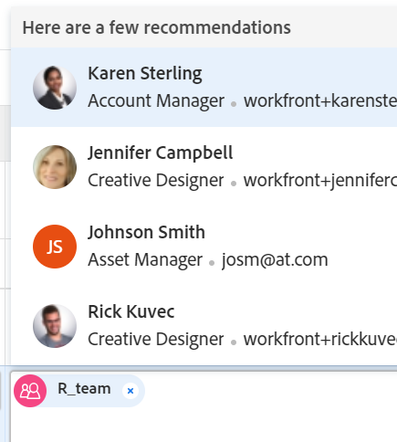

# Vue d’ensemble des affectations intelligentes

<!--Audited: 07/2024-->

Lors de la gestion des affectations de tâches et d&#39;événements, vous pouvez utiliser les affectations intelligentes pour identifier la meilleure ressource pour effectuer le travail.

Les affectations intelligentes sont des suggestions qu’Adobe Workfront vous présente lorsque vous affectez des éléments de travail à des ressources en fonction d’un algorithme qui détermine la ressource la plus appropriée pour le traitement. Les affectations intelligentes peuvent être des utilisateurs et des utilisatrices, des fonctions ou des équipes.

>[!NOTE]
>
>Lors de la suggestion de personnes, les affectations intelligentes ne prennent pas en compte la disponibilité des personnes. Toutefois, leur disponibilité en fonction de leurs plannings affecte les dates prévues et prévisionnelles des tâches et des problèmes lorsqu’elles sont affectées. Pour plus d’informations sur les plannings, voir l’article [Créer un planning](../../../administration-and-setup/set-up-workfront/configure-timesheets-schedules/create-schedules.md).

Cet article contient des informations générales sur les affectations intelligentes. Pour plus d’informations sur l’utilisation d’affectations intelligentes afin d’affecter des tâches et des problèmes aux utilisateurs et utilisatrices, voir [Créer des affectations intelligentes](../../../manage-work/tasks/assign-tasks/make-smart-assignments.md).

## Vue d’ensemble des affectations intelligentes

Tenez compte des points suivants lorsque vous utilisez des affectations intelligentes :

<!--* The algorithm works independently for tasks and issues. This means that the list of suggested users for issues might differ from the list of suggested users for a task because Workfront builds the lists according to criteria pertaining to issues and tasks separately. -->
<!--not sure this is accurate: * Smart assignments do not recommend job roles or teams. Instead, they are suggestions of users who are best fit to complete a task or an issue. -->
* Les affectations suggérées sont toujours des utilisateurs actifs, des fonctions ou des équipes.
* La ressource répertoriée en premier doit correspondre le mieux à la tâche.

## Localiser des suggestions d’affectation intelligente

Vous pouvez afficher des affectations intelligentes dans les zones suivantes où vous pouvez affecter des tâches ou des problèmes :

* Liste de problèmes ou rapport dans la colonne Affectations

  

* Une liste de tâches ou un rapport dans la colonne Affectations

  

* En-tête de tâche dans le champ Affectations

  

* En-tête de problème dans le champ Affectations

  

* Panneau Résumé de la tâche ou du problème dans la zone Affectations

  

<!--* The Assignments field in the New Task box, when adding a task to a project

  -->

<!--this is not possible in the new home  - we have Summary there: 
* The Assignments field for an item listed in the Home area, when you open a task or issue

  
-->

* Équilibreur de charge de travail dans la zone A affecté ce(tte) lors de l’affectation d’une tâche ou d’un problème

  

## Critères d’affectation intelligente

<!--Smart assignments work differently for tasks than for issues.  -->

<!--### Smart assignments criteria for tasks

The task smart assignments calculation works in two phases which use two different algorithms.

Depending on which algorithm finds the smart assignment, the assignments are listed under two separate sections in the Assignments field. For information, see [Make smart assignments](/help/quicksilver/manage-work/tasks/assign-tasks/make-smart-assignments.md). 

#### First phase of smart assignment calculation for tasks 

In the first phase of calculating smart assignments, Workfront calculates a similarity score for every assignment. 

>[!NOTE]
>
>The first phase of the smart assignments calculation does not apply to the following task areas:
>
>* Bulk Assignments in the Workload Balancer.
>* Connected cards on boards.

The calculation for the similarity score and the order in which the assignments are listed take into account the following:  

* A score of 100% is given to an existing assignment where the task, project, and portfolio names are identical to the task you're trying to assign. The project and portfolio names of the task of an existing assignment must also match the project and portfolio of the task you are trying to assign.   

* If only some of this information from other assignments matches on the existing tasks, the score might be lower than 100%.  

  For example, if you are assigning a task called "My second task" on a project called "My project" in a portfolio called "My portfolio" and you have an existing task called "My task" in another project called "My project" in a portfolio called "My portfolio", the user assigned to "My task" might get a score of 95% because the name of the existing task and the task you're trying to assign now are similar, but not identical.  
 
    >[!TIP]
    >
    >  Workfront looks for matches only in the Name fields of tasks, projects, and portfolios and not in any other fields. 

* An assignment could get a higher score when they are assigned to a lot of tasks in the system that have similar names. For example, if a team called "Development" is assigned to 50% of the tasks in the system containing "AI" in the name and you are now assigning another task with "AI" in the name, the score of the "Development" team is higher. In this case, the names of  projects and portfolios are not as important.  

* Taking into account this scoring system, the first 7 suggestions are listed as smart assignments, in the descending order of their scores. Assignments with scores lower than 40% do not display.  

* If several assignments have identical scores, they display in order of the date on which the assignments were made, starting from the most recent date.  

  For example, if Rick was assigned to a similar task earlier today and Jennifer was assigned to a similar task two days ago, Rick displays first.  

* Assignments identified in this phase are listed in the    **Suggested assignments**  section of the Assignments field for tasks. 

* If there are no matches using this calculation, the second phase of smart assignments starts which is calculated using a different algorithm.  

#### Second phase of smart assignment calculation for tasks-->

<!--If the first step of task smart assignments has found no matches,-->

Workfront calcule les affectations intelligentes pour les tâches de la même manière qu’il les calcule pour les problèmes.

<!--For more information, see the section [Smart assignments criteria for tasks and issues](#smart-assignments-criteria-for-tasks-and-issues) in this article. -->

Les affectations identifiées sont répertoriées dans les sections **Utilisateurs et équipes** et **Fonctions**<!--, and **Rate card roles**--> du champ Affectations. <!--For more information on rate cards, see [Manage rate cards](/help/quicksilver/administration-and-setup/set-up-workfront/configure-system-defaults/manage-rate-cards.md). keep the rate cards roles in yellow after the release of assignments to Prod-->

<!--
### Smart assignments criteria for tasks and issues 

>[!NOTE]
>
>The following criteria applies for tasks only when the first phase of the task smart assignment calculation did not find any matches. For information, see the section [First phase of smart assignment calculation for tasks](#first-phase-of-smart-assignment-calculation-for-tasks) in this article. The following criteria always applies for issues, by default. -->

Les personnes sont recommandées dans la liste déroulante Affectations intelligentes en fonction d’une combinaison des critères suivants (répertoriés dans l’ordre du plus important au moins important) :

1. Personnes affectées à d’autres tâches au cours des 30 derniers jours par la personne effectuant l’affectation. Les 50 premières personnes qui correspondent à ce critère s’affichent. La personne qui est le plus souvent affectée s’affiche en premier.

2. Si l’élément de travail est affecté à une équipe ou à un rôle, la liste des personnes suggérées est davantage filtrée en tenant compte des affectations existantes ci-dessous. Dans ce cas, seules les personnes suivantes s’affichent dans la liste des suggestions :

   * Personnes dont l’équipe interne est l’équipe affectée à l’élément de travail.
   * Personnes dont le rôle principal est le rôle affecté à l’élément de travail.

>[!TIP]
>
>* Si aucun rôle ou équipe n’est affecté à la tâche ou au problème, Workfront affiche toutes les personnes affectées au cours des 30 derniers jours, jusqu’à 50 personnes.
>
>* Si vous n’avez effectué aucune affectation au cours des 30 derniers jours, seules les personnes appartenant à l’équipe affectée ou ayant le rôle affecté à l’élément de travail s’affichent dans la liste des affectations intelligentes.

<!--the commented out piece in the tip above was live before but I am not totally sure that smart assignments look at your team. I think they look JUST at the team/ role assigned to the work item; see this help site request for more info: https://experience.adobe.com/#/@adobeinternalworkfront/so:hub-Hub/workfront/issue/62fd222200037eb87572c5b6ad6bf53e/overview -->
<!--

<h3>Smart assignments criteria for the Production environment</h3>

(NOTE: drafted,this was the case BEFORE we updated the logic in the WB - with the 21.4 release)

Smart assignments display on tasks and issues when the following conditions are met:

<ul>
<li>The task or issue is subordinate to a parent task or issue that has a user, team, or job role currently assigned. </li>
</ul>

Smart assignments display the top twenty recommendations based on a proprietary algorithm that uses your own team information.

Users are recommended in the smart assignments drop-down list based on a combination of the following criteria (listed in order from most important to least important):

<ul>
<li>The user has the team assigned to the task or issue designated as their Home Team</li>
<li>The user is also assigned to the parent task</li>
<li>The user has the same primary job role as is currently assigned to the task or issue</li>
<li>The user has the team assigned to the parent task or issue designated as their Home Team</li>
<li>The user is associated with the same primary job role currently assigned to the parent task</li>
<li>The user is a member of the same team as the user who assigned the task or issue and the team is designated as their Home Team</li>
<li>The user is a member of the same Home Group as the user who is assigning the task or issue</li>
<li>The user has the same primary job role as the user who is assigning the task or issue.</li>
</ul>

-->

<!--

<h2>Make smart assignments</h2>

(NOTE: this was moved to its own article: make-smart-assignments.) 

Smart assignments are available in most locations where you can make assignments in Workfront.

You can use smart assignments on tasks and issues that have previously been assigned to a job role or a team.
 <note type="note">
You must have a Plan or a Work license and have at least Contribute permissions to a task or an issue to be able to make assignments to the task or the issue. You must have the Make Assignments option enabled in your permission level to make assignments.
</note>

To use smart assignments:

<ol>
<li value="1">Navigate to an issue or a task and click one of the following fields to edit them:  
<ul>
<li>
The <strong>Assignments</strong> field in the task or issue header
</li>
<li>The <strong>Assignments</strong> field of a task or issue list using in-line editing in a task or issue list. </li>
<li>The <strong>Assignee</strong> field after you have clicked <strong>Advanced</strong> from a task or an issue. </li>
</ul></li>
<li value="2"> 
Place your cursor in the assignment field, and wait for two seconds, then the <strong>Suggestions</strong> list is displayed.
 
Users displayed in this list are the smart assignment suggestions for the task or the issue. 
 
  
 </li>
<li value="3"> 
Select the user in the recommendations list by clicking their name. 
 
If there are no suggestions, the suggestion list does not open.
 </li>
<li value="4">(Optional) If you do not want to use one of the recommended users from the smart assignments list, start typing the name of the desired user and select the name when it appears in the list.</li>
<li value="5">Click <strong>Enter</strong> to make the assignment. </li>
</ol>

-->
