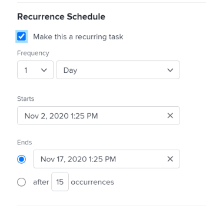

# Créer des tâches récurrentes

<!--Audited: 01/2024-->

Vous pouvez créer des tâches récurrentes pour les tâches que vous devez répéter dans le cadre d’un projet unique.

Pour des informations générales sur les tâches récurrentes, y compris l’impact de la modification d’une tâche récurrente existante, voir [Vue d’ensemble des tâches récurrentes](../../../manage-work/tasks/manage-tasks/recurring-tasks-overview.md).

## Conditions d’accès

+++ Développez pour afficher les exigences d’accès aux fonctionnalités de cet article.

<table style="table-layout:auto"> 
 <col> 
 <col> 
 <tbody> 
  <tr> 
   <td role="rowheader">Package Adobe Workfront</td> 
   <td> 
Tous
 </td> 
  </tr> 
  <tr> 
   <td role="rowheader">Licence Adobe Workfront</td> 
   <td> 
Standard
 
   
Travail ou supérieur
 </td> 
  </tr> 
  <tr> 
   <td role="rowheader">Configurations des niveaux d’accès</td> 
   <td> 
Modifier l’accès aux tâches et aux projets
 </td> 
  </tr> 
  <tr> 
   <td role="rowheader">Autorisations d’objet</td> 
   <td> 
Autorisations Contribuer pour le projet avec la capacité d’ajouter des tâches ou autorisations supérieures
 
   
Lorsque vous créez une tâche, vous recevez automatiquement des autorisations de gestion de la tâche.
 
    </td> 
  </tr> 
 </tbody> 
</table>

Pour plus d’informations, voir [Conditions d’accès dans la documentation Workfront](/help/quicksilver/administration-and-setup/add-users/access-levels-and-object-permissions/access-level-requirements-in-documentation.md).

+++

<!--Old:

<table style="table-layout:auto"> 
 <col> 
 <col> 
 <tbody> 
  <tr> 
   <td role="rowheader">Adobe Workfront plan*</td> 
   <td> 
Any
 </td> 
  </tr> 
  <tr> 
   <td role="rowheader">Adobe Workfront license*</td> 
   <td> 
New: Standard
 
   
Current: Work or higher
 </td> 
  </tr> 
  <tr> 
   <td role="rowheader">Access level configurations*</td> 
   <td> 
Edit access to Tasks and Projects
 </td> 
  </tr> 
  <tr> 
   <td role="rowheader">Object permissions</td> 
   <td> 
Contribute permissions to the project with ability to Add Tasks or higher
 
   
When you create a task you automatically receive Manage permissions to the task
 
   
 For information about task permissions, see <a href="../../../workfront-basics/grant-and-request-access-to-objects/share-a-task.md" class="MCXref xref">Share a task </a>.
  </td> 
  </tr> 
 </tbody> 
</table>

&#42;To find out what plan, license type, or access you have, contact your Workfront administrator. For more information about access requirements, see [Access requirements in Workfront documentation](/help/quicksilver/administration-and-setup/add-users/access-levels-and-object-permissions/access-level-requirements-in-documentation.md). -->

## Créer une tâche récurrente

>[!NOTE]
>
>Vous ne pouvez pas créer une tâche récurrente en modifiant une tâche existante. Vous devez créer une tâche à partir de zéro.

1. Accédez au projet dans lequel vous souhaitez créer une tâche récurrente, puis cliquez sur la section **Tâches** dans le panneau de gauche.
1. Cliquez sur **Nouvelle tâche**.

   La boîte de dialogue Nouvelle tâche s’affiche.

   

1. Cliquez sur **Plus d’options**, puis saisissez un nom pour la tâche dans le champ **Nom de la tâche**.
1. Poursuivez la mise à jour de la tâche de la même manière que si vous aviez ajouté une nouvelle tâche. Pour plus d’informations sur l’ajout d’une nouvelle tâche, voir [Créer des tâches dans un projet](../../../manage-work/tasks/create-tasks/create-tasks-in-project.md).

   >[!TIP]
   >
   >   La durée et les heures prévues indiquées pour une nouvelle tâche récurrente sont la durée et les heures prévues de chaque occurrence. La durée de la tâche parent est le temps écoulé entre la date de début prévue de la tâche la plus ancienne et la date d’achèvement prévue e de la tâche la plus récente. Les heures prévues de la tâche parent sont le total de toutes les heures prévues de toutes les occurrences.

1. Cliquez sur **Vue d’ensemble** dans le panneau de gauche.
1. Faites défiler la page jusqu’à la section **Planning de périodicité**, puis sélectionnez l’option **Transformer en tâche récurrente**.

   

1. Dans la liste déroulante **Fréquence**, sélectionnez le nombre d’unités de temps pendant lesquelles vous souhaitez que la tâche se déroule et le type d’unités de temps. Sélectionnez l’une des options suivantes :

   <table style="table-layout:auto"> 
    <col> 
    <col> 
    <thead> 
     <tr> 
      <th>Type de récurrence</th> 
      <th>Description</th> 
     </tr> 
    </thead> 
    <tbody> 
     <tr> 
      <td role="rowheader"><strong>Jour</strong> </td> 
      <td> 
La tâche se répète tous les jours, tous les 2 jours, tous les 3 jours, et ainsi de suite, en fonction du rythme que vous avez choisi. Vous pouvez configurer les tâches pour qu’elles se répètent jusqu’à tous les 6 jours. Le réglage par défaut est 1 jour. 
 </td> 
     </tr> 
     <tr> 
      <td role="rowheader"><strong>Jour ouvrable</strong> </td> 
      <td> 
 La tâche se répète tous les jours ouvrables, tous les 2 jours ouvrables, tous les 3 jours ouvrables, et ainsi de suite, en fonction du rythme que vous avez choisi. Vous pouvez configurer les tâches pour qu’elles se répètent jusqu’à tous les 6 jours ouvrables.
 
Cette option utilise le planning par défaut défini par l’administrateur ou l’administratrice système, comme décrit dans <a href="../../../administration-and-setup/set-up-workfront/configure-timesheets-schedules/create-schedules.md" class="MCXref xref">Créer un planning</a>.
 </td> 
     </tr> 
     <tr> 
      <td role="rowheader"><strong>Semaine</strong> </td> 
      <td> 
 La tâche se répète chaque semaine, toutes les 2 semaines, toutes les 3 semaines, et ainsi de suite, en fonction du rythme que vous avez choisi.
 
Dans le champ <strong>Répétitions</strong>, sélectionnez le jour de la semaine où vous souhaitez que chaque tâche se produise. Vous pouvez sélectionner plusieurs jours. 
 </td> 
     </tr> 
     <tr> 
      <td role="rowheader"><strong>Mois</strong> </td> 
      <td> 
La tâche se répète tous les mois, tous les 2 mois, tous les 3 mois, et ainsi de suite, en fonction du rythme que vous avez choisi. Vous pouvez choisir entre 1 et 12 mois. 
 
Dans le champ <strong>Répéter</strong>, sélectionnez parmi les options suivantes le moment où vous souhaitez que la tâche soit exécutée :
 
       <ul> 
        <li> 
<strong>Chaque mois le &lt;month date&gt;</strong> 
 
Vous pouvez sélectionner les jours de 1 à 30 ou vous pouvez sélectionner <strong>dernier</strong>. Par exemple, vous pouvez sélectionner « chaque mois le 30 ». 
 </li> 
        <li> 
<strong>chaque mois le &lt;number&gt; &lt;day of the week&gt;</strong> 
 
Dans le premier menu déroulant, vous pouvez sélectionner un nombre entre 1 et 4 pour le numéro de la semaine dans le mois, ou vous pouvez sélectionner « dernier ». 
 
Dans le deuxième menu déroulant, vous pouvez sélectionner n’importe quel jour de la semaine. 
 
Par exemple, vous pouvez sélectionner « chaque mois le 2e mardi ». 
 </li> 
       </ul> </td> 
     </tr> 
    </tbody> 
   </table>

   >[!NOTE]
   >
   >Si une exception de planning est associée au planning du projet, les tâches récurrentes ne peuvent pas commencer pendant cette exception. Les tâches récurrentes qui se produisent pendant l’exception de planning sont programmées pour commencer le premier jour ouvrable qui suit l’exception. Pour plus d’informations sur les exceptions de planning, consultez l’article [Créer un planning](../../../administration-and-setup/set-up-workfront/configure-timesheets-schedules/create-schedules.md).

1. Dans le champ **Commence**, sélectionnez la date et l’heure auxquelles vous souhaitez que les tâches récurrentes commencent.
1. Dans le champ **Se termine**, sélectionnez la date et l’heure auxquelles vous souhaitez que les tâches récurrentes se terminent.

   Ou

   Sélectionnez **après `<number>` occurrences** pour indiquer combien de fois la tâche récurrente doit être exécutée. Workfront crée le même nombre de récurrences pour les tâches que le nombre que vous indiquez dans ce champ.

1. Cliquez sur **Créer une tâche.**

   La liste des tâches s’affiche. La tâche récurrente est créée en tant que parent, et toutes les récurrences sont ses enfants. Workfront a généré automatiquement les noms des tâches enfant, en utilisant le nom que vous avez saisi pour le parent suivi d’un numéro. Les tâches récurrentes sont placées à la fin de la liste des tâches.

   Pour plus d’informations sur les champs remplis automatiquement à partir de la tâche récurrente parent, consultez [Vue d’ensemble des tâches récurrentes](../../../manage-work/tasks/manage-tasks/recurring-tasks-overview.md).

   

1. (Facultatif) Modifiez chaque tâche récurrente comme vous le feriez pour n’importe quelle autre tâche du projet.

   Par exemple, vous pouvez ajouter des affectations, des tâches antérieures, des durées et modifier toute autre information sur la tâche, y compris les champs personnalisés.

   >[!IMPORTANT]
   >
   >La modification de la récurrence du parent après la modification individuelle des enfants peut entraîner des informations différentes entre les enfants ou entre les enfants et le parent. Pour plus d’informations, consultez [Vue d’ensemble des tâches récurrentes](../../../manage-work/tasks/manage-tasks/recurring-tasks-overview.md).
