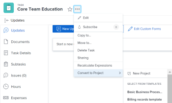

# Convertir une tâche en projet

<!--
 

The highlighted information on this page refers to functionality not yet generally available. It is available only in the Preview environment for all customers. The same features will also be available in the Production environment for all customers after a week from the Preview release.      

For more information, see [Interface modernization](/help/quicksilver/product-announcements/product-releases/interface-modernization/interface-modernization.md).  

-->

Lorsqu’une tâche d’un projet nécessite plus d’efforts que prévu, vous pouvez la convertir en projet.

## Conditions d’accès

+++ Développez pour afficher les exigences d’accès aux fonctionnalités de cet article. 

<table style="table-layout:auto"> 
 <col> 
 <col> 
 <tbody> 
  <tr> 
   <td role="rowheader">Package Adobe Workfront</td> 
   <td> 
Tous
 </td> 
  </tr> 
  <tr> 
   <td role="rowheader">Licence Adobe Workfront</td> 
   <td> 
Standard

   
Plan
 </td> 
  </tr> 
  <tr> 
   <td role="rowheader">Configurations des niveaux d’accès</td> 
   <td> 
Modifier l’accès aux tâches et aux projets
 
Accès en affichage ou supérieur aux modèles lors de la conversion en projet à l’aide d’un modèle
 </td> 
  </tr> 
  <tr> 
   <td role="rowheader">Autorisations d’objet</td> 
   <td> 
Autorisations de gestion pour une tâche
 
Droits d'affichage sur un modèle, en cas de conversion vers un projet utilisant un modèle
 
Une fois le projet créé, vous disposez de droits de gestion sur le projet.
</td> 
  </tr> 
 </tbody> 
</table>

Pour plus d’informations, voir [Conditions d’accès dans la documentation Workfront](/help/quicksilver/administration-and-setup/add-users/access-levels-and-object-permissions/access-level-requirements-in-documentation.md).

+++

<!--Old:

<table style="table-layout:auto"> 
 <col> 
 <col> 
 <tbody> 
  <tr> 
   <td role="rowheader">Adobe Workfront plan*</td> 
   <td> 
Any
 </td> 
  </tr> 
  <tr> 
   <td role="rowheader">Adobe Workfront license*</td> 
   <td> 
Plan 
 </td> 
  </tr> 
  <tr> 
   <td role="rowheader">Access level configurations*</td> 
   <td> 
Edit access to Tasks and Projects
 
View or higher access to Templates, when converting to a project using a template
 
Note: If you still don't have access, ask your Workfront administrator if they set additional restrictions in your access level. For information on how a Workfront administrator can modify your access level, see <a href="../../../administration-and-setup/add-users/configure-and-grant-access/create-modify-access-levels.md" class="MCXref xref">Create or modify custom access levels</a>.
 </td> 
  </tr> 
  <tr> 
   <td role="rowheader">Object permissions</td> 
   <td> 
Manage permissions to a task
 
View permissions on a template, if converting to a project using a template
 
After creating the project, you have Manage permissions to the project
 
For information on requesting additional access, see <a href="../../../workfront-basics/grant-and-request-access-to-objects/request-access.md" class="MCXref xref">Request access to objects </a>.
 </td> 
  </tr> 
 </tbody> 
</table>-->

## Considérations relatives à la conversion des tâches en projets

* Vous pouvez convertir une tâche en un projet vierge ou en un projet utilisant un modèle.
* La tâche originale est supprimée.
* Toutes les sous-tâches, les problèmes et les notes sont intégrés au nouveau projet.
* Les documents, les versions des documents et les épreuves sont déplacés vers le nouveau projet.
* Le temps de traitement est limité à 5 minutes lors de la conversion d’une tâche en projet. Si la tâche est associée à un grand nombre de documents et ne parvient pas à effectuer la conversion, vous devrez peut-être supprimer certains des documents et réessayer.
* Le statut et le pourcentage terminé de toutes les sous-tâches et de tous les problèmes sont conservés.
* Les personnes affectées à la tâche et l’utilisateur qui convertit la tâche en projet deviennent des utilisateurs partagés sur le projet.
* La date de début du projet correspond à la date de début de la tâche.
* Le tableau suivant répertorie les informations relatives au projet et indique si elles sont transférées à partir du modèle ou de la tâche :

  <table style="table-layout:auto"> 
  <col> 
  <col> 
  <tbody> 
    <tr> 
    <td>Description</td> 
    <td> 
La description de la tâche est transférée au nouveau projet. 
 
 Si la tâche ne comporte pas de description, la description du modèle est transférée au projet. 
 
Si le champ Description est vide à la fois pour la tâche et pour le modèle, le champ est vide dans le projet. 
 </td> 
    </tr> 
    <tr> 
    <td>Statut</td> 
    <td> Statut par défaut sélectionné pour le groupe sur le modèle. Si le modèle n'est pas associé au groupe, le statut du projet est défini par défaut par l'administration de Workfront dans la zone Préférences de projet de la Configuration. Pour plus d’informations, voir <a href="../../../administration-and-setup/set-up-workfront/configure-system-defaults/set-project-preferences.md">Configurer les préférences du projet à l'échelle du système</a>.

  Les scénarios suivants existent pour la mise à jour du statut du projet :
  <ul>
    <li> Si le statut de la tâche est « Nouveau », le statut du projet est « Planification ».</li>
    <li> Si le statut de la tâche est « En cours », le statut du projet adopte le même statut.</li>
    <li> Si le statut de la tâche est « Terminé », le statut du projet est « Terminé ».</li></ul>

  </td> 
    </tr> 
    <tr> 
    <td>Priorité</td> 
    <td>Transfert de la tâche vers le projet, ou transfert à partir du modèle, si vous en utilisez un lors de la conversion. </td> 
    </tr> 
    <tr> 
    <td>URL</td> 
    <td> 
L’URL de la tâche est transférée vers le nouveau projet. 
 
 Si aucune URL n’est spécifiée dans la tâche, l’URL du modèle est transférée au projet. 
 
Si le champ URL est vide à la fois pour le problème et pour le modèle, le champ est vide dans le projet. 
 </td> 
    </tr> 
    <tr> 
    <td>Type de condition du projet</td> 
    <td>Est transféré à partir du modèle.</td> 
    </tr> 
    <tr> 
    <td>Statut du projet</td> 
    <td>Correspond à la préférence par défaut au niveau du système, déterminée par l’administrateur ou administratrice Workfront dans la zone Configuration. Pour plus d’informations, voir <a href="../../../administration-and-setup/customize-workfront/create-manage-custom-conditions/set-custom-condition-default-projects.md">Définir une condition personnalisée comme condition par défaut pour les projets</a>.
    </td> 
    </tr> 
    <tr> 
    <td>Planifier à partir de</td> 
    <td>Est transféré à partir du modèle.</td> 
    </tr> 
    <tr> 
    <td>Dates de projets</td> 
    <td> 
      <ul> 
      <li> 
<b>Date de début prévue</b> : le temps de travail le plus proche basé sur le temps de travail du planning du modèle doit être présélectionné, en fonction du fuseau horaire du planning du modèle. Ce champ est désactivé si le champ Planifier à partir de est défini sur À partir de l’achèvement. 
 </li> 
      <li> 
<b>Date d’achèvement prévue</b> : le temps de travail le plus proche, basé sur le temps de travail du planning du modèle, doit être présélectionné, en fonction du fuseau horaire de planning du modèle. Ce champ est désactivé si le champ Planifier à partir de est défini sur Dès le début. 
 </li> 
      </ul> </td> 
    </tr> 
    <tr> 
    <td>Portfolio</td> 
    <td>Est transféré à partir du modèle. Sinon, ce champ est vide.</td> 
    </tr> 
    <tr> 
    <td>Programme</td> 
    <td>Est transféré à partir du modèle. Sinon, ce champ est vide.</td> 
    </tr> 
    <tr> 
    <td>Groupe</td> 
    <td>
 Les scénarios suivants sont possibles :

      <ul><li>Si un groupe est spécifié pendant la conversion, il devient le groupe du projet.</li>
      <li>Si vous effectuez une conversion vers un projet à l’aide d’un modèle et qu’un groupe est présent sur le modèle, et que vous ne spécifiez pas de groupe pendant la conversion, le groupe du modèle devient le groupe du nouveau projet.</li>
      <li> S’il n’y a aucun groupe sur le modèle et que vous ne spécifiez pas de groupe pendant la conversion, le groupe du projet du problème d’origine devient le groupe du nouveau projet.</li> </ul>
        </td> 
    </tr> 
    <tr> 
    <td>Entreprise</td>    
    <td>  Est transféré à partir du modèle. Sinon, ce champ est vide.</td>

  </tr> 
    <tr> 
    <td>Propriétaire du projet</td> 
    <td>Est transféré à partir du champ Propriétaire du modèle sur le modèle. Sinon, il est défini sur la personne connectée qui effectue la conversion. </td> 
    </tr> 
    <tr> 
    <td>Sponsor du projet</td> 
    <td>Est transféré à partir du champ Modèle de sponsor sur le modèle. Sinon, ce champ est vide.</td> 
    </tr> 
    <tr> 
    <td>Gestionnaire des ressources</td> 
    <td>Est transféré à partir du modèle. Sinon, ce champ est vide.</td> 
    </tr> 
    <tr> 
    <td>Paramètres de la tâche</td> 
    <td>Est transféré à partir du modèle.</td> 
    </tr> 
    <tr> 
    <td>Paramètres de l'événement</td> 
    <td>Est transféré à partir du modèle. </td> 
    </tr> 
    <tr> 
    <td>Accès</td> 
    <td> 
Est transféré depuis la section Accès du modèle. 
 </td> 
    </tr> 
    <tr> 
    <td>Approbations</td> 
    <td>Est transféré à partir du modèle. Les approbations associées à la tâche sont supprimées lors de la conversion. </td> 
    </tr> 
  </tbody> 
  </table>

## Convertir une tâche en projet

1. Accédez à la tâche que vous souhaitez convertir en projet.
1. Cliquez sur l’icône **Plus** , puis **Convertir en projet**.
1. Choisissez l’une des options suivantes :

   * **Nouveau projet**, pour créer un projet sans utiliser de modèle
   * Un modèle dans la section **Sélectionner à partir des modèles** 

     

1. Cliquez sur **Continuer** dans la notification qui s’affiche.
1. Dans la boîte **Convertir en projet**, indiquez ce qui suit :

   * **Nom** : attribuez un nom à votre projet. Le nom par défaut est le nom de la tâche. Champ obligatoire.
   * **Description** : Décrivez l&#39;objectif de ce projet.
   * (Conditionnel) Si vous avez choisi de créer un projet à partir d’un modèle, mettez à jour les champs disponibles dans la zone **Convertir en projet**.

     Pour plus d’informations sur la modification des champs des projets, voir [Modifier des projets](../../../manage-work/projects/manage-projects/edit-projects.md).

     >[!TIP]
     >
     >Pour mettre à jour les champs de la section Finances de la zone Convertir en projet , vous devez disposer d’un accès en modification aux données financières dans votre niveau d’accès. Si vous avez un accès en lecture seule aux données financières dans votre niveau d&#39;accès, toutes les informations financières du modèle sont transférées vers le nouveau projet et vous ne pouvez pas les modifier pendant la conversion de l&#39;événement. Pour plus d’informations, voir [Accorder l’accès aux données financières](../../../administration-and-setup/add-users/configure-and-grant-access/grant-access-financial.md) et [Partager un modèle](../../../workfront-basics/grant-and-request-access-to-objects/share-a-template.md).

   * (Facultatif) Ajoutez des **formulaires personnalisés** au nouveau projet.

     >[!TIP]
     >
     >Si un formulaire personnalisé multi-objets joint à la tâche est configuré pour être utilisé à la fois avec les tâches et les projets, toutes les informations enregistrées dans le formulaire sont conservées lorsque vous effectuez la conversion.
     >
     >
     >Si vous utilisez un modèle pour la conversion et qu&#39;un formulaire personnalisé joint au modèle contient un champ personnalisé qui se trouve également dans un formulaire personnalisé joint à la tâche, la valeur du champ de la tâche est utilisée pour le nouveau projet. Cependant, si le champ personnalisé est vide sur la tâche, la valeur du modèle est utilisée.

1. Cliquez sur **Convertir en projet**.
