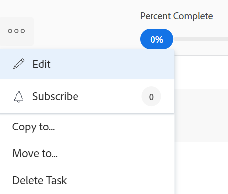

# Copier et dupliquer des tâches

Vous pouvez copier une tâche d’un projet vers un autre projet ou dupliquer une tâche au sein du même projet.

Vous pouvez copier ou dupliquer une ou plusieurs tâches ou tâches parent à la fois.

## Conditions d’accès

+++ Développez pour afficher les exigences d’accès aux fonctionnalités de cet article. 

<table style="table-layout:auto"> 
 <col> 
 <col> 
 <tbody> 
  <tr> 
   <td role="rowheader">Package Adobe Workfront</td> 
   <td> 
Tous
 </td> 
  </tr> 
  <tr> 
   <td role="rowheader">Licence Adobe Workfront</td> 
   <td> 
Standard
 
   
Travail ou supérieur
 </td> 
  </tr> 
  <tr> 
   <td role="rowheader">Configurations des niveaux d’accès</td> 
   <td> 
Modifier l’accès aux tâches et aux projets
</td> 
  </tr> 
  <tr> 
   <td role="rowheader">Autorisations d’objet</td> 
   <td> 
Autorisations de gestion pour une tâche
 
Autorisations de contribution ou de niveau supérieur pour un projet
 
   </td> 
  </tr> 
 </tbody> 
</table>

Pour plus d’informations, voir [Conditions d’accès dans la documentation Workfront](/help/quicksilver/administration-and-setup/add-users/access-levels-and-object-permissions/access-level-requirements-in-documentation.md).

+++

<!--Old:

<table style="table-layout:auto"> 
 <col> 
 <col> 
 <tbody> 
  <tr> 
   <td role="rowheader">Adobe Workfront plan*</td> 
   <td> 
Any 
 </td> 
  </tr> 
  <tr> 
   <td role="rowheader">Adobe Workfront license*</td> 
   <td> 
Current license: Standard
 
   Or
   
Legacy license: Work or higher 
 </td> 
  </tr> 
  <tr> 
   <td role="rowheader">Access level configurations*</td> 
   <td> 
Edit access to Tasks and Projects
 
<b>NOTE</b>
   
   If you still don't have access, ask your Workfront administrator if they set additional restrictions in your access level. For information on how a Workfront administrator can modify your access level, see <a href="../../../administration-and-setup/add-users/configure-and-grant-access/create-modify-access-levels.md" class="MCXref xref">Create or modify custom access levels</a>.
 </td> 
  </tr> 
  <tr> 
   <td role="rowheader">Object permissions</td> 
   <td> 
Manage permissions to a task
 
Contribute or higher permissions to the project
 
   
For information on requesting additional access, see <a href="../../../workfront-basics/grant-and-request-access-to-objects/request-access.md" class="MCXref xref">Request access to objects </a>.
 </td> 
  </tr> 
 </tbody> 
</table>-->

## Observations relatives à la copie de tâches

Tenez compte des points suivants lors de la copie d’une tâche :

* Lorsque vous copiez une tâche d’un projet vers un autre, les dates de la tâche peuvent être recalculées. Le nouveau calcul prendra en compte le planning utilisé par le nouveau projet, ainsi que les informations « Planifier à partir de » du projet.
* Les formulaires personnalisés sont copiés avec la tâche. Les informations contenues dans les champs personnalisés ne sont transférées aux tâches copiées que lorsque vous choisissez de copier les données personnalisées lors de la copie de la tâche.
* Vous avez la possibilité de choisir de copier certains éléments associés à la tâche dans la tâche copiée au cours du processus de copie. Cependant, par défaut, les objets suivants ne sont pas transférés vers la tâche copiée :
   * Problèmes
   * Heures consignées
   * Commentaires des utilisateurs et utilisatrices <!--not sure about this, enable only if requested by users and verified by Product: System activity comments transfer to the new task if they relate to information that you specifically select to be copied. For example, if you select to copy Expenses to the new task, system comments that identify adding expenses to the task will transfer to the copied task. -->
* Par défaut, les éléments suivants sont déplacés vers la tâche copiée :

   * Les jalons sont transférés vers la tâche copiée et supprimés de la tâche d’origine.
   * Les sous-tâches sont transférées vers la nouvelle tâche.

* Vous pouvez copier une ou plusieurs tâches à la fois lorsque vous modifiez des tâches dans une liste.

## Copier des tâches dans une liste {#copy-tasks-in-a-list}

1. Accédez au projet contenant la ou les tâches à copier.

   Ou

   Accédez à un rapport de tâches.

1. (Le cas échéant) Cliquez sur **Tâches** dans le panneau de gauche, si vous avez ouvert le projet qui contient les tâches.
1. Cliquez sur l’icône **Mode Plan**  et assurez-vous que l’option **Enregistrement automatique** est activée.

   

   >[!IMPORTANT]
   >
   >Vous ne pouvez copier des tâches dans une liste que lors de l’enregistrement automatique des modifications. Pour plus d’informations sur l’enregistrement des options lors de la modification de tâches, consultez la section [Modifier les tâches dans une liste](../../../manage-work/tasks/manage-tasks/edit-tasks-in-a-list.md).

1. Sélectionnez la ou les tâches à copier, puis effectuez l’une des opérations suivantes :

   * Cliquez sur le **Menu Plus** en haut de la liste des tâches, puis cliquez sur **Copier vers**.
   * Cliquez avec le bouton droit de la souris sur les tâches sélectionnées, puis cliquez sur **Copier vers**.
   * Lors de la sélection d’une tâche, cliquez sur le menu **Plus**  en regard du nom de la tâche dans la liste, puis cliquez sur **Copier dans**.

   

1. Continuez de copier la tâche, comme décrit dans la section [Copier une tâche au niveau de la tâche](#copy-a-task-at-the-task-level) à partir de l’étape 4.

   <!--
      (NOTE: is this still accurate?!)
   -->

## Copier une tâche au niveau de la tâche {#copy-a-task-at-the-task-level}

Outre la copie de tâches dans une liste de tâches, vous pouvez également copier une tâche une fois que vous l’avez ouverte.

1. Accédez à une tâche dans votre système Workfront en la recherchant.
1. Cliquez sur le nom de la tâche pour l’ouvrir.
1. Cliquez sur le menu déroulant **Plus**  en regard du nom de la tâche, puis cliquez sur **Copier dans**.

   

   La zone « Copier la tâche » s’affiche.

1. (Facultatif) Mettez à jour le **nom de la tâche**.

   >[!TIP]
   >
   >Ce champ est grisé et ne peut pas être modifié lorsque vous sélectionnez plusieurs tâches dans une liste. Vous pouvez placer le pointeur sur le champ Nom de la tâche pour afficher la liste de toutes les tâches sélectionnées.
   >
   >

1. Saisissez le nom du **projet de destination** où vous souhaitez copier la tâche dans le champ **Sélectionner le projet de destination**.

   >[!TIP]
   >
   >* Le nom du projet est sensible à la casse.
   >* Vous pouvez également commencer à saisir le numéro de référence ou l’ID du projet. Cela peut vous aider à distinguer les projets portant des noms identiques.
   >* Seuls 100 projets s’affichent dans la liste.

   Le nom actuel du projet s’affiche par défaut. Pour copier la tâche dans le même projet, laissez ce champ inchangé.

1. (Le cas échéant) Cliquez sur **Demander l’accès** pour demander l’accès au projet, si vous n’avez pas accès au projet sélectionné.
1. (Le cas échéant) Continuez à copier la tâche vers le projet de destination sélectionné sans demander l’accès si vous avez accès à l’une des tâches du projet de destination.

   

   >[!TIP]
   >
   >Des messages similaires s’affichent si le projet sélectionné est en attente d’approbation, terminé ou inactif, lorsque l’administration de Workfront empêche l’ajout de tâches à ces projets. Pour plus d’informations, voir [Configurer les préférences du projet à l’échelle du système](../../../administration-and-setup/set-up-workfront/configure-system-defaults/set-project-preferences.md).

1. Cliquez sur **Options** dans le panneau de gauche, puis désélectionnez les attributs de tâche à ne pas copier avec la tâche. Toutes les options sont sélectionnées par défaut.

   >[!TIP]
   >
   >La sélection, puis la désélection de **Sélectionner tout** désélectionne toutes les options.

   Désélectionnez les options suivantes pour ne pas les transférer vers la tâche copiée. Le tableau suivant décrit ce qui se produit lorsque les options sont désélectionnées :

   <table style="table-layout:auto"> 
    <col> 
    <col> 
    <tbody> 
     <tr> 
      <td role="rowheader">Contrainte</td> 
      <td> 
La contrainte de tâche est définie sur Aussi Tôt Que Possible ou Aussi Tard Que Possible en fonction du paramètre Mode horaire du projet.
 
 Lorsque cette option est sélectionnée, la contrainte actuelle de la tâche est transférée à la tâche copiée. 
 
Note : lorsque vous déplacez ou copiez une tâche avec des contraintes de date spécifiques vers un autre projet et que les dates de contrainte de la tâche ne correspondent pas aux dates du nouveau projet, la contrainte de tâche passe à Aussi Tôt Que Possible ou Aussi Tard Que Possible ou les dates de début ou de fin prévues des projets sont ajustées. Certains exemples de contraintes spécifiques à une date sont : Il Faut Commencer Le, Doit se terminer le, Commencer Au Plus Tôt, Commencer Au Plus Tard, etc. Pour plus d’informations sur les contraintes de tâche et sur la manière dont les contraintes de tâche ou les dates de projet peuvent être affectées, voir <a href="../../../manage-work/tasks/task-constraints/task-constraint-overview.md" class="MCXref xref">Vue d’ensemble des contraintes de tâches</a> et recherchez une contrainte spécifique.
 </td> 
     </tr> 
     <tr> 
      <td role="rowheader">Affectations</td> 
      <td> 
Toutes les affectations sont supprimées de la tâche. 
 </td> 
     </tr> 
     <tr> 
      <td role="rowheader">Processus d’approbation</td> 
      <td>Tous les processus de validation sont supprimés de la tâche.</td> 
     </tr> 
     <tr> 
      <td role="rowheader">Progression</td> 
      <td>Le statut de la tâche passe à Nouveau. Sinon, la tâche copiée conserve le statut de la tâche existante.</td> 
     </tr> 
     <tr> 
      <td role="rowheader">Informations financières</td> 
      <td>Les informations financières de la tâche sont supprimées.</td> 
     </tr> 
     <tr> 
      <td role="rowheader">Toutes les tâches antérieures</td> 
      <td> 
Cela signifie que les dépendances ne seront pas transférées aux tâches copiées. 
 
Lorsque cette option est sélectionnée, les tâches antérieures du groupe de tâches copiées sont conservées, les autres sont supprimées.
 </td> 
     </tr> 
     <tr> 
      <td role="rowheader">Documents</td> 
      <td> 
Les documents joints à la tâche ne sont pas transférés vers la tâche copiée. Il s’agit notamment des versions, des épreuves et des documents associés.
 
Les approbations de documents suivent un processus distinct. Les approbations de document ne peuvent jamais être copiées lorsqu’une tâche est copiée.
 </td> 
     </tr> 
     <tr> 
      <td role="rowheader">Notifications de rappel</td> 
      <td>Les rappels de tâche ne sont pas transférés vers la tâche copiée. </td> 
     </tr> 
     <tr> 
      <td role="rowheader">Frais</td> 
      <td>Les dépenses enregistrées sur la tâche ne sont pas transférées vers la tâche copiée. </td> 
     </tr> 
     <tr> 
      <td role="rowheader">Autorisations</td> 
      <td>Workfront supprime les noms de toutes les entités qui s’affichent dans la liste Partage de la tâche. </td> 
     </tr> 
     <tr> 
      <td role="rowheader">Données personnalisées</td> 
      <td> 
Les valeurs des champs personnalisés sont effacées et les formulaires personnalisés sont transférés vers la tâche copiée. 
 
Lorsque cette option est sélectionnée, les formulaires et les valeurs des champs personnalisés sont transférés à la tâche copiée. 
 </td> 
     </tr> 
    </tbody> 
   </table>

1. (Facultatif) Cliquez sur **Sélectionner le parent** dans le panneau de gauche, puis sélectionnez la tâche dans le projet de destination qui doit devenir le parent de la tâche copiée.

   >[!TIP]
   >
   >Lorsque vous choisissez de copier plusieurs tâches dans une liste, toutes les tâches sélectionnées deviennent les enfants du parent sélectionné.

   Sélectionnez un parent en effectuant l’une des opérations suivantes :

   * Dans la liste des tâches, sélectionnez l’un des parents du plan de projet.
   * Cliquez sur l’icône de recherche  et recherchez une tâche parent par nom.

   La tâche s’affiche dans la liste.

   

1. Sélectionnez la case d’option du parent une fois que vous l’avez trouvée.

   Si vous ne sélectionnez pas de tâche parent, les tâches sont copiées en tant que tâches principales plutôt que sous-tâches et elles sont placées à la fin de la liste des tâches sur le projet de destination.

1. Cliquez sur **Copier la tâche**.

   Ou

   Cliquez sur **Copier les tâches** lorsque vous sélectionnez plusieurs tâches dans une liste.
Les tâches copiées se trouvent désormais sur le projet spécifié et sont soit des sous-tâches à la tâche parent sélectionnée, soit les dernières tâches du projet.

## Dupliquer des tâches

Vous pouvez rapidement dupliquer une tâche dans une liste de tâches, si vous avez besoin d’une tâche identique dans le même projet.

* [Considérations relatives à la duplication de tâches](#considerations-for-duplicating-tasks)
* [Dupliquer des tâches](#duplicate-tasks)

### Considérations relatives à la duplication de tâches {#considerations-for-duplicating-tasks}

* Vous ne pouvez dupliquer une tâche dans une liste de tâches que lorsque la liste est triée par numéro de tâche.
* La nouvelle tâche porte le même nom que la tâche d’origine.
* Vous ne pouvez pas sélectionner les informations qui sont dupliquées vers la nouvelle tâche. Presque toutes les informations de la tâche d’origine seront transférées par défaut à la tâche dupliquée, y compris la relation parent.
* Les éléments suivants ne sont pas transférés vers la nouvelle tâche :

   * Heures consignées
   * Notes
   * Problèmes
   * Seules les tâches antérieures appartenant au même groupe de tâches copiées sont également copiées avec leurs tâches ultérieures.

     **EXEMPLE**

     Par exemple, si vous copiez simultanément la tâche 2 et sa tâche antérieure, la tâche 1, vous disposez alors de deux copies : une de la tâche 2 et une de la tâche 1. La copie de la tâche 1 est antérieure à celle de la tâche 2. Mais si vous copiez uniquement la tâche 2 sans copier sa tâche antérieure, sa copie n’a pas de tâche antérieure.

* Lorsque vous dupliquez une tâche parent, toutes les tâches enfant sont également dupliquées, même si les tâches enfant ne sont pas sélectionnées.
* Vous pouvez dupliquer une ou plusieurs tâches en même temps.

  Cependant, vous ne pouvez pas dupliquer simultanément plusieurs tâches qui ne sont pas séquentielles.

* Les jalons sont déplacés vers la nouvelle tâche et supprimés de la tâche d’origine.

### Dupliquer des tâches

1. Accédez au projet contenant la ou les tâches que vous souhaitez dupliquer.
1. Cliquez sur **Tâches** dans le panneau de gauche.
1. Utilisez l’une des méthodes suivantes :

   * (Conditionnel) Cliquez sur l’icône **Mode Plan**  et assurez-vous que l’option **Enregistrement automatique** est activée, sélectionnez les tâches à dupliquer, puis cliquez sur le **menu Plus**  > **Dupliquer**.

     

   * (Conditionnel) Cliquez sur l’icône **Mode Plan**  > **Enregistrement manuel** > **Standard** ou **Planification de la chronologie**, puis procédez comme suit :

      1. Sélectionnez la ou les tâches à dupliquer, puis cliquez sur **Dupliquer**.
      1. (Facultatif) Cliquez sur **Annuler** pour annuler vos modifications et ne pas dupliquer les tâches.
      1. (Facultatif et le cas échéant) Cliquez sur **Rétablir** si vous avez précédemment cliqué sur **Annuler**, pour conserver les modifications et dupliquer les tâches.

      1. Cliquez sur **Enregistrer** pour enregistrer les modifications.

         Les tâches sont dupliquées et ajoutées au même projet que les tâches d’origine.
