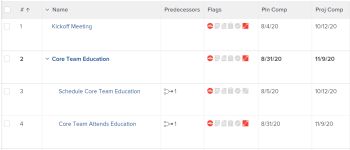

# Vue d’ensemble du chemin critique du projet

<!-- Audited: 5/2025 -->

La détermination du chemin critique d’un projet est un moyen automatique pour Adobe Workfront de marquer une séquence de tâches dans un projet qui ont le potentiel d’avoir un impact sur la chronologie du projet. Les tâches qui peuvent avoir un impact sur la chronologie du projet sont marquées comme tâches de chemin critique.

Les fonctionnalités suivantes peuvent avoir un impact sur le chemin critique d’un projet :

* La structure de répartition du travail du projet.

  Pour plus d’informations, voir [Déterminer la structure de répartition du travail dans un projet](../../../manage-work/projects/planning-a-project/determine-project-work-breakdown-structure.md).

* Le temps (durée) nécessaire à l’exécution de chaque tâche.
* Les dépendances entre les tâches.

  Tenez compte des points suivants :

   * Lorsqu&#39;une tâche sur le chemin critique possède une relation de prédécesseur, ses prédécesseurs et ses successeurs sont également sur le chemin critique si les modifications apportées aux dates des prédécesseurs ou des successeurs ont un impact direct sur leurs dépendants.

     >[!TIP]
     >
     >Lorsque la date du successeur d&#39;une tâche n&#39;a pas d&#39;incidence directe sur la date de ses tâches dépendantes ou sur les dates du projet, la tâche du successeur ne se trouve pas sur le chemin critique.
     >
     >
     >     >
     >

   * Lorsqu&#39;une sous-tâche est identifiée comme tâche de chemin critique, la tâche parent est également identifiée comme tâche de chemin critique si la date de début prévue et l&#39;heure de la tâche parent sont identiques à celles de la sous-tâche.

En tenant compte de ces fonctions, le système calcule le chemin critique en utilisant le chemin le plus long entre la tâche la plus ancienne et la tâche qui détermine la fin du projet. Le calcul du chemin critique prend en compte la première et la dernière fois où chaque tâche peut commencer et se terminer sans rallonger le projet. Ce processus détermine quelles tâches sont « critiques » (et appartiennent au chemin le plus long) et lesquelles sont « totalement flottantes » (peuvent être retardées sans rallonger le projet).

Tout retard dans l’activité d’une tâche sur le chemin critique affecte directement la date d’achèvement projetée du projet (il n’y a pas de flottement sur le chemin critique).

## Conditions d’accès

+++ Développez pour afficher les exigences d’accès aux fonctionnalités de cet article.

<table style="table-layout:auto"> 
 <col> 
 <col> 
 <tbody> 
  <tr> 
   <td role="rowheader">Package Adobe Workfront</td> 
   <td> 
Tous
 </td> 
  </tr> 
  <tr> 
   <td role="rowheader">Licence Adobe Workfront</td> 
   <td> 
   
Standard

   
Travail ou supérieur

    </td> 
  </tr> 
  <tr> 
   <td role="rowheader">Configurations des niveaux d’accès</td> 
   <td> 
Accès d’affichage ou supérieur aux tâches
</td> 
  </tr> 
  <tr> 
   <td role="rowheader">Autorisations d’objet</td> 
   <td> 
Autorisations d’affichage ou supérieures sur une tâche 
</td> 
  </tr> 
 </tbody> 
</table>

Pour plus d’informations, voir [Conditions d’accès dans la documentation Workfront](/help/quicksilver/administration-and-setup/add-users/access-levels-and-object-permissions/access-level-requirements-in-documentation.md).

+++

<!--Old:

<table style="table-layout:auto"> 
 <col> 
 <col> 
 <tbody> 
  <tr> 
   <td role="rowheader">Adobe Workfront plan</td> 
   <td> 
Any
 </td> 
  </tr> 
  <tr> 
   <td role="rowheader">Adobe Workfront license</td> 
   <td> 
   
New: Standard

   
Or

   
Current: Work or higher

    </td> 
  </tr> 
  <tr> 
   <td role="rowheader">Access level configurations</td> 
   <td> 
View or higher access to Tasks
 
Note: If you still don't have access, ask your Workfront administrator if they set additional restrictions in your access level. For information on how a Workfront administrator can modify your access level, see <a href="../../../administration-and-setup/add-users/configure-and-grant-access/create-modify-access-levels.md" class="MCXref xref">Create or modify custom access levels</a>.
 </td> 
  </tr> 
  <tr> 
   <td role="rowheader">Object permissions</td> 
   <td> 
View or higher permissions on a task 
 
For information on requesting additional access, see <a href="../../../workfront-basics/grant-and-request-access-to-objects/request-access.md" class="MCXref xref">Request access to objects </a>.
 </td> 
  </tr> 
 </tbody> 
</table>-->

## Afficher le chemin critique

Vous pouvez afficher les tâches qui appartiennent au chemin critique dans les zones suivantes de l’application Workfront :

* [Afficher le chemin critique dans le graphique de Gantt](#view-the-critical-path-in-the-gantt-chart)
* [Afficher le chemin critique dans une liste de tâches ou un rapport](#view-the-critical-path-in-a-task-list-or-report)

### Afficher le chemin critique dans le graphique de Gantt {#view-the-critical-path-in-the-gantt-chart}

Pour afficher les tâches sur le chemin critique dans le graphique de Gantt :

{{step1-to-projects}}

1. Dans la liste des projets, sélectionnez un projet.

1. Dans le panneau de gauche, cliquez sur **Tâches**. L’onglet **Tâches** s’ouvre.

1. Dans le coin supérieur droit de la liste des tâches, cliquez sur l’icône **Graphique Gantt**.

   

1. Dans l’angle supérieur droit de la section Diagramme de Gantt, cliquez sur l’icône **Options** , puis sélectionnez l’option **Chemin critique** dans la liste déroulante qui s’affiche. Les tâches qui se trouvent sur le chemin critique comportent désormais une ligne rouge au-dessus de leur chronologie.

   

### Afficher le chemin critique dans une liste de tâches ou un rapport {#view-the-critical-path-in-a-task-list-or-report}

Pour afficher les tâches qui se trouvent sur le chemin critique dans une liste de tâches :

{{step1-to-projects}}

1. Dans la liste des projets, sélectionnez un projet.

1. Dans le panneau de gauche, cliquez sur **Tâches**. L’onglet **Tâches** s’ouvre.

1. Cliquez sur l’icône **Affichage** , puis sélectionnez **Statut**. Les tâches qui se trouvent sur le chemin critique affichent un indicateur **Chemin critique** dans la colonne **Indicateurs** de la liste.

   Ou

   Cliquez sur l’icône **Filtre** , puis sélectionnez **+ Nouveau filtre**.
1. Dans le premier champ, saisissez *Est critique*, puis sélectionnez-le lorsqu’il apparaît sous la section **Tâches** dans la liste.

   

1. Assurez-vous que **Est vrai** est sélectionné dans le deuxième menu déroulant.

   

1. Fermez le panneau Filtres. La liste des tâches n’affiche désormais que les tâches qui se trouvent sur le chemin critique.
