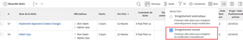

# Supprimer des tâches

Vous pouvez supprimer des tâches qui peuvent être des doublons ou qui ont été créées par erreur.

Pour les tâches qui comportent des informations historiques (mises à jour, changements de planning, statut ou autres champs), nous vous recommandons de les fermer ou de les marquer comme Mort, au lieu de les supprimer. Vous conservez ainsi les informations historiques de vos projets.

## Exigences d’accès

Vous devez disposer des accès suivants pour effectuer les étapes de cet article :

<table style="table-layout:auto"> 
 <col> 
 <col> 
 <tbody> 
  <tr> 
   <td role="rowheader">Formule Adobe Workfront*</td> 
   <td> 
Tous
 </td> 
  </tr> 
  <tr> 
   <td role="rowheader">Licence Adobe Workfront*</td> 
   <td> 
Travail ou plus élevé
 </td> 
  </tr> 
  <tr> 
   <td role="rowheader">Paramétrages du niveau d'accès*</td> 
   <td> 
Modifier l’accès aux tâches et aux projets avec l’accès à Supprimer
 
Remarque : Si vous n’avez toujours pas accès à , demandez à votre administrateur Workfront s’il définit des restrictions supplémentaires à votre niveau d’accès. Pour plus d’informations sur l’accès aux tâches, voir <a href="../../../administration-and-setup/add-users/configure-and-grant-access/grant-access-tasks.md" class="MCXref xref">Accorder l’accès aux tâches</a>. Pour plus d’informations sur la façon dont un administrateur Workfront peut modifier votre niveau d’accès, voir <a href="../../../administration-and-setup/add-users/configure-and-grant-access/create-modify-access-levels.md" class="MCXref xref">Création ou modification de niveaux d’accès personnalisés</a>. 
 </td> 
  </tr> 
  <tr> 
   <td role="rowheader">Autorisations d’objet</td> 
   <td> 
Attribuez des autorisations au projet avec la possibilité d’ajouter des tâches ou plus.
 
Lorsque vous créez une tâche, vous recevez automatiquement les autorisations Gérer pour la tâche.
 
 Pour plus d’informations sur les autorisations de tâche, voir <a href="../../../workfront-basics/grant-and-request-access-to-objects/share-a-task.md" class="MCXref xref">Partage d’une tâche </a>. 
 
Pour plus d’informations sur la demande d’autorisations supplémentaires, voir <a href="../../../workfront-basics/grant-and-request-access-to-objects/request-access.md" class="MCXref xref">Demande d’accès aux objets </a>.
 </td> 
  </tr> 
 </tbody> 
</table>

&#42;Pour connaître le plan, le type de licence ou l’accès dont vous disposez, contactez votre administrateur Workfront.

## Comprendre le processus de suppression des tâches

* [Restrictions relatives à la suppression de tâches](#limitations-for-deleting-tasks)
* [Impact de la suppression des tâches](#the-impact-of-deleting-tasks)

### Restrictions relatives à la suppression de tâches  {#limitations-for-deleting-tasks}

* Lorsqu’un projet a l’état Terminé, vous ne pouvez supprimer des tâches que si votre administrateur Workfront ou un administrateur de groupe l’a autorisé dans la zone Préférences du projet. Pour plus d’informations sur la configuration des préférences de projet, voir [Configuration des préférences de projet à l’échelle du système](../../../administration-and-setup/set-up-workfront/configure-system-defaults/set-project-preferences.md).

* Si la tâche comporte des heures enregistrées, l’administrateur de Workfront ou de groupe doit autoriser la suppression de ces tâches en configurant les préférences de tâche et de problème dans votre instance Workfront. Cela s’applique également lorsque vous essayez de supprimer des projets pour lesquels des tâches sont connectées pendant des heures.

   <!--
  (NOTE: the last statement is NWE&nbsp;only; not possible in classic)
  -->

   Pour plus d’informations sur l’activation de la suppression des tâches où des heures sont enregistrées, voir la section &quot;Suppression&quot; dans [Configuration des préférences de tâche et de problème à l’échelle du système](../../../administration-and-setup/set-up-workfront/configure-system-defaults/set-task-issue-preferences.md).

### Impact de la suppression des tâches {#the-impact-of-deleting-tasks}

Lorsque vous supprimez une tâche, vous avez un impact sur les autres objets liés à la tâche.

Les objets suivants associés à une tâche sont également supprimés lorsque vous supprimez une tâche :

* Documents

   Vous ne pouvez pas supprimer une tâche à laquelle est associé un document extrait. Pour plus d’informations sur l’extraction de documents, voir [Extraction de documents](../../../documents/managing-documents/check-out-documents.md).

* Événements
* Sous-tâches
* Notes
* Approbations

Selon la manière dont votre administrateur Workfront configure les préférences Projet, Tâche ou Suppression d’un problème dans les préférences Frise chronologique et Heure de votre instance Workfront, les heures consignées pour les tâches sont gérées de l’une des manières suivantes lors de la suppression d’une tâche :

* Accédez au projet et ne sera pas restauré sur la tâche, si la tâche est restaurée ultérieurement.
* Sont supprimés et restaurés sur la tâche, si la tâche est restaurée ultérieurement.

   Cela s’applique également lorsque vous essayez de supprimer des projets pour lesquels des tâches sont connectées pendant des heures.

   <!--
  <MadCap:conditionalText data-mc-conditions="QuicksilverOrClassic.Draft mode">
  (NOTE: this stays NWE; not possible in classic;)
  </MadCap:conditionalText>
  -->

   Pour plus d’informations sur la configuration des préférences de suppression pour les heures de connexion aux problèmes, voir [Configuration des préférences de feuille de temps et d’heure](../../../administration-and-setup/set-up-workfront/configure-timesheets-schedules/timesheet-and-hour-preferences.md).

* Les dépenses de la tâche seront déplacées vers le projet.

* Les utilisateurs affectés à la tâche ou à l’approbation de la tâche restent membres de l’équipe de projet.

   Pour plus d’informations sur les équipes de projet, voir [Présentation de l’équipe de projet](../../../manage-work/projects/planning-a-project/project-team-overview.md).

## Supprimer des tâches

* [Suppression simultanée de plusieurs tâches dans un projet](#delete-multiple-tasks-in-a-project-simultaneously)
* [Supprimer une seule tâche](#delete-a-single-task)

### Suppression simultanée de plusieurs tâches dans un projet  {#delete-multiple-tasks-in-a-project-simultaneously}

1. Cliquez sur le bouton **Menu Principal** icon  dans le coin supérieur droit d’Adobe Workfront.

1. Cliquez sur **Projets**.
1. Cliquez sur le nom du projet qui contient les tâches à supprimer.
1. Cliquez sur **Tâches** dans le panneau de gauche.
1. Utilisez l’une des méthodes suivantes :

   1. (Conditionnel) Lorsque la variable **Enregistrement automatique** La bascule est activée :

      1. Sélectionnez les tâches à supprimer, puis cliquez sur **Plus**
      1. Cliquez sur **Supprimer**, puis **Oui, la supprimer** pour confirmer la suppression.

         Les tâches sont supprimées.
   1. (Conditionnel) Cliquez sur le bouton **Mode Plan** et sélectionnez **Enregistrement manuel** si vous souhaitez annuler les modifications que vous apportez à la liste des tâches.

      

      Procédez comme suit :

      1. Sélectionnez les tâches à supprimer.
      1. Cliquez sur **Supprimer**.
      1. (Facultatif) Cliquez sur **Annuler** pour annuler votre modification et ne pas supprimer les tâches.
      1. Cliquez sur **Rétablir** si vous souhaitez conserver la modification et supprimer la tâche.
      1. Cliquez sur **Enregistrer** pour supprimer les tâches.

         Les tâches ne sont supprimées qu’après l’enregistrement des modifications.

### Supprimer une seule tâche {#delete-a-single-task}

1. Cliquez sur le bouton **Menu Principal** icon  dans le coin supérieur droit d’Adobe Workfront.

1. Cliquez sur **Projets**.
1. Cliquez sur le nom du projet qui contient la tâche à supprimer.
1. Cliquez sur **Tâches** dans le panneau de gauche.
1. Cliquez sur le nom de la tâche à supprimer.
1. Cliquez sur le bouton **Plus** icon dans le coin supérieur droit.

   

1. Cliquez sur **Supprimer la tâche**.
1. Si la suppression est autorisée, cliquez sur **Oui, supprimez-le**.

   Votre administrateur Workfront ou votre administrateur de groupe peut ne pas autoriser la suppression des tâches pour lesquelles des heures sont enregistrées.

   Pour plus d’informations sur l’accès et les autorisations nécessaires à la suppression d’une tâche, voir la section [Restrictions relatives à la suppression de tâches](#limitations-for-deleting-tasks) dans cet article.

## Restaurer les tâches supprimées

Un administrateur Workfront ou de groupe peut restaurer les tâches dans les 30 jours qui suivent leur suppression, comme décrit dans la section [Restauration des éléments supprimés](../../../administration-and-setup/manage-workfront/manage-deleted-items/restore-deleted-items.md).
