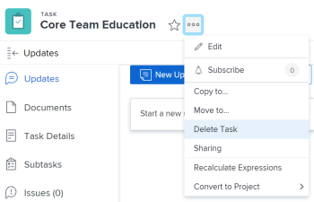

# Supprimer des tâches

Vous pouvez supprimer les tâches qui pourraient être des doublons ou qui ont été créées par erreur.

Pour les tâches contenant des informations historiques (mises à jour, changements de planification, de statut ou autres champs), nous vous recommandons de les fermer ou de les marquer comme Inactifs, au lieu de les supprimer. Cela vous permet de conserver les informations historiques pour vos projets.

## Conditions d’accès

+++ Développez pour afficher les exigences d’accès aux fonctionnalités de cet article.

<table style="table-layout:auto"> 
 <col> 
 <col> 
 <tbody> 
  <tr> 
   <td role="rowheader">Package Adobe Workfront</td> 
   <td> 
Tous
 </td> 
  </tr> 
  <tr> 
   <td role="rowheader">Licence Adobe Workfront</td> 
   <td>
Standard
 
   
Travail ou supérieur
 </td> 
  </tr> 
  <tr> 
   <td role="rowheader">Configurations des niveaux d’accès</td> 
   <td> 
Modifier l'accès aux Tâches et Projets avec accès à la suppression
</td> 
  </tr> 
  <tr> 
   <td role="rowheader">Autorisations d’objet</td> 
   <td> 
Autorisations Contribuer pour le projet avec la capacité d’ajouter des tâches ou autorisations supérieures
 
Lorsque vous créez une tâche, vous recevez automatiquement des autorisations de gestion de la tâche.
</td> 
  </tr> 
 </tbody> 
</table>

Pour plus d’informations, voir [Conditions d’accès dans la documentation Workfront](/help/quicksilver/administration-and-setup/add-users/access-levels-and-object-permissions/access-level-requirements-in-documentation.md).

+++

<!--Old:

<table style="table-layout:auto"> 
 <col> 
 <col> 
 <tbody> 
  <tr> 
   <td role="rowheader">Adobe Workfront plan*</td> 
   <td> 
Any
 </td> 
  </tr> 
  <tr> 
   <td role="rowheader">Adobe Workfront license*</td> 
   <td> 
Work or higher
 </td> 
  </tr> 
  <tr> 
   <td role="rowheader">Access level configurations*</td> 
   <td> 
Edit access to Tasks and Projects with access to Delete
 
Note: If you still don't have access, ask your Workfront administrator if they set additional restrictions in your access level. For information about access to tasks, see <a href="../../../administration-and-setup/add-users/configure-and-grant-access/grant-access-tasks.md" class="MCXref xref">Grant access to tasks</a>. For information on how a Workfront administrator can change your access level, see <a href="../../../administration-and-setup/add-users/configure-and-grant-access/create-modify-access-levels.md" class="MCXref xref">Create or modify custom access levels</a>. 
 </td> 
  </tr> 
  <tr> 
   <td role="rowheader">Object permissions</td> 
   <td> 
Contribute permissions to the project with ability to Add Tasks or higher
 
When you create a task you automatically receive Manage permissions to the task
 
 For information about task permissions, see <a href="../../../workfront-basics/grant-and-request-access-to-objects/share-a-task.md" class="MCXref xref">Share a task </a>. 
 
For information on requesting additional permissions, see <a href="../../../workfront-basics/grant-and-request-access-to-objects/request-access.md" class="MCXref xref">Request access to objects </a>.
 </td> 
  </tr> 
 </tbody> 
</table>-->

## Comprendre le processus de suppression des tâches

* [Limites de suppression des tâches](#limitations-for-deleting-tasks)
* [Impact de la suppression des tâches](#the-impact-of-deleting-tasks)

### Limites de la suppression des tâches  {#limitations-for-deleting-tasks}

* Lorsque le statut d’un projet est défini sur Terminé, vous ne pouvez supprimer des tâches que si votre administrateur ou administratrice Workfront ou de groupes l’a autorisé dans la zone Préférences du projet. Pour plus d’informations sur la définition des préférences de projet, voir [Configurer les préférences de projet à l’échelle du système](../../../administration-and-setup/set-up-workfront/configure-system-defaults/set-project-preferences.md).

* Si la tâche a des heures consignées, l’administrateur ou l’administratrice Workfront ou du groupe doit autoriser la suppression de ces tâches en configurant les préférences de tâches et de problèmes dans votre instance Workfront. Cela s’applique également lorsque vous essayez de supprimer des projets dans lesquels se trouvent des tâches avec des heures consignées.

  <!--
  (NOTE: the last statement is NWE only; not possible in classic)
  -->

  Pour plus d’informations sur l’activation de la suppression des tâches dans lesquelles des heures sont consignées, voir la section « Suppression » dans [Configurer les préférences de tâches et de problèmes à l’échelle du système](../../../administration-and-setup/set-up-workfront/configure-system-defaults/set-task-issue-preferences.md).

### Impact de la suppression des tâches {#the-impact-of-deleting-tasks}

La suppression d’une tâche a un impact sur les autres objets liés à cette tâche.

Tenez compte des points suivants :

* Les objets suivants attachés à une tâche sont également supprimés lorsque vous supprimez une tâche :

   * Documents

  Vous ne pouvez pas supprimer une tâche à laquelle est joint un document qui a été extrait. Pour plus d’informations sur l’extraction de documents, voir [Extraire des documents](../../../documents/managing-documents/check-out-documents.md).

   * Problèmes
   * Sous-tâches
   * Notes
   * Approbations

* Selon la façon dont votre administrateur ou administratrice Workfront configure les préférences de suppression de projet, de tâche ou de problème dans les préférences de feuille de temps et d’heures de votre instance Workfront, les heures consignées pour les tâches sont traitées de l’une des façons suivantes lors de la suppression d’une tâche :

   * Les heures consignées sont déplacées vers le projet et ne seront pas restaurées sur la tâche si celle-ci est restaurée ultérieurement.
   * Les heures consignées sont supprimées et seront restaurées sur la tâche, si celle-ci est restaurée ultérieurement.

  Cela s’applique également lorsque vous essayez de supprimer des projets dans lesquels se trouvent des tâches avec des heures consignées.

  Pour plus d’informations sur la configuration des préférences de suppression des heures consignées sur les problèmes, voir [Configurer les préférences de feuilles de temps et d’heures](../../../administration-and-setup/set-up-workfront/configure-timesheets-schedules/timesheet-and-hour-preferences.md).
   * Les dépenses relatives à la tâche seront transférées au projet.

   * Les utilisateurs et utilisatrices affectés à la tâche ou à l’approbation de la tâche restent dans l’équipe de projet.

  Pour plus d’informations sur les équipes de projet, voir [Vue d’ensemble de l’équipe de projet](../../../manage-work/projects/planning-a-project/project-team-overview.md).

* Lorsque vous supprimez une tâche enfant et que vous déplacez son parent vers un autre projet, puis que vous restaurez la tâche enfant supprimée, la tâche est de nouveau ajoutée au projet d’origine en tant que tâche principale.

<!--
  <MadCap:conditionalText data-mc-conditions="QuicksilverOrClassic.Draft mode">
  (NOTE: this stays NWE; not possible in classic;)
  </MadCap:conditionalText>
  -->

## Supprimer des tâches

* [Supprimer simultanément plusieurs tâches d’un projet](#delete-multiple-tasks-in-a-project-simultaneously)
* [Supprimer une seule tâche](#delete-a-single-task)

### Supprimer simultanément plusieurs tâches d’un projet  {#delete-multiple-tasks-in-a-project-simultaneously}

{{step1-to-projects}}

1. Cliquez sur le nom du projet qui contient les tâches à supprimer.
1. Cliquez sur **Tâches** dans le panneau de gauche.
1. Utilisez l’une des méthodes suivantes :

   1. (Le cas échéant) Lorsque le bouton (bascule) **Enregistrement automatique** est activé :

      1. Sélectionnez les tâches que vous souhaitez supprimer, puis cliquez sur **Plus**.
      1. Cliquez sur **Supprimer**, puis sur **Supprimer** pour confirmer la suppression.

         Les tâches sont supprimées.

   1. (Le cas échéant) Cliquez sur l’icône **Mode Plan** et sélectionnez **Enregistrement manuel** si vous souhaitez annuler les modifications apportées à la liste des tâches.

      

      Procédez comme suit :

      1. Sélectionnez les tâches à supprimer.
      1. Cliquez sur **Supprimer**.
      1. (Facultatif) Cliquez sur **Annuler** pour annuler votre modification et ne pas supprimer les tâches.
      1. Cliquez sur **Rétablir** si vous souhaitez conserver les modifications et supprimer la tâche.
      1. Cliquez sur **Enregistrer** pour supprimer les tâches.

         Les tâches ne sont supprimées qu’après l’enregistrement des modifications.

### Supprimer une seule tâche {#delete-a-single-task}

{{step1-to-projects}}

1. Cliquez sur le nom du projet qui contient la tâche à supprimer.
1. Cliquez sur **Tâches** dans le panneau de gauche.
1. Cliquez sur le nom de la tâche à supprimer.
1. Cliquez sur l’icône **Plus**  dans le coin supérieur droit.

   

1. Cliquez sur **Supprimer la tâche**.
1. Si la suppression est autorisée, cliquez sur **Supprimer**.

   Il se peut que votre administrateur ou administratrice Workfront ou de groupes n’autorise pas la suppression des tâches dans lesquelles des heures sont consignées.

   Pour plus d’informations sur l’accès et les autorisations nécessaires pour supprimer une tâche, voir la section [Limites de la suppression des tâches](#limitations-for-deleting-tasks) dans cet article.

## Restaurer les tâches supprimées

Un administrateur ou une administratrice Workfront ou de groupes peut restaurer des tâches dans les 30 jours suivant leur suppression, comme décrit dans [Restaurer les éléments supprimés](../../../administration-and-setup/manage-workfront/manage-deleted-items/restore-deleted-items.md).
