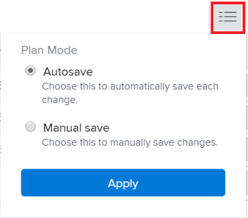
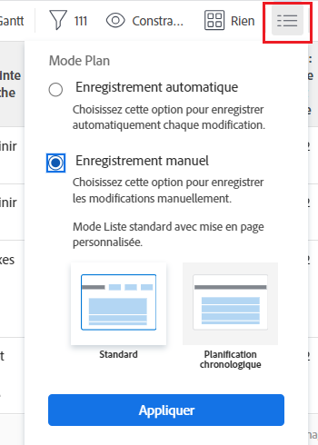

# Modifier les tâches dans une liste {#edit-tasks-in-a-list}

Vous pouvez modifier les informations de la tâche dans une liste de tâches en modifiant les champs affichés dans la liste. Pour plus d’informations sur d’autres méthodes de modification des tâches, voir [Modifier les tâches](../../../manage-work/tasks/manage-tasks/edit-tasks.md).

## Conditions d’accès

Vous devez disposer des accès suivants pour effectuer les étapes de cet article :

<table style="table-layout:auto"> 
 <col> 
 <col> 
 <tbody> 
  <tr> 
   <td role="rowheader">Forfait Adobe Workfront*</td> 
   <td> 
N’importe quelle
 </td> 
  </tr> 
  <tr> 
   <td role="rowheader">Licence Adobe Workfront*</td> 
   <td> 
Travail ou supérieure
 </td> 
  </tr> 
  <tr> 
   <td role="rowheader">Configurations des niveau d’accès*</td> 
   <td> 
Modifier l’accès aux tâches et aux projets
 
Remarque : si vous n’avez toujours pas d’accès, demandez à votre équipe d’administration Workfront s’il existe des restrictions supplémentaires à votre niveau d’accès. Pour plus d’informations sur la façon dont un administrateur ou une administratrice de Workfront peut modifier votre niveau d’accès, voir <a href="../../../administration-and-setup/add-users/configure-and-grant-access/create-modify-access-levels.md" class="MCXref xref">Créer ou modifier les niveaux d’accès personnalisés</a>.
 </td> 
  </tr> 
  <tr> 
   <td role="rowheader">Autorisations d’objet</td> 
   <td> 
Autorisations de contribution ou supérieures à la tâche et au projet
 
Pour plus d’informations sur la demande d’accès supplémentaire, voir <a href="../../../workfront-basics/grant-and-request-access-to-objects/request-access.md" class="MCXref xref">Demander l’accès aux objets</a>.
 </td> 
  </tr> 
 </tbody> 
</table>

&#42;Pour connaître le forfait, le type de licence ou l’accès dont vous disposez, contactez votre administrateur ou administratrice Workfront.

## Remarques sur la modification des tâches dans une liste {#considerations-about-editing-tasks-in-a-list}

La modification de tâches dans une liste permet d’apporter rapidement des modifications à plusieurs tâches simultanément et de voir l’effet des modifications sur la chronologie du projet en un coup d’œil.

Tenez compte des points suivants lors de la modification de tâches dans une liste :

* Contrairement à la modification d’une tâche dans la zone de modification, où des autorisations de gestion sont nécessaires, vous ne pouvez modifier une tâche dans une liste que si vous disposez d’autorisations de contribution pour la tâche. Vous pouvez ainsi modifier les informations limitées suivantes pour la tâche :

   * Description
   * Statut
   * Pourcentage d’achèvement
   * Informations sur les formulaires personnalisés

     >[!NOTE]
     >
     >Vous ne pouvez modifier un champ personnalisé de tâche dans une liste que si vous disposez des autorisations de mise à jour pour le champ.

   * Consigner les heures
   * Modifier les affectations
   * Afficher les informations financières
   * Ajouter des dépenses, des tâches ou des problèmes

* Vous pouvez modifier une tâche dans les listes suivantes :

   * La section Tâches du projet
   * La section Sous-tâches du projet
   * Un rapport de tâche

     >[!NOTE]
     >
     >Par défaut, Workfront enregistre automatiquement vos modifications dans les tâches de la section Sous-tâches ou dans un rapport de tâches.

* Vous pouvez contrôler le moment où Workfront enregistre les modifications que vous apportez aux tâches d’une liste. Vos modifications peuvent être enregistrées automatiquement ou manuellement.

  Pour plus d’informations sur le mode d’enregistrement des modifications que vous apportez aux tâches dans une liste, consultez la section [Sélectionner une option d’enregistrement lors de la modification de tâches dans une liste](#select-a-save-option-when-editing-tasks-in-a-list) de cet article.

* Les autres personnes doivent actualiser leurs pages avant de pouvoir afficher les mises à jour apportées à une tâche.

## Sélectionner une option d’enregistrement lors de la modification de tâches dans une liste {#select-a-save-option-when-editing-tasks-in-a-list}

Vous pouvez choisir d’enregistrer automatiquement les modifications que vous apportez aux tâches d’une liste, ou si vous souhaitez enregistrer manuellement chaque modification.

>[!IMPORTANT]
>
>Selon que vous enregistrez les tâches automatiquement ou manuellement, vous pouvez remplacer les informations d’une autre personne lorsque vous modifiez des tâches dans une liste. Pour plus d’informations sur la façon dont Workfront enregistre les modifications apportées aux tâches que vous effectuez en même temps que d’autres personnes, consultez la section [Vue d’ensemble de l’enregistrement des modifications simultanées dans une liste de tâches](../../../manage-work/tasks/manage-tasks/save-concurrent-changes-in-a-task-list.md).

Lorsque vous enregistrez vos modifications dans une liste pour un projet pour lequel le type de mise à jour est défini sur Automatique ou Automatique et En cas de modification, Workfront met à jour la chronologie du projet, ainsi que toutes les dépendances au sein du projet et inter-projets. Les calculs de chronologie peuvent prendre beaucoup de temps si le projet est volumineux ou s’il y a beaucoup de dépendances. Certaines méthodes de modification d’une liste de tâches peuvent être plus rapides que d’autres, selon le mode d’enregistrement des modifications choisi.

Vous pouvez contrôler le moment où Workfront enregistre les modifications que vous apportez aux tâches d’une liste. Les scénarios suivants existent :

* Workfront peut enregistrer automatiquement les modifications après chaque mise à jour.

  Pour plus d’informations, consultez la section [Modifier les tâches dans une liste et enregistrer automatiquement les modifications](#edit-tasks-in-a-list-and-automatically-save-changes) de cet article.

* Vous pouvez contrôler le moment où vous appliquez plusieurs modifications à la fois en utilisant manuellement le bouton Enregistrer.

  Pour plus d’informations, consultez la section [Modifier les tâches dans une liste et enregistrer manuellement les modifications](#edit-tasks-in-a-list-and-manually-save-changes) de cet article.

### Modifier les tâches dans une liste et enregistrer automatiquement les modifications {#edit-tasks-in-a-list-and-automatically-save-changes}

>[!TIP]
>
>L’enregistrement de vos modifications et de toutes les dépendances de projet peut être plus lent si votre projet comporte plus de 2 000 tâches ou s’il comporte de nombreuses dépendances.

Tenez compte de ce qui suit lorsque vous enregistrez automatiquement les modifications de votre liste de tâches :

* Vous pouvez appliquer une vue personnalisée à la liste des tâches et modifier les champs associés aux tâches que vous avez accès pour effectuer la mise à jour.
* Vous ne pouvez pas annuler les modifications enregistrées automatiquement. Il s’agit du paramètre par défaut.
* Workfront recalcule automatiquement la chronologie du projet et toutes les dépendances internes et inter-projets à chaque modification, lorsque le type de mise à jour du projet est défini sur Automatique ou Automatique et En cs de modification. Pour plus d’informations sur les différents types de mises à jour pour les projets, consultez la section [Sélectionner le type de mise à jour du projet](../../../manage-work/projects/manage-projects/select-project-update-type.md).

Pour modifier les tâches dans une liste et enregistrer automatiquement les modifications :

1. Accédez au projet, puis cliquez sur la section **Tâches**.
1. Cliquez sur le **Menu du mode Plan**  en haut de la liste et assurez-vous de sélectionner l&#39;option **Enregistrement automatique**.

   

1. Modifiez manuellement les champs pour lesquels vous disposez d&#39;autorisations de mise à jour.

   

1. (Facultatif) Appuyez sur **Échap** pour annuler vos modifications.
1. Appuyez sur Entrée pour enregistrer les modifications apportées aux tâches et à la chronologie du projet.
1. (Facultatif) Cliquez avec le bouton droit de la souris sur une tâche à modifier.

   Ou

   Cliquez sur le menu **Plus**  à droite du nom de la tâche.

1. (Facultatif) Sélectionnez l’une des options suivantes :

   <table style="table-layout:auto"> 
    <col> 
    <col> 
    <tbody> 
     <tr> 
      <td role="rowheader"><strong>Ouvrir dans un nouvel onglet</strong></td> 
      <td>Ouvre la tâche dans un nouvel onglet du navigateur. </td> 
     </tr> 
     <tr> 
      <td role="rowheader"><strong>Modifier</strong></td> 
      <td>
Ouvre la zone <strong>Modifier la tâche</strong> dans laquelle vous pouvez modifier la tâche.

Pour plus d’informations sur la modification d’une tâche, consultez la section <a href="#edit-tasks-in-a-list" class="MCXref xref">Modifier les tâches dans une liste</a>.
</td> 
     </tr> 
     <tr> 
      <td role="rowheader">Supprimer</td> 
      <td>
Supprime la tâche.

Pour plus d’informations sur la suppression de tâches, consultez la section <a href="../../../manage-work/tasks/manage-tasks/delete-tasks.md" class="MCXref xref">Supprimer les tâches</a>.
</td> 
     </tr> 
     <tr> 
      <td role="rowheader">Alinéa</td> 
      <td>
Met en retrait la tâche d’un niveau. 

Cette option s’affiche uniquement sur les tâches autonomes.
</td> 
     </tr> 
     <tr> 
      <td role="rowheader">Supprimer un alinéa</td> 
      <td>
Abaisse la tâche d’un niveau. 

Cette option s’affiche uniquement pour les tâches enfants. 
</td> 
     </tr> 
     <tr> 
      <td role="rowheader">Insérer une tâche ci-dessus</td> 
      <td>Insère une tâche au-dessus de la tâche sélectionnée.</td> 
     </tr> 
     <tr> 
      <td role="rowheader">Insérer la tâche ci-dessous</td> 
      <td>Insère une tâche sous la tâche sélectionnée.</td> 
     </tr> 
     <tr> 
      <td role="rowheader">Dupliquer</td> 
      <td>
Crée une version en double de la tâche au sein du même projet. 
</td> 
     </tr> 
     <tr> 
      <td role="rowheader">Copier sur</td> 
      <td>
Copie la tâche vers un autre projet.

Pour plus d’informations sur la copie et la duplication de tâches, consultez la section <a href="../../../manage-work/tasks/manage-tasks/copy-and-duplicate-tasks.md" class="MCXref xref">Copier et dupliquer les tâches</a>.
</td> 
     </tr> 
     <tr> 
      <td role="rowheader">Déplacer vers</td> 
      <td>
Déplace la tâche vers un autre projet.

Pour plus d’informations sur le déplacement de tâches, consultez la section <a href="../../../manage-work/tasks/manage-tasks/move-tasks.md" class="MCXref xref">Déplacer les tâches</a>.
</td> 
     </tr> 
    </tbody> 
   </table>

   Les modifications sont enregistrées automatiquement et cette opération est irréversible.

### Modifier les tâches dans une liste et enregistrer manuellement les modifications {#edit-tasks-in-a-list-and-manually-save-changes}

Vous pouvez enregistrer manuellement les modifications que vous apportez aux tâches dans une liste. Lorsque vous enregistrez les modifications de cette manière, vous avez la possibilité d’annuler les modifications avant de les enregistrer.

>[!TIP]
>
>* Vous ne pouvez pas annuler les modifications que vous apportez aux tâches d’une liste lorsque vous les modifiez dans la section Sous-tâches ou dans un rapport de tâche.
>* Il n’existe aucune limite quant au nombre de modifications que vous pouvez annuler. Vous pouvez annuler les toutes les modifications une par une, jusqu’à revenir à l’état d’origine des tâches.
>

Tenez compte des points suivants lorsque vous enregistrez manuellement les modifications dans une liste de tâches :

* Pour enregistrer manuellement les modifications apportées à la liste des tâches, vous devez disposez d’autorisations de gestion pour les tâches et le projet.
* Vous ne pouvez pas modifier le projet. L’option permettant de modifier le projet est désactivée.
* Vous ne pouvez pas mettre à jour les informations dans l’en-tête du projet. Vous ne pouvez effectuer que les opérations suivantes lorsque vous enregistrez manuellement les modifications dans la liste des tâches :

   * S’abonner au projet
   * Ajouter le projet à votre liste de favoris
   * Ouvrir une tâche en cliquant sur son nom dans la liste

* Vous ne pouvez pas modifier les tâches en bloc, car l’icône Modifier est désactivée lors de la sélection de plusieurs tâches.
* Workfront déclenche des notifications sur les modifications que vous apportez aux tâches uniquement après avoir enregistré vos modifications.

Il existe deux manières d’enregistrer manuellement les modifications apportées aux tâches dans une liste. Ces deux méthodes sont décrites ci-dessous.

* [Enregistrer manuellement les modifications apportées à une liste de tâches en sélectionnant l’option standard Enregistrement manuel](#save-changes-in-a-task-list-manually-when-you-select-the-manual-save-standard-option)
* [Enregistrer manuellement les modifications apportées à une liste de tâches en sélectionnant l’option de planification chronologique Enregistrement manuel](#save-changes-in-a-task-list-manually-when-you-select-the-manual-save-timeline-planning-option)

#### Enregistrer manuellement les modifications apportées à une liste de tâches en sélectionnant l’option standard Enregistrement manuel {#save-changes-in-a-task-list-manually-when-you-select-the-manual-save-standard-option}

>[!TIP]
>
>Si votre projet comporte plus de 2 000 tâches ou de nombreuses dépendances, il peut s’écouler un certain temps avant que les modifications que vous apportez à vos tâches soient visuellement identifiées et reflétées sur toutes les dépendances du projet. Dans ce cas, l’enregistrement de vos modifications peut prendre plus de temps si votre projet comporte plus de 2 000 tâches ou de nombreuses dépendances.

Tenez compte des points suivants lors de la mise à jour des tâches dans une liste après avoir sélectionné l’option standard d’enregistrement manuel :

* Vous pouvez appliquer une vue personnalisée à la liste des tâches et modifier les champs associés aux tâches pour lesquelles vous disposez d’autorisations de gestion dans cette vue.
* Workfront calcule la chronologie du projet et toutes les dépendances internes et inter-projets après avoir cliqué sur Enregistrer, lorsque le type de mise à jour du projet est défini sur Automatique ou Automatique et En cas de modification. Pour plus d’informations sur les différents types de mises à jour des projets, consultez la section [Sélectionner le type de mise à jour du projet](../../../manage-work/projects/manage-projects/select-project-update-type.md).

Pour modifier les tâches d’une liste lors de la sélection de l’option d’enregistrement standard manuel, procédez comme suit :

1. Accédez à un projet, puis cliquez sur la section **Tâches**.
1. Cliquez sur le menu **Mode Plan**  en haut de la liste et sélectionnez **Enregistrement manuel**, puis cliquez sur **Standard** > **Appliquer**.

   

   Un paramètre de barre d’outils s’affiche avec des options permettant d’annuler, de rétablir et d’enregistrer vos modifications.

   

1. Cliquez à l’intérieur des champs pour lesquels vous disposez d’autorisations pour les mettre à jour manuellement. Le champ devient modifiable et vous avez le champ libre pour apporter des modifications.

   

1. Appuyez sur Entrée pour enregistrer temporairement les modifications que vous avez apportées.
1. (Facultatif) Cliquez sur l’**icône Annuler**  pour annuler une modification et rétablir le champ à son état d’origine.
1. (Facultatif et le cas échéant) Cliquez sur l’**icône Rétablir**  pour restaurer la modification annulée.

1. (Facultatif) Cliquez avec le bouton droit de la souris sur une tâche à modifier.

   Ou

   Cliquez sur le menu **Plus** .

1. (Facultatif) Sélectionnez l’une des options suivantes :

   <table style="table-layout:auto"> 
    <col> 
    <col> 
    <tbody> 
     <tr> 
      <td role="rowheader"><strong>Ouvrir dans un nouvel onglet</strong> </td> 
      <td>Ouvre la tâche dans un nouvel onglet du navigateur. </td> 
     </tr> 
     <tr> 
      <td role="rowheader">Supprimer</td> 
      <td>Pour plus d’informations sur la suppression de tâches, consultez la section <a href="../../../manage-work/tasks/manage-tasks/delete-tasks.md" class="MCXref xref">Supprimer des tâches</a>.</td> 
     </tr> 
     <tr> 
      <td role="rowheader">Alinéa</td> 
      <td> 
Met en retrait la tâche d’un niveau. 
 
Cette option s’affiche uniquement sur les tâches autonomes.
 </td> 
     </tr> 
     <tr> 
      <td role="rowheader">Supprimer un alinéa</td> 
      <td> 
Abaisse la tâche d’un niveau. 
 
Cette option s’affiche uniquement pour les tâches enfants. 
 </td> 
     </tr> 
     <tr> 
      <td role="rowheader">Insérer une tâche ci-dessus</td> 
      <td>Insère une tâche au-dessus de la tâche sélectionnée.</td> 
     </tr> 
     <tr> 
      <td role="rowheader">Insérer la tâche ci-dessous</td> 
      <td>Insère une tâche sous la tâche sélectionnée.</td> 
     </tr> 
     <tr> 
      <td role="rowheader">Dupliquer</td> 
      <td> 
Crée une version en double de la tâche au sein du même projet. 
 
Pour plus d’informations sur la copie et la duplication de tâches, consultez la section <a href="../../../manage-work/tasks/manage-tasks/copy-and-duplicate-tasks.md" class="MCXref xref">Copier et dupliquer les tâches</a>.
 </td> 
     </tr> 
    </tbody> 
   </table>

1. Workfront met à jour toutes les dépendances internes aux projets et inter-projets lorsque vous modifiez la chronologie des tâches.
1. Cliquez sur **Enregistrer** lorsque vous souhaitez conserver vos modifications de tâche de manière permanente et enregistrer la chronologie du projet.

#### Enregistrer manuellement les modifications apportées à une liste de tâches en sélectionnant l’option de planification chronologique Enregistrement manuel {#save-changes-in-a-task-list-manually-when-you-select-the-manual-save-timeline-planning-option}

L’enregistrement de vos modifications et de toutes les dépendances du projet est l’option la plus rapide. Notez qu’elle n’est pas disponible pour les projets comportant plus de 2 000 tâches.

>[!IMPORTANT]
>
>Nous vous recommandons d’utiliser cette option lors de la modification d’une grande liste de tâches de plus de quelques centaines ayant de nombreuses dépendances. Cette option vous permet d’identifier visuellement vos modifications beaucoup plus rapidement que lors de l’enregistrement manuel.

Tenez compte des points suivants lorsque vous utilisez l’option de planification chronologique Enregistrement manuel dans une liste de tâches :

* L’option de planification chronologique Enregistrement manuel n’est pas disponible pour les projets comportant plus de 2 000 tâches.
* Vous ne pouvez pas appliquer une vue, un filtre ou un regroupement personnalisé à la liste des tâches. Les menus déroulants Vue, Filtre et Regroupement, ainsi que l’icône Vue agile, sont désactivés. La vue appliquée par défaut contient un nombre limité de champs.
* La chronologie du projet et toutes les dépendances internes au projet sont calculées automatiquement après chaque modification lorsque le type de mise à jour du projet est Automatique ou Automatique et En cas de modification.
* Les dépendances inter-projets sont calculées après avoir cliqué sur Enregistrer, lorsque le type de mise à jour du projet est Automatique ou Automatique et En cas de modification. Pour plus d’informations sur les différents types de mises à jour des projets, consultez la section [Sélectionner le type de mise à jour du projet](../../../manage-work/projects/manage-projects/select-project-update-type.md).

Pour modifier des tâches dans une liste lors de l’utilisation de l’option de planification chronologique Enregistrement manuel, procédez comme suit :

1. Accédez à un projet, puis cliquez sur la section **Tâches**.
1. Cliquez sur le menu **Mode Plan**  en haut de la liste et sélectionnez **Enregistrement manuel**, puis cliquez sur **Planification chronologique**> **Appliquer**.

   Cette option est grisée pour les projets comportant plus de 2 000 tâches.

   

   >[!TIP]
   >
   >Lorsque vous quittez cette page, Workfront réactive l’option d’enregistrement automatique.

   Notez les modifications suivantes dans la liste :

   * Les menus déroulants Vue, Regroupement et Filtre sont supprimés et la vue est remplacée par les champs suivants :

      * Numéro de tâche
      * Nom de la tâche
      * Type de contrainte
      * Durée
      * Date de début prévue
      * Date d&#39;achèvement prévue
      * Tâches antérieures
      * Affectations
      * Statut
      * Pourcentage d’achèvement

   * L’icône Vue Agile est supprimée.
   * Un paramètre de barre d’outils s’affiche avec des options permettant d’annuler, de rétablir et d’enregistrer vos modifications.

     

1. Modifiez manuellement les champs pour lesquels vous disposez d&#39;autorisations de mise à jour.

   

1. Appuyez sur Entrée pour enregistrer temporairement les modifications que vous avez apportées.
1. (Facultatif) Cliquez sur l’**icône Annuler**  pour annuler une modification et rétablir le champ à son état d’origine.
1. (Facultatif et le cas échéant) Cliquez sur l’**icône Rétablir**  pour rétablir la modification que vous avez annulée.

1. (Facultatif) Cliquez avec le bouton droit sur une tâche à modifier.

   Ou

   Cliquez sur le menu **Plus** .

1. Sélectionnez l’une des options suivantes :

   <table style="table-layout:auto"> 
    <col> 
    <col> 
    <tbody> 
     <tr> 
      <td role="rowheader"><strong>Ouvrir dans un nouvel onglet</strong> </td> 
      <td>Ouvre la tâche dans un nouvel onglet du navigateur. </td> 
     </tr> 
     <tr> 
      <td role="rowheader">Supprimer</td> 
      <td>Pour plus d’informations sur la suppression de tâches, consultez la section <a href="../../../manage-work/tasks/manage-tasks/delete-tasks.md" class="MCXref xref">Supprimer des tâches</a>.</td> 
     </tr> 
     <tr> 
      <td role="rowheader">Alinéa</td> 
      <td> 
Met en retrait la tâche d’un niveau. 
 
Cette option s’affiche uniquement sur les tâches autonomes.
 </td> 
     </tr> 
     <tr> 
      <td role="rowheader">Supprimer un alinéa</td> 
      <td> 
Abaisse la tâche d’un niveau. 
 
Cette option s’affiche uniquement pour les tâches enfants. 
 </td> 
     </tr> 
     <tr> 
      <td role="rowheader">Insérer une tâche ci-dessus</td> 
      <td>Insère une tâche au-dessus de la tâche sélectionnée.</td> 
     </tr> 
     <tr> 
      <td role="rowheader">Insérer la tâche ci-dessous</td> 
      <td>Insère une tâche sous la tâche sélectionnée.</td> 
     </tr> 
     <tr> 
      <td role="rowheader">Dupliquer</td> 
      <td> 
Crée une version en double de la tâche au sein du même projet. 
 
Pour plus d’informations sur la copie et la duplication de tâches, voir <a href="../../../manage-work/tasks/manage-tasks/copy-and-duplicate-tasks.md" class="MCXref xref">Copier et dupliquer des tâches</a>.
 </td> 
     </tr> 
    </tbody> 
   </table>

1. Workfront met à jour toutes les dépendances internes aux projets et inter-projets lorsque vous modifiez la chronologie d’une tâche.
1. Cliquez sur **Enregistrer** lorsque vous souhaitez conserver vos modifications de tâche de manière permanente et enregistrer la chronologie du projet.

## Modifier une tâche dans une liste à l’aide du résumé

1. Accédez au projet contenant les tâches à modifier.
1. Cliquez sur **Tâches** dans le panneau de gauche.

   La liste des tâches du projet s’affiche.

1. Cliquez sur le menu Plus  après le nom de la tâche, puis cliquez sur **Ouvrir le résumé**. Sélectionnez la tâche à modifier, puis cliquez sur l’**icône Ouvrir le résumé**  dans le coin supérieur droit de la liste.

   Le panneau **Résumé** s’affiche.

   

1. (Facultatif) Cliquez sur l’**icône X** dans le coin supérieur droit du résumé pour fermer le panneau et modifier les tâches en ligne.

   Suivez les étapes de modification d’une tâche dans une liste pour la modifier en ligne.

   Pour plus d’informations sur la modification de la tâche dans une liste, voir [Remarques relatives à la modification des tâches dans une liste](#considerations-about-editing-tasks-in-a-list) de cet article.

1. (Facultatif) Saisissez une mise à jour pour la tâche dans la zone **Mises à jour**.
1. Cliquez sur l’une des icônes ou zones suivantes pour accéder à la tâche et modifier les informations à l’échelle de la tâche :

   | Documents | Cliquez sur **Cliquez ici pour ajouter** pour ajouter des documents à la tâche. |
   |---|---|
   | Détails | Cliquez pour mettre à jour les informations sur la tâche. |
   | Formulaires personnalisés | Cliquez pour ajouter ou supprimer des formulaires personnalisés ou mettre à jour les informations sur les formulaires. |
   | Heures | Cliquez pour consigner des heures. |
   | Approbations | Cliquez pour ajouter des approbations de tâches. |

   {style="table-layout:auto"}

1. Cliquez sur le bouton Retour de votre navigateur pour revenir à la liste des tâches lorsque vous avez terminé la mise à jour de la tâche.

## Modifier les tâches en masse

Vous pouvez modifier plusieurs tâches à la fois. Assurez-vous que vous disposez des autorisations de gestion pour les tâches afin de pouvoir les modifier.

1. Accédez à un projet contenant les tâches que vous souhaitez modifier en masse.
1. Cliquez sur **Tâches** dans le panneau de gauche.
1. Assurez-vous que l’option **Enregistrement automatique** est sélectionnée.

   >[!IMPORTANT]
   >
   >Vous ne pouvez pas modifier les tâches en masse en utilisant l’enregistrement manuel des tâches.

   Pour plus d’informations sur les façons d’enregistrer les modifications apportées aux tâches d’une liste, voir la section [Remarques sur la modification des tâches d’une liste](#considerations-about-editing-tasks-in-a-list) de cet article.

1. Sélectionnez plusieurs tâches dans la liste des tâches.
1. Cliquez sur l’**icône Modifier** .

   La boîte de dialogue **Modifier les tâches** s’ouvre.

1. Indiquez les informations à modifier pour toutes les tâches sélectionnées.

   Modifier des informations sur toutes les tâches revient à modifier des informations sur une tâche. Si vous souhaitez modifier la durée de la tâche, les tâches sélectionnées doivent avoir la même contrainte de tâche. Dans le cas contraire, le champ **Durée** ne s’affiche pas.

   Pour plus d’informations sur la modification d’une tâche, voir [Modifier les tâches](../../../manage-work/tasks/manage-tasks/edit-tasks.md).

   >[!NOTE]
   >
   >Les informations que vous modifiez sur toutes les tâches sélectionnées remplacent les informations existantes sur chaque tâche, à l’exception du champ **Affectations**. L’ajout d’une nouvelle personne cessionnaire dans la modification en masse l’ajoute à toutes les tâches sélectionnées. Si d’autres personnes cessionnaires sont affectées aux tâches sélectionnées, elles restent affectées en plus de celle ajoutée par modification en masse.

1. Cliquez sur **Formulaires personnalisés** pour modifier les formulaires personnalisés associés à toutes les tâches sélectionnées. Seuls les formulaires personnalisés actifs sont affichés dans la liste.

   Si les tâches sélectionnées ne comportent aucun formulaire personnalisé commun, aucun formulaire n’est répertorié dans cette section.

   Vous ne pouvez modifier que les champs des formulaires associés à toutes les tâches sélectionnées et que vous avez l’autorisation de modifier.

1. (Facultatif) Dans la section Formulaires personnalisés, sélectionnez l’option **Recalculer les expressions personnalisées** pour vous assurer que tous les champs personnalisés calculés qui se trouvent sur les formulaires personnalisés joints aux tâches sélectionnées sont à jour.
1. Cliquez sur **Enregistrer les modifications**.

   Toutes les modifications que vous avez apportées sont désormais visibles pour toutes les tâches sélectionnées.

Pour plus d’informations sur la modification en masse de formulaires personnalisés, reportez-vous à la section « Modifier plusieurs formulaires personnalisés lors de la modification en masse d’objets » dans [Gestion des formulaires personnalisés associés à des objets](../../../workfront-basics/work-with-custom-forms/manage-custom-forms-attached-to-objects.md).
