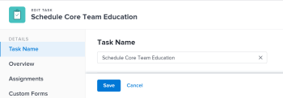

# Modifier les tâches

<!--Audited: 07/2024-->

<!--

(NOTE: some information in this area is repeated in the following articles. If you need to update a field, update it in both:

** Task finances in details

** Task information in overview)

-->

Vous pouvez modifier les informations sur les tâches que vous avez créées ou sur lesquelles vous disposez des autorisations de contribution ou de gestion.

## Conditions d’accès

+++ Développez pour afficher les exigences d’accès aux fonctionnalités de cet article.

<table style="table-layout:auto"> 
 <col> 
 <col> 
 <tbody> 
  <tr> 
   <td role="rowheader">Forfait Adobe Workfront</td> 
   <td> 
N’importe quelle 
 </td> 
  </tr> 
  <tr> 
   <td role="rowheader">Licence Adobe Workfront*</td> 
   <td> 
Nouvelle : standard

   
Actuellement : Travail ou licence supérieure
 </td> 
  </tr> 
  <tr> 
   <td role="rowheader">Niveau d’accès</td> 
   <td> 
Accès en modification aux tâches et aux projets
 </td> 
  </tr> 
  <tr> 
   <td role="rowheader">Autorisations d’objet</td> 
   <td> 
    <ul> 
     <li> 
Autorisations de contribution pour une tâche afin de modifier les informations suivantes dans la zone Détails de la tâche : 

     <ul>
     <li>Description</li>
     <li>Statut</li>
     </ul>  
      </li> 
     <li> 
Autorisations de gestion pour une tâche afin de modifier toutes les informations dans les zones Détails et Modifier la tâche
 </li> 
    </ul> 
    <ul> 
     <li> 
Autorisations de contribution ou supérieures pour le projet
 </li> 
    </ul> </td> 
  </tr> 
 </tbody> 
</table>

*Pour plus d’informations, voir [Exigences d’accès dans la documentation Workfront](/help/quicksilver/administration-and-setup/add-users/access-levels-and-object-permissions/access-level-requirements-in-documentation.md).

+++

## Restrictions relatives à la modification des tâches

Certaines restrictions peuvent vous empêcher de modifier des tâches.

Tenez compte des points suivants lors de la modification des tâches :

* La mise à jour des tâches déclenche des notifications pour les projets dont l’état est En cours. Pour éviter toute confusion pour les personnes affectées aux tâches, limitez autant que possible les tâches de modification lorsque le statut du projet est En cours.
* Vous ne pouvez pas modifier les tâches qui se trouvent dans un processus d’approbation. Vous pouvez uniquement consigner l’heure ou mettre à jour le statut d’une tâche dans un processus d’approbation.

  

* Vous pouvez modifier et ajouter des documents aux tâches d’un projet dont le statut est Terminé, Inactif ou En attente d’approbation uniquement si votre équipe d’administration Workfront ou de groupe a activé cette fonctionnalité dans la zone Préférences du projet. Pour plus d’informations sur la définition des préférences de projet, voir [Configurer des préférences de projet à l’échelle du système](../../../administration-and-setup/set-up-workfront/configure-system-defaults/set-project-preferences.md).

* Vous pouvez toujours modifier les informations suivantes d’une tâche lorsque le projet a été marqué comme Terminé, Inactif ou qu’il se trouve dans un processus d’approbation :

   * Enregistrer des heures
   * Modifier des dépenses existantes
   * Joindre un formulaire personnalisé

* Les autres personnes doivent actualiser leurs pages avant de pouvoir afficher les mises à jour apportées à une tâche.

## Modifier les tâches dans une liste

Vous pouvez modifier les informations de la tâche dans une liste de tâches, en modifiant en ligne les champs affichés dans la vue de la liste.

Pour plus d’informations sur la modification des tâches dans les listes, voir [Modifier les tâches dans une liste](../../../manage-work/tasks/manage-tasks/edit-tasks-in-a-list.md).

## Modifier une tâche dans une liste à l’aide du résumé

Vous pouvez modifier une tâche dans une liste à l’aide du panneau Résumé. Pour plus d’informations sur la modification d’une tâche dans le panneau Résumé, reportez-vous à la section « Modifier une tâche dans le résumé » de l’article [Modifier les tâches dans une liste](../../../manage-work/tasks/manage-tasks/edit-tasks-in-a-list.md).

## Modifier une tâche dans la zone Modifier la tâche

Vous pouvez modifier une tâche à l’aide des zones Modifier la tâche ou Détails de la tâche. Les étapes suivantes décrivent la modification d’une tâche dans la zone Modifier la tâche.

{{step1-click-main-menu}}

1. Cliquez sur **Projets**, puis sur le nom d’un projet pour l’ouvrir.
1. Cliquez sur **Tâches** dans le panneau de gauche.
1. Cliquez sur la tâche à modifier.
1. (Le cas échéant) Pour modifier des informations limitées sur une tâche, cliquez sur **Détails de la tâche** dans le panneau de gauche.

   

   Tenez compte des informations de modification dans les zones suivantes de la section Détails de la tâche :

   * **Vue d’ensemble**

     Cette zone est développée par défaut.

   * **Formulaires personnalisés**

     Les noms des formulaires personnalisés ne s’affichent que s’il existe des formulaires personnalisés joints à l’objet.

   * **Finances**

   >[!NOTE]
   >
   >Selon la manière dont votre équipe d’administration Workfront ou de groupe a modifié votre modèle de disposition, les champs de la zone Détails de la tâche peuvent être réorganisés ou masqués. Pour plus d’informations, voir [Personnaliser la vue Détails à l’aide d’un modèle de disposition](../../../administration-and-setup/customize-workfront/use-layout-templates/customize-details-view-layout-template.md).

   Pour plus d’informations sur les champs visibles dans la section Détails de la tâche, continuez à modifier la tâche dans la zone Modifier la tâche comme décrit ci-dessous.

   Pour modifier les informations de la section Détails, procédez comme suit :

   1. (Facultatif) Cliquez sur l’icône **Réduire tout**  dans le coin supérieur droit pour réduire toutes les zones.
   1. (Facultatif et le cas échéant) Lorsqu’une zone est réduite, cliquez sur la **flèche droite**  en regard de chaque zone pour développer celle à modifier.
   1. Pour plus d’informations sur la modification des informations dans l’onglet Détails de la tâche, voir les articles suivants :

      * [Gérer les informations des tâches dans la zone Vue d’ensemble des détails de la tâche](../../../manage-work/tasks/manage-tasks/task-information-in-overview.md)
      * [Gérer les finances des tâches dans la section Détails de la tâche](../../../manage-work/tasks/manage-tasks/task-finances-in-details.md)

   1. (Facultatif) S’il n’existe aucun formulaire personnalisé joint à la tâche, commencez à saisir le nom d’un formulaire dans le champ **Ajouter un formulaire personnalisé** puis sélectionnez-le lorsqu’il s’affiche dans la liste, puis cliquez sur **Enregistrer les modifications**.
   1. (Facultatif) Cliquez sur l’icône **Exporter**  pour exporter les informations de vue d’ensemble et de formulaires personnalisés vers un fichier PDF, puis cliquez sur **Exporter**. Sélectionnez l’une des options suivantes :

      * Sélectionner tout (s’affiche uniquement lorsqu’au moins un formulaire personnalisé est joint)
      * Vue d’ensemble
      * Le nom d’un ou de plusieurs formulaires personnalisés

      Le fichier PDF est téléchargé sur votre ordinateur.

      

      Pour plus d’informations, voir [Exporter les formulaires personnalisés et les détails des objets](../../../workfront-basics/work-with-custom-forms/export-custom-forms-details.md).

1. (Le cas échéant) Pour modifier toutes les informations relatives à la tâche, en tant que personne avec les autorisations de gestion pour la tâche, cliquez sur le menu **Plus**  en regard du nom de la tâche, puis cliquez sur **Modifier**.

   Ou

   Dans une liste de tâches, sélectionnez une tâche, puis cliquez sur l’icône **Modifier**  en haut de la liste.

   La boîte de dialogue Modifier la tâche s’ouvre.

   >[!IMPORTANT]
   >
   >Pour afficher l’option Modifier, vous devez disposer des autorisations Gérer pour la tâche.

   Tous les champs de tâche sont disponibles dans la zone Modifier la tâche et sont regroupés par zones répertoriées dans le panneau de gauche.

   >[!NOTE]
   >
   >Selon la manière dont votre équipe d’administration Workfront ou de groupe a modifié votre modèle de disposition, les champs de la zone Détails de la tâche peuvent être réorganisés ou masqués. Pour plus d’informations, voir [Personnaliser la vue Détails à l’aide d’un modèle de disposition](../../../administration-and-setup/customize-workfront/use-layout-templates/customize-details-view-layout-template.md).

   Envisagez d’indiquer des informations dans l’une des sections suivantes :

   * [Nom de la tâche](#task-name)
   * [Vue d’ensemble](#overview)
   * [Affectations](#assignments)
   * [Formulaires personnalisés](#Custom%C2%A0F)
   * [Finances](#finance)
   * [Paramètres](#settings)

   >[!NOTE]
   >
   >Selon la manière dont votre administrateur Workfront ou votre administrateur de groupe configure votre modèle de mise en page, les champs de la zone Modifier la tâche peuvent être réorganisés ou non. Pour plus d’informations, voir [Personnaliser la vue Détails à l’aide d’un modèle de disposition](../../../administration-and-setup/customize-workfront/use-layout-templates/customize-details-view-layout-template.md).

### Nom de la tâche {#task-name}

1. Commencez à modifier votre tâche comme décrit ci-dessus.
1. Cliquez sur **Nom de la tâche** dans le panneau de gauche.

   

1. Mettez à jour le nom de la tâche.

1. Cliquez sur **Enregistrer** ou passez aux sections suivantes.

### Vue d’ensemble {#overview}

1. Commencez à modifier votre tâche comme décrit ci-dessus.
1. Cliquez sur **Vue d’ensemble** dans le panneau de gauche.

   

1. Mettez à jour les informations suivantes sur la tâche :

   <table style="table-layout:auto"> 
    <col> 
    <col> 
    <tbody> 
     <tr> 
      <td role="rowheader">Description</td> 
      <td>Ajoutez des informations supplémentaires sur la tâche. </td> 
     </tr> 
     <tr> 
      <td colspan="2" role="rowheader">Section Informations de base </td> 
     </tr> 
     <tr> 
      <td role="rowheader">Statut</td> 
      <td> 
Sélectionnez l’état de la tâche qui indique à quel stade de développement se trouve la tâche.
 
<b>CONSEIL</b>

   Vous pouvez mettre à jour le statut de la tâche dans l’en-tête de la tâche. 
 </td>
   </tr> 
     <tr> 
      <td role="rowheader">Priorité</td> 
      <td> 
Il s’agit d’un indicateur visuel qui vous permet de hiérarchiser vos tâches. 
 
Sélectionnez l’une des options suivantes : 
 
       <ul> 
      <li> 
 Aucun
 </li> 
      <li> 
 Faible 
 </li> 
      <li> 
Normal 
 </li> 
      <li> 
Élevé 
 </li> 
      <li> 
 Urgent 
 </li> 
       </ul> 
Selon les préférences du projet sélectionnées par votre administrateur ou administratrice Workfront, les noms des priorités peuvent être différents pour vous. Pour plus d’informations sur les priorités des tâches, voir <a href="../../../manage-work/tasks/task-information/task-priority.md" class="MCXref xref">Mettre à jour la priorité des tâches</a>. 
 </td> 
     </tr> 
     <tr> 
      <td colspan="2" role="rowheader"> Section Dates et contraintes de tâche  </td> 
     </tr> 
     <tr> 
      <td role="rowheader">Contrainte de tâche</td> 
      <td> 
Déterminez quand la tâche doit être terminée en spécifiant une contrainte de tâche. 
 
Sélectionnez l’une des options suivantes : 
 
       <ul> 
      <li> 
Dates fixes 
 
Indiquez un <strong>Démarrage prévu</strong> et une <strong>date d’achèvement prévue</strong>. 
 </li> 
      <li> 
Doit commencer le 
 
Indiquez une <strong>date de début prévue</strong>. 
 </li> 
      <li> 
Doi se terminer le 
 
INdiquez une <strong>date d’achèvement prévue</strong>. 
 </li> 
       </ul> 
       <ul> 
      <li> 
Le plus tôt possible
 </li> 
      <li> 
Le plus tard possible
 </li> 
      <li> 
Première Heure Disponible
 </li> 
      <li> 
 Dernière heure disponible
 </li> 
      <li> 
Commencer au plus tard le 
 </li> 
      <li> 
Indiquer une date de début prévue
 </li> 
      <li> 
Commencer au plus tôt le 
 
Indiquez une <strong>date de début prévue</strong>. 
 </li> 
      <li> 
 Finir au plus tard le
 
Indiquez une <strong>date d’achèvement prévue</strong>. 
 </li> 
      <li> 
 Finir au plus tôt le
 
Indiquer une <strong>date d’achèvement prévue</strong>
 </li> 
       </ul> 
Pour plus d’informations sur la contrainte de tâche, voir <a href="../../../manage-work/tasks/task-constraints/task-constraint-overview.md" class="MCXref xref">Vue d’ensemble de la contrainte de tâche</a>.
 </td> 
     </tr> 
     <tr> 
      <td role="rowheader">Date d’engagement et heure</td> 
      <td> 
Il s’agit de la date à laquelle la personne affectée à la tâche s’engage à la terminer. Il peut s’agir d’une date d’achèvement planifiée différente. Seules les personnes assignées peuvent modifier ce champ. Pour plus d’informations sur les dates d’engagement, consultez <a href="../../../manage-work/projects/updating-work-in-a-project/overview-of-commit-dates.md" class="MCXref xref">Vue d’ensemble de la date d’engagement</a>. 
 </td> 
     </tr> 
     <tr> 
      <td role="rowheader">Date et heure de début prévues</td> 
      <td> 
Date à laquelle le début de la tâche est prévu. La date de début prévue d’une tâche est définie et influencée par un certain nombre de facteurs :
 
       <ul> 
      <li>Selon la préférence système pour la date de début prévue de la tâche, la date de début d’une nouvelle tâche d’un projet peut être la date du jour, ou la date de début du projet, par défaut. L’équipe d’administration du groupe associé au projet peut également définir cette préférence pour le groupe. Pour plus d’informations sur les préférences de tâche au niveau du système ou du groupe, voir <a href="../../../administration-and-setup/set-up-workfront/configure-system-defaults/set-task-issue-preferences.md" class="MCXref xref">Configuration des préférences de tâche et de problème à l’échelle du système</a>.</li> 
      <li>Selon les prédécesseurs de la tâche, Workfront choisit la date de début prévue comme prochaine date disponible après la fin ou le début des prédécesseurs ou selon la relation entre les prédecesseurs. Pour plus d’informations sur les relations entre les prédécesseurs, voir <a href="../../../manage-work/tasks/use-prdcssrs/predecessors-overview.md" class="MCXref xref">Vue d’ensemble des prédécesseurs de tâches</a>.</li> 
      <li>La personne en charge du projet ou propriétaire de la tâche peut définir manuellement la date de début prévue lorsque la contrainte de tâche est Dates fixes ou Doit commencer le. Pour plus d’informations sur les contraintes de tâche, voir <a href="../../../manage-work/tasks/task-constraints/task-constraint-overview.md" class="MCXref xref">Vue d’ensemble de la contrainte de tâche</a>.</li> 
       </ul> </td> 
     </tr> 
     <tr> 
      <td role="rowheader">Date et heure d’achèvement prévues</td> 
      <td> 
Date d’achèvement anticipée, comme indiqué lors de la planification de la tâche. Workfront définit la date d’achèvement prévue à l’aide de certains des facteurs suivants :
 
       <ul> 
      <li>La date d’achèvement prévue est calculée à partir de la date de début prévue en ajoutant la durée de la tâche à la date de début prévue. Lorsque la personne en charge du projet ou Workfront spécifie la durée de la tâche, cela déclenche une mise à jour de la date d’achèvement prévue. Si la date planifiée change, c'est souvent parce que la Durée de la tâche a été mise à jour.</li> 
      <li>La personne en charge du projet ou propriétaire de la tâche peut définir manuellement la date d’achèvement prévue lorsque la contrainte de tâche est Dates fixes ou Doit se terminele. Pour plus d’informations sur les contraintes de tâche, voir <a href="../../../manage-work/tasks/task-constraints/task-constraint-overview.md" class="MCXref xref">Vue d’ensemble de la contrainte de tâche</a>.</li> 
      <li>Si le type de durée de la tâche et que le nombre de ressources sur les tâches changent en même temps, la date d’achèvement prévue change également. Pour plus d’informations sur les types de durée, voir <a href="../../../manage-work/tasks/taskdurtn/task-duration-and-duration-type.md" class="MCXref xref">Vue d’ensemble de la durée et du type de durée des tâches</a>.</li> 
       </ul> </td> 
     </tr> 
     <tr> 
      <td role="rowheader">Date et heure de début effectives</td> 
      <td> 
Indiquez une date de début effective de la tâche. La valeur par défaut est généralement renseignée automatiquement lorsque vous définissez l’état de la tâche sur En cours. La date de début effective peut également être modifiée manuellement par la personne en charge du projet ou propriétaire de la tâche. 
 </td> 
     </tr> 
     <tr> 
      <td role="rowheader">Date et heure d’achèvement effectives</td> 
      <td> 
Indiquez la date et l’heure effectives auxquelles la tâche s’achève. La date et l’heure par défaut auxquelles une tâche est terminée correspondent toujours à l’heure effective à laquelle le statut devient Terminé. La date d’achèvement effective peut également être modifiée manuellement par la personne en charge du projet ou propriétaire de la tâche. 
 </td> 
     </tr> 
     <tr> 
      <td role="rowheader"><b>Section de temps de travail</b></td> 
     </tr> 
     <tr> 
      <td role="rowheader">Effort de travail </td> 
      <td>

   
Quantité d’effort requise pour terminer la tâche. La personne en charge du projet peut décider d’utiliser ce champ au lieu du nombre d’heures prévues pour estimer l’effort nécessaire pour terminer une tâche. Ce champ n’est visible que lorsque les conditions suivantes sont remplies :
 
      <ul> 
      <li> 
La tâche a un type de durée simple. 
 
<b>CONSEIL</b>

   Si vous modifiez le type de durée de la tâche, ce champ devient grisé. 
 </li>
   <li>La personne en charge du projet a activé le champ Effort de travail pour calculer automatiquement le champ Nombre d’heures prévues detâche du projet. </li> 
      </ul> 
      
Sélectionnez l’une des options suivantes :
 
      <ul> 
      <li>Petite</li> 
      <li>Moyenne (il s’agit de la valeur par défaut pour une nouvelle tâche)</li> 
      <li>Grande</li> 
      </ul> 
      
<b>NOTE</b>

   La mise à jour de la quantité d’effort peut mettre à jour le nombre d’heures prévues de la tâche. La mise à jour est immédiate si le type de mise à jour du projet est automatique. Lorsque le type de mise à jour du projet est Manuel, vous devez recalculer la chronologie pour afficher les heures planifiées mises à jour. 

   
Pour plus d’informations sur l’utilisation de l’effort de travail au lieu du nombre d’heures prévues pour estimer l’effort de tâche, voir <a href="../../../manage-work/tasks/task-information/work-effort.md" class="MCXref xref">Vue d’ensemble de l’effort de travail</a>. 
 
    </td> 
     </tr> 
    </tbody> 
   </table>

1. Cliquez sur **Enregistrer** ou passez aux sections suivantes.

### Affectations {#assignments}

1. Commencez à modifier votre tâche comme décrit ci-dessus.
1. Cliquez sur **Affectations** dans le panneau de gauche.

   

1. Cliquez sur **Recherche de personnes, de rôles et d’équipes** et commencez à saisir le nom d’une personne, d’un rôle ou d’une équipe que vous souhaitez affecter à la tâche, puis cliquez dessus ou appuyez sur Entrée lors de son affichage dans la liste.

   >[!NOTE]
   >
   >Si le nom de l’utilisateur ou utilisatrice contient un caractère spécial, vous devez l’inclure dans le champ de recherche.

   >[!TIP]
   >
   >Vous pouvez affecter plusieurs utilisateurs et utilisatrices, fonctions ou équipes. Vous pouvez affecter uniquement les utilisateurs et utilisatrices, fonctions et équipes actifs.
   >
   >Si une personne, une fonction ou une équipe a été affectée avant d’être désactivée, elle reste affectée à l’élément de travail. Dans ce cas, nous vous recommandons ce qui suit :
   >
   >* Réaffectez l’élément de travail aux ressources actives.
   >* Associez les personnes d’une équipe désactivée à une équipe active et réaffectez l’élément de travail à l’équipe active.

1. (Facultatif) Indiquez si une personne cessionnaire est la personne cessionnaire principale de la tâche en sélectionnant la case d’option **Propriétaire** en regard de son nom. Une équipe ne peut pas être le cessionnaire principal d’une tâche.
1. (Conditionnel et le cas échéant) Mettez à jour les champs suivants :

   <table style="table-layout:auto"> 
    <col> 
    <col> 
    <tbody> 
     <tr> 
      <td role="rowheader">Type de durée</td> 
      <td> 
Permet d’identifier la relation entre les éléments suivants : 
 
       <ul> 
      <li> 
Le nombre de ressources affectées à une tâche. 
 </li> 
      <li> 
L’effort total nécessaire à la réalisation de la tâche. 
 </li> 
      <li> 
 La durée totale de la tâche. 
 </li> 
       </ul> 
Votre administrateur Workfront ou un administrateur de groupe sélectionne le paramètre Type de durée par défaut pour les tâches de votre système ou de votre groupe. Pour plus d’informations sur la définition des paramètres par défaut d’un projet, consultez la section <a href="../../../administration-and-setup/set-up-workfront/configure-system-defaults/set-project-preferences.md" class="MCXref xref">Configurer les préférences des projets à l’échelle du système</a>. 
 
Les types de durée vous permettent de définir des affectations de ressources cohérentes en fonction des besoins de la tâche. Pour plus d’informations sur le type de durée d’une tâche, consultez la section <a href="../../../manage-work/tasks/taskdurtn/task-duration-and-duration-type.md" class="MCXref xref">Vue d’ensemble de la durée et du type de durée des tâches</a>. 
 
Sélectionnez l’une des options suivantes : 
 
       <ul> 
      <li> 
Calcul d'affectation 
 </li> 
      <li> 
 Calcul de travail 
 </li> 
      <li> 
Piloté par l'effort 
 </li> 
      <li> 
Simple
 </li> 
       </ul> </td> 
     </tr> 
     <tr data-mc-conditions="QuicksilverOrClassic.Quicksilver"> 
      <td role="rowheader">Durée par occurrence</td> 
      <td> 
Cette option s’affiche uniquement sur le parent des tâches récurrentes. Elle affiche la durée de chaque tâche récurrente, telle que définie lors de la création de la tâche. Pour plus d’informations sur la création de tâches récurrentes, consultez la section <a href="../../../manage-work/tasks/create-tasks/create-recurring-tasks.md" class="MCXref xref">Créer des tâches récurrentes</a>. 
 
 <b>NOTE</b>

   Les durées modifiées dans des tâches récurrentes individuelles n’affichent pas la valeur indiquée dans ce champ. 
 </td>
   </tr> 
     <tr> 
      <td role="rowheader">Durée</td> 
      <td> 
      
 
      
 
      
Il s’agit de la durée pendant laquelle vous laissez une tâche en cours avant qu’elle ne soit terminée. 
 
      
<b>IMPORTANT</b>

   Comme la durée de la tâche correspond généralement au temps écoulé entre les dates de début et de fin prévues, elle affecte la chronologie du projet.

   
Pour indiquer la durée de la tâche et l’unité de temps, procédez comme suit :
 
      <ul> 
      <li> 
Saisissez la durée et sélectionnez une unité de temps dans le menu déroulant.
 
<b>CONSEIL</b>

      Lorsque vous mettez à jour la durée des tâches dans une liste de tâches, vous pouvez utiliser l’abréviation pour l’unité de temps. 
 </li> 
      </ul> 
      
 Vous pouvez choisir parmi les options de temps normal ou de temps écoulé dans le tableau suivant : 
 
      <table style="table-layout:auto"> 
      <col> 
      <col data-mc-conditions=""> 
      <tbody> 
      <tr> 
      <td>Unité de temps</td> 
      <td>Abréviation</td> 
      </tr> 
      <tr> 
      <td>Minutes</td> 
      <td>L</td> 
      </tr> 
      <tr> 
      <td>Heures</td> 
      <td>H</td> 
      </tr> 
      <tr> 
      <td>Jours. Il s’agit du paramètre par défaut. </td> 
      <td>Dés</td> 
      </tr> 
      <tr> 
      <td>Semaines</td> 
      <td>S</td> 
      </tr> 
      <tr> 
      <td>Mois</td> 
      <td>M</td> 
      </tr> 
      <tr> 
      <td>Minutes écoulées</td> 
      <td>ME</td> 
      </tr> 
      <tr> 
      <td>Heures écoulées</td> 
      <td>EH</td> 
      </tr> 
      <tr> 
      <td>Jours écoulés</td> 
      <td>ED</td> 
      </tr> 
      <tr> 
      <td>Semaines écoulées</td> 
      <td>EW</td> 
      </tr> 
      <tr> 
      <td>Mois écoulés</td> 
      <td>ET</td> 
      </tr> 
      </tbody> 
   </table>

   
<b>NOTE</b>

   
Le temps écoulé est une unité de temps pour la durée d’une tâche. Il s’agit de l’heure entre la date de début prévue et la date d’achèvement prévue d’une tâche qui comprend les jours fériés, les week-ends et les congés. En d’autres termes, le temps écoulé est le passage des jours calendaires.

   Le temps régulier prend en compte les jours fériés, les week-ends et les congés et les exclut de la durée de la tâche. Pour plus d’informations sur la durée de la tâche, voir <a href="../../../manage-work/tasks/taskdurtn/task-duration-and-duration-type.md" class="MCXref xref">Vue d’ensemble de la durée et du type de durée de la tâche</a>. 

   
 
   
 </td> 
   </tr> 
   <tr> 
   <td role="rowheader">Heures prévues</td> 
   <td> 
Indiquez le nombre d’heures planifiées de la tâche, en heures. Il s’agit de la durée réelle nécessaire aux personnes désignées de la tâche pour la terminer. Vous pouvez uniquement spécifier le nombre d’heures planifiées pour une tâche lorsque le type de durée est défini sur Attribution calculée. Pour plus d’informations sur les types de durée, voir <a href="../../../manage-work/tasks/taskdurtn/task-duration-and-duration-type.md" class="MCXref xref">Vue d’ensemble de la durée ou du type de durée des tâches</a>.
 
   <b>NOTE</b>
   

   Lors de la création de tâches récurrentes, le nombre d’heures prévues sont celles de chaque occurrence. Le nombre d’heures prévues des tâches parent sont le total du nombre d’heures prévues de toutes les occurrences. Pour plus d’informations sur la création de tâches récurrentes, voir <a href="../../../manage-work/tasks/create-tasks/create-recurring-tasks.md" class="MCXref xref">Créer des tâches récurrentes</a>.
   

   </td> 
   </tr> 
   <tr> 
   <td role="rowheader">Allocation</td> 
   <td> 
Si la contrainte de tâche est Calculée de travail ou Piloté par l’effort, spécifiez l’<strong>affectation en %</strong> (pourcentage d’affectation) pour chaque personne assignée. Il s’agit de la durée du planning que la personne assignée peut consacrer à cette tâche. La modification du pourcentage d’affectation d’une personne assignée modifie le nombre d’heures prévues d’une tâche. 
 
Lorsque la contrainte de tâche est simple, vous pouvez spécifier les éléments suivants :
 
      <ul> 
      <li> 
Nombre d’heures d’affectation de chaque personne assignée.
 </li> 
      <li> 
Nombre d’heures prévues de la tâche
 </li> 
      <li> 
Durée de la tâche
 </li> 
      </ul> </td> 
   </tr> 
   <tr> 
   <td role="rowheader">Rôle du cessionnaire</td> 
   <td> 
Sélectionnez un rôle dans le menu déroulant <strong>Rôle de la personne assignée</strong> lorsque vous avez sélectionné une personne assignée. Il s’agit du rôle que la personne assignée peut remplir pour cette tâche. 
 
<b>CONSEIL</b>

   Seuls les rôles de tâche associés à chaque personne assigne dans son profil s’affichent dans le menu déroulant.
 </td>
   </tr> 
      </tbody> 
      </table>

1. Cliquez sur **Enregistrer** ou passez aux sections suivantes.

### Formulaires personnalisés

Vous pouvez définir des formulaires personnalisés par défaut à joindre automatiquement aux tâches lorsque les tâches sont ajoutées à un projet. Pour plus d’informations sur la configuration du projet afin d’inclure des formulaires personnalisés de tâche par défaut pour toutes les nouvelles tâches, voir la section « Tâches » de l’article [Modifier des projets](../../../manage-work/projects/manage-projects/edit-projects.md).

1. Commencez à modifier la tâche comme décrit ci-dessus.
1. Cliquez sur **Formulaires personnalisés** dans le panneau de gauche, ou cliquez sur le nom d’un formulaire personnalisé s’il est déjà joint.

   

1. Cliquez sur **Ajouter un formulaire personnalisé** et sélectionnez le ou les formulaires personnalisés à associer à la tâche. Vous devez créer les formulaires personnalisés avant de pouvoir les sélectionner dans ce champ. Seuls les formulaires personnalisés actifs sont affichés dans la liste.

   Pour plus d’informations sur la création de formulaires personnalisés, voir [Créer ou modifier un formulaire personnalisé](../../../administration-and-setup/customize-workfront/create-manage-custom-forms/create-or-edit-a-custom-form.md). Vous pouvez ajouter jusqu’à dix formulaires personnalisés à une tâche.

1. (Le cas échéant) Si vous avez joint un formulaire personnalisé à la tâche, modifiez les champs du formulaire. Vous devez spécifier tous les champs requis avant de pouvoir enregistrer la tâche.

   >[!NOTE]
   >
   >Selon la manière dont votre équipe d’administration Workfront définit les autorisations pour les sections de votre formulaire personnalisé, tout le monde ne peut pas afficher ou modifier les mêmes champs sur un formulaire personnalisé donné. Les autorisations de modification des champs d’une section d’un formulaire personnalisé dépendent des autorisations dont vous disposez sur la tâche elle-même. Pour plus d’informations sur la définition des autorisations de tâche, consultez la section [Partager une tâche](../../../workfront-basics/grant-and-request-access-to-objects/share-a-task.md).

1. Cliquez sur **Enregistrer** ou passez aux sections suivantes.

### Finances {#finance}

1. Commencez à modifier votre tâche, comme décrit dans la section [Modifier les tâches](#Edit2) de cet article.
1. Cliquez sur **Finances** dans le panneau de gauche.

   

1. Mettez à jour les champs suivants :

   <table style="table-layout:auto"> 
    <col> 
    <col> 
    <tbody> 
     <tr> 
      <td role="rowheader">Type de coût</td> 
      <td> 
Indiquez le type de coût de la tâche. Ce paramètre détermine le mode de calcul du coût de la tâche, en fonction du nombre d’heures passées sur les tâches. 
 
Sélectionnez l’une des options suivantes : 
 
       <ul> 
        <li> 
Aucun coût
 </li> 
        <li> 
Fixe par heure 
 </li> 
        <li> 
 Utilisateur, par heure 
 </li> 
        <li> 
 Rôle par heure
 </li> 
       </ul> 
Pour plus d’informations sur le suivi des coûts, consultez la section <a href="../../../manage-work/projects/project-finances/track-costs.md" class="MCXref xref">Suivre les coûts</a>. Votre administrateur ou administratrice de Workfront ou de groupe sélectionne le paramètre Type de coût par défaut pour les tâches de votre système ou de votre groupe. Pour plus d’informations sur la définition des paramètres par défaut d’un projet, consultez la section <a href="../../../administration-and-setup/set-up-workfront/configure-system-defaults/set-project-preferences.md" class="MCXref xref">Configurer les préférences des projets à l’échelle du système</a>.
 </td> 
     </tr> 
     <tr> 
      <td role="rowheader">Type de revenus</td> 
      <td> 
Indiquez le type de revenu de la tâche. Ce paramètre détermine le mode de calcul du revenu de la tâche, en fonction du nombre d’heures passées sur les tâches. 
 
Sélectionnez l’une des options suivantes : 
 
       <ul> 
      <li> 
 Non facturable 
 </li> 
      <li> 
Utilisateur, par heure 
 </li> 
      <li> 
Rôle par heure 
 </li> 
      <li> 
Fixe par heure 
 </li> 
      <li> 
Utilisateur par heure avec limite 
 </li> 
      <li> 
Rôle par heure avec limite 
 </li> 
      <li> 
Utilisateur, par heure plus fixe 
 </li> 
      <li> 
Rôle par heure plus fixe 
 </li> 
      <li> 
Revenus fixes 
 </li> 
       </ul> 
Pour plus d’informations sur le suivi du revenu, consultez la section <a href="../../../manage-work/projects/project-finances/billing-and-revenue-overview.md" class="MCXref xref">Vue d’ensemble de la facturation et du revenu</a>. 
 
L’administrateur ou l’administratrice Workfront ou de groupe sélectionne le paramètre Type de revenu par défaut pour les tâches de votre système ou de votre groupe. Pour plus d’informations sur la définition des paramètres par défaut d’un projet, consultez la section <a href="../../../administration-and-setup/set-up-workfront/configure-system-defaults/set-project-preferences.md" class="MCXref xref">Configurer les préférences des projets à l’échelle du système</a>.
 </td> 
     </tr> 
    </tbody> 
   </table>

1. Cliquez sur **Enregistrer** ou passez à la section suivante.

### Paramètres {#settings}

1. Commencez à modifier votre tâche, comme décrit dans la section [Modifier les tâches](#Edit2) de cet article.
1. Cliquez sur **Paramètres** dans le panneau de gauche.

   

1. Mettez à jour les champs suivants :

   <table style="table-layout:auto"> 
    <col> 
    <col> 
    <tbody> 
     <tr> 
      <td role="rowheader">Mode de suivi</td> 
      <td> 
Indiquez le mode de suivi du statut de progression de la tâche. 
 
Sélectionnez l’une des options suivantes : 
 
       <ul> 
      <li> 
 Utilisateur doit mettre à jour 
 </li> 
      <li> 
Supposer à l’heure 
 </li> 
      <li> 
Ignorer avertissements de retard
 </li> 
      <li> 
 Saisie automatique 
 </li> 
      <li> 
Tâche antérieure 
 </li> 
       </ul> 
Pour plus d’informations sur le mode de suivi pour les tâches, consultez la section <a href="../../../manage-work/tasks/task-information/task-tracking-mode.md" class="MCXref xref">Vue d’ensemble du mode de suivi des tâches</a>.
 </td> 
     </tr> 
     <tr> 
      <td role="rowheader">Nivellement des ressources</td> 
      <td> 
Sélectionnez le champ <strong>Exclure du nivellement des ressources</strong> si vous souhaitez que les ressources affectées à la tâche soient exclues du nivellement.
 </td> 
     </tr> 
     <tr> 
      <td role="rowheader">Délai de nivellement</td> 
      <td> 
Indiquez le délai de nivellement en heures. 
 
 Pour plus d’informations sur le nivellement des retards, consultez la section <a href="../../../manage-work/tasks/task-information/task-leveling-delay.md" class="MCXref xref">Mettre à jour le délai de nivellement des tâches</a>. 
 </td> 
     </tr> 
     <tr> 
      <td role="rowheader">Processus d'approbation</td> 
      <td> 
Sélectionnez un processus d’approbation à associer à la tâche. Votre administrateur ou administratrice Workfront doit définir des processus d’approbation au niveau du système avant de pouvoir les associer à des tâches. Toute personne disposant d’un accès administratif aux processus d’approbation peut également créer des processus d’approbation spécifiques à un groupe. 
 
Pour plus d’informations sur la création de processus d’approbation, consultez la section <a href="../../../administration-and-setup/customize-workfront/configure-approval-milestone-processes/create-approval-processes.md">Créer un processus d’approbation pour les éléments de travail</a>. Tenez compte des éléments suivants lorsque vous ajoutez des processus d’approbation : 
 
       <ul>

   <li> 
Seuls les processus d’approbation actifs sont affichés dans la liste. 
 </li>

   <li> 
Les processus d’approbation à l’échelle du système et du groupe s’affichent dans la liste. Un processus d’approbation associé à un groupe autre que celui du projet ne s’affiche pas dans la liste. 

   
<b>IMPORTANT</b>

   Si le groupe du projet est modifié, le processus d’approbation spécifique au groupe précédemment joint devient un processus d’approbation à usage unique. Pour plus d’informations sur la façon dont les modifications apportées au groupe du projet ou au processus d’approbation affectent les paramètres d’approbation, consultez la section <a href="../../../administration-and-setup/customize-workfront/configure-approval-milestone-processes/how-changes-affect-group-approvals.md">Comment les modifications apportées au processus d’approbation et au groupe influencent-elles les processus d’approbation affectés ?</a> 

   </li>

   <li> 
Vous pouvez définir des processus d’approbation par défaut qui seront automatiquement associés à des tâches lors de leur ajout à un projet. Pour plus d’informations sur la configuration du projet afin d’inclure les processus d’approbation de tâche par défaut, consultez la section « Tâches » de l’article <a href="../../../manage-work/projects/manage-projects/edit-projects.md" class="MCXref xref">Modifier les projets</a>. 
 </li>

   <li> 
Lors de la modification en masse de tâches, les scénarios suivants se présentent : 
 
      <ul> 
      <li> 
Lorsque vous sélectionnez plusieurs tâches d’un même groupe, les processus de validation au niveau du système et du groupe s’affichent dans ce champ. 
 </li> 
      <li> 
Lorsque vous sélectionnez plusieurs tâches issues de différents groupes, seuls les processus d’approbation au niveau du système s’affichent dans ce champ. 
 </li> 
      <li> 
Lorsque l’une des tâches est associée à un processus d’approbation à usage unique, celui-ci est remplacé par le processus d’approbation au niveau du système ou du groupe que vous sélectionnez. 
 </li>

   </ul> </li> 
      </ul> </td> 
     </tr> 
    </tbody> 
   </table>
    </li>

1. Cliquer sur **Enregistrer**.

<!--notes from the table: 
(NOTE: this bullet stays here although the sections it might appear in are QS only, so we can use the snippet for both Qs and classic)
       -->

## Modifier une tâche dans l’en-tête de la tâche (limité)

Vous pouvez modifier une quantité limitée d’informations dans l’en-tête de la tâche.

Votre administrateur ou administratrice système ou de groupe peut personnaliser les champs affichés dans l’en-tête de la tâche. Pour plus d’informations, consultez la section [Personnaliser les en-têtes d’objet à l’aide d’un modèle de mise en page](../../../administration-and-setup/customize-workfront/use-layout-templates/customize-object-headers.md).

Par défaut, les champs suivants sont inclus dans l’en-tête de la tâche :

* Nom de la tâche
* Pourcentage d’achèvement
* Affectations
* Date d&#39;achèvement prévue

  >[!CAUTION]
  >
  >Certaines contraintes de tâche et d’autres dépendances peuvent vous empêcher de modifier ce champ. Pour plus d’informations sur les contraintes de tâche, consultez la section [Vue d’ensemble des contraintes de tâche](../../../manage-work/tasks/task-constraints/task-constraint-overview.md).

* Statut
* Prendre des décisions d’approbation si vous êtes approbateur ou approbatrice dans un processus d’approbation en cours

## Modifier les tâches en masse

Vous pouvez modifier les tâches en masse dans une liste et mettre à jour toutes leurs informations en même temps que vous choisissez d’enregistrer automatiquement les modifications que vous apportez aux tâches de la liste.

Pour plus d’informations sur l’enregistrement des tâches en bloc, reportez-vous à la section &quot;Modifier les tâches en bloc&quot; de l’article [Modifier les tâches dans une liste](../../../manage-work/tasks/manage-tasks/edit-tasks-in-a-list.md).
