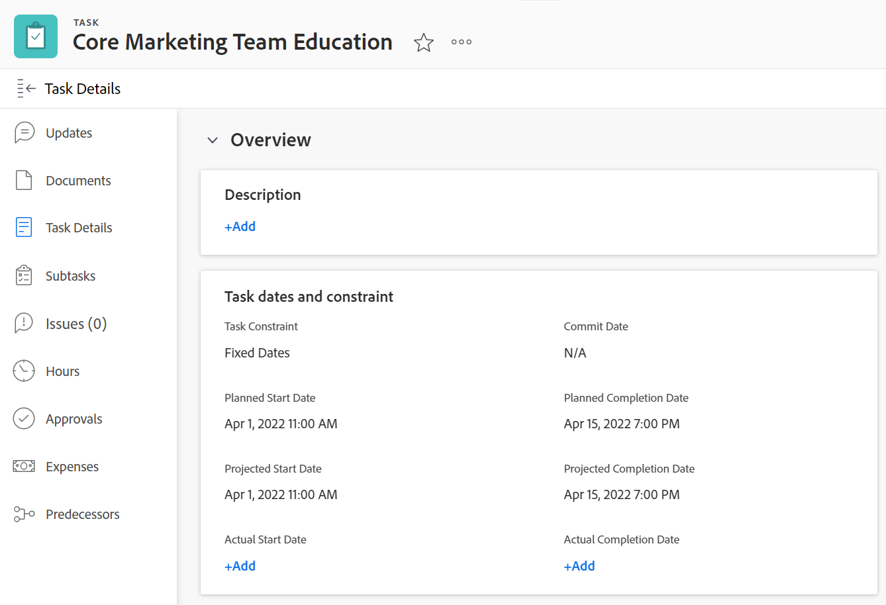
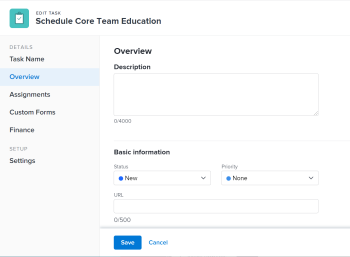

# Modifier les tâches

<!--Audited: 10/2025-->

<!--take out prod and preview references at release, or new and old experience-->

<!--

(NOTE: some information in this area is repeated in the following articles. If you need to update a field, update it in both:

** Task finances in details

** Task information in overview)

-->

Les informations surlignées sur cette page font référence à des fonctionnalités qui ne sont pas encore disponibles de manière générale. Elle est disponible uniquement dans l’environnement de Prévisualisation pour tous les clients. Les mêmes fonctionnalités seront également disponibles dans l’environnement de production pour tous les clients et clientes à partir d’une semaine à compter de la version préliminaire.

Pour plus d’informations, voir [Présentation de la version du deuxième trimestre 2026](/help/quicksilver/product-announcements/product-releases/26-q2-release-activity/26-q2-release-overview.md).

Vous pouvez modifier les détails des tâches que vous avez créées ou pour lesquelles vous disposez des autorisations « Contribuer » ou « Gérer ».

## Conditions d’accès

+++ Développez pour afficher les exigences d’accès aux fonctionnalités de cet article. 

<table style="table-layout:auto"> 
 <col> 
 <col> 
 <tbody> 
  <tr> 
   <td role="rowheader">Package Adobe Workfront</td> 
   <td> 
Tous
 </td> 
  </tr> 
  <tr> 
   <td role="rowheader">Licence Adobe Workfront</td> 
   <td> 
Standard

   
Travail ou supérieur
 </td> 
  </tr> 
  <tr> 
   <td role="rowheader">Niveau d’accès</td> 
   <td> 
Modifier l’accès aux tâches et aux projets
 </td> 
  </tr> 
  <tr> 
   <td role="rowheader">Autorisations d’objet</td> 
   <td> 
    <ul> 
     <li> 
Autorisations « Contribuer » pour une tâche pour modifier les informations suivantes dans la zone de détails de la tâche : 

     <ul>
     <li>Description</li>
     <li>Statut</li>
     </ul>  
      </li> 
     <li> 
Autorisations « Gérer » pour une tâche afin de modifier toutes les informations dans les zones de détails et de modification de la tâche
 </li> 
    </ul> 
    <ul> 
     <li> 
Autorisations de contribution ou de niveau supérieur pour un projet
 </li> 
    </ul> </td> 
  </tr> 
 </tbody> 
</table>

*Pour plus d’informations, voir [Conditions d’accès dans la documentation de Workfront](/help/quicksilver/administration-and-setup/add-users/access-levels-and-object-permissions/access-level-requirements-in-documentation.md).

+++

<!--Old:

<table style="table-layout:auto"> 
 <col> 
 <col> 
 <tbody> 
  <tr> 
   <td role="rowheader">Adobe Workfront plan</td> 
   <td> 
Any 
 </td> 
  </tr> 
  <tr> 
   <td role="rowheader">Adobe Workfront license*</td> 
   <td> 
Standard

   
Work or higher
 </td> 
  </tr> 
  <tr> 
   <td role="rowheader">Access level</td> 
   <td> 
Edit access to Tasks and Projects
 </td> 
  </tr> 
  <tr> 
   <td role="rowheader">Object permissions</td> 
   <td> 
    <ul> 
     <li> 
Contribute permissions to a task to edit the following information in the Task Details area: 

     <ul>
     <li>Description</li>
     <li>Status</li>
     </ul>  
      </li> 
     <li> 
Manage permissions to a task to edit all the information in the Details area and the Edit Task box
 </li> 
    </ul> 
    <ul> 
     <li> 
Contribute or higher permissions to the project
 </li> 
    </ul> </td> 
  </tr> 
 </tbody> 
</table>-->

## Restrictions relatives à la modification des tâches

Certaines restrictions peuvent vous empêcher de modifier des tâches.

Pour modifier des tâches, tenez compte des points suivants :

* Mettre à jour des tâches déclenche des notifications pour les projets dont le statut est « Actuel ». Pour éviter toute confusion sur les tâches affectées aux utilisateurs et utilisatrices, limitez les modifications de tâches lorsque le statut du projet est « Actuel ».
* Les tâches en attente d’approbation ne peuvent pas être modifiées. Il est seulement possible de consigner le temps ou de mettre à jour le statut d’une tâche se trouvant dans un processus d’approbation.

  

* Vous pouvez modifier et ajouter des documents aux tâches des projets qui sont terminés, immobilisés ou en attente d’approbation seulement si l’administration de Workfront ou de groupes a activé cette option dans les préférences du projet. Pour plus d’informations sur la définition des préférences de projet, consultez la section [Configurer les préférences de projet à l’échelle du système](../../../administration-and-setup/set-up-workfront/configure-system-defaults/set-project-preferences.md).

* Vous pouvez toujours modifier les informations suivantes sur une tâche quand le projet est terminé, immobilisé, ou en attente d’approbation :

   * Enregistrer des heures
   * Modifier les dépenses existantes
   * Joindre un formulaire personnalisé

* Les autres personnes doivent actualiser leurs pages avant de pouvoir afficher les mises à jour apportées à une tâche.

## Modifier les tâches dans une liste

Vous pouvez modifer les informations d’une tâche dans une liste de tâches à l’aide de la modification en ligne des champs affichés dans la vue de la liste.

Pour plus d’informations sur la modification de tâches dans des listes, consultez la section [Modifier les tâches dans une liste](../../../manage-work/tasks/manage-tasks/edit-tasks-in-a-list.md).

## Modifier une tâche dans une liste à l’aide du résumé

Vous pouvez modifier une tâche dans une liste à l’aide du panneau de résumé. Pour plus d’informations sur la modification d’une tâche dans le panneau de résumé, reportez-vous à la section « Modifier une tâche dans le résumé » de l’article [Modifier les tâches dans une liste](../../../manage-work/tasks/manage-tasks/edit-tasks-in-a-list.md).

## Modifier une tâche dans la zone de modification de la tâche

Vous pouvez modifier une tâche à l’aide des zones de modification ou de détails de la tâche. Les étapes suivantes décrivent comment modifier une tâche dans la zone de modification de la tâche.

{{step1-click-main-menu}}

1. Cliquez sur **Projets**, puis cliquez sur le nom d’un projet pour l’ouvrir.
1. Cliquez sur **Tâches** dans le panneau de gauche.
1. Cliquez sur la tâche à modifier.
1. (Le cas échéant) Pour modifier des informations limitées sur une tâche, cliquez sur **Détails de la tâche** dans le panneau de gauche.

   

   Envisagez de modifier des informations dans les zones suivantes de la section des détails de la tâche :

   * **Vue d’ensemble**

     Cette zone est développée par défaut.

   * **Formulaires personnalisés**

     Les noms des formulaires personnalisés ne s’affichent que s’il existe des formulaires personnalisés associés à l’objet.

   * **Finances**

   >[!NOTE]
   >
   >Selon la manière dont votre équipe d’administration Workfront ou de groupe a modifié votre modèle de mise en page, les champs de la zone Détails de la tâche peuvent être réorganisés ou masqués. Pour plus d’informations, consultez la section [Personnaliser l’affichage des détails avec un modèle de mise en page](../../../administration-and-setup/customize-workfront/use-layout-templates/customize-details-view-layout-template.md).

   Pour plus d’informations sur les champs visibles dans la section des détails de la tâche, continuez à modifier la tâche dans la zone de modification de la tâche comme décrit ci-dessous.

   Pour modifier les informations de la section Détails, procédez comme suit :

   1. (Facultatif) Cliquez sur l’icône **Tout réduire**  dans le coin supérieur droit pour réduire toutes les zones.
   1. (Facultatif et conditionnel) Lorsqu’une zone est réduite, cliquez sur la **flèche pointant vers la droite**  en regard de chaque zone pour développer la zone à modifier.
   1. Pour plus d’informations sur la modification des informations dans l’onglet des détails de la tâche, consultez les articles suivants :

      * [Gérer les informations des tâches dans la zone de vue d’ensemble des détails de la tâche](../../../manage-work/tasks/manage-tasks/task-information-in-overview.md)
      * [Gérer les finances des tâches dans la section Détails de la tâche](../../../manage-work/tasks/manage-tasks/task-finances-in-details.md)

   1. (Facultatif) Si aucun formulaire personnalisé n’est associé à la tâche, commencez à saisir le nom d’un formulaire dans le champ **Ajouter un formulaire personnalisé**, sélectionnez-le lorsqu’il s’affiche dans la liste, puis cliquez sur **Enregistrer les modifications**.
   1. (Facultatif) Cliquez sur l’icône **Exporter**  pour exporter les informations de la Présentation et des formulaires personnalisés dans un fichier PDF, puis cliquez sur **Exporter**. Sélectionnez l’une des options suivantes :

      * Sélectionner tout (ne s’affiche que lorsqu’au moins un formulaire personnalisé est joint)
      * Vue d’ensemble
      * Nom d’un ou de plusieurs formulaires personnalisés

      Le fichier PDF est téléchargé sur votre ordinateur.

      

      Pour plus d’informations, consultez la section [Exporter les formulaires personnalisés et les détails de l’objet](../../../workfront-basics/work-with-custom-forms/export-custom-forms-details.md).

1. (Conditionnel) Pour modifier toutes les informations relatives à la tâche, en tant qu’utilisateur disposant d’autorisations de niveau Gérer pour la tâche, cliquez sur le menu **Plus**  en regard du nom de la tâche, puis cliquez sur **Modifier**.

   Ou

   Dans une liste de tâches, sélectionnez une tâche, puis cliquez sur l’icône **Modifier**  en haut de la liste.

   La zone Modifier la tâche s’ouvre.

   >[!IMPORTANT]
   >
   >Vous devez disposer d’autorisations de niveau Gérer sur la tâche pour voir l’option Modifier .

   Tous les champs de tâche sont disponibles dans la zone Modifier la tâche et sont regroupés par zones répertoriées dans le panneau de gauche.

   >[!NOTE]
   >
   >Selon la manière dont votre équipe d’administration Workfront ou de groupe a modifié votre modèle de mise en page, les champs de la zone Détails de la tâche peuvent être réorganisés ou masqués. Pour plus d’informations, voir [Personnaliser la vue Détails à l’aide d’un modèle de mise en page](../../../administration-and-setup/customize-workfront/use-layout-templates/customize-details-view-layout-template.md).

   Pensez à spécifier des informations dans l’une des sections suivantes :

   * [Nom de la tâche](#task-name)
   * [Vue d’ensemble](#overview)
   * [Affectations](#assignments)
   * [Formulaires personnalisés](#Custom%C2%A0F)
   * [Finances](#finance)
   * [Paramètres](#settings)
   * [Commentaire](#comment)

   >[!NOTE]
   >
   >Selon la manière dont votre administrateur Workfront ou votre administrateur de groupe a configuré votre modèle de mise en page, les champs de la zone Modifier la tâche peuvent être réorganisés ou ne pas s’afficher. Pour plus d’informations, voir [Personnaliser la vue Détails à l’aide d’un modèle de mise en page](../../../administration-and-setup/customize-workfront/use-layout-templates/customize-details-view-layout-template.md).

### Nom de la tâche {#task-name}

1. Commencez à modifier votre tâche comme décrit ci-dessus.
1. Cliquez sur **Nom de la tâche** dans le panneau de gauche.

   

1. Mettez à jour le nom de la tâche.

1. Cliquez sur **Enregistrer** ou passez aux sections suivantes.

### Vue d’ensemble {#overview}

1. Commencez à modifier votre tâche comme décrit ci-dessus.
1. Cliquez sur **Vue d’ensemble** dans le panneau de gauche.

   

1. Mettez à jour les informations suivantes sur la tâche :

   <table style="table-layout:auto"> 
    <col> 
    <col> 
    <tbody> 
     <tr> 
      <td role="rowheader">Description</td> 
      <td>Ajoutez des informations supplémentaires sur la tâche. </td> 
     </tr> 
     <tr> 
      <td colspan="2" role="rowheader">Section Informations de base </td> 
     </tr> 
     <tr> 
      <td role="rowheader">Statut</td> 
      <td> 
Sélectionnez le statut de la tâche qui indique à quel stade de développement elle se trouve.
 
<b>CONSEIL</b>

   Vous pouvez mettre à jour le statut de la tâche dans l’en-tête de la tâche. 

   
Votre administrateur Workfront ou de groupe peut personnaliser les noms des statuts des tâches. Pour plus d’informations, voir <a href="/help/quicksilver/administration-and-setup/customize-workfront/creating-custom-status-and-priority-labels/create-or-edit-a-status.md">Créer ou modifier un statut</a>. 
      </td> 
     </tr> 
     <tr> 
      <td role="rowheader">Priorité</td> 
      <td> 
Il s’agit d’un indicateur visuel qui vous permet de hiérarchiser vos tâches. 
 
Sélectionnez l’une des options suivantes : 
 
       <ul> 
      <li> 
 Aucun
 </li> 
      <li> 
 Faible 
 </li> 
      <li> 
Normal 
 </li> 
      <li> 
Élevé 
 </li> 
      <li> 
 Urgent 
 </li> 
       </ul> 
Selon les préférences du projet sélectionnées par votre administrateur ou administratrice Workfront, les noms des priorités peuvent être différents pour vous. Pour plus d’informations sur les priorités des tâches, voir <a href="../../../manage-work/tasks/task-information/task-priority.md" class="MCXref xref">Mettre à jour les priorités des tâches</a>. 
 </td> 
     </tr> 
     <tr> 
      <td colspan="2" role="rowheader">Section dates et contraintes de tâche </td> 
     </tr> 
     <tr> 
      <td role="rowheader">Contrainte de tâche</td> 
      <td> 
Déterminez quand la tâche doit être terminée en indiquant une contrainte de tâche. 
 
Sélectionnez l’une des options suivantes : 
 
       <ul> 
      <li> 
Dates fixes 
 
Indiquez une <strong>Date de début prévue</strong> et une <strong>Date d’achèvement prévue</strong>. 
 </li> 
      <li> 
Il Faut Commencer Le 
 
Indiquez une <strong>Date de début prévue</strong>. 
 </li> 
      <li> 
Doit se terminer le 
 
Indiquez une <strong>Date d’achèvement prévue</strong>. 
 </li> 
       </ul> 
       <ul> 
      <li> 
Aussi Tôt Que Possible
 </li> 
      <li> 
Aussi Tard Que Possible
 </li> 
      <li> 
Première Heure Disponible
 </li> 
      <li> 
 Dernière Heure Disponible
 </li> 
      <li> 
Commencer Au Plus Tard 
 </li> 
      <li> 
Indiquer une Date de début prévue
 </li> 
      <li> 
Commencer Au Plus Tôt 
 
Indiquez une <strong>Date de début prévue</strong>. 
 </li> 
      <li> 
 Finir Au plus tard
 
Indiquez une <strong>Date d’achèvement prévue</strong>. 
 </li> 
      <li> 
 Finir Au Plus Tôt
 
Indiquer une <strong>Date d’achèvement prévue</strong>
 </li> 
       </ul> 
Pour plus d’informations sur la contrainte de tâche, voir <a href="../../../manage-work/tasks/task-constraints/task-constraint-overview.md" class="MCXref xref">Vue d’ensemble de la contrainte de tâche</a>.
 </td> 
     </tr> 
     <tr> 
      <td role="rowheader">Date et heure d’engagement</td> 
      <td> 
Il s’agit de la date à laquelle la personne affectée à la tâche s’engage à ce qu’elle soit terminée. Elle peut être différente de la date d'achèvement prévue. Seuls les cessionnaires peuvent modifier ce champ. Pour plus d’informations sur les dates d’engagement dans Workfront, voir <a href="../../../manage-work/projects/updating-work-in-a-project/overview-of-commit-dates.md" class="MCXref xref">Vue d’ensemble de la date d’engagement</a>. 
 </td> 
     </tr> 
     <tr> 
      <td role="rowheader">Date et heure de début prévues</td> 
      <td> 
Date et heure auxquelles la tâche devrait commencer. La date de début prévue d’une tâche est définie et influencée par un certain nombre de facteurs :
 
       <ul> 
      <li>Selon la préférence système pour la date de début prévue de la tâche, la date de début d’une nouvelle tâche sur un projet peut être aujourd’hui, ou par défaut, la date de début du projet. L’équipe d’administration de groupes associée au projet peut également définir cette préférence pour le groupe.Pour plus d’informations sur les préférences de tâche au niveau du système ou du groupe, voir <a href="../../../administration-and-setup/set-up-workfront/configure-system-defaults/set-task-issue-preferences.md" class="MCXref xref">Configurer les préférences de tâche et de problème à l’échelle du système</a>.</li> 
      <li>Selon les tâches antérieures de la tâche, Workfront choisit la date de début prévue comme prochaine date disponible après la fin ou le début de la relation antérieure. Pour plus d’informations sur les relations antérieures, voir <a href="../../../manage-work/tasks/use-prdcssrs/predecessors-overview.md" class="MCXref xref">Vue d’ensemble des tâches antérieures</a>.</li> 
      <li>La personne responsable du projet ainsi que la personne propriétaire de la tâche peuvent définir manuellement la date de début prévue si la contrainte de tâche est définie sur Dates fixes ou Il Faut Commencer Le. Pour plus d’informations sur les contraintes de tâche, voir <a href="../../../manage-work/tasks/task-constraints/task-constraint-overview.md" class="MCXref xref">Vue d’ensemble des contraintes de tâches</a>.</li> 
       </ul> </td> 
     </tr> 
     <tr> 
      <td role="rowheader">Date et heure d’achèvement prévues</td> 
      <td> 
Date d’achèvement prévue, comme indiqué lors de la planification de la tâche. Workfront définit la date d’achèvement prévue à l’aide de certains des facteurs suivants :
 
       <ul> 
      <li>La date d’achèvement prévue est calculée à partir de la date de début prévue en ajoutant la durée de la tâche à la date de début prévue. Lorsque la personne responsable du projet ou Workfront spécifie la durée de la tâche, une mise à jour de la date d’achèvement prévue est déclenchée. Si la date prévue est modifiée, c'est souvent parce que la durée de la tâche a été mise à jour.</li> 
      <li>La personne responsable du projet ainsi que la personne propriétaire de la tâche peuvent définir manuellement la date d’achèvement prévue si la contrainte de tâche est définie sur Dates fixes ou Doit se terminer le. Pour plus d’informations sur les contraintes de tâche, voir <a href="../../../manage-work/tasks/task-constraints/task-constraint-overview.md" class="MCXref xref">Vue d’ensemble de la contrainte de tâche</a>.</li> 
      <li>Si le type de durée de la tâche est modifié et que le nombre de ressources sur les tâches est modifié en même temps, la date d’achèvement prévue change également. Pour plus d’informations sur les types de durée, voir <a href="../../../manage-work/tasks/taskdurtn/task-duration-and-duration-type.md" class="MCXref xref">Vue d’ensemble de la durée des tâches et du type de durée</a>.</li> 
       </ul> </td> 
     </tr> 
     <tr> 
      <td role="rowheader">Date et heure de début effectives</td> 
      <td> 
Spécifiez la date de début effective de la tâche. La valeur par défaut est généralement renseignée automatiquement lorsque vous modifiez le statut de la tâche en En cours. La personne responsable du projet ou la personne propriétaire de la tâche peut également modifier manuellement la date de début effective. 
 </td> 
     </tr> 
     <tr> 
      <td role="rowheader">Date et heure d’achèvement effectives</td> 
      <td> 
Indiquez la date et l’heure effectives auxquelles la tâche est terminée. La date et l’heure par défaut auxquelles une tâche est terminée correspondent toujours à l’heure effective à laquelle le statut devient Terminé. La personne responsable du projet ou la personne propriétaire de la tâche peut également modifier manuellement la date d’achèvement effective. 
 </td> 
     </tr> 
     <tr> 
      <td role="rowheader"><b>Section de temps de travail</b></td> 
     </tr> 
     <tr> 
      <td role="rowheader">Effort de travail </td> 
      <td>

   
Quantité d’effort requise pour terminer la tâche. La personne responsable de votre projet peut décider d’utiliser ce champ au lieu du nombre d’heures prévues afin d’estimer l’effort requis pour terminer une tâche. Ce champ n’est visible que lorsque les conditions suivantes sont remplies :
 
      <ul> 
      <li> 
La tâche a un type de durée simple. 
 
<b>CONSEIL</b>

   Si vous modifiez le type de durée de la tâche, ce champ devient grisé. 
 </li>
   <li>La personne responsable de votre projet a activé Utiliser l’option Effort de travail pour calculer automatiquement le champ Nombre d’heures prévues de la tâche dans le projet. </li> 
      </ul> 
      
Sélectionnez l’une des options suivantes :
 
      <ul> 
      <li>Petite</li> 
      <li>Moyenne (il s’agit de la valeur par défaut pour une nouvelle tâche)</li> 
      <li>Grande</li> 
      </ul> 
      
<b>NOTE</b>

   La mise à jour de la quantité d’effort peut entraîner celle du nombre d’heures prévues de la tâche. La mise à jour est immédiate si le type de mise à jour du projet est Automatique. Lorsque le type de mise à jour du projet est Manuel, vous devez recalculer la chronologie pour afficher les heures planifiées mises à jour. 

   
Pour plus d’informations sur l’utilisation de l’effort de travail au lieu du nombre d’heures prévues pour estimer l’effort de tâche, voir <a href="../../../manage-work/tasks/task-information/work-effort.md" class="MCXref xref">Vue d’ensemble de l’effort de travail</a>. 
 
    </td> 
     </tr> 
    </tbody> 
   </table>

1. Cliquez sur **Enregistrer** ou passez aux sections suivantes.

### Affectations {#assignments}

La modification des affectations est différente dans la zone Modifier la tâche selon l&#39;environnement choisi.

#### Modifiez la zone Affectations dans l’environnement de production.

1. Commencez à modifier votre tâche comme décrit ci-dessus.
1. Cliquez sur **Affectations** dans le panneau de gauche.

   La zone Affectations s’ouvre dans la nouvelle expérience .

1. (Conditionnel) À l’aide de la nouvelle expérience, procédez comme suit :

   1. Commencez à saisir le nom d’un utilisateur, d’une fonction ou d’une équipe dans le champ **Rechercher des personnes, un rôle ou une équipe**, puis sélectionnez-les lorsqu’elles s’affichent dans la liste

      Ou

      Cliquez sur **Me l’affecter** pour vous affecter la tâche.

   1. Mettez à jour les informations suivantes :

      <table style="table-layout:auto"> 
         <col> 
         <col> 
         <tbody> 
         <tr> 
         <td role="rowheader">Type de durée</td> 
         <td> 
Cela identifie la relation entre les éléments suivants : 
 
         <ul> 
         <li> 
Nombre de ressources affectées à une tâche 
 </li> 
         <li> 
Effort total requis pour terminer la tâche 
 </li> 
         <li> 
 Durée totale de la tâche. 
 </li> 
         </ul> 
Votre administrateur Workfront ou un administrateur de groupes sélectionne le paramètre Type de durée par défaut pour les tâches de votre système ou de votre groupe. Pour plus d'informations sur la définition des paramètres par défaut du projet, voir <a href="../../../administration-and-setup/set-up-workfront/configure-system-defaults/set-task-issue-preferences.md" class="MCXref xref">Configurer les préférences de tâches et de problèmes à l'échelle du système</a>. 
 
Les types de durée vous permettent de définir des affectations de ressources cohérentes en fonction des besoins de la tâche. Pour plus d’informations sur le type de durée d’une tâche, voir <a href="../../../manage-work/tasks/taskdurtn/task-duration-and-duration-type.md" class="MCXref xref">Vue d’ensemble de la durée de la tâche et du type de durée</a>. 
 
Sélectionnez l’une des options suivantes : 
 
         <ul> 
         <li> 
Calcul d'affectation 
 </li> 
         <li> 
 Calcul de travail 
 </li> 
         <li> 
Piloté par l'effort 
 </li> 
         <li> 
Simple
 </li> 
         </ul> </td> 
         </tr> 
         <td role="rowheader">Durée par occurrence</td> 
         <td> 
Cela s’affiche uniquement sur le parent des tâches récurrentes. La durée de chaque tâche récurrente est affichée, telle que définie lors de la création de la tâche. Pour plus d’informations sur la création de tâches récurrentes, voir <a href="../../../manage-work/tasks/create-tasks/create-recurring-tasks.md" class="MCXref xref">Créer des tâches récurrentes</a>. 
 
 <b>REMARQUE </b>          
         Les durées modifiées dans des tâches récurrentes individuelles n’affichent pas la valeur indiquée dans ce champ. 
 </td> 
         </tr>
         <tr> 
         <td role="rowheader">Durée</td> 
         <td> 
         
 
         
 
         
Il s’agit de la durée pendant laquelle vous laissez une tâche ouverte avant qu’elle soit terminée. 
 
         
<b>IMPORTANT</b>

      Comme la durée de la tâche correspond généralement à la durée entre les dates de début et d’achèvement prévues, elle affecte la chronologie du projet.

      
Pour indiquer la durée de la tâche et l’unité de temps, procédez comme suit :
 
         <ul> 
         <li> 
Saisissez la durée et sélectionnez l’unité de temps disponible dans le menu déroulant.
 
<b>CONSEIL</b>

         Lorsque vous mettez à jour la durée des tâches dans une liste de tâches, vous pouvez utiliser l’abréviation pour l’unité de temps. 
 </li> 
         </ul> 
         
 Vous pouvez choisir parmi les options de temps normal ou de temps écoulé dans le tableau suivant : 
 
         <table style="table-layout:auto"> 
         <col> 
         <col data-mc-conditions=""> 
         <tbody> 
         <tr> 
         <td>Unité de temps</td> 
         <td>Abréviation</td> 
         </tr> 
         <tr> 
         <td>Minutes</td> 
         <td>L</td> 
         </tr> 
         <tr> 
         <td>Heures</td> 
         <td>H</td> 
         </tr> 
         <tr> 
         <td>Jours. Il s’agit de la valeur par défaut. </td> 
         <td>Dés</td> 
         </tr> 
         <tr> 
         <td>Semaines</td> 
         <td>S</td> 
         </tr> 
         <tr> 
         <td>Mois</td> 
         <td>M</td> 
         </tr> 
         <tr> 
         <td>Minutes écoulées</td> 
         <td>ME</td> 
         </tr> 
         <tr> 
         <td>Heures écoulées</td> 
         <td>HE</td> 
         </tr> 
         <tr> 
         <td>Jours écoulés</td> 
         <td>JE</td> 
         </tr> 
         <tr> 
         <td>Semaines écoulées</td> 
         <td>SE</td> 
         </tr> 
         <tr> 
         <td>Mois écoulés</td> 
         <td>TE</td> 
         </tr> 
         </tbody> 
         </table>

      
<b>NOTE</b>

      
Le temps écoulé est une unité de temps pour la durée d’une tâche. Il s’agit de la durée entre la date de début et la date d’achèvement prévues d’une tâche qui comprend les jours fériés, les week-ends et les jours de congé. En d’autres termes, le temps écoulé est le nombre de jours calendaires écoulés.

      Le temps normal prend en compte les jours fériés, les week-ends et les jours de congé et les exclut de la durée de la tâche. Pour plus d’informations sur la durée de la tâche, voir <a href="../../../manage-work/tasks/taskdurtn/task-duration-and-duration-type.md" class="MCXref xref">Vue d’ensemble de la durée de la tâche et du type de durée</a>. 

      </td> 
         </tr> 
         <tr> 
         <td role="rowheader">Heures prévues</td> 
         <td> 
Spécifiez le nombre d’heures prévues pour la tâche, en heures. Il s’agit de la quantité de temps réel nécessaire aux personnes assignées à la tâche pour la terminer. Vous ne pouvez spécifier le nombre d'heures prévues pour une tâche que lorsque le type de durée est défini sur Calcul d'affectation. Pour plus d’informations sur les types de durée, voir <a href="../../../manage-work/tasks/taskdurtn/task-duration-and-duration-type.md" class="MCXref xref">Vue d’ensemble de la durée de la tâche et du type de durée</a>.
 
         <b>NOTE</b>
         

         Lors de la création de tâches récurrentes, les heures prévues sont celles de chaque occurrence. Les heures prévues des tâches parent correpondent au nombre total d’heures prévues de toutes les occurrences. Pour plus d’informations sur la création de tâches récurrentes, voir <a href="../../../manage-work/tasks/create-tasks/create-recurring-tasks.md" class="MCXref xref">Créer des tâches récurrentes</a>.
         

      </td> 
         </tr> 
         </tbody> 
         </table>

      <!--<tr> 
      <td role="rowheader">Allocation</td> 
      <td> 
If your Task Constraint is Calculated Work or Effort Driven, specify the <strong>Allocation %</strong> (allocation percentage) for each assignee. This is the amount of time from the schedule of the assignee that they can spend on this task. Changing the allocation percentage for an assignee will change the Planned Hours of a task. 
 
When the Task Constraint is Simple, you can specify the following:
 
         <ul> 
         <li> 
Allocation Hours of each assignee.
 </li> 
         <li> 
Planned Hours of the task
 </li> 
         <li> 
Duration of the task
 </li> 
         </ul> </td> 
      </tr> 
      <tr> 
      <td role="rowheader">Assignee's Role</td> 
      <td> 
Select a role from the <strong>Assignee's Role</strong> drop-down menu when you selected a person as an assignee. This is the role that the assignee can fulfill on this task. 
 
<b>TIP</b>
         Only the job roles associated with each assignee in their profile appear in the drop-down menu.
 </td> 
         </tr>
         </tbody> 
         </table>-->

   1. (Facultatif) Cliquez sur **Passer à l’ancienne expérience** au bas de la zone **Modifier la tâche**.
La zone Affectations s’ouvre dans l’ancienne expérience .

      

1. (Conditionnel) À l’aide de l’ancienne expérience, procédez comme suit :

   1. Cliquez sur **Rechercher des personnes, des rôles ou des équipes** et commencez à saisir le nom d&#39;un utilisateur, d&#39;un rôle ou d&#39;une équipe que vous souhaitez affecter à la tâche, puis cliquez dessus ou appuyez sur Entrée lorsqu&#39;elle s&#39;affiche dans la liste.

      >[!TIP]
      >
      >* Si le nom de l’utilisateur ou utilisatrice contient un caractère spécial, vous devez l’inclure dans le champ de recherche.
      >* Vous pouvez affecter plusieurs utilisateurs et utilisatrices, fonctions ou équipes. Vous pouvez affecter uniquement les utilisateurs et utilisatrices, fonctions et équipes actifs.
      >
      >* Si une personne, une fonction ou une équipe a été affectée avant d’être désactivée, elle reste affectée à l’élément de travail. Dans ce cas, nous vous recommandons ce qui suit :
      >
      >* Réaffectez la tâche aux ressources actives.
      >* Associez les utilisateurs et utilisatrices d’une équipe désactivée à une équipe active et réaffectez l’élément de travail à l’équipe active.

   1. (Facultatif) Passez la souris sur le nom d’une personne désignée, puis cliquez sur **Effectuer un Principal** pour indiquer si une personne désignée est la personne désignée principale ou le propriétaire de la tâche. Une équipe ne peut pas être l’entité cessionnaire principale d’une tâche.
   1. (Facultatif) Mettez à jour les champs suivants :

      <table style="table-layout:auto"> 
      <col> 
      <col> 
      <tbody> 
      <tr> 
         <td role="rowheader">Type de durée</td> 
         <td> 
Cela identifie la relation entre les éléments suivants : 
 
         <ul> 
         <li> 
Nombre de ressources affectées à une tâche 
 </li> 
         <li> 
Effort total requis pour terminer la tâche 
 </li> 
         <li> 
 Durée totale de la tâche. 
 </li> 
         </ul> 
Votre administrateur Workfront ou un administrateur de groupes sélectionne le paramètre Type de durée par défaut pour les tâches de votre système ou de votre groupe. Pour plus d'informations sur la définition des paramètres par défaut du projet, voir <a href="../../../administration-and-setup/set-up-workfront/configure-system-defaults/set-task-issue-preferences.md" class="MCXref xref">Configurer les préférences de tâches et de problèmes à l'échelle du système</a>. 
 
Les types de durée vous permettent de définir des affectations de ressources cohérentes en fonction des besoins de la tâche. Pour plus d’informations sur le type de durée d’une tâche, voir <a href="../../../manage-work/tasks/taskdurtn/task-duration-and-duration-type.md" class="MCXref xref">Vue d’ensemble de la durée de la tâche et du type de durée</a>. 
 
Sélectionnez l’une des options suivantes : 
 
         <ul> 
         <li> 
Calcul d'affectation 
 </li> 
         <li> 
 Calcul de travail 
 </li> 
         <li> 
Piloté par l'effort 
 </li> 
         <li> 
Simple
 </li> 
         </ul> </td> 
      </tr> 
      <tr data-mc-conditions="QuicksilverOrClassic.Quicksilver"> 
         <td role="rowheader">Durée par occurrence</td> 
         <td> 
Cela s’affiche uniquement sur le parent des tâches récurrentes. La durée de chaque tâche récurrente est affichée, telle que définie lors de la création de la tâche. Pour plus d’informations sur la création de tâches récurrentes, voir <a href="../../../manage-work/tasks/create-tasks/create-recurring-tasks.md" class="MCXref xref">Créer des tâches récurrentes</a>. 
 
 <b>NOTE</b>

      Les durées modifiées dans des tâches récurrentes individuelles n’affichent pas la valeur indiquée dans ce champ. 
 </td>
      </tr> 
      <tr> 
         <td role="rowheader">Durée</td> 
         <td> 
         
 
         
 
         
Il s’agit de la durée pendant laquelle vous laissez une tâche ouverte avant qu’elle soit terminée. 
 
         
<b>IMPORTANT</b>

      Comme la durée de la tâche correspond généralement à la durée entre les dates de début et d’achèvement prévues, elle affecte la chronologie du projet.

      
Pour indiquer la durée de la tâche et l’unité de temps, procédez comme suit :
 
         <ul> 
         <li> 
Saisissez la durée et sélectionnez l’unité de temps disponible dans le menu déroulant.
 
<b>CONSEIL</b>

         Lorsque vous mettez à jour la durée des tâches dans une liste de tâches, vous pouvez utiliser l’abréviation pour l’unité de temps. 
 </li> 
         </ul> 
         
 Vous pouvez choisir parmi les options de temps normal ou de temps écoulé dans le tableau suivant : 
 
         <table style="table-layout:auto"> 
         <col> 
         <col data-mc-conditions=""> 
         <tbody> 
         <tr> 
         <td>Unité de temps</td> 
         <td>Abréviation</td> 
         </tr> 
         <tr> 
         <td>Minutes</td> 
         <td>L</td> 
         </tr> 
         <tr> 
         <td>Heures</td> 
         <td>H</td> 
         </tr> 
         <tr> 
         <td>Jours. Il s’agit de la valeur par défaut. </td> 
         <td>Dés</td> 
         </tr> 
         <tr> 
         <td>Semaines</td> 
         <td>S</td> 
         </tr> 
         <tr> 
         <td>Mois</td> 
         <td>M</td> 
         </tr> 
         <tr> 
         <td>Minutes écoulées</td> 
         <td>ME</td> 
         </tr> 
         <tr> 
         <td>Heures écoulées</td> 
         <td>HE</td> 
         </tr> 
         <tr> 
         <td>Jours écoulés</td> 
         <td>JE</td> 
         </tr> 
         <tr> 
         <td>Semaines écoulées</td> 
         <td>SE</td> 
         </tr> 
         <tr> 
         <td>Mois écoulés</td> 
         <td>TE</td> 
         </tr> 
         </tbody> 
      </table>

      
<b>NOTE</b>

      
Le temps écoulé est une unité de temps pour la durée d’une tâche. Il s’agit de la durée entre la date de début et la date d’achèvement prévues d’une tâche qui comprend les jours fériés, les week-ends et les jours de congé. En d’autres termes, le temps écoulé est le nombre de jours calendaires écoulés.

      Le temps normal prend en compte les jours fériés, les week-ends et les jours de congé et les exclut de la durée de la tâche. Pour plus d’informations sur la durée de la tâche, voir <a href="../../../manage-work/tasks/taskdurtn/task-duration-and-duration-type.md" class="MCXref xref">Vue d’ensemble de la durée de la tâche et du type de durée</a>. 

      
 
         
 </td> 
         </tr> 
         <tr> 
         <td role="rowheader">Heures prévues</td> 
         <td> 
Spécifiez le nombre d’heures prévues pour la tâche, en heures. Il s’agit de la quantité de temps réel nécessaire aux personnes assignées à la tâche pour la terminer. Vous ne pouvez spécifier le nombre d'heures prévues pour une tâche que lorsque le type de durée est défini sur Calcul d'affectation. Pour plus d’informations sur les types de durée, voir <a href="../../../manage-work/tasks/taskdurtn/task-duration-and-duration-type.md" class="MCXref xref">Vue d’ensemble de la durée de la tâche et du type de durée</a>.
 
         <b>NOTE</b>
         

         Lors de la création de tâches récurrentes, les heures prévues sont celles de chaque occurrence. Les heures prévues des tâches parent correpondent au nombre total d’heures prévues de toutes les occurrences. Pour plus d’informations sur la création de tâches récurrentes, voir <a href="../../../manage-work/tasks/create-tasks/create-recurring-tasks.md" class="MCXref xref">Créer des tâches récurrentes</a>.
         

      </td> 
         </tr> 
         <tr> 
         <td role="rowheader">Allocation</td> 
         <td> 
Si la contrainte de tâche est Calcul de travail ou Piloté par l’effort, spécifiez la variable <strong>% d’affectation</strong> (pourcentage d’affectation) pour chaque personne cessionnaire. Il s’agit de la durée dans le planning de la personne cessionnaire qui peut être consacrée à cette tâche. La modification du pourcentage d’affectation d’une personne cessionnaire modifie le nombre d’heures prévues d’une tâche. 
 
Lorsque la contrainte de tâche est simple, vous pouvez spécifier les éléments suivants :
 
            <ul> 
            <li> 
Nombre d’heures d’affectation de chaque personne cessionnaire.
 </li> 
            <li> 
Nombre d’heures prévues de la tâche.
 </li> 
            <li> 
Durée de la tâche.
 </li> 
            </ul> </td> 
         </tr> 
         <tr> 
         <td role="rowheader">Rôle du cessionnaire</td> 
         <td> 
Sélectionnez un rôle dans le menu déroulant <strong>Rôle de la personne cessionnaire</strong> lorsque vous avez sélectionné une personne comme personne cessionnaire. Il s’agit du rôle que la personne cessionnaire peut remplir pour cette tâche. 
 
<b>CONSEIL</b>

      Seules les fonctions associées à chaque personne cessionnaire dans son profil s’affichent dans le menu déroulant.
 </td>
      </tr>
      </tbody>
      </table>

1. Cliquez sur **Enregistrer** ou passez aux sections suivantes.

#### Modifiez la zone Affectations dans l’environnement Aperçu .

>[!TIP]
>
>Lors de la modification des affectations de tâche en bloc, un indicateur Valeurs multiples s’affiche pour les champs dont les valeurs diffèrent entre les tâches sélectionnées.
>
>Vous ne pouvez pas afficher les affectations individuelles pour chaque tâche sélectionnée.

1. Commencez à modifier votre tâche comme décrit ci-dessus.
1. Cliquez sur **Affectations** dans le panneau de gauche.

   

1. Cliquez sur **Rechercher des personnes, des rôles ou des équipes** et commencez à saisir le nom d&#39;un utilisateur, d&#39;un rôle ou d&#39;une équipe que vous souhaitez affecter à la tâche, puis cliquez dessus ou appuyez sur Entrée lorsqu&#39;elle s&#39;affiche dans la liste.

   >[!TIP]
   >
   >* Si le nom de l’utilisateur ou utilisatrice contient un caractère spécial, vous devez l’inclure dans le champ de recherche.
   >* Vous pouvez affecter plusieurs utilisateurs et utilisatrices, fonctions ou équipes. Vous pouvez affecter uniquement les utilisateurs et utilisatrices, fonctions et équipes actifs.
   >
   >* Si une personne, une fonction ou une équipe a été affectée avant d’être désactivée, elle reste affectée à l’élément de travail. Dans ce cas, nous vous recommandons ce qui suit :
   >
   >* Réaffectez la tâche aux ressources actives.
   >* Associez les utilisateurs et utilisatrices d’une équipe désactivée à une équipe active et réaffectez l’élément de travail à l’équipe active.

1. (Facultatif) Passez la souris sur le nom d’une personne désignée, puis cliquez sur **Effectuer un Principal** pour indiquer si une personne désignée est la personne désignée principale ou le propriétaire de la tâche. Une équipe ne peut pas être l’entité cessionnaire principale d’une tâche.
1. (Facultatif) Mettez à jour les champs suivants :

   <table style="table-layout:auto"> 
    <col> 
    <col> 
    <tbody> 
     <tr> 
      <td role="rowheader">Type de durée</td> 
      <td> 
Cela identifie la relation entre les éléments suivants : 
 
       <ul> 
      <li> 
Nombre de ressources affectées à une tâche 
 </li> 
      <li> 
Effort total requis pour terminer la tâche 
 </li> 
      <li> 
 Durée totale de la tâche. 
 </li> 
       </ul> 
Votre administrateur Workfront ou un administrateur de groupes sélectionne le paramètre Type de durée par défaut pour les tâches de votre système ou de votre groupe. Pour plus d'informations sur la définition des paramètres par défaut du projet, voir <a href="../../../administration-and-setup/set-up-workfront/configure-system-defaults/set-task-issue-preferences.md" class="MCXref xref">Configurer les préférences de tâches et de problèmes à l'échelle du système</a>. 
 
Les types de durée vous permettent de définir des affectations de ressources cohérentes en fonction des besoins de la tâche. Pour plus d’informations sur le type de durée d’une tâche, voir <a href="../../../manage-work/tasks/taskdurtn/task-duration-and-duration-type.md" class="MCXref xref">Vue d’ensemble de la durée de la tâche et du type de durée</a>. 
 
Sélectionnez l’une des options suivantes : 
 
       <ul> 
      <li> 
Calcul d'affectation 
 </li> 
      <li> 
 Calcul de travail 
 </li> 
      <li> 
Piloté par l'effort 
 </li> 
      <li> 
Simple
 </li> 
       </ul> </td> 
     </tr> 
     <tr data-mc-conditions="QuicksilverOrClassic.Quicksilver"> 
      <td role="rowheader">Durée par occurrence</td> 
      <td> 
Cela s’affiche uniquement sur le parent des tâches récurrentes. La durée de chaque tâche récurrente est affichée, telle que définie lors de la création de la tâche. Pour plus d’informations sur la création de tâches récurrentes, voir <a href="../../../manage-work/tasks/create-tasks/create-recurring-tasks.md" class="MCXref xref">Créer des tâches récurrentes</a>. 
 
 <b>NOTE</b>

   Les durées modifiées dans des tâches récurrentes individuelles n’affichent pas la valeur indiquée dans ce champ. 
 </td>
   </tr> 
     <tr> 
      <td role="rowheader">Durée</td> 
      <td> 
      
 
      
 
      
Il s’agit de la durée pendant laquelle vous laissez une tâche ouverte avant qu’elle soit terminée. 
 
      
<b>IMPORTANT</b>

   Comme la durée de la tâche correspond généralement à la durée entre les dates de début et d’achèvement prévues, elle affecte la chronologie du projet.

   
Pour indiquer la durée de la tâche et l’unité de temps, procédez comme suit :
 
      <ul> 
      <li> 
Saisissez la durée et sélectionnez l’unité de temps disponible dans le menu déroulant.
 
<b>CONSEIL</b>

      Lorsque vous mettez à jour la durée des tâches dans une liste de tâches, vous pouvez utiliser l’abréviation pour l’unité de temps. 
 </li> 
      </ul> 
      
 Vous pouvez choisir parmi les options de temps normal ou de temps écoulé dans le tableau suivant : 
 
      <table style="table-layout:auto"> 
      <col> 
      <col data-mc-conditions=""> 
      <tbody> 
      <tr> 
      <td>Unité de temps</td> 
      <td>Abréviation</td> 
      </tr> 
      <tr> 
      <td>Minutes</td> 
      <td>L</td> 
      </tr> 
      <tr> 
      <td>Heures</td> 
      <td>H</td> 
      </tr> 
      <tr> 
      <td>Jours. Il s’agit de la valeur par défaut. </td> 
      <td>Dés</td> 
      </tr> 
      <tr> 
      <td>Semaines</td> 
      <td>S</td> 
      </tr> 
      <tr> 
      <td>Mois</td> 
      <td>M</td> 
      </tr> 
      <tr> 
      <td>Minutes écoulées</td> 
      <td>ME</td> 
      </tr> 
      <tr> 
      <td>Heures écoulées</td> 
      <td>HE</td> 
      </tr> 
      <tr> 
      <td>Jours écoulés</td> 
      <td>JE</td> 
      </tr> 
      <tr> 
      <td>Semaines écoulées</td> 
      <td>SE</td> 
      </tr> 
      <tr> 
      <td>Mois écoulés</td> 
      <td>TE</td> 
      </tr> 
      </tbody> 
   </table>

   
<b>NOTE</b>

   
Le temps écoulé est une unité de temps pour la durée d’une tâche. Il s’agit de la durée entre la date de début et la date d’achèvement prévues d’une tâche qui comprend les jours fériés, les week-ends et les jours de congé. En d’autres termes, le temps écoulé est le nombre de jours calendaires écoulés.

   Le temps normal prend en compte les jours fériés, les week-ends et les jours de congé et les exclut de la durée de la tâche. Pour plus d’informations sur la durée de la tâche, voir <a href="../../../manage-work/tasks/taskdurtn/task-duration-and-duration-type.md" class="MCXref xref">Vue d’ensemble de la durée de la tâche et du type de durée</a>. 

   
 
      
 </td> 
      </tr> 
      <tr> 
      <td role="rowheader">Heures prévues</td> 
      <td> 
Spécifiez le nombre d’heures prévues pour la tâche, en heures. Il s’agit de la quantité de temps réel nécessaire aux personnes assignées à la tâche pour la terminer. Vous ne pouvez spécifier le nombre d'heures prévues pour une tâche que lorsque le type de durée est défini sur Calcul d'affectation. Pour plus d’informations sur les types de durée, voir <a href="../../../manage-work/tasks/taskdurtn/task-duration-and-duration-type.md" class="MCXref xref">Vue d’ensemble de la durée de la tâche et du type de durée</a>.
 
      <b>NOTE</b>
      

      Lors de la création de tâches récurrentes, les heures prévues sont celles de chaque occurrence. Les heures prévues des tâches parent correpondent au nombre total d’heures prévues de toutes les occurrences. Pour plus d’informations sur la création de tâches récurrentes, voir <a href="../../../manage-work/tasks/create-tasks/create-recurring-tasks.md" class="MCXref xref">Créer des tâches récurrentes</a>.
      

   </td> 
      </tr> 
      <tr> 
      <td role="rowheader">Allocation</td> 
      <td> 
Si la contrainte de tâche est Calcul de travail ou Piloté par l’effort, spécifiez la variable <strong>% d’affectation</strong> (pourcentage d’affectation) pour chaque personne cessionnaire. Il s’agit de la durée dans le planning de la personne cessionnaire qui peut être consacrée à cette tâche. La modification du pourcentage d’affectation d’une personne cessionnaire modifie le nombre d’heures prévues d’une tâche. 
 
Lorsque la contrainte de tâche est simple, vous pouvez spécifier les éléments suivants :
 
         <ul> 
         <li> 
Nombre d’heures d’affectation de chaque personne cessionnaire.
 </li> 
         <li> 
Nombre d’heures prévues de la tâche.
 </li> 
         <li> 
Durée de la tâche.
 </li> 
         </ul> </td> 
      </tr> 
      <tr> 
      <td role="rowheader">Rôle du cessionnaire</td> 
      <td> 
Sélectionnez un rôle dans le menu déroulant <strong>Rôle de la personne cessionnaire</strong> lorsque vous avez sélectionné une personne comme personne cessionnaire. Il s’agit du rôle que la personne cessionnaire peut remplir pour cette tâche. 
 
<b>CONSEIL</b>

   Seules les fonctions associées à chaque personne cessionnaire dans son profil s’affichent dans le menu déroulant.
 </td>
   </tr>
   </tbody>
   </table>

1. Cliquez sur **Enregistrer** ou passez aux sections suivantes.

### Formulaires personnalisés

Vous pouvez définir des formulaires personnalisés par défaut à associer automatiquement aux tâches lorsque les tâches sont ajoutées à un projet. Pour plus d’informations sur la configuration du projet afin d’inclure des formulaires personnalisés de tâche par défaut pour toutes les nouvelles tâches, voir la section « Tâches » de l’article [Modifier des projets](../../../manage-work/projects/manage-projects/edit-projects.md).

1. Commencez à modifier la tâche comme décrit ci-dessus.
1. Cliquez sur **Formulaires personnalisés** dans le panneau de gauche, ou cliquez sur le nom d’un formulaire personnalisé s’il est déjà associé.

   

1. Cliquez sur **Ajouter un formulaire personnalisé** et sélectionnez le ou les formulaires personnalisés à associer à la tâche. Vous devez créer les formulaires personnalisés avant de pouvoir les sélectionner dans ce champ. Seuls les formulaires personnalisés actifs sont affichés dans la liste.

   Pour plus d’informations sur la création de formulaires personnalisés, voir [Créer un formulaire personnalisé](/help/quicksilver/administration-and-setup/customize-workfront/create-manage-custom-forms/form-designer/design-a-form/design-a-form.md).Vous pouvez ajouter jusqu’à dix formulaires personnalisés à une tâche

1. (Le cas échéant) Si vous avez associé un formulaire personnalisé à la tâche, modifiez les champs du formulaire. Vous devez renseigner tous les champs obligatoires avant de pouvoir enregistrer la tâche.

   >[!NOTE]
   >
   >Selon la manière dont votre équipe d’administration Workfront définit les autorisations pour les sections de votre formulaire personnalisé, tout le monde ne peut pas afficher ou modifier les mêmes champs sur un formulaire personnalisé donné. Les autorisations de modification des champs d’une section d’un formulaire personnalisé dépendent des autorisations dont vous disposez sur la tâche elle-même. Pour plus d’informations sur la définition des autorisations de tâche, voir [Partager une tâche](../../../workfront-basics/grant-and-request-access-to-objects/share-a-task.md).

1. Cliquez sur **Enregistrer** ou passez aux sections suivantes.

### Finances {#finance}

1. Commencez à modifier votre tâche, comme décrit dans la section [Modifier les tâches](#Edit2) de cet article.
1. Cliquez sur **Finances** dans le panneau de gauche.

   

1. Mettez à jour les champs suivants :

   <table style="table-layout:auto"> 
    <col> 
    <col> 
    <tbody> 
     <tr> 
      <td role="rowheader">Type de coût</td> 
      <td> 
Indiquez le type de coût de la tâche. Cela détermine comment le coût de la tâche est calculé, en fonction du nombre d’heures passées sur les tâches. 
 
Sélectionnez l’une des options suivantes : 
 
       <ul> 
        <li> 
Aucun coût
 </li> 
        <li> 
Fixe par heure 
 </li> 
        <li> 
 Utilisateur, par heure 
 </li> 
        <li> 
 Rôle par heure
 </li> 
       </ul> 
Pour plus d’informations sur le suivi des coûts, voir <a href="../../../manage-work/projects/project-finances/track-costs.md" class="MCXref xref">Suivre les coûts</a>. L’administration de Workfront ou de groupes sélectionne le paramètre « Type de coût » par défaut pour les tâches de votre système ou de votre groupe. Pour plus d’informations sur la définition des paramètres par défaut d’un projet, voir <a href="../../../administration-and-setup/set-up-workfront/configure-system-defaults/set-project-preferences.md" class="MCXref xref">Configurer les préférences de projet à l’échelle du système</a>.
 </td> 
     </tr> 
     <tr> 
      <td role="rowheader">Type de revenus</td> 
      <td> 
Indiquez le type de revenu de la tâche. Cela détermine comment le revenu de la tâche est calculé en fonction du nombre d’heures passées sur les tâches. 
 
Sélectionnez l’une des options suivantes : 
 
       <ul> 
      <li> 
 Non facturable 
 </li> 
      <li> 
Utilisateur, par heure 
 </li> 
      <li> 
Rôle par heure 
 </li> 
      <li> 
Fixe par heure 
 </li> 
      <li> 
Utilisateur par heure avec limite 
 </li> 
      <li> 
Rôle par heure avec limite 
 </li> 
      <li> 
Utilisateur, par heure plus fixe 
 </li> 
      <li> 
Rôle par heure plus fixe 
 </li> 
      <li> 
Revenus fixes 
 </li> 
       </ul> 
Pour plus d’informations sur le suivi des revenus, voir <a href="../../../manage-work/projects/project-finances/billing-and-revenue-overview.md" class="MCXref xref">Vue d’ensemble de la facturation et des revenus</a>. 
 
L’administration de Workfront ou de groupes sélectionne le paramètre « Type de revenu » par défaut pour les tâches de votre système ou de votre groupe. Pour plus d’informations sur la définition des paramètres par défaut d’un projet, consultez la section <a href="../../../administration-and-setup/set-up-workfront/configure-system-defaults/set-project-preferences.md" class="MCXref xref">Configurer les préférences d’un projet à l’échelle du système</a>.
 </td> 
     </tr> 
    </tbody> 
   </table>

1. Cliquez sur **Enregistrer** ou passez à la section suivante.

### Paramètres {#settings}

1. Commencez à modifier votre tâche, comme décrit dans la section [Modifier les tâches](#Edit2) de cet article.
1. Cliquez sur **Paramètres** dans le panneau de gauche.

   

1. Mettez à jour les champs suivants :

   <table style="table-layout:auto"> 
    <col> 
    <col> 
    <tbody> 
     <tr> 
      <td role="rowheader">Mode de suivi</td> 
      <td> 
Indiquez comment le statut de la progression de la tâche est suivi. 
 
Sélectionnez l’une des options suivantes : 
 
       <ul> 
      <li> 
 Utilisateur doit mettre à jour 
 </li> 
      <li> 
Supposer à l’heure 
 </li> 
      <li> 
Ignorer avertissements de retard
 </li> 
      <li> 
 Conclusion automatique 
 </li> 
      <li> 
Tâche antérieure 
 </li> 
       </ul> 
Pour plus d’informations sur le mode de suivi des tâches, consultez la section <a href="../../../manage-work/tasks/task-information/task-tracking-mode.md" class="MCXref xref">Vue d’ensemble du mode de suivi des tâches</a>.
 </td> 
     </tr> 
     <tr> 
      <td role="rowheader">Nivellement des ressources</td> 
      <td> 
Pour exclure du nivellement les ressources affectées à la tâche, sélectionnez le champ <strong>Exclure du nivellement des ressources</strong>.
 </td> 
     </tr> 
     <tr> 
      <td role="rowheader">Délai de nivellement</td> 
      <td> 
Spécifiez le délai de nivellement en heures. 
 
 Pour plus d’informations sur les délais de nivellement, consultez la section <a href="../../../manage-work/tasks/task-information/task-leveling-delay.md" class="MCXref xref">Mettre à jour le délai de nivellement des tâches</a>. 
 </td> 
     </tr> 
     <tr> 
      <td role="rowheader">Processus d’approbation</td> 
      <td> 
Sélectionnez un processus d’approbation à associer à la tâche. Votre administrateur ou administratrice Workfront doit définir des processus d’approbation au niveau du système avant que vous ne puissiez les associer à des tâches. Un utilisateur ou une utilisatrice disposant d’un accès administratif aux processus d’approbation peut également créer des processus d’approbation spécifiques à un groupe. 
 
Pour plus d’informations sur la création de processus d’approbation, voir <a href="../../../administration-and-setup/customize-workfront/configure-approval-milestone-processes/create-approval-processes.md">Créer un processus d’approbation pour les éléments de travail</a>. Tenez compte des éléments suivants lorsque vous ajoutez des processus d’approbation : 
 
       <ul>

   <li> 
Seuls les processus d’approbation actifs sont affichés dans la liste. 
 </li>

   <li> 
Les processus d’approbation à l’échelle du système et spécifiques au groupe s’affichent dans la liste. Un processus d’approbation associé à un groupe autre que celui du projet ne s’affiche pas dans la liste. 

   
<b>IMPORTANT</b>

   Si le groupe du projet change, le processus d’approbation spécifique au groupe précédemment joint devient un processus d’approbation à usage unique. Pour plus d’informations sur la façon dont les modifications apportées au groupe du projet ou au processus d’approbation affectent les paramètres d’approbation, voir <a href="../../../administration-and-setup/customize-workfront/configure-approval-milestone-processes/how-changes-affect-group-approvals.md">Comment les modifications du processus d’approbation et de groupe influencent les processus d’approbation affectés</a>. 

   </li>

   <li> 
Vous pouvez définir des processus d’approbation par défaut qui sont automatiquement associés à des tâches lorsque ces dernières sont ajoutées à un projet. Pour plus d’informations sur la configuration du projet afin d’inclure les processus d’approbation de tâche par défaut, voir la section « Tâches » de l’article <a href="../../../manage-work/projects/manage-projects/edit-projects.md" class="MCXref xref">Modifier des projets</a>. 
 </li>

   <li> 
Lors de la modification de tâches en masse, les scénarios suivants se présentent : 
 
      <ul> 
      <li> 
Lorsque vous sélectionnez plusieurs tâches d’un même groupe, les processus d’approbation au niveau du système et du groupe s’affichent dans ce champ. 
 </li> 
      <li> 
Lorsque vous sélectionnez plusieurs tâches issues de différents groupes, seuls les processus d’approbation au niveau du système s’affichent dans ce champ. 
 </li> 
      <li> 
Lorsque l’une des tâches est associée à un processus d’approbation à usage unique, celui-ci est remplacé par le processus d’approbation au niveau du système ou du groupe que vous sélectionnez. 
 </li>

   </ul> </li> 
      </ul> </td> 
     </tr> 
    </tbody> 
   </table>
    </li>

1. Cliquez sur **Enregistrer** ou passez à la section suivante.

<!--notes from the table: 
(NOTE: this bullet stays here although the sections it might appear in are QS only, so we can use the snippet for both Qs and classic)
       -->

### Commentaire

1. Commencez à modifier votre tâche, comme décrit dans la section [Modifier les tâches](#Edit2) de cet article.
1. Cliquez sur **Commentaire** dans le panneau de gauche.

   

1. Ajoutez une mise à jour dans l&#39;espace prévu à cet effet.
1. (Facultatif) Ajoutez l’un des éléments suivants à votre mise à jour :

   * Ajoutez des utilisateurs ou des équipes à votre mise à jour dans la zone **Taguer des personnes** ou utilisez @ pour les inclure dans votre mise à jour.
   * Cochez la case **Privé à ma société** pour que la mise à jour reste privée pour les personnes de votre société.

   >[!TIP]
   >
   >Le paramètre **Privé à ma société** n’est disponible que lorsque votre profil Workfront est associé à une société.

1. Cliquer sur **Enregistrer**.

## Modifier une tâche dans l’en-tête de la tâche (limité)

Vous pouvez modifier une quantité limitée d’informations dans l’en-tête de la tâche.

Votre administrateur ou administratrice système ou de groupes peut personnaliser les champs affichés dans l’en-tête de la tâche. Pour plus d’informations, voir [Personnaliser des en-têtes d’objet à l’aide d’un modèle de mise en page](../../../administration-and-setup/customize-workfront/use-layout-templates/customize-object-headers.md).

Par défaut, les champs suivants sont inclus dans l’en-tête de la tâche :

* Nom de la tâche
* Pourcentage d’achèvement

  Pour plus d&#39;informations, voir [Afficher et mettre à jour le pourcentage d&#39;achèvement des tâches](/help/quicksilver/manage-work/projects/updating-work-in-a-project/view-update-percent-complete-for-tasks.md).
* Affectations
* Date d’achèvement prévue

  >[!CAUTION]
  >
  >Certaines contraintes de tâche et d&#39;autres dépendances peuvent vous empêcher de modifier la date d&#39;achèvement prévue d&#39;une tâche. Pour plus d’informations sur les contraintes de tâches, voir [Vue d’ensemble des contraintes de tâches](../../../manage-work/tasks/task-constraints/task-constraint-overview.md).

* Statut
* Prendre des décisions d’approbation si vous occupez le rôle d’approbateur ou d’approbatrice dans un processus d’approbation en cours

## Modifier les tâches en bloc

Vous pouvez modifier les tâches en masse dans une liste et mettre à jour toutes leurs informations en même temps lorsque vous choisissez d’enregistrer automatiquement les modifications que vous apportez aux tâches de la liste.

Pour plus d’informations sur l’enregistrement de tâches en bloc, consultez la section « Modifier les tâches en bloc » de l’article [Modifier les tâches dans une liste](../../../manage-work/tasks/manage-tasks/edit-tasks-in-a-list.md).
