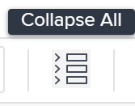

# Gérer les finances des tâches dans la section Détails de la tâche

<!--

(NOTE: some of the information (fields) in this article is also in the Edit tasks article; if you need to update one field, to it in both articles)

-->

Vous pouvez afficher ou modifier les informations financières d’une tâche en accédant à la zone Aperçu de la section Détails de la tâche. Vous pouvez afficher ou modifier un nombre limité de champs dans cette zone.

Pour plus d’informations sur la modification de toutes les informations financières d’une tâche, voir [Modifier les tâches](../../../manage-work/tasks/manage-tasks/edit-tasks.md).

## Conditions d’accès

+++ Développez pour afficher les exigences d’accès aux fonctionnalités de cet article. 

<table style="table-layout:auto"> 
 <col> 
 <col> 
 <tbody> 
  <tr> 
   <td role="rowheader">Package Adobe Workfront</td> 
   <td> 
Tous
 </td> 
  </tr> 
  <tr> 
   <td role="rowheader">Licence Adobe Workfront</td> 
   <td>
Standard
 
   
Travail ou supérieur
 </td> 
  </tr> 
  <tr> 
   <td role="rowheader">Configurations des niveaux d’accès</td> 
   <td> 
Modifier l’accès aux projets et tâches
 
Afficher l’accès aux données financières ou ultérieures
 
Vous devez disposer d'un accès en modification aux données financières pour modifier les informations financières des tâches
 </td> 
  </tr> 
  <tr> 
   <td role="rowheader">Autorisations d’objet</td> 
   <td> 
Autorisations Afficher pour la tâche qui incluent l’autorisation Afficher les finances ou supérieure.
 
Vous devez disposer des autorisations Gérer sur la tâche qui incluent Modifier les finances pour modifier les informations financières sur les tâches.
</td> 
  </tr> 
 </tbody> 
</table>

Pour plus d’informations, voir [Conditions d’accès dans la documentation Workfront](/help/quicksilver/administration-and-setup/add-users/access-levels-and-object-permissions/access-level-requirements-in-documentation.md).

+++

<!--Old:
<table style="table-layout:auto"> 
 <col> 
 <col> 
 <tbody> 
  <tr> 
   <td role="rowheader">Adobe Workfront plan*</td> 
   <td> 
Any
 </td> 
  </tr> 
  <tr> 
   <td role="rowheader">Adobe Workfront license*</td> 
   <td> 
Work or higher
 </td> 
  </tr> 
  <tr> 
   <td role="rowheader">Access level configurations*</td> 
   <td> 
Edit access to Projects and Tasks
 
View access to Financial Data or higher
 
You must have Edit access to Financial Data to edit financial information on tasks
 
Note: If you still don't have access, ask your Workfront administrator if they set additional restrictions in your access level. For information on how a Workfront administrator can change your access level, see <a href="../../../administration-and-setup/add-users/configure-and-grant-access/create-modify-access-levels.md" class="MCXref xref">Create or modify custom access levels</a>.
 </td> 
  </tr> 
  <tr> 
   <td role="rowheader">Object permissions</td> 
   <td> 
View permissions to the task that include View Finance or higher
 
You must have Manage permissions on the task that include Edit Finance to edit financial information on tasks
 
For information on requesting additional access, see <a href="../../../workfront-basics/grant-and-request-access-to-objects/request-access.md" class="MCXref xref">Request access to objects </a>.
 </td> 
  </tr> 
 </tbody> 
</table>-->

## Modifier les finances de la tâche dans la section Détails de la tâche

1. Accédez à un projet dans lequel vous souhaitez afficher une tâche.

   >[!NOTE]
   >
   >Pour trouver une tâche, vous pouvez également la rechercher, puis cliquer sur le nom pour accéder à la tâche. Pour plus d’informations sur la recherche d’objets dans Workfront, voir [Rechercher dans Adobe Workfront](../../../workfront-basics/navigate-workfront/search/search-workfront.md).

1. Cliquez sur **Tâches** dans le panneau de gauche.
1. Cliquez sur le nom de la tâche que vous souhaitez afficher.
1. Cliquez sur **Détails de la tâche**.
1. (Facultatif) Cliquez sur l’icône **Réduire tout** en haut à droite de la page Détails de la tâche.

   

   >[!NOTE]
   >
   >Selon la façon dont votre administrateur ou administratrice Workfront ou de groupes configure notre modèle de mise en page, les champs de la section Détails de la tâche peuvent être réorganisés ou ne pas s’afficher. Pour plus d’informations, voir [Personnaliser la vue Détails à l’aide d’un modèle de mise en page](../../../administration-and-setup/customize-workfront/use-layout-templates/customize-details-view-layout-template.md).

1. Cliquez sur **Finances** pour développer et afficher les informations financières de la tâche.

   Cliquez sur l’icône **Modifier**  dans le coin supérieur droit de la section Détails, puis cliquez sur **Finance**.

1. Modifiez un champ qui peut être modifié en cliquant sur le champ ou en cliquant sur **+Ajouter** pour ajouter des informations à un champ vide.
1. Examinez ou modifiez les informations suivantes dans la section **Finances** :

   <table style="table-layout:auto"> 
    <col> 
    <col> 
    <tbody> 
     <tr> 
      <td role="rowheader">Type de coût</td> 
      <td> 
Indiquez le type de coût de la tâche. Cela détermine comment le coût de la tâche est calculé, en fonction du nombre d’heures passées sur les tâches. 
 
Sélectionnez l’une des options suivantes : 
 
       <ul> 
        <li> 
Aucun coût
 </li> 
        <li> 
Fixe par heure 
 </li> 
        <li> 
 Utilisateur, par heure 
 </li> 
        <li> 
 Rôle par heure
 </li> 
       </ul> 
Pour plus d’informations sur le suivi des coûts, voir <a href="../../../manage-work/projects/project-finances/track-costs.md" class="MCXref xref">Suivre les coûts</a>. L’administration de Workfront ou de groupes sélectionne le paramètre « Type de coût » par défaut pour les tâches de votre système ou de votre groupe. Pour plus d’informations sur la définition des paramètres par défaut d’un projet, voir <a href="../../../administration-and-setup/set-up-workfront/configure-system-defaults/set-project-preferences.md" class="MCXref xref">Configurer les préférences de projet à l’échelle du système</a>.
 </td> 
     </tr> 
     <tr> 
      <td role="rowheader">Type de revenus</td> 
      <td> 
Indiquez le type de revenu de la tâche. Cela détermine comment le revenu de la tâche est calculé en fonction du nombre d’heures passées sur les tâches. 
 
Sélectionnez l’une des options suivantes : 
 
       <ul> 
        <li> 
 Non facturable 
 </li> 
        <li> 
Utilisateur, par heure 
 </li> 
        <li> 
Rôle par heure 
 </li> 
        <li> 
Fixe par heure 
 </li> 
        <li> 
Utilisateur par heure avec limite 
 </li> 
        <li> 
Rôle par heure avec limite 
 </li> 
        <li> 
Utilisateur, par heure plus fixe 
 </li> 
        <li> 
Rôle par heure plus fixe 
 </li> 
        <li> 
Revenus fixes 
 </li> 
       </ul> 
Pour plus d’informations sur le suivi des revenus, voir <a href="../../../manage-work/projects/project-finances/billing-and-revenue-overview.md" class="MCXref xref">Vue d’ensemble de la facturation et des revenus</a>. 
 
L’administration de Workfront ou de groupes sélectionne le paramètre « Type de revenu » par défaut pour les tâches de votre système ou de votre groupe. Pour plus d’informations sur la définition des paramètres par défaut d’un projet, voir <a href="../../../administration-and-setup/set-up-workfront/configure-system-defaults/set-project-preferences.md" class="MCXref xref">Configurer les préférences du projet à l’échelle du système</a>.
 </td> 
     </tr> 
     <tr> 
      <td role="rowheader">Coûts prévus</td> 
      <td> 
Il s’agit d’un calcul qui affiche le coût de la tâche en fonction du nombre d’heures prévues, du type de coût et du taux horaire des utilisateurs et utilisatrices ou des fonctions. Pour plus d’informations sur le suivi des coûts, voir <a href="../../../manage-work/projects/project-finances/track-costs.md" class="MCXref xref">Suivre les coûts</a>. 
 </td> 
     </tr> 
     <tr> 
      <td role="rowheader">Coûts réels</td> 
      <td> 
 Il s’agit d’un calcul qui affiche le coût de la tâche en fonction des heures effectives, du type de coût et du taux horaire pour des utilisateurs et utilisatrices ou des fonctions. Pour plus d’informations sur le suivi des coûts, voir <a href="../../../manage-work/projects/project-finances/track-costs.md" class="MCXref xref">Suivre les coûts</a>.
 </td> 
     </tr> 
     <tr> 
      <td role="rowheader">Revenus prévus</td> 
      <td> 
Il s’agit d’un calcul qui affiche les revenus associées à la tâche en fonction du nombre d’heures prévues, du type de revenu et du taux horaire des utilisateurs et utilisatrices ou des fonctions. Pour plus d’informations sur le suivi des coûts, voir <a href="../../../manage-work/projects/project-finances/track-costs.md" class="MCXref xref">Suivre les coûts</a>.
 </td> 
     </tr> 
     <tr> 
      <td role="rowheader">Revenu réel</td> 
      <td> 
Il s’agit d’un calcul qui affiche les revenus associés à la tâche en fonction des heures effectives, du type de revenu et du taux horaire des utilisateurs et utilisatrices ou des fonctions. Pour plus d’informations sur le suivi des coûts, voir <a href="../../../manage-work/projects/project-finances/track-costs.md" class="MCXref xref">Suive les coûts</a>.
 </td> 
     </tr> 
     <tr> 
      <td role="rowheader"><strong>ICP/SPI/CSI</strong> </td> 
      <td> 
Il s’agit de mesures des performances de votre tâche à un moment donné. Leurs valeurs sont calculées en fonction de la méthode d’indice de performances du projet. Pour plus d’informations, voir les articles suivants :
 
       <ul> 
        <li> 
<a href="../../../manage-work/projects/project-finances/calculate-cpi.md" class="MCXref xref">Calculer l’Indice Coûts Performances (ICP)</a> 
 </li> 
        <li> 
<a href="../../../manage-work/projects/project-finances/calculate-spi.md" class="MCXref xref">Calculer l’Indice Horaire Performances (IHP) </a> 
 </li> 
        <li> 
 
<a href="../../../manage-work/projects/project-finances/calculate-csi.md" class="MCXref xref">Calculer l’Indice Coûts Horaire Performances (CSI)</a> 
 
 </li> 
       </ul> </td> 
     </tr> 
     <tr> 
      <td role="rowheader">Estimation à l’achèvement (EAC)</td> 
      <td> 
Il s’agit d’un calcul qui affiche le coût total de votre tâche à la fin de celle-ci. Pour plus d’informations sur l’estimation à l’achèvement, voir <a href="../../../manage-work/projects/project-finances/calculate-eac.md" class="MCXref xref">Calculer l’estimation à l’achèvement (EAC)</a>.
 </td> 
     </tr> 
    </tbody> 
   </table>

1. (Le cas échéant) Si vous modifiez les champs de la section Finance, cliquez sur **Enregistrer**&#x200B;**les modifications**.
