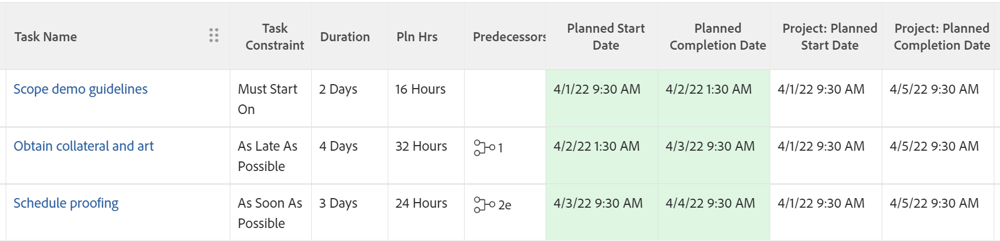

# Vue d’ensemble des contraintes de tâches : Première heure disponible

Le délai le plus court est une contrainte de tâche qui planifie une tâche pour qu’elle commence au plus tôt après avoir pris en compte les relations antérieures.

Pour plus d’informations sur la mise à jour de la contrainte de tâche, voir [Mettre à jour la contrainte de tâche](../../../manage-work/tasks/task-constraints/update-task-constraint-of-task.md).

<!--

(NOTE: replaced with new article linked above) 

-->

<!--

To update the Task Constraint to Earliest Available Time:

-->

<!--
   <li value="1" data-mc-conditions="QuicksilverOrClassic.Draft mode">Go to a task whose constraint you want to modify. </li>
   -->

<!--
   
Click <strong>Edit Task</strong>.

   -->

<!--
   
Click the <strong>More</strong> icon  next to the task name, then click <strong>Edit</strong>.

   -->

<!--
   
In the <strong>Overview</strong> section, expand the <strong>Task Constraint</strong> drop-down menu.

   -->

<!--
   
Select <strong>Earliest Available Time</strong>.

   -->

<!--
   <li value="5" data-mc-conditions="QuicksilverOrClassic.Draft mode">Click <strong>Save Changes</strong>.</li>
   -->

## Différence entre Première heure disponible et Aussi tôt que possible

<!--

(NOTE: [! This section is duplicated in "Earliest Available Time"])

-->

La contrainte Première heure disponible diffère de la contrainte Aussi tôt que possible lorsque tous les critères suivants sont remplis :

* Le projet est planifié à partir de la date d’achèvement.
* Les tâches du projet ont une relation antérieure.
* La tâche antérieure a une contrainte de tâche flexible.

Dans ce cas :

* **Première Heure Disponible :** l’utilisation de la contrainte « Première Heure Disponible » pour la tâche ultérieure donne la priorité à la contrainte flexible antérieure.

  **EXEMPLE**

  La tâche A est antérieure à la tâche B. La tâche B est soumise à la contrainte « Première Heure Disponible » et la tâche A est soumise à la contrainte « Aussi Tard Que Possible ». Dans ce cas, la tâche B est programmée le plus près possible de la fin du projet.

  

* **Aussi Tôt Que Possible :** dans ce scénario, l’utilisation de la contrainte « Aussi Tôt Que Possible » pour la tâche ultérieure donne la priorité à cette dernière.

  **EXEMPLE**

  La tâche A est antérieure à la tâche B. La tâche B a la contrainte « Aussi Tôt Que Possible » et la tâche A a la contrainte « Aussi Tard Que Possible ». Dans ce cas, la tâche B est programmée le plus près possible du début du projet.

  
