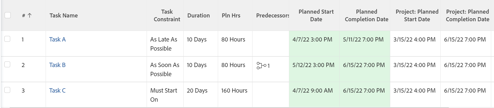

# Présentation de la contrainte de tâche : Dernière heure disponible

La dernière heure disponible (LAT) est un type de contrainte de tâche dans Adobe Workfront.

## Utilisation de la dernière contrainte de tâche de temps disponible

Vous pouvez utiliser la contrainte LAT lorsque vous souhaitez planifier le début d’une tâche au dernier moment disponible après avoir pris en compte les relations prédécesseur-successeurs dans le projet.

Cette contrainte diffère dès que possible du fait qu’elle ne forcera pas les prédécesseurs ou les successeurs à être reprogrammés. En revanche, elle n’affecte que le planning de la tâche à laquelle elle est associée, en la définissant sur l’heure disponible la plus récente en fonction de sa relation avec d’autres tâches.

Pour plus d’informations sur la mise à jour de la contrainte de tâche sur une tâche, voir [Mettre à jour la contrainte de tâche d’une tâche](../../../manage-work/tasks/task-constraints/update-task-constraint-of-task.md).

<!--

To update the Task Constraint to Latest Available Time:

(NOTE:&nbsp;replaced with new article linked above)&nbsp;

<ol>
<li value="1">Go to a task whose Task Constraint you want to update.</li>
<li value="2"> 
Click the <strong>More</strong> icon  next to the task name, then click <strong>Edit</strong>.
 </li>
<li value="3">In the <strong>Overview</strong> section, expand the <strong>Task Constraint</strong> drop-down menu.</li>
<li value="4"> 
Select <strong>Latest Available Time</strong>.
 </li>
<li value="5">Click <strong>Save Changes</strong>.</li>
</ol>

-->

## Différence entre la dernière heure disponible et aussi tardive que possible

<!--

(NOTE: [! This section is duplicated in "As Late As Possible"] - inserted snippet in both (Alina)) 

-->

La dernière contrainte Heure disponible diffère de la contrainte Dès que possible lorsqu’il existe les critères suivants :

* Le projet est planifié à partir de la date de début
* Les tâches du projet ont une relation de prédécesseur
* La tâche qui lui succède présente une contrainte de tâche flexible.

Dans ce cas :

* **Dernière heure disponible :** L’utilisation de la dernière contrainte de temps disponible sur la tâche précédente donne la priorité à la contrainte flexible du successeur.

   **Exemple :** Par exemple, la tâche A est un prédécesseur de la tâche B. La tâche A a la dernière contrainte de temps disponible et la tâche B la contrainte Dès que possible. Dans ce cas, la tâche A est planifiée aussi près que possible du début du projet.

   

* **Aussi Tard Que Possible :** Dans ce scénario, l’utilisation de la contrainte Aussi tard que possible sur la tâche du prédécesseur donne la priorité à la tâche du prédécesseur.

   **Exemple :** Par exemple, la tâche A est un prédécesseur de la tâche B. La tâche A a la contrainte Dès que possible et la tâche B la contrainte Dès que possible. Dans ce cas, la tâche A est planifiée aussi près que possible de la fin du projet.

   

<!--

(NOTE:&nbsp;this content was here before but it was wrong - according to this issue in Hub, per Dev, the correct functionality is in the snippet above: https://hub.workfront.com/task/6193c6910004bce9de07cda7757f3ce8/updates?email-source=subscribedCommunication) 

The Latest Available Time constraint differs from the As Late As Possible constraint when the following criteria exist:

<ul>
<li> The project is scheduled From Completion </li>
<li> Tasks in the project have a predecessor relationship </li>
<li> The predecessor task has a flexible task constraint </li>
</ul>

 In this situation: 

<ul>
<li> 
<strong>Latest Available Time:</strong> Using the Latest Available Time constraint on the successor task gives priority to flexible constraint of the predecessor.
 
For example, Task A is a predecessor to Task B. Task B has the Latest Available Time constraint and Task A has the As Soon As Possible constraint. In this situation, Task B is scheduled as close to the start of the project as possible.
 </li>
<li> 
<strong>As Late As Possible:</strong> In this scenario, using the As Late As Possible constraint on the successor task gives the priority to the successor task.
 
For example, Task A is a predecessor to Task B. Task B has the As Late As Possible constraint and Task A has the As Soon As Possible constraint. In this situation, Task B is scheduled as close to the end of the project as possible.
 </li>
</ul>

-->
