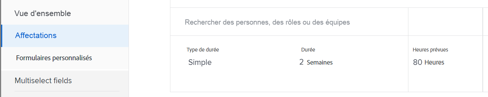
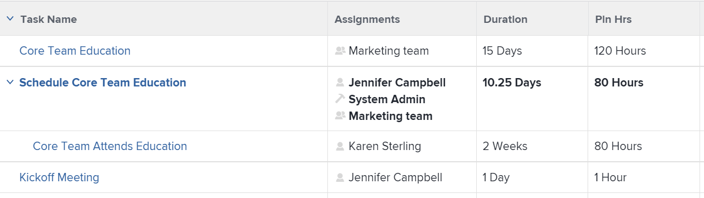

# Vue d’ensemble du nombre d’heures prévues

<!-- Audited: 01/2024 -->

Le nombre d’heures prévues associées à une tâche, à un problème ou à un projet représentent le temps nécessaire aux utilisateurs et utilisatrices affectés pour terminer la tâche, le problème ou le projet.

## Remarques concernant le nombre d’heures prévues dans Adobe Workfront

* Le nombre d’heures prévues sont principalement associées aux éléments de travail (tâches et problèmes) dans Adobe Workfront. Le nombre d’heures prévues des tâches est répercutés sur le nombre d’heures prévues de leurs projets.
* Par défaut, Workfront répartit le nombre d’heures prévues pour la tâche et le problème de manière égale sur tous les jours de la durée de la tâche ou du problème.
* Lorsque des utilisateurs et utilisatrices, et des rôles sont affectés à des tâches et des problèmes, le nombre d’heures prévues des tâches et des problèmes sont associées aux affectations d’utilisateurs et d’utilisatrices, ou de rôles.
* Si vous souhaitez utiliser les outils de gestion des ressources dans Workfront, vous devez définir la valeur du nombre d’heures prévues pour les tâches et les problèmes.
* Vous ne pouvez modifier la valeur du nombre d’heures prévues sur les tâches que pour certains types de durée.

  Pour plus d’informations sur la modification du nombre d’heures prévues sur les tâches par rapport au type de durée des tâches, consultez la section [Mettre à jour le nombre d’heures prévues de la tâche en fonction du type de durée](#update-task-planned-hours-based-on-duration-type) dans cet article.

* Vous pouvez, à tout moment, modifier la valeur du nombre d’heures prévues pour les problèmes.
* Vous ne pouvez pas modifier la valeur du nombre d’heures prévues des projets ou des tâches parent, car il s’agit d’un total calculé du nombre d’heures prévues de toutes leurs tâches et sous-tâches.
* La gestion des affectations des utilisateurs et utilisatrices à l’aide des outils de gestion des ressources peut modifier le nombre d’heures prévues de tâches, de problèmes et de projets, ainsi que celui des affectations associées aux éléments de travail.

## Nombre d’heures prévues des tâches par rapport au nombre d’heures prévues des projets {#planned-hours-on-tasks-vs-planned-hours-on-projects}

Le nombre d’heures prévues des tâches est répercuté sur le nombre d’heures prévues du projet. Le Nombre d’heures prévues des problèmes n’est pas toujours répercuté sur le nombre d’heures prévues du projet.

Cette section décrit les différences entre le nombre d’heures prévues des projets et des tâches. Elle décrit également où vous pouvez afficher le le nombre d’heure prévues des problèmes qui est repércuté sur le projet.

### Nombre d’heures prévues pour les tâches {#planned-hours-on-tasks}

Le nombre d’heures prévues d’une tâche indiquent la durée estimée du travail réel pour la tâche. Par défaut, Workfront répartit uniformément le nombre total d’heures prévues pour chaque jour dans la durée de chaque tâche. Le nombre quotidien d’heures prévues devient l’affectation quotidienne de la tâche. Si la tâche est assignée à plusieurs ressources, chaque ressource se voit attribuer par défaut un nombre égal d’heures journalières.

À l’aide de l’équilibreur de charge de travail, vous pouvez modifier les allocations quotidiennes des utilisateurs et utilisatrices affectés aux tâches. Cela peut également mettre à jour le nombre d’heures prévues de la tâche lorsque le type de durée de la tâche est simple. Pour plus d’informations, voir la section « Mettre à jour le nombre d’heures prévues de la tâche lors de la gestion des allocations des utilisateurs et utilisatrices » dans l’article [Gérer les allocations des utilisateurs et utilisatrices dans l’équilibreu de charge de travail](../../../resource-mgmt/workload-balancer/manage-user-allocations-workload-balancer.md).

Lorsqu’une tâche contient des sous-tâches, le nombre d’heures prévues de la tâche parent est la somme du nombre d’heures prévues de toutes les sous-tâches. Vous ne pouvez pas mettre à jour le nombre d’heures prévues d’une tâche parent.

>[!NOTE]
>
>Contrairement au nombre d’heures prévues, les heures effectives d’une tâche parent sont les heures consignées directement sur la tâche parente. Elles ne représentent pas la somme des heures effectives des tâches enfant.\
>Pour plus d’informations sur les heures effectives, voir [Afficher les heures effectives](../../../manage-work/tasks/task-information/actual-hours.md).

### Nombre d’heures prévues pour les projets {#planned-hours-on-projects}

Vous ne pouvez pas modifier le nombre d’heures prévues pour un projet. Le nombre d’heures prévues d’un projet correspond à la somme calculée du nombre d’heures prévues de toutes les tâches du projet.

L’inclusion des problèmes dans le calcul du nombre d’heures prévues dépend de l’emplacement du projet où vous visualisez le nombre d’heures prévues. Vous pouvez afficher le nombre d’heures prévues du projet aux emplacements suivants dans un projet :

* **Section Détails du projet et zone Modifier le projet** : seul le nombre d’heures prévues pour les tâches du projet est pris en compte. Le nombre d’heures prévues pour les problèmes du projet n’est pas pris en compte lors de l’affichage du nombre total d’heures prévues pour le projet dans la section Détails du projet ou dans la zone Modifier le projet.

* **Équilibreur de charge de travail** : seul le nombre d’heures prévues associées aux tâches visibles dans l’équilibreur de charge de travail s’affichent dans l’équilibreur de charge de travail pour les projets. Les allocations quotidiennes des utilisateurs peuvent modifier le nombre d’heures prévues quotidiennes du projet dans l’équilibreur de charge de travail.
* **Section Utilisation** : le nombre d’heures prévues associé aux utilisateurs et utilisatrices affectés aux tâches et aux problèmes du projet est pris en compte lors de l’affichage du nombre total d’heures prévues du projet dans la section Utilisation.
* **Panneau Affectation des rôles** dans la liste des tâches : le nombre d’heures prévues pour les tâches et les problèmes du projet attribué à une fonction, ou à un utilisateur ou une utilisatrice associé à une fonction s’affiche dans cette zone. Le nombre d’heures prévues associé aux tâches et aux problèmes qui n’est pas assigné ou qui est assigné aux équipes ne s’affichent pas dans cette zone. Pour plus d’informations, voir [Afficher le nombre d’heures prévues du projet dans le panneau Affectation des rôles](../../../manage-work/projects/planning-a-project/view-planed-hours-in-role-allocation-panel.md).

## Répartition des heures prévues sur la durée d’une tâche

Par défaut, Workfront répartit le nombre d’heures prévues uniformément sur la durée d’une tâche, allouant un nombre égal d’heures prévues pour chaque jour de la tâche, en fonction de la disponibilité du planning du projet.

Par exemple, si une tâche doit commencer à 16 h et qu’il reste une heure au premier jour de la tâche, Workfront place une heure prévue dans le premier jour de la durée de la tâche, puis divise le reste du nombre d’heures prévues de manière égale entre les autres jours de la durée de la tâche.

>[!NOTE]
>
>Le nombre d’heures prévues par jour ou l’allocation quotidienne correspond à l’allocation du nombre d’heures prévues pour chaque jour pendant la durée de la tâche. Si la tâche comporte une affectation, ce nombre représente le nombre d’heures prévues par jour et par affectation. Si la tâche comporte plusieurs affectations, le nombre d’heures prévues par jour et par affectation est différent du nombre d’heures prévues par jour pour la tâche. Il n’existe aucune représentation visuelle dans Workfront pour le nombre d’heures prévues par jour et par affectation, pour les tâches avec plusieurs affectations.

## Localiser et comprendre les valeurs de nombre d’heures prévues

Les valeurs de nombre d’heures prévues se trouvent dans différentes zones de Workfront.

Le nombre d’heures prévues affiché provient des éléments de travail du projet ou est calculé différemment selon la zone et l’objet dans lesquels vous les visualisez.

Vous pouvez localiser le nombre d’heures prévues dans les zones suivantes de Workfront :

* [La section Détails d’un projet, d’une tâche ou d’un problème](#the-details-section-of-a-project-task-or-issue)
* [La zone Modifier la tâche ou Modifier le problème](#the-edit-task-or-edit-issue-box)
* [Rapports](#reports)
* [L’équilibreur de charge de travail](#the-workload-balancer)
* [Le planificateur de ressources](#the-resource-planner)
* [Le rapport d’utilisation](#the-utilization-report)
* [Panneau « Attribution du rôle »](#the-role-allocation-panel)

### La section Détails d’un projet, d’une tâche ou d’un problème {#the-details-section-of-a-project-task-or-issue}

Le nombre d’heures prévues dans la section Détails d’une tâche, d’un problème ou d’un projet correspond au nombre total d’heures prévues associé à l’élément.

Pour plus d’informations sur le nombre d’heures prévues du projet, voir la section [Nombre d’heures prévues des tâches par rapport au Nombre d’heures prévues des projets](#planned-hours-on-tasks-vs-planned-hours-on-projects) de cet article.

### La zone Modifier la tâche ou Modifier le problème {#the-edit-task-or-edit-issue-box}

Le nombre d’heures prévues dans la zone Modifier d’une tâche ou d’un problème correspond au nombre total d’heures prévues de l’élément correspondant.

Pour plus d’informations sur le nombre d’heures prévues du projet, voir la section [Nombre d’heures prévues des tâches par rapport au Nombre d’heures prévues des projets](#planned-hours-on-tasks-vs-planned-hours-on-projects) de cet article.

Pour les tâches, vous pouvez ne modifier la quantité du nombre d’heures prévues que pour certains types de durées. Pour plus d’informations, voir la section [Mettre à jour le nombre d’heures prévues des tâches en fonction du type de durée](#update-task-planned-hours-based-on-duration-type) de cet article.

Vous pouvez afficher l’affectation individuelle du nombre d’heures prévues de chaque utilisateur ou utilisatrice ou fonction affecté à la tâche ou au problème dans la zone Affectations.

### Rapports {#reports}

Vous pouvez ajouter le champ Nombre d’heures prévues dans les rapports de projets, de tâches et de problèmes.

Par défaut, la colonne Nombre d’heures prévues est incluse dans la vue Standard d’une liste de tâches.

Le rapport Nombre d’heures prévues d’une tâche, d’un problème ou d’un projet correspond au nombre total d’heures prévues de l’élément correspondante, tel qu’il s’affiche dans la section Détails ou dans la zone Modifier des éléments.

Pour plus d’informations sur la création de rapports, voir [Créer un rapport personnalisé](../../../reports-and-dashboards/reports/creating-and-managing-reports/create-custom-report.md).

>[!NOTE]
>
>Si vous créez un rapport Projet (Données financières) et que vous le regroupez par date, le nombre d’heures prévues peut afficher une partie du nombre d’heures prévues du projet selon la chronologie des tâches du projet. Par défaut, Workfront répartit uniformément le nombre d’heures prévues des tâches pour chaque jour de la durée de la tâche. Le nombre d’heures prévues d’une période donnée correspond à la répartition égale définie par Workfront pour cette période dans le rapport Projet (Données financières).

<!--
### The Scheduling areas  {#the-scheduling-areas}

The Planned Hours for tasks and issues display in the Scheduling areas in the Planned Hours field.

You can view the daily allocation of Planned Hours for each user assigned to a task or an issue in the Scheduling areas.

The daily hour amount represents one of the following:

* the default amount equally distributed by Workfront for each day of the Duration of the tasks or issues
* the adjusted daily allocation managed by resource managers.

  For information about adjusting daily allocations in the Scheduling tools, see [Manage user allocations in the Scheduling areas](../../../resource-mgmt/resource-scheduling/manage-allocations-scheduling-areas.md).
-->

### Équilibreur de charge de travail {#the-workload-balancer}

Les nombres d’heures prévues suivants pour les tâches, problèmes et projets s’affichent dans l’équilibreur de charge de travail à droite du nom de la tâche, du problème ou du projet :

* Pour les tâches et les problèmes, les nombres d’heures prévues qui y sont associés s’affichent.
* Pour les projets, un nombre total d’heures prévues des tâches et des problèmes visibles à l’écran s’affiche.

  >[!TIP]
  >
  >L’équilibreur de charge de travail n’affiche pas tous les nombres d’heures prévues d’un projet visibles dans la zone Détails du projet.

Vous pouvez afficher l’affectation quotidienne du nombre d’heures prévues de chaque utilisateur ou utilisatrice affecté à une tâche ou à un problème dans l’équilibreur de charge de travail.

Le nombre d&#39;heures prévues par jour représente l&#39;un des éléments suivants :

* la quantité par défaut répartie uniformément par Workfront pour chaque jour de la durée des tâches, des problèmes ou du projet ;
* l’affectation quotidienne ajustée gérée par les gestionnaires de ressources.

  Pour plus d’informations sur l’ajustement des affectations dans l’équilibreur de charge de travail, voir la section [Gérer les affectations des utilisateurs et utilisatrices dans l’équilibreur de charge de travail](../../../resource-mgmt/workload-balancer/manage-user-allocations-workload-balancer.md).

### Planificateur de ressources {#the-resource-planner}

Le planificateur de ressources affiche le nombre d’heures prévues des projets, des tâches et des problèmes.

Vous pouvez afficher les affectations hebdomadaires de nombre d’heures prévues pour les utilisateurs et utilisatrices et les fonctions associés aux éléments de travail dans la colonne PLN du planificateur de ressources.

>[!TIP]
>
>Les ajustements d’affectation quotidienne dans l’équilibreur de charge de travail influent sur les affectations hebdomadaires pour les tâches et les problèmes dans le planificateur de ressources.

Le nombre d&#39;heures planifiées pour chaque objet varie selon la vue que vous appliquez au planificateur de ressources. Pour plus d’informations, consultez la section [Vue d’ensemble des heures, de l’équivalent temps complet et des informations sur les coûts dans les vues « Projet » et « Rôle » du planificateur de ressources](../../../resource-mgmt/resource-planning/overview-of-planner-hour-fte-cost-information-in-role-project-views.md).

Le nombre d’heures prévues par semaine pour les tâches et les problèmes représente l’un des éléments suivants :

* montant hebdomadaire par défaut réparti uniformément par Workfront pour chaque jour de la durée des tâches ou des problèmes ;
* affectation hebdomadaire ajustée gérée par les personnes chargées de la gestion des ressources dans l’équilibreur de charge de travail.

  Pour plus d’informations sur l’ajustement des allocations quotidiennes dans l’équilibreur de charge de travail, consultez la section [Gérer les affectations des utilisateurs et des utilisatrices dans l’équilibreur de charge de travail](../../../resource-mgmt/workload-balancer/manage-user-allocations-workload-balancer.md).

Le montant hebdomadaire des projets, des utilisateurs et des utilisatrices et des rôles dépend du nombre hebdomadaire d’heures prévues pour les tâches et les problèmes qui y sont associés.

### Rapport d’utilisation {#the-utilization-report}

Les heures prévues du projet sont celles associées aux affectations pour chaque tâche et chaque problème.

>[!IMPORTANT]
>
>Notez que les heures prévues du rapport d’utilisation sont associées aux affectations et non aux tâches et problèmes eux-mêmes. Les heures prévues dans le rapport Utilisation ne correspondent pas toujours aux heures prévues pour les tâches et événements du projet. Toutefois, les heures planifiées correspondent aux heures associées aux affectations pour les tâches et les événements.

Vous pouvez afficher les types d’heures prévues suivants dans le rapport d’utilisation :

* Nombre total d’heures prévues de toutes les affectations du projet pour la durée de vie globale des projets inclus
* Nombre total d’heures prévues de toutes les affectations uniquement pour la période spécifiée (vous pouvez spécifier une semaine ou un mois spécifique).

  Lorsque les heures de travail quotidiennes de l’utilisateur ou de l’utilisatrice sont ajustées par l’équilibreur de charge de travail, les heures prévues pour une période donnée peuvent être modifiées si les dates sélectionnées dans le rapport d’utilisation couvrent seulement une partie de la durée d’une tâche ou d’un problème. Pour plus d’informations sur l’ajustement des allocations quotidiennes pour les utilisateurs et les utilisatrices, consultez la section [Gérer les affectations des utilisateurs et des utilisatrices dans l’équilibreur de charge de travail](../../../resource-mgmt/workload-balancer/manage-user-allocations-workload-balancer.md).

Pour plus d’informations, consultez la section [Afficher les informations sur l’utilisation des ressources](../../../resource-mgmt/resource-utilization/view-utilization-information.md).

### Panneau « Attribution du rôle »

Dans le panneau « Attribution du rôle », le nombre d’heures prévues représente le nombre d’heures prévues associé à chaque fonction affectée aux tâches ou aux problèmes du projet pendant toute la durée du projet. Le nombre correspond au rôle « Nombre d’heures prévues » du planificateur de ressources.

>[!TIP]
>
>Notez que le nombre d’heures prévues associé aux utilisateurs et aux utilisatrices ne s’affiche pas dans le panneau « Attribution du rôle ».

Pour plus d’informations, consultez la section [Afficher l’attribution du rôle pour les projets et les initiatives dans l’équilibreur de charge de travail](../../../scenario-planner/show-role-allocation-workload-balancer.md).

## Mise à jour du nombre d’heures prévues de la tâche en fonction du type de durée {#update-task-planned-hours-based-on-duration-type}

La mise à jour du nombre total d’heures prévues pour les tâches n’est possible lors de l’édition que si les tâches possèdent un certain type de durée.

Les scénarios suivants sont possibles :

* Vous ne pouvez modifier le nombre d’heures prévues pour les tâches que lorsque vous utilisez les types « Calcul d’affectation » ou « Simple » lors de la modification d’une tâche.

  Pour plus d’informations sur le type de durée « Calcul d’affectation », consultez la section [Vue d’ensemble du type de durée : « Calcul d’affectation »](../../../manage-work/tasks/taskdurtn/calculated-assignment.md).

  Pour plus d’informations sur le type de durée « Simple », consultez la section [Vue d’ensemble du type de durée : « Simple »](../../../manage-work/tasks/taskdurtn/simple-duration-type.md).

* Vous ne pouvez mettre à jour le nombre d’heures prévues de la tâche dans l’équilibreur de charge de travail que pour les tâches de type de durée « Simple » lorsque vous gérez les affectations des utilisateurs et des utilisatrices aux tâches. Pour plus d’informations sur la gestion des affectations des utilisateurs et des utilisatrices dans l’équilibreur de charge de travail, consultez la section [Gérer les affectations des utilisateurs et des utilisatrices dans l’équilibreur de charge de travail](../../../resource-mgmt/workload-balancer/manage-user-allocations-workload-balancer.md).
* Vous ne pouvez pas modifier le nombre d’heures prévues pour les tâches avec un type de durée « Piloté par l’effort » ou « Calcul de travail ». Dans ce contexte, Workfront détermine le nombre d’heures prévues selon la durée de la tâche ; cependant, le nombre d’heures prévues correspond toujours à la durée (en heures) et n’est pas modifié par le pourcentage de ressources affectées.

  Pour plus d’informations sur le type de durée « Piloté par l’effort », consultez la section [Vue d’ensemble du type de durée : « Piloté par l’effort »](../../../manage-work/tasks/taskdurtn/effort-driven.md).

  Pour plus d’informations sur le type de durée « Calcul de travail », consultez la section [Vue d’ensemble du type de durée : « Calcul de travail »](../../../manage-work/tasks/taskdurtn/calculated-work.md).

## Mettre à jour le nombre d’heures prévues d’une tâche lors de la gestion des affectations des personnes

Il est possible de mettre à jour le nombre d’heures prévues pour les tâches lorsque vous modifiez manuellement les affectations d’utilisateurs et d’utilisatrices ou de fonctions aux tâches. Cela n’est possible que si les tâches ont un type de durée « Simple ».

Pour plus d’informations, consultez la section [Vue d’ensemble du type de durée : « Simple »](../../../manage-work/tasks/taskdurtn/simple-duration-type.md).

Il est possible de modifier l’affectation globale des utilisateurs, utilisatrices et fonctions affectés à la tâche ou de modifier les affectations journalières de chaque utilisateur ou utilisatrice grâce à l’équilibreur de charge de travail.

Pour plus d’informations sur la gestion de l’affectation globale des utilisateurs, utilisatrices et fonctions aux tâches, consultez la section [Gérer les heures d’affectation des utilisateurs, utilisatrices et fonctions aux tâches](../../../manage-work/tasks/assign-tasks/manage-allocation-hours-on-tasks.md).

Pour plus d’informations sur la gestion des affectations quotidiennes pour les tâches, consultez la section [Gérer les affectations des utilisateurs et utilisatrices dans l’équilibreur de charge de travail](../../../resource-mgmt/workload-balancer/manage-user-allocations-workload-balancer.md).

Les scénarios suivants existent lors de la mise à jour manuelle des affectations des utilisateurs, utilisatrices et fonctions aux tâches :

* Si vous n’avez pas mis à jour manuellement les affectations spécifiques des utilisateurs, utilisatrices et fonctions aux tâches pour ajuster le nombre d’heures prévues, ces heures prévues demeurent les mêmes lorsque vous ajoutez, retirez ou remplacez des affectations sur la tâche. Lors de l’ajout d’une nouvelle affectation à la tâche, les affectations individuelles sont réparties entre toutes les personnes cessionnaires.
* En mettant à jour manuellement les affectations pour ajuster le nombre d’heures prévues de la tâche, les heures prévues diminuent lorsque vous supprimez des affectations de la tâche. Elles restent inchangées lorsque vous remplacez une affectation.
* En mettant à jour manuellement les affectations pour ajuster le nombre d’heures prévues de la tâche et en ajoutant une nouvelle affectation, celle-ci reçoit par défaut 0 heure. Vous devez mettre à jour manuellement leur affectation à la tâche, ce qui peut affecter le nombre d’heures prévues.
* Si vous n’avez pas mis à jour manuellement les affectations pour déclencher une modification du nombre d’heures prévues de la tâche et que vous supprimez toutes les affectations, le nombre d’heures prévues demeure inchangé.
* Lorsque vous avez mis à jour manuellement les affectations pour déclencher une modification du nombre d’heures prévues de la tâche et que vous supprimez toutes les affectations à la tâche, le nombre d’heures prévues est également supprimé et le nombre d’heures prévues de la tâche devient 0.

>[!NOTE]
>
>Par exemple, si une tâche a 10 heures prévues et que vous avez deux personnes cessionnaires, elles se voient allouer 5 heures chacune, par défaut.
>
>* Si vous ne mettez pas à jour l’attribution individuelle de la personne ou les attributions quotidiennes à l’aide de l’équilibreur de charge de travail et que vous supprimez tout ou partie des personnes cessionnaires de la tâche, le nombre d’heures prévues de la tâche reste à 10 heures.
>* Si vous modifiez manuellement les affectations pour qu’elles soient de 4 et 6 heures, respectivement, et que vous supprimez la personne ayant une attribution de 6 heures ainsi que sa fonction, le nombre d’heures prévues de la tâche devient 4 heures. Si vous supprimez également la personne ayant une attribution de 4 heures, mais que vous conservez le rôle associé à la personne supprimée, le nombre d’heures prévues de la tâche reste 4 heures. Si vous supprimez la dernière personne à laquelle 4 heures ont été attribuées ainsi que sa fonction et que la tâche reste non attribuée, le nombre d’heures prévues de la tâche devient 0.

## Mettre à jour automatiquement le nombre d’heures prévues des tâches à l’aide de l’effort de travail

Lorsque vous utilisez l’effort de travail pour estimer l’effort nécessaire à l’accomplissement d’une tâche, le nombre d’heures prévues pour les tâches est automatiquement mis à jour. Ceci n’est possible que pour les tâches ayant un type de durée Simple.

Pour plus d’informations sur l’utilisation de l’effort de travail pour estimer l’effort de la tâche, voir [Vue d’ensemble de l’effort de travail](../../../manage-work/tasks/task-information/work-effort.md).

<!--

(NOTE: this issue has the explanation of how Planned Hours should work - from Vazgen and Anna: https://hub.workfront.com/issue/6217dced00730b7034c4b808339a35ce/

-->

<!--

Details of their comments: 

-->

<!--

Anna Asatryan

3/22/2022 At 3:16 PM

 

to Mark Paul, Corrie Butler, Arman Simonyan, Gagik Khalatyan, Alina Wilson, Artur Sargsyan, Vazgen Babayan, Anna Asatryan

I have done some rough calculations on what the planned hours/revenues should look like Book.xlsx . And if we look, for example at the 2 users highlighted in one of the screenshots their planned hours look way off from what the calculation looks like in the spreadsheet (i.e. equally distributed allocation). When looking at the Workload balancer (the second screenshot), as an example for the user Yashas Mitta, I can see that the allocation has been modified. Obviously the utilization report calculates the allocations based on the modified contouring using the new work per day calculation. The project financial report uses the old, equal distribution of allocation along the full duration of the task. Hence. there is a difference when grouping per periods.

Vazgen Babayan

I believe we will need to prioritise syncing the project financial data report with the new work per day.

Alina Wilson

@Anna Asatryan , do you have a definition of what we should say in documentation (glossary, for example) for how the Planned Hours (or Planned Revenue) is calculated, keeping in mind that we don't document the concept of "workPerDay". We call them "daily allocations", for example, but let me know if that's accurate, too.

Vazgen Babayan

Last Thursday at 3:13 PM

I think an important note here is that regardless the calculation, even if the both views used the same formula, they will not display the same data, because the underlying data sources are different. The Financial Data report does not respect user-entered allocations in Workload Balancer at this moment. So there will be a clear discrepancy, as Anna showed in her message. My recommendation for communication will be to explain that the data sources are different so there can be a mismatch in data and that we will look into addressing that on our roadmap.

Alina Wilson

So far, I hear you guys say this (with my questions for confirmation/ comments in bold):

- the utilization report calculates the allocations based on the modified contouring using the new work per day calculation (so this is what we see in the Workload Balancer, right?)

- the project financial report uses the old, equal distribution of allocation along the full duration of the task (this is before the daily allocations for example were modified in the WB, right?)

I have these additional questions:

- what does the Project Details show? Which Planned Hours, for instance - because earlier, we had a question about this also. - which numbers?

- what does any Planned Hours/ Planned Revenue field that can be pulled in any other report (outside of Financial Data and Utilization reports) show? - which numbers?

- are there any other areas I am not thinking of that we need to document, @Corrie Butler

I will try to document all the possible areas where these display but please help. Thanks!

Vazgen Babayan

Last Saturday at 3:41 PM

<ul>
<li> 
Confirming the first two points 
 </li>
</ul>

For the following questions

<ul>
<li> 
Project details show an aggregated sum of task planned hours. It doesn't have anything to do with the work per day because it always deals with total numbers for the whole duration of the Project/Task.
 </li>
<li> 
Same thing applies to the Planned Hours and Planned Revenue fields in reports - they show totals for the whole Project/Task duration and thus have no use of work per day.
 </li>
<li> 
Can't think of any other fields related to this right now.
 </li>
<li> 
In general, if I were to summarize the system behavior, it's as follows:
 </li>
<li> 
Every area that only deals with total numbers of Planned Hours / Planned Revenue, uses the numbers entered on the tasks. Those are Task / Project Details, reports exposing those fields.
 </li>
<li> 
Areas that deal with time-sensitive portions of Planned Hours / Planned Revenue, use work per day. Those are all Resource Management tools - Workload Balancer, Resource Planner, Utilization Report, importing projects via Scenario Planner.
 </li>
<li> 
All the areas in the second point support user-edited allocations made in Workload Balancer.
 </li>
<li> 
Scheduling area and Project Financial Data reports use the old version of the work per day, which doesn't respect user-edited allocations from Workload Balancer.
 </li>
<li> 
Scheduling will be removed this year, and we need to do work to move the Project Financial Data reports to the new work per day sometime after Q3.
 </li>
</ul>

Alina Wilson

@Vazgen Babayan , one clarifying question: when you say "Scheduling and Project Financial Data reports use the old version of the work per day, which doesn't respect user-edited allocations from WB" - you mean that those use the system default which spreads the allocations evenly, correct? Because you can edit (daily) allocations in Scheduling tools, but it doesn't use that, correct? It uses the default of the daily allocation that the system figures out when dividing the Planned Hours by the number of days in the Duration. Please let me know. And thanks!

Anna Asatryan

Yesterday at 11:42 AM

@Alina Wilson , that's correct, when saying "Scheduling and Project Financial Data reports use the old version of the work per day, which doesn't respect user-edited allocations from WB" Vazgen meant that it spreads the allocation evenly.

As for the scheduling, the allocation modification that's being done there isn't reflected anywhere else in the application other than in the Scheduling itself. That's probably one of the reasons it's being deprecated.

-->

<!--

   

-->

<!--

(NOTE: everything below is drafted because I replaced it with the table above)

-->

<!--

You can find the Planned Hours information on tasks, issues, or projects in the following locations:

-->

<!--

The Planned Hours in the Details  section  of a task, issue, or project are the total Planned Hours of the respective item. 

Finding the Planned Hours in the Details  section  is identical for tasks, issues, and projects. 
 <note type="tip">
You cannot edit the Planned Hours of projects manually, as they are a calculation of all Planned Hours of all the tasks on the project.
</note>

To locate the Planned Hours value on the Details  section  of a task: 

<ol>
<li value="1">Go to a task for which you want to review the Planned Hours.</li>
<li value="2"> 
Click <strong>Task Details</strong> in the left panel. 
 </li>
<li value="3"> 
Click the <strong>Overview</strong> area and notice the Planned Hours value.
 
This value represents the time it would take the user assigned to the task to complete it. 
 </li>
</ol>

-->

<!--

<h3> </h3>

The Planned Hours in the Edit box of a task, issue, or project are the total Planned Hours of the respective item. 

Finding the Planned Hours while editing a task or an issue is identical. 
 <note type="tip">
You cannot edit the Planned Hours of projects manually, as they are a calculation of all Planned Hours of all the tasks on the project.
</note>

To locate the value of Planned Hours while editing a task:

<ol>
<li value="1">Go to the task or issue you want to view Planned Hours for.</li>
<li value="2"> 
Click the <strong>More</strong> icon  next to the task name, then click <strong>Edit</strong>.
 
The Planned Hours are located in the <strong>Overview</strong> section. 
 </li>
</ol>

-->

<!--

The Planned Hours column is included in the Standard view of a task list, by default. For issues and projects, you can add it to the view, when you are editing the view or when you build a report. 

The Planned Hours in a task, issue, or project report are the total Planned Hours of the respective item as they display in the Details  section  or the Edit box of the items. 

Adding the Planned Hours column to a project view is similar to building a view in a project report. 

To show Planned Hours in a project report:

<ol>
<li value="1"> 
Click the <strong>Main Menu</strong> icon  in the upper-right corner of Workfront, then click <strong>Reports</strong>. 
 </li>
<li value="2">Click <strong>New Report</strong>, then choose <strong>Project</strong> as your object.</li>
<li value="3">Click <strong>Add Column</strong>, and start typing <strong>Planned Hours</strong> when the <strong>Show in this column</strong> drop-down field is displayed. Select the field when it appears in the list.</li>
<li value="4"> 
Click <strong>Save + Close</strong> to save the report. 
 
The Planned Hours column shows the total number of Planned Hours on each project. 
 </li>
</ol>

-->

<!--

Planned Hours in Resource Management tools
 <note type="important">
When viewing Planned Hours in the Resource Management tools by a specific time frame, the daily allocations for each work item and the daily allocations for the resources assigned to the work items during that time frame can influence the daily Planned Hours of projects or work items.
</note>

You can see the value of Planned Hours for your tasks, issues, or projects when using the following Resource Management tools:

<ul>
<li> 
Resource Planner
 
For information about using the Resource Planner, see <a href="../../../resource-mgmt/resource-planning/get-started-resource-planner.md" class="MCXref xref">Resource Planner overview</a>.
 </li>
<li> 
Utilization Report.
 
For information about the utilization report, see <a href="../../../reports-and-dashboards/reports/using-built-in-reports/resource-utilization-report.md" class="MCXref xref">Overview of the Resource Utilization report</a>.
 </li>
<li>

Workload Balancer or Scheduling areas in the following sections:

<ul>
<li>Scheduling or Workload Balancer sections in the Resourcing area</li>
<li>Scheduling or Workload Balancer section at the project level</li>
<li>Schedule or Workload Balancer section at the team level</li>
</ul>

 
For information about scheduling resources, see <a href="../../../resource-mgmt/resource-scheduling/get-started-resource-scheduling.md" class="MCXref xref">Get started with Resource Scheduling</a>.
 
For information about the Workload Balancer, see <a href="../../../resource-mgmt/workload-balancer/overview-workload-balancer.md" class="MCXref xref">Workload Balancer overview</a>. 
 </li>
<li> 
<b>Role Allocation panel</b> in the project  task list or  Workload Balancer: The Planned Hours for the tasks and the issues on the project that are assigned to a job role or a user associated with a job role are taken into account in this area. For more information, see <a href="../../../manage-work/projects/planning-a-project/view-planed-hours-in-role-allocation-panel.md" class="MCXref xref">View project Planned Hours in the Role Allocation panel</a>. 
 </li>
</ul>

-->
