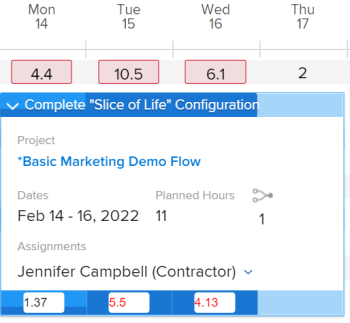

# Présentation des heures planifiées

Les Heures planifiées associées à une tâche, à une publication ou à un projet représentent le temps nécessaire aux utilisateurs affectés pour terminer la tâche, la publication ou le projet.

## Points à prendre en compte concernant les heures planifiées dans Adobe Workfront

* Les heures planifiées sont principalement associées aux tâches (tâches et problèmes) dans Adobe Workfront. Les Heures planifiées des tâches s’étendent jusqu’aux Heures planifiées de leurs projets.
* Par défaut, Workfront répartit la tâche et publie les heures planifiées de manière égale sur tous les jours de la durée de la tâche ou du problème.
* Lorsque des utilisateurs et des rôles sont affectés à des tâches et des problèmes, les heures planifiées des tâches et des problèmes sont associées aux affectations d’utilisateurs ou de rôles.
* Si vous souhaitez utiliser les outils de gestion des ressources dans Workfront, vous devez définir la valeur des heures planifiées pour les tâches et les problèmes.
* Vous ne pouvez modifier la valeur des heures planifiées sur les tâches que pour certains types de durée.

   Pour plus d’informations sur la modification des heures planifiées sur les tâches par rapport au type de durée des tâches, consultez la section [Mise à jour des heures planifiées de la tâche en fonction du type de durée](#update-task-planned-hours-based-on-duration-type) dans cet article.

* Vous pouvez, à tout moment, modifier la valeur des Heures planifiées pour les problèmes.
* Vous ne pouvez pas modifier la valeur des Heures planifiées des projets ou des tâches parentes, car il s’agit d’un total calculé de toutes les Heures planifiées de toutes leurs tâches et sous-tâches.
* La gestion de la répartition des utilisateurs à l’aide des outils de gestion des ressources peut modifier le nombre d’heures planifiées de tâches, de problèmes, de projets et de tâches associées aux tâches.

## Heures planifiées pour les tâches par rapport aux heures planifiées pour les projets {#planned-hours-on-tasks-vs-planned-hours-on-projects}

Heures planifiées à partir des tâches cumulées jusqu’aux Heures planifiées du projet. Les heures planifiées issues des problèmes ne correspondent pas toujours aux heures planifiées du projet.

Cette section décrit les différences entre la tâche et les heures planifiées du projet. Il décrit également où vous pouvez afficher le problème Heures planifiées cumulées au projet.

* [Heures planifiées pour les tâches](#planned-hours-on-tasks)
* [Heures planifiées sur les projets](#planned-hours-on-projects)

### Heures planifiées pour les tâches {#planned-hours-on-tasks}

Les Heures planifiées d’une tâche indiquent la durée estimée du travail réel sur la tâche. Par défaut, Workfront répartit uniformément le nombre total d’heures planifiées pour chaque jour pendant la durée de chaque tâche. Le nombre quotidien d’heures planifiées devient l’affectation quotidienne de la tâche. Si la tâche est affectée à plusieurs ressources, chaque ressource se voit attribuer par défaut un nombre égal d&#39;heures quotidiennes.

A l’aide de l’équilibreur de charge de travail, vous pouvez modifier les allocations quotidiennes des utilisateurs affectés aux tâches. Cela peut également mettre à jour les heures planifiées de la tâche lorsque le type de durée de la tâche est simple. Pour plus d’informations, voir la section &quot;Mettre à jour les heures planifiées de la tâche lors de la gestion des affectations utilisateur&quot; de l’article [Gestion des affectations utilisateur dans l’équilibreur de charge de travail](../../../resource-mgmt/workload-balancer/manage-user-allocations-workload-balancer.md).

Lorsqu’une tâche contient des sous-tâches, les Heures planifiées de la tâche parent sont la somme de toutes les Heures planifiées de toutes les sous-tâches. Vous ne pouvez pas mettre à jour les Heures planifiées d’une tâche parent.

>[!NOTE]
>
>Contrairement aux Heures planifiées, les Heures réelles d’une tâche parente sont les heures consignées directement sur la tâche parente. Elles ne représentent pas la somme des Heures réelles des tâches des enfants.\
>Pour plus d’informations sur les heures réelles, voir [Afficher les heures réelles](../../../manage-work/tasks/task-information/actual-hours.md).

### Heures planifiées sur les projets {#planned-hours-on-projects}

Vous ne pouvez pas modifier le nombre d’heures planifiées sur un projet. Les heures planifiées d’un projet sont la somme calculée de toutes les heures planifiées de toutes les tâches du projet.

Le fait que des problèmes soient inclus dans le calcul des heures planifiées dépend de l’emplacement du projet dans lequel vous affichez les heures planifiées. Vous pouvez afficher les heures planifiées du projet aux emplacements suivants dans un projet :

* **Détails du projet** **section** ****et le **Modifier le projet**box **:**Seules les Heures planifiées pour les tâches du projet sont prises en compte. Les heures planifiées pour les problèmes du projet ne sont pas prises en compte lors de l’affichage du nombre total d’heures planifiées pour le projet dans la section Détails du projet ou dans la zone Modifier le projet .

* **L’équilibreur de charge de travail **: Seules les heures planifiées associées aux tâches visibles dans l’équilibreur de charge de travail s’affichent dans l’équilibreur de charge de travail pour les projets. Les affectations quotidiennes de l’utilisateur peuvent modifier les heures planifiées quotidiennes du projet dans l’équilibreur de charge de travail.
* **Section Utilisation :** Les Heures planifiées associées aux utilisateurs affectés aux tâches et problèmes du projet sont prises en compte lors de l’affichage du nombre total d’Heures planifiées du projet dans la section Utilisation .
* **Panneau Attribution des rôles** dans la liste des tâches : Les heures planifiées pour les tâches et les problèmes du projet affectés à un rôle de tâche ou à un utilisateur associé à un rôle de tâche s’affichent dans cette zone. Les heures planifiées associées aux tâches et aux problèmes qui ne sont pas affectés ou affectés aux équipes ne s’affichent pas dans cette zone. Pour plus d’informations, voir [Affichage des heures planifiées du projet dans le panneau Attribution des rôles](../../../manage-work/projects/planning-a-project/view-planed-hours-in-role-allocation-panel.md).

## Répartition des heures planifiées sur la durée d’une tâche

Par défaut, Workfront répartit les heures planifiées uniformément sur la durée d’une tâche, allouant un nombre égal d’heures planifiées pour chaque jour de la tâche, en fonction de la disponibilité du planning du projet.

Par exemple, si une tâche doit commencer à 16 heures et qu’il reste une heure au premier jour de la tâche, Workfront place une heure planifiée le premier jour de la durée de la tâche, puis divise le reste des heures planifiées de manière égale entre le reste des jours de la durée de la tâche.

>[!NOTE]
>
>Les Heures planifiées par jour ou l’allocation quotidienne sont l’allocation des Heures planifiées pour chaque jour pendant la durée de la tâche. Si la tâche n’a qu’une affectation, ce nombre représente les Heures planifiées par jour et par affectation. Si la tâche comporte plusieurs affectations, les Heures planifiées par jour et par affectation sont différentes des Heures planifiées par jour pour la tâche. Il n’existe aucune représentation visuelle dans Workfront pour les heures planifiées par jour et par affectation, pour les tâches avec plusieurs affectations.

## Localisation et compréhension des valeurs des heures planifiées

Les valeurs Heures planifiées se trouvent dans différentes zones de Workfront. 

Le nombre d’heures planifiées affichées provient des tâches du projet ou est calculé différemment selon la zone et l’objet dans lequel vous les visualisez.

Vous pouvez localiser Heures planifiées dans les zones suivantes de Workfront :

* [Section Détails d’un projet, d’une tâche ou d’un problème](#the-details-section-of-a-project-task-or-issue)
* [Zone Modifier la tâche ou Modifier le problème](#the-edit-task-or-edit-issue-box)
* [Rapports](#reports)
* [L’équilibreur de charge de travail](#the-workload-balancer)
* [Le planificateur de ressources](#the-resource-planner)
* [Rapport Utilisation](#the-utilization-report)
* [Panneau Attribution des rôles](#The%C2%A0Role)

### Section Détails d’un projet, d’une tâche ou d’un problème {#the-details-section-of-a-project-task-or-issue}

Les Heures planifiées dans la section Détails d’une tâche, d’un problème ou d’un projet sont le nombre total d’Heures planifiées associées à l’élément correspondant.

Pour plus d’informations sur les heures planifiées du projet, voir [Heures planifiées pour les tâches par rapport aux heures planifiées pour les projets](#planned-hours-on-tasks-vs-planned-hours-on-projects) dans cet article.

### Zone Modifier la tâche ou Modifier le problème {#the-edit-task-or-edit-issue-box}

Les Heures planifiées dans la zone Modifier d’une tâche ou d’un problème correspondent au total des Heures planifiées de l’élément correspondant.

Pour plus d’informations sur les heures planifiées du projet, voir [Heures planifiées pour les tâches par rapport aux heures planifiées pour les projets](#planned-hours-on-tasks-vs-planned-hours-on-projects) dans cet article.

Pour les tâches, vous pouvez modifier le montant des heures planifiées uniquement pour certains types de durée. Pour plus d’informations, voir [Mise à jour des heures planifiées de la tâche en fonction du type de durée](#update-task-planned-hours-based-on-duration-type) dans cet article.

Vous pouvez afficher l’affectation individuelle des heures planifiées pour chaque utilisateur ou rôle de tâche affecté à la tâche ou au problème dans la zone Affectations .

### Rapports {#reports}

Vous pouvez ajouter le champ Heures planifiées dans les rapports de projet, de tâche et d’émission.

Par défaut, la colonne Heures planifiées est incluse dans la vue Standard d’une liste de tâches.

Le rapport Heures planifiées d’une tâche, d’un problème ou d’un projet correspond au total des Heures planifiées de l’élément respectif, tel qu’il s’affiche dans la section Détails ou dans la zone Modifier des éléments.

Pour plus d’informations sur la création de rapports, voir [Création d’un rapport personnalisé](../../../reports-and-dashboards/reports/creating-and-managing-reports/create-custom-report.md).

>[!NOTE]
>
>Si vous créez un rapport Projet (données financières) et le regroupez par date, les Heures planifiées peuvent afficher une partie des Heures planifiées du projet selon la chronologie des tâches du projet. Par défaut, Workfront répartit uniformément les heures planifiées des tâches pour chaque jour de la durée de la tâche. Les Heures planifiées pour une certaine période correspondent à la répartition égale définie par Workfront pour cette période dans le rapport Projet (données financières) .

<!--
### The Scheduling areas  {#the-scheduling-areas}

The Planned Hours for tasks and issues display in the Scheduling areas in the Planned Hours field.

You can view the daily allocation of Planned Hours for each user assigned to a task or an issue in the Scheduling areas.

The daily hour amount represents one of the following:

* the default amount equally distributed by Workfront for each day of the Duration of the tasks or issues
* the adjusted daily allocation managed by resource managers.

  For information about adjusting daily allocations in the Scheduling tools, see [Manage user allocations in the Scheduling areas](../../../resource-mgmt/resource-scheduling/manage-allocations-scheduling-areas.md).
-->

### L’équilibreur de charge de travail {#the-workload-balancer}

Les heures planifiées suivantes pour les tâches, problèmes et projets s’affichent dans l’équilibreur de charge de travail à droite de la tâche, du problème ou du nom du projet :

* Pour les tâches et les problèmes, les Heures planifiées qui y sont associées s’affichent.
* Pour les projets, un total des heures planifiées des tâches et des problèmes visibles à l’écran s’affiche.

   >[!TIP]
   >
   >L’équilibreur de charge de travail n’affiche pas toutes les heures planifiées d’un projet comme visible dans la zone Détails du projet.

Vous pouvez afficher l’allocation quotidienne des heures planifiées pour chaque utilisateur affecté à une tâche ou à un problème dans l’équilibreur de charge de travail.

Le nombre d’heures planifiées par jour représente l’une des heures suivantes : 

* le montant par défaut réparti uniformément par Workfront pour chaque jour de la durée des tâches, des problèmes ou du projet ;
* l’affectation quotidienne ajustée gérée par les gestionnaires de ressources.

   Pour plus d’informations sur l’ajustement des allocations quotidiennes dans l’ équilibreur de charge de travail , voir [Gestion des affectations utilisateur dans l’équilibreur de charge de travail](../../../resource-mgmt/workload-balancer/manage-user-allocations-workload-balancer.md).

### Le planificateur de ressources {#the-resource-planner}

Le planificateur de ressources affiche les heures planifiées pour les projets, les tâches et les problèmes.

Vous pouvez afficher les affectations hebdomadaires des heures planifiées pour les utilisateurs et les rôles de tâche associés aux tâches dans la colonne PLN du planificateur de ressources.

>[!TIP]
>
>Les ajustements quotidiens de l’équilibreur de charge de travail influent sur les affectations hebdomadaires pour les tâches et les problèmes du planificateur de ressources.

Le nombre d’heures planifiées pour chaque objet varie en fonction de la vue que vous appliquez au planificateur de ressources. Pour plus d’informations, voir [Vue d’ensemble des heures, de l’éditeur de texte enrichi et des coûts dans les vues Projet et Rôle du planificateur de ressources](../../../resource-mgmt/resource-planning/overview-of-planner-hour-fte-cost-information-in-role-project-views.md).

Le nombre d’heures planifiées par semaine pour les tâches et les problèmes représente l’un des éléments suivants : 

* le montant hebdomadaire par défaut réparti uniformément par Workfront pour chaque jour de la durée des tâches ou des problèmes ;
* l’affectation hebdomadaire ajustée gérée par les gestionnaires de ressources dans l’équilibreur de charge de travail.

   Pour plus d’informations sur l’ajustement des allocations quotidiennes dans l’ équilibreur de charge de travail , voir [Gestion des affectations utilisateur dans l’équilibreur de charge de travail](../../../resource-mgmt/workload-balancer/manage-user-allocations-workload-balancer.md).

Le montant hebdomadaire des projets, des utilisateurs et des rôles dépend du nombre hebdomadaire d’heures planifiées pour les tâches et les problèmes qui y sont associés.

### Rapport Utilisation {#the-utilization-report}

Les heures planifiées du projet sont celles associées aux affectations pour chaque tâche et chaque problème.

>[!IMPORTANT]
>
>Notez que les Heures planifiées du rapport Utilisation sont associées aux affectations et non aux tâches et problèmes eux-mêmes. Les heures planifiées du rapport Utilisation ne correspondent pas toujours aux heures planifiées sur les tâches et les problèmes du projet. Toutefois, les heures planifiées correspondent aux heures associées aux affectations sur les tâches et les problèmes.

Vous pouvez afficher les types d’heures planifiées suivants dans le rapport Utilisation :

* le nombre total d’heures planifiées de toutes les affectations du projet pour la durée de vie globale des projets inclus ;
* le total des heures planifiées de toutes les affectations uniquement pour la période spécifiée (vous pouvez spécifier une semaine ou un mois spécifique).

   Lorsque l’affectation quotidienne de l’utilisateur pour les heures a été ajustée à l’aide de l’équilibreur de charge de travail, les heures planifiées d’une période spécifique peuvent être affectées si les dates sélectionnées dans le rapport Utilisation contiennent seulement une partie de la durée d’une tâche ou d’un problème. Pour plus d’informations sur l’ajustement des allocations quotidiennes pour les utilisateurs, voir [Gestion des affectations utilisateur dans l’équilibreur de charge de travail](../../../resource-mgmt/workload-balancer/manage-user-allocations-workload-balancer.md).

Pour plus d’informations, voir [Affichage des informations sur l’utilisation des ressources](../../../resource-mgmt/resource-utilization/view-utilization-information.md).

### Panneau Attribution des rôles

Dans le panneau Affectation du rôle, les heures planifiées représentent le nombre d’heures planifiées associées à chaque rôle de tâche affecté aux tâches ou aux problèmes du projet pendant toute la durée du projet. Le nombre correspond au rôle Heures planifiées du planificateur de ressources.

>[!TIP]
Notez que les heures planifiées associées aux utilisateurs ne s’affichent pas dans le panneau Attribution des rôles .

Pour plus d’informations, voir [Afficher l’affectation des rôles pour les projets et les initiatives dans l’équilibreur de charge de travail](../../../scenario-planner/show-role-allocation-workload-balancer.md).

## Mise à jour des heures planifiées de la tâche en fonction du type de durée {#update-task-planned-hours-based-on-duration-type}

Vous ne pouvez mettre à jour le total des heures planifiées sur les tâches lors de l’édition des tâches que si les tâches ont un certain type de durée.

Les scénarios suivants existent :

* Vous ne pouvez modifier les heures planifiées pour les tâches que lorsque vous utilisez les types d’affectation calculée ou de durée simple lors de la modification d’une tâche.

   Pour plus d’informations sur le type de durée d’affectation calculée, voir [Présentation du type de durée : Attribution calculée](../../../manage-work/tasks/taskdurtn/calculated-assignment.md).

   Pour plus d’informations sur le type de durée simple, voir [Présentation du type de durée : Simple](../../../manage-work/tasks/taskdurtn/simple-duration-type.md).

* Vous ne pouvez mettre à jour les heures planifiées de la tâche dans l’équilibreur de charge de travail que pour les tâches de type Durée simple lorsque vous gérez les affectations des utilisateurs aux tâches. Pour plus d’informations sur la gestion des affectations d’utilisateurs dans l’équilibreur de charge de travail, voir [Gestion des affectations utilisateur dans l’équilibreur de charge de travail](../../../resource-mgmt/workload-balancer/manage-user-allocations-workload-balancer.md).
* Vous ne pouvez pas modifier les heures planifiées pour les tâches avec un type de durée de travail piloté par l’effort ou de travail calculé. Dans ce cas, Workfront détermine les heures planifiées en fonction de la durée de la tâche. toutefois, dans ce cas, les heures planifiées sont toujours égales à la durée (en heures) et elles ne sont pas affectées par la répartition en pourcentage des ressources affectées.

   Pour plus d’informations sur le type de durée pilotée par l’effort, voir [Présentation du type de durée : Effort piloté](../../../manage-work/tasks/taskdurtn/effort-driven.md).

   Pour plus d’informations sur le type de durée de travail calculée, voir [Présentation du type de durée : Travail calculé](../../../manage-work/tasks/taskdurtn/calculated-work.md).

## Mettre à jour les heures planifiées de la tâche lors de la gestion des affectations utilisateur

Vous pouvez mettre à jour les heures planifiées pour les tâches lorsque vous mettez manuellement à jour les affectations de rôles d’utilisateur ou de tâche en tâches. Cela n’est possible que si les tâches ont un type de durée simple.

Pour plus d’informations, voir [Présentation du type de durée : Simple](../../../manage-work/tasks/taskdurtn/simple-duration-type.md).

Vous pouvez mettre à jour l’affectation globale des utilisateurs et des rôles affectés à la tâche, ou les affectations quotidiennes de l’utilisateur lors de l’utilisation de l’équilibreur de charge de travail.

Pour plus d’informations sur la gestion de l’affectation globale des rôles utilisateur et de tâche pour les tâches, voir [Gestion des heures d’affectation des utilisateurs et des rôles pour les tâches](../../../manage-work/tasks/assign-tasks/manage-allocation-hours-on-tasks.md).

Pour plus d’informations sur la gestion des affectations quotidiennes pour les tâches, voir [Gestion des affectations utilisateur dans l’équilibreur de charge de travail](../../../resource-mgmt/workload-balancer/manage-user-allocations-workload-balancer.md).

Les scénarios suivants se produisent lors de la mise à jour manuelle des affectations de rôles utilisateur ou de tâche pour les tâches :

* Lorsque vous n’avez pas manuellement mis à jour les affectations utilisateur ou rôle individuelles pour déclencher une modification des heures planifiées de la tâche, les heures planifiées restent inchangées lorsque vous ajoutez, supprimez ou remplacez des affectations sur la tâche. Lors de l’ajout d’une nouvelle affectation à la tâche, les affectations individuelles sont redistribuées entre tous les cessionnaires.
* Lorsque vous avez mis à jour manuellement les affectations afin de déclencher une modification des heures planifiées de la tâche, les heures planifiées diminuent lorsque vous supprimez des affectations de la tâche. Elles restent inchangées lorsque vous remplacez une affectation.
* Lorsque vous avez mis à jour manuellement les affectations afin de déclencher une modification de la tâche Heures planifiées et que vous ajoutez une affectation à la tâche, la nouvelle affectation se voit attribuer 0 heure par défaut. Vous devez mettre à jour manuellement leur allocation à la tâche, ce qui peut affecter les Heures planifiées.
* Lorsque vous n’avez pas manuellement mis à jour les affectations pour déclencher une modification des heures planifiées de la tâche et que vous supprimez toutes les affectations à la tâche, les heures planifiées restent inchangées.
* Lorsque vous avez mis à jour manuellement les affectations afin de déclencher une modification de la tâche Heures planifiées et que vous supprimez toutes les affectations à la tâche, les Heures planifiées sont également supprimées et les Heures planifiées de la tâche deviennent 0.

>[!NOTE]
Par exemple, si une tâche comporte 10 heures planifiées et que vous avez deux personnes désignées, chacune se voit attribuer 5 heures, par défaut.
* Si vous ne mettez pas à jour l’affectation individuelle de l’utilisateur ou les allocations quotidiennes à l’aide de l’équilibreur de charge de travail et que vous supprimez tous les ou n’importe lequel des cessionnaires de la tâche, la tâche Heures planifiées reste de 10 heures.
* Si vous définissez manuellement les affectations des affectations sur 4 et 6 heures, respectivement, et que vous supprimez l’utilisateur affecté à 6 heures ainsi que son rôle de tâche, la tâche Heures planifiées passe à 4 heures. Si vous supprimez également l’utilisateur qui a été affecté à 4 heures, mais que vous conservez le rôle de tâche associé à l’utilisateur supprimé, les Heures planifiées de la tâche restent 4 heures. Si vous supprimez le dernier utilisateur qui a été affecté à 4 heures ainsi que son rôle de tâche et que la tâche reste non affectée, la tâche Heures planifiées de la tâche devient 0.

## Mise à jour automatique des heures planifiées de la tâche à l’aide de l’effort de travail

Lorsque vous utilisez l’effort de travail pour estimer l’effort nécessaire à la réalisation d’une tâche, le nombre d’heures planifiées pour les tâches est automatiquement mis à jour. Cela est possible uniquement pour les tâches avec un type de durée simple.

Pour plus d’informations sur l’utilisation de l’effort de travail pour estimer l’effort de tâche, voir [Présentation de l’effort de travail](../../../manage-work/tasks/task-information/work-effort.md).

<!--

(NOTE: this issue has the explanation of how Planned Hours should work - from Vazgen and Anna: https://hub.workfront.com/issue/6217dced00730b7034c4b808339a35ce/

-->

<!--

Details of their comments: 

-->

<!--

Anna Asatryan

3/22/2022 At 3:16 PM

&nbsp;

to Mark Paul, Corrie Butler, Arman Simonyan, Gagik Khalatyan, Alina Wilson, Artur Sargsyan, Vazgen Babayan, Anna Asatryan

I have done some rough calculations on what the planned hours/revenues should look like Book.xlsx . And if we look, for example at the 2 users highlighted in one of the screenshots their planned hours look way off from what the calculation looks like in the spreadsheet (i.e. equally distributed allocation). When looking at the Workload balancer (the second screenshot), as an example for the user Yashas Mitta, I can see that the allocation has been modified. Obviously the utilization report calculates the allocations based on the modified contouring using the new work per day calculation. The project financial report uses the old, equal distribution of allocation along the full duration of the task. Hence. there is a difference when grouping per periods.

Vazgen Babayan

I believe we will need to prioritise syncing the project financial data report with the new work per day.

Alina Wilson

@Anna Asatryan , do you have a definition of what we should say in documentation (glossary, for example) for how the Planned Hours (or Planned Revenue) is calculated, keeping in mind that we don't document the concept of "workPerDay". We call them "daily allocations", for example, but let me know if that's accurate, too.

Vazgen Babayan

Last Thursday at 3:13 PM

I think an important note here is that regardless the calculation, even if the both views used the same formula, they will not display the same data, because the underlying data sources are different. The Financial Data report does not respect user-entered allocations in Workload Balancer at this moment. So there will be a clear discrepancy, as Anna showed in her message. My recommendation for communication will be to explain that the data sources are different so there can be a mismatch in data and that we will look into addressing that on our roadmap.

Alina Wilson

So far, I hear you guys say this (with my questions for confirmation/ comments in bold):

- the utilization report calculates the allocations based on the modified contouring using the new work per day calculation (so this is what we see in the Workload Balancer, right?)

- the project financial report uses the old, equal distribution of allocation along the full duration of the task (this is before the daily allocations for example were modified in the WB, right?)

I have these additional questions:

- what does the Project Details show? Which Planned Hours, for instance - because earlier, we had a question about this also. - which numbers?

- what does any Planned Hours/ Planned Revenue field that can be pulled in any other report (outside of Financial Data and Utilization reports) show? - which numbers?

- are there any other areas I am not thinking of that we need to document, @Corrie Butler

I will try to document all the possible areas where these display but please help. Thanks!

Vazgen Babayan

Last Saturday at 3:41 PM

<ul>
<li> 
Confirming the first two points 
 </li>
</ul>

For the following questions

<ul>
<li> 
Project details show an aggregated sum of task planned hours. It doesn't have anything to do with the work per day because it always deals with total numbers for the whole duration of the Project/Task.
 </li>
<li> 
Same thing applies to the Planned Hours and Planned Revenue fields in reports - they show totals for the whole Project/Task duration and thus have no use of work per day.
 </li>
<li> 
Can't think of any other fields related to this right now.
 </li>
<li> 
In general, if I were to summarize the system behavior, it's as follows:
 </li>
<li> 
Every area that only deals with total numbers of Planned Hours / Planned Revenue, uses the numbers entered on the tasks. Those are Task / Project Details, reports exposing those fields.
 </li>
<li> 
Areas that deal with time-sensitive portions of Planned Hours / Planned Revenue, use work per day. Those are all Resource Management tools - Workload Balancer, Resource Planner, Utilization Report, importing projects via Scenario Planner.
 </li>
<li> 
All the areas in the second point support user-edited allocations made in Workload Balancer.
 </li>
<li> 
Scheduling area and Project Financial Data reports use the old version of the work per day, which doesn't respect user-edited allocations from Workload Balancer.
 </li>
<li> 
Scheduling will be removed this year, and we need to do work to move the Project Financial Data reports to the new work per day sometime after Q3.
 </li>
</ul>

Alina Wilson

@Vazgen Babayan , one clarifying question: when you say "Scheduling and Project Financial Data reports use the old version of the work per day, which doesn't respect user-edited allocations from WB" - you mean that those use the system default which spreads the allocations evenly, correct? Because you can edit (daily) allocations in Scheduling tools, but it doesn't use that, correct? It uses the default of the daily allocation that the system figures out when dividing the Planned Hours by the number of days in the Duration. Please let me know. And thanks!

Anna Asatryan

Yesterday at 11:42 AM

@Alina Wilson , that's correct, when saying "Scheduling and Project Financial Data reports use the old version of the work per day, which doesn't respect user-edited allocations from WB" Vazgen meant that it spreads the allocation evenly.

As for the scheduling, the allocation modification that's being done there isn't reflected anywhere else in the application other than in the Scheduling itself. That's probably one of the reasons it's being deprecated.

-->

<!--

   

-->

<!--

(NOTE: everything below is drafted because I replaced it with the table above)

-->

<!--

You can find the Planned Hours information on tasks, issues, or projects in the following locations:

-->

<!--

The Planned Hours in the Details  section  of a task, issue, or project are the total Planned Hours of the respective item. 

Finding the Planned Hours in the Details  section  is identical for tasks, issues, and projects. 
 <note type="tip">
You cannot edit the Planned Hours of projects manually, as they are a calculation of all Planned Hours of all the tasks on the project.
</note>

To locate the Planned Hours value on the Details  section  of a task: 

<ol>
<li value="1">Go to a task for which you want to review the Planned Hours.</li>
<li value="2"> 
Click <strong>Task Details</strong> in the left panel. 
 </li>
<li value="3"> 
Click the <strong>Overview</strong> area and notice the Planned Hours value.
 
This value represents the time it would take the user assigned to the task to complete it. 
 </li>
</ol>

-->

<!--

<h3> </h3>

The Planned Hours in the Edit box of a task, issue, or project are the total Planned Hours of the respective item. 

Finding the Planned Hours while editing a task or an issue is identical. 
 <note type="tip">
You cannot edit the Planned Hours of projects manually, as they are a calculation of all Planned Hours of all the tasks on the project.
</note>

To locate the value of Planned Hours while editing a task:

<ol>
<li value="1">Go to the task or issue you want to view Planned Hours for.</li>
<li value="2"> 
Click the <strong>More</strong> icon  next to the task name, then click <strong>Edit</strong>.
 
The Planned Hours are located in the <strong>Overview</strong> section. 
 </li>
</ol>

-->

<!--

The Planned Hours column is included in the Standard view of a task list, by default. For issues and projects, you can add it to the view, when you are editing the view or when you build a report. 

The Planned Hours in a task, issue, or project report are the total Planned Hours of the respective item as they display in the Details  section  or the Edit box of the items. 

Adding the Planned Hours column to a project view is similar to building a view in a project report. 

To show Planned Hours in a project report:

<ol>
<li value="1"> 
Click the <strong>Main Menu</strong> icon  in the upper-right corner of Workfront, then click <strong>Reports</strong>. 
 </li>
<li value="2">Click <strong>New Report</strong>, then choose <strong>Project</strong> as your object.</li>
<li value="3">Click <strong>Add Column</strong>, and start typing <strong>Planned Hours</strong> when the <strong>Show in this column</strong> drop-down field is displayed. Select the field when it appears in the list.</li>
<li value="4"> 
Click <strong>Save + Close</strong> to save the report. 
 
The Planned Hours column shows the total number of Planned Hours on each project. 
 </li>
</ol>

-->

<!--

Planned Hours in Resource Management tools
 <note type="important">
When viewing Planned Hours in the Resource Management tools by a specific time frame, the daily allocations for each work item and the daily allocations for the resources assigned to the work items during that time frame can influence the daily Planned Hours of projects or work items.
</note>

You can see the value of Planned Hours for your tasks, issues, or projects when using the following Resource Management tools:

<ul>
<li> 
Resource Planner
 
For information about using the Resource Planner, see <a href="../../../resource-mgmt/resource-planning/get-started-resource-planner.md" class="MCXref xref">Resource Planner overview</a>.
 </li>
<li> 
Utilization Report.
 
For information about the utilization report, see <a href="../../../reports-and-dashboards/reports/using-built-in-reports/resource-utilization-report.md" class="MCXref xref">Overview of the Resource Utilization report</a>.
 </li>
<li>

Workload Balancer or Scheduling areas in the following sections:

<ul>
<li>Scheduling or Workload Balancer sections in the Resourcing area</li>
<li>Scheduling or Workload Balancer section at the project level</li>
<li>Schedule or Workload Balancer section at the team level</li>
</ul>

 
For information about scheduling resources, see <a href="../../../resource-mgmt/resource-scheduling/get-started-resource-scheduling.md" class="MCXref xref">Get started with Resource Scheduling</a>.
 
For information about the Workload Balancer, see <a href="../../../resource-mgmt/workload-balancer/overview-workload-balancer.md" class="MCXref xref">Overview of the Workload Balancer</a>. 
 </li>
<li> 
<b>Role Allocation panel</b> in the project  task list or  Workload Balancer: The Planned Hours for the tasks and the issues on the project that are assigned to a job role or a user associated with a job role are taken into account in this area. For more information, see <a href="../../../manage-work/projects/planning-a-project/view-planed-hours-in-role-allocation-panel.md" class="MCXref xref">View project Planned Hours in the Role Allocation panel</a>. 
 </li>
</ul>

-->
