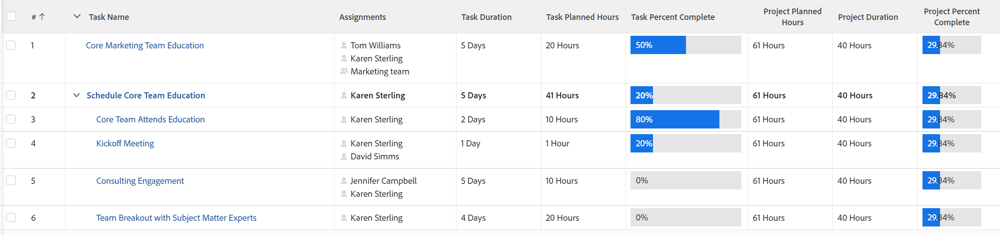

# Vue d’ensemble du pourcentage terminé du projet

<!-- Audited 01/2024 -->

La valeur Pourcentage terminé d’un projet est calculée en fonction de la durée ou du nombre d’heures prévues des tâches du projet. Votre administrateur ou administratrice Adobe Workfront ou un administrateur ou une administratrice de groupes définit la valeur qui est prise en compte lors du calcul du pourcentage terminé dans votre système lors de la configuration des informations dans la zone Préférences du projet.

Pour plus d’informations sur la configuration des préférences de projet, voir [Configurer les préférences du projet à l’échelle du système](../../../administration-and-setup/set-up-workfront/configure-system-defaults/set-project-preferences.md).

Le pourcentage terminé d’une tâche parent est basé sur la durée ou le nombre d’heures prévues de chacune de ses sous-tâches.

De même, le pourcentage terminé d’un projet est basé sur les durées ou le nombre d’heures prévues de chaque tâche principale du projet.

Les tâches principales sont les tâches parent et les tâches autonomes qui n’ont pas d’enfants.

>[!TIP]
>
>Les tâches principales ne sont pas mises en avant dans un plan de projet.

## Calculer le pourcentage terminé dans Workfront

### Mettre à jour le pourcentage terminé sur une tâche {#update-the-percent-complete-on-a-task}

Vous pouvez modifier manuellement le pourcentage terminé d’une tâche. Ce n’est pas un calcul.

Workfront utilise le pourcentage terminé d’une tâche individuelle pour calculer le pourcentage terminé de sa tâche parent ou le pourcentage terminé du projet.

Pour plus d’informations sur la mise à jour du pourcentage terminé d’une tâche, consultez [Afficher et mettre à jour le pourcentage terminé des tâches](../../../manage-work/projects/updating-work-in-a-project/view-update-percent-complete-for-tasks.md).

### Calculer le pourcentage terminé sur une tâche parent dans Workfront {#how-workfront-calculates-percent-complete-on-a-parent-task}

Selon ce que votre administrateur ou administratrice Workfront ou de groupes a sélectionné dans les préférences du projet au niveau du système ou du groupe, le pourcentage terminé d’une tâche parent est calculé en fonction de la durée ou du nombre d’heures prévues des tâches.

Tenez compte des scénarios suivants :

* Si le système calcule le pourcentage terminé sur la base du nombre d’heures prévues, le pourcentage terminé de la tâche parent est calculé à l’aide de la formule suivante :

  `Parent Task Percent Complete = (((Task 1 Planned Hours * Task 1 Percent Complete) + (Task 2 Planned Hours * Task 2 Percent Complete))/Total Planned Hours of Parent)*100`

  Le total du nombre d’heures prévues de la tâche parent représente la somme de toutes les heures prévues de chacun des enfants.

  

* Si le système calcule le pourcentage terminé en fonction de la durée, le pourcentage terminé de la tâche parent est calculé à l’aide de la formule suivante :

  `Parent Task Percent Complete = (((Task 1 Duration * Task 1 Percent Complete) + (Task 2 Duration * Task 2 Percent Complete))/ Total Duration of Parent)*100`

  

  >[!IMPORTANT]
  >
  >La durée totale de la tâche parent est le total de toutes les durées des tâches enfant. Par exemple, une tâche parent avec deux enfants dont la durée respective est de 1 jour et de 2 jours a une durée totale de 3 jours, même lorsque les deux enfants commencent le même jour.

### Calcul du pourcentage terminé sur un projet dans Workfront {#how-workfront-calculates-percent-complete-on-a-project}

Selon ce que votre administrateur ou administratrice Workfront ou de groupes a sélectionné dans les préférences du projet au niveau du système ou du groupe, le pourcentage terminé d’un projet est calculé en fonction de la durée ou du nombre d’heures prévues des tâches principales du projet.

* Si le système calcule le pourcentage terminé sur la base du nombre d’heures prévues, le pourcentage terminé du projet est calculé à l’aide de la formule suivante :

  `Project Percent Complete =(((Task 1 Planned Hours * Task 1 Percent Complete) + (Task 2 Planned Hours * Task 2 Percent Complete))/Total Planned Hours of the Project)*100`

  Le total du nombre d’heures prévues du projet est la somme du nombre d’heures prévues de toutes les tâches principales du projet.

  

  >[!NOTE]
  >
  >La tâche 1 ou la tâche 2 peuvent uniquement être des tâches parent ou des tâches autonomes. Le nombre d’heures prévues et le pourcentage terminé des tâches enfant ne sont pas utilisés dans ce calcul.

* Si le système calcule le pourcentage terminé sur la base de la durée, le pourcentage terminé du projet est calculé à l’aide de la formule suivante :

  `Project Percent Complete = (((Task 1 Duration * Task 1 Percent Complete) + (Task 2 Duration * Task 2 Percent Complete))/Duration of the Project)*100`

  >[!IMPORTANT]
  >
  >La durée du projet est le total de toutes les durées des tâches principales qui affichent un pourcentage terminé. Par exemple, un projet avec une tâche autonome d’une durée de 2 jours et une tâche parent d’une durée de 5 jours pour laquelle un travail a été effectué sur celle-ci aura une durée totale de 7 jours, même si les deux tâches commencent le même jour.

  

  >[!NOTE]
  >
  >La tâche 1 ou la tâche 2 peuvent uniquement être des tâches parent ou des tâches autonomes. La durée et le pourcentage terminé des tâches enfant ne sont pas utilisées dans ce calcul.

## Exemple de pourcentage terminé sur un projet utilisant la durée

Lorsque vous utilisez la durée des tâches pour calculer le pourcentage terminé d’un projet, prenez en compte l’exemple suivant :

Les informations suivantes sont utilisées pour calculer le pourcentage terminé du projet :

* Pourcentage terminé de la tâche autonome (tâche 1 - 20 %)
* Pourcentage terminé de la tâche parent (tâche 2 - 25 %)
* Durée de la tâche 1 (5 jours)
* Durée de la tâche 2 (2 jours)
* Durée du projet (7 jours)

Pour calculer le pourcentage terminé du projet à l’aide de la durée, procédez comme suit :

`Project Percent Complete = (((Task 1 Duration * Task 1 Percent Complete) + (Task 2 Duration * Task 2 Percent Complete))/Duration of the Project)*100`

Ou

`(((5*0.2)+(2*0.25))/7)*100= 21.43%`

<!--drafted, this was the old example:

When using the Planned Duration of the tasks to calculate the percent complete of a project, consider the following example:

percent_complete_on_project_example.png

Only the parent task (Task 1) and the standalone task (Task 8) are used to calculate the percent complete of the project.

The secondary parents of Task 1 are used to calculate the percent complete of the main parent (Task 1).

To calculate the percent complete of the main parent (Task 1), first calculate the percent complete of its secondary parents:

Task 5 Percent Complete = ((14 * 0.75 + 12 * 0.25)/(12 + 14))*100 = 51.92%

Task 2 Percent Complete = ((5 * 0.7 + 2 * 0.5)/(5 + 2))*100 = 64.29 %

Then, to calculate the percent complete of the main parent (Task 1), use the following formula:

Task 1 Percent Complete =((56 * 0.5192 + 7 * 0.6429)/63)*100 = 53.29%

To calculate the percent complete of the project, you will need to have the following numbers ready:

Task 1 Duration (63 hours) and Percent Complete (53.29%)
Task 8 Duration (100 hours) and Percent Complete (4%)
Now, to calculate the percent complete of the project, use the following formula:

Project Percent Complete =((100 * 0.04 + 63 * 0.5329))/163)*100 = 23.05%
-->
