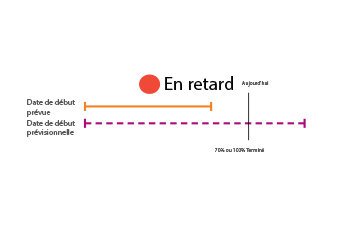

# Vue d’ensemble du statut de progression de la tâche

<!-- Audited: 1/2024 -->

Adobe Workfront détermine le statut de progression d’une tâche en examinant l’avancement de sa chronologie. Vous pouvez configurer Workfront pour qu’il détermine la condition d’un projet en fonction de la valeur du statut de progression des tâches. Pour plus d’informations sur la configuration de la condition du projet, voir l’article [Vue d’ensemble de la condition du projet et du type de condition](../../../manage-work/projects/manage-projects/project-condition-and-condition-type.md).

## Critères déterminant le statut de progression des tâches

Pour plus d’informations sur le statut de progression d’un projet, consultez la section [Vue d’ensemble du statut de progression d’un projet](../../../manage-work/projects/planning-a-project/project-progress-status.md).

Pour plus d’informations sur le suivi de la progression de vos tâches, consultez la section [Vue d’ensemble du mode de suivi des tâches](../../../manage-work/tasks/task-information/task-tracking-mode.md).

Les critères suivants déterminent le statut de progression d’une tâche :

<table> 
 <col> 
 <col> 
 <thead> 
  <tr> 
   <th> 
<strong>Statut de progression</strong> 
 </th> 
   <th> 
<strong>Définir les critères</strong> 
 </th> 
  </tr> 
 </thead> 
 <tbody> 
  <tr valign="top"> 
   <td scope="col"> 
 
 
<strong>À l’heure</strong> 
 </td> 
   <td scope="col"> 
Une tâche est considérée comme étant <strong>À l’heure</strong> lorsque toutes les dates prévues correspondent aux dates prévisionnelles. Ce statut de progression peut également indiquer que le projet est en avance sur le planning et que les dates prévisionnelles peuvent être antérieures aux dates prévues.
 
Pour plus d’informations sur les dates prévisionnelles, consultez la section <a href="../../../manage-work/projects/planning-a-project/project-projected-completion-date.md" class="MCXref xref">Vue d’ensemble de la date d’achèvement prévisionnelle pour les projets, tâches et problèmes</a>.
 
Pour plus d’informations sur la date d’achèvement prévue de la tâche, consultez les articles suivants :
 
    <ul> 
     <li> 
<a href="../../../manage-work/tasks/task-information/task-planned-start-date.md" class="MCXref xref">Vue d’ensemble de la date de début prévue de la tâche</a> 
 </li> 
     <li> 
<a href="../../../manage-work/tasks/task-information/task-planned-completion-date.md" class="MCXref xref">Vue d’ensemble de la date d’achèvement prévue de la tâche</a> 
 </li> 
    </ul> </td> 
  </tr> 
  <tr> 
   <td>

 
<strong>En danger</strong> 
 </td> 
   <td>
Une tâche est considérée comme étant <strong>En danger</strong> lorsque la date d’achèvement estimée est postérieure à la date d’achèvement prévue et postérieure à la date d’achèvement prévisionnelle. Ceci peut arriver quand une tâche est soumise à une contrainte <strong>Il Faut Finir Le</strong> ou <strong>Il Faut Commencer Le</strong>, mais que le pourcentage d’achèvement ou les relations antérieures de la tâche montrent que les dates de début ou de fin spécifiées de cette tâche ne peuvent pas être respectées. 

 Définir manuellement la contrainte de tâche sur <strong>Il Faut Finir Le</strong> détermine une date spécifique pour la date de début prévue. Dans ce cas, la date d’achèvement prévisionnelle correspond à la date d’achèvement prévue. Workfront analyse la tâche pour calculer à quel moment elle se terminera, en fonction du pourcentage d’achèvement, dans le cas de cette contrainte. Ce calcul est stocké en tant qu’échéance estimée. Si l’échéance estimée est postérieure à la date d’achèvement prévisionnelle, la tâche est considérée comme risquant d’être en retard. 
 
 Définir manuellement la contrainte de tâche sur <strong>Il Faut Commencer Le</strong> détermine une date spécifique pour la date de début prévue. Dans ce cas, la date de début prévisionnelle correspond à la date de début prévue. Dans le cas de cette contrainte, Workfront analyse la tâche pour calculer quand elle commencera en fonction de ses relations antérieures. Ce calcul est stocké en tant que date de début estimée. Si une tâche antérieure imposée empêche la tâche de démarrer à la date de début spécifiée, la date de début estimée peut être postérieure à la date d’achèvement prévisionnelle. La tâche est considérée comme étant à risque d’être en retard. 
 
Note : en règle générale, les dates estimées correspondent aux dates prévisionnelles, sauf dans le cas où les contraintes <strong>Il Faut Commencer Le</strong> ou <strong>Il Faut Finir Le</strong> sont utilisées. Dans cette situation, les dates estimées sont toujours calculées en fonction du pourcentage d’achèvement et d’autres facteurs (comme les relations antérieures), alors que les dates prévisionnelles doivent correspondre aux dates prévues qui ont été définies manuellement.
 </td> 
  </tr> 
  <tr> 
   <td> 
<strong>En retard</strong> 
 </td> 
   <td> 
Une tâche est considérée comme étant <strong>En retard</strong> lorsque la date d’achèvement estimée est postérieure ou égale à la date d’achèvement prévue, mais antérieure à la date d’achèvement prévisionnelle.
 
La date d’achèvement prévisionnelle est une vue en temps réel du moment où la tâche sera terminée sur la base des progrès antérieurs. Bien que la tâche ait été lancée tardivement, elle n’est pas encore considérée comme dépassée, car les dates d’achèvement prévues et prévisionnelles sont encore dans le futur, et la tâche peut encore être terminée à temps.
 
Note : les statuts de progression possibles <strong>En retard</strong> et <strong>En danger</strong> sont presque identiques. Cependant, <strong>En danger</strong> indique qu’il existe des contraintes de tâches forcées (« Il Faut Finir Le », « Il Faut Commencer Le », « Dates fixes ») sur l’une des dates prévues ou les deux. Si aucune contrainte forcée n’existe sur la tâche, les dates prévisionnelles correspondent aux dates estimées et reflètent le calcul par le système de la date d’achèvement, en se basant sur la progression actuelle de la tâche. La tâche n’est pas encore considérée comme dépassée, car les dates d’achèvement prévues et prévisionnelles se situent toujours dans le futur, et la tâche peut encore être achevée en temps voulu. Pour plus d’informations sur les dates prévisionnelles et estimées, voir <a href="../../../manage-work/tasks/task-information/differentiate-projected-estimated-dates.md" class="MCXref xref">Aperçu des dates prévisionnelles et estimées </a>.
 </td> 
  </tr> 
  <tr valign="top"> 
   <td> 
<strong>Dépassée</strong> 
 </td> 
   <td> 
Une tâche est considérée comme <strong>Dépassée</strong> lorsque la date d’achèvement prévue est antérieure à la date d’aujourd’hui. 
 </td> 
  </tr> 
 </tbody> 
</table>

<!--hiding this because some users find the images confusing, as they don't really show the dates mentioned in the descriptions above. Keep the pictures though, in case some users will complain that we hid them. 

## How task Progress Status updates over time

The different date types in our projects tell us how tasks are progressing over time:

* On Time

  

* At Risk

  

* Behind

  

* Late

  

-->
