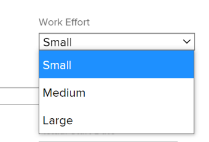

# Présentation de l’effort de travail

<!--Audited: 01/2024-->

<!--
(NOTE: Linked to the UI >> in the Project/ Template edit box > Tasks area> Learn more)
-->

En tant que chef de projet, vous pouvez décider comment estimer la quantité de travail nécessaire à l’exécution des tâches dans un projet. Estimez la quantité de travail nécessaire à l’exécution des tâches à l’aide de l’un des indicateurs suivants :

<table style="table-layout:auto"> 
 <col> 
 <col> 
 <tbody> 
  <tr> 
   <td role="rowheader">Heures prévues</td> 
   <td> <p> Une saisie numérique manuelle ou un calcul Adobe Workfront qui affiche le nombre d’heures nécessaire pour que les ressources affectées à une tâche la terminent. </p> <p>Tenez compte des points suivants au sujet des heures planifiées : </p> 
    <ul> 
     <li>Il s’agit de la méthode par défaut. </li> 
     <li>Vous pouvez mettre à jour manuellement les heures planifiées uniquement pour les tâches avec un type de durée d’affectation calculée ou simple. </li> 
    </ul> <p>Pour plus d’informations sur les heures planifiées, voir <a href="../../../manage-work/tasks/task-information/planned-hours.md" class="MCXref xref">Présentation des heures planifiées</a>. </p> </td> 
  </tr> 
  <tr> 
   <td role="rowheader">Effort de travail </td> 
   <td> <p>Libellé manuel qui définit si l’utilisateur doit faire un effort quotidien important, moyen ou modeste pour terminer une tâche. <!--
      <MadCap:conditionalText data-mc-conditions="QuicksilverOrClassic.Draft mode">
       The level of effort is estimated to be a percentage of the daily amount of working time. (NOTE: keep this drafted. Vazgen said it's not needed, but waiting for feedback from users)
      </MadCap:conditionalText>
     --> </p> <p>Tenez compte des points suivants concernant l’effort de travail :</p> 
    <ul> 
     <li>Ce champ est disponible uniquement pour les tâches avec un type de durée simple. </li> 
     <li>Vous pouvez activer l’utilisation de ce libellé et définir le pourcentage de temps de travail qui lui est associé au niveau du projet. </li> 
    </ul> </td> 
  </tr> 
 </tbody> 
</table>

Cet article décrit l’effort de travail et comment l’utiliser pour estimer la quantité de travail pour vos tâches.

>[!NOTE]
>
>Les heures prévues et l&#39;effort de travail s&#39;influencent mutuellement. La mise à jour des heures planifiées peut mettre à jour l’effort de travail et la mise à jour de l’effort de travail peut mettre à jour les heures planifiées de la tâche.

## Exigences d’accès

Vous devez disposer des accès suivants pour effectuer les étapes de cet article :

<table style="table-layout:auto"> 
 <col> 
 <col> 
 <tbody> 
  <tr> 
   <td role="rowheader">Formule Adobe Workfront</td> 
   <td> <p>Quelconque</p> </td> 
  </tr> 
  <tr> 
   <td role="rowheader">Licence Adobe Workfront*</td> 
   <td> <p>Actuel : formule </p>
   Ou
   <p>Nouveau : Standard </p>
    </td> 
  </tr> 
  <tr> 
   <td role="rowheader">Configuration du niveau d’accès</td> 
   <td> <p>Modifier l’accès aux projets et tâches</p> </td> 
  </tr> 
  <tr> 
   <td role="rowheader">Autorisations d’objet</td> 
   <td> <p>Gestion des autorisations d’un projet et de ses tâches</p>  </td> 
  </tr> 
 </tbody> 
</table>

&#42;Pour connaître le plan, le type de licence ou l’accès dont vous disposez, contactez votre administrateur Workfront. Pour plus d’informations, voir [Conditions d’accès requises dans la documentation Workfront](/help/quicksilver/administration-and-setup/add-users/access-levels-and-object-permissions/access-level-requirements-in-documentation.md).

## Observations relatives à l’utilisation des efforts de travail

* Lorsque les tâches du projet comportent 0 heure planifiée et que vous activez le paramètre Utiliser l’effort de travail pour calculer automatiquement les heures planifiées de la tâche sur le projet, le niveau par défaut de l’effort de travail associé est Moyen. Les heures planifiées sont automatiquement mises à jour pour les tâches de type Durée simple . Pour plus d’informations, voir la section  [Niveaux de travail](#levels-of-work-effort) dans cet article.
* Lorsque les tâches du projet comportent des heures planifiées supérieures à 0 et que vous activez le paramètre Utiliser l’effort de travail pour calculer automatiquement les heures planifiées de la tâche sur le projet, le niveau de l’effort de travail est mis à jour en fonction du nombre d’heures planifiées sans modifier le nombre d’heures planifiées pour les tâches de type Durée simple. Pour plus d’informations, voir la section [Comment Workfront calcule l’effort de travail en fonction des heures planifiées](#how-workfront-calculates-work-effort-based-on-planned-hours) dans cet article.
* Lorsque les tâches du projet comportent 0 heure planifiée et que vous activez le paramètre Utiliser l’effort de travail pour calculer automatiquement le nombre d’heures planifiées de la tâche sur le projet, puis mettez à jour le niveau de l’effort de travail de Moyen à Petit ou Grand, les heures planifiées sont également mises à jour. Pour plus d’informations, voir la section [Comment Workfront calcule les heures planifiées en fonction des efforts de travail](#how-workfront-calculates-planned-hours-based-on-work-effort) dans cet article.
* Lorsque vous insérez des tâches de modification et modifiez simultanément les champs Heures planifiées et Effort de travail pour la tâche, les Heures planifiées sont mises à jour avec la valeur que vous indiquez, tandis que la valeur Effort de travail est calculée en fonction de vos Heures planifiées mises à jour.
* Lorsque vous mettez à jour la valeur Effort de travail d’une tâche, la Durée ne se calcule plus automatiquement en fonction des Heures planifiées. Pour plus d’informations sur le calcul de la durée pour les tâches Durée simple, voir [Présentation du type de durée : simple](../../../manage-work/tasks/taskdurtn/simple-duration-type.md).
* Lorsque vous changez le type de durée d’une tâche de Simple à n’importe quel autre type, le champ Effort de travail est masqué sur la tâche. Les heures prévues restent inchangées.
* Vous ne pouvez pas mettre à jour le niveau Effort de travail sur une tâche parente. Le niveau de l’effort de travail d’une tâche mère est automatiquement calculé en fonction du nombre d’heures planifiées pour les tâches, qui est un cumul de toutes les tâches enfants. Pour plus d’informations sur les tâches parentes, voir [Création de sous-tâches](../../../manage-work/tasks/create-tasks/create-subtasks.md).

## Activation de l’utilisation de l’effort de travail au lieu des heures planifiées

1. Accédez à un projet et cliquez sur le bouton **Plus** menu , puis cliquez sur **Modifier**.
1. Cliquez sur **Paramètres de tâche**, puis sélectionnez l’option **Utiliser l’effort de travail pour calculer automatiquement les heures planifiées de la tâche**. Cette option est désélectionnée par défaut.

   

   Pour plus d’informations sur l’activation de l’utilisation de l’effort de travail sur un projet, voir la section &quot;Paramètres des tâches&quot; dans la section [Modification de projets](../../../manage-work/projects/manage-projects/edit-projects.md) article.

1. Cliquez sur **Tâche** dans le panneau de gauche , cliquez sur le nom d’une tâche pour y accéder.
1. Cliquez sur le bouton **Plus** menu , puis cliquez sur **Modifier**. Assurez-vous que la tâche possède un type de durée simple.

   >[!TIP]
   >
   >Vous pouvez également mettre à jour l’effort de travail d’une tâche dans la section Détails de la tâche .

1. Dans le **Présentation** , cliquez sur le menu déroulant Effort de travail pour corriger la quantité d’effort nécessaire pour terminer la tâche.

   

   Pour plus d’informations sur la mise à jour du champ Effort de travail sur une tâche, consultez les articles suivants :

   * La section &quot;Aperçu&quot; de la variable [Modifier les tâches](../../../manage-work/tasks/manage-tasks/edit-tasks.md) article
   * [Gestion des informations sur la tâche dans la zone Présentation des détails de la tâche](../../../manage-work/tasks/manage-tasks/task-information-in-overview.md)

## Niveaux de travail {#levels-of-work-effort}

En tant que chef de projet, vous pouvez identifier trois niveaux d’effort de travail pour vos projets. Chaque niveau d’effort correspond à un pourcentage du temps quotidien dont les utilisateurs ont besoin pour terminer la tâche.

Lors de la configuration du niveau d’effort de travail, vous devez vous poser la question : &quot;Combien de temps un utilisateur affecté à cette tâche doit-il consacrer chaque jour à cette tâche pour la réaliser à temps ?&quot;

Le tableau suivant illustre les niveaux possibles de l’effort de travail et leurs pourcentages correspondants par défaut. En tant que chef de projet, vous pouvez mettre à jour les pourcentages en fonction des besoins de votre entreprise. Vous procédez comme suit lorsque vous modifiez un projet. Pour plus d’informations sur la modification de projets, voir [Modification de projets](../../../manage-work/projects/manage-projects/edit-projects.md).

En tant qu’administrateur Workfront, vous définissez les heures types par jour de travail dans la zone Préférences du projet de la section Configuration. Il s’agit de la durée journalière considérée comme temps de travail. Pour plus d’informations sur la configuration des préférences de projet pour votre instance de Workfront, voir [Configuration des préférences de projet à l’échelle du système](../../../administration-and-setup/set-up-workfront/configure-system-defaults/set-project-preferences.md).

>[!NOTE]
>
>Dans les exemples ci-dessous, nous supposons que l’administrateur de Workfront a défini le nombre d’heures types par jour de travail sur 8 heures.

<table style="table-layout:auto"> 
 <col> 
 <col> 
 <tbody> 
  <tr> 
   <td>Niveau d'effort professionnel</td> 
   <td>Valeurs en pourcentage</td> 
  </tr> 
  <tr> 
   <td>Petite </td> 
   <td>Un faible niveau d’effort pour terminer une tâche est défini sur 25 % des heures types par jour de travail. Cela signifie qu’une tâche affectée à ce niveau d’effort de travail doit prendre jusqu’à 2 heures par jour pour se terminer en une journée. <code>(0.25*8=2)</code></td> 
  </tr> 
  <tr> 
   <td>Moyen</td> 
   <td> <p>Un niveau d’effort moyen pour terminer une tâche est défini sur 50 % des heures types par jour de travail. Cela signifie qu’une tâche affectée à ce niveau d’effort de travail devrait prendre plus de 2 heures et moins de 6 heures en une seule journée. <code>(0.50*80=4)</code> </p> <p>Remarque : Lorsque le paramètre Utiliser l’effort de travail pour calculer automatiquement les heures planifiées de la tâche est activé sur le projet, il s’agit du paramètre par défaut pour une tâche, si la tâche avait 0 heure planifiée avant l’activation de ce paramètre. La tâche Heures planifiées passe alors à 4 heures. </p> </td> 
  </tr> 
  <tr> 
   <td>Grande</td> 
   <td>Un grand niveau d’effort pour terminer une tâche est défini sur 75 % des heures types par jour de travail. Cela signifie qu’une tâche affectée à ce niveau d’effort de travail doit prendre 6 heures ou plus en un jour. <code>(0.75*8=6)</code></td> 
  </tr> 
 </tbody> 
</table>

## Comment Workfront calcule les heures planifiées en fonction des efforts de travail {#how-workfront-calculates-planned-hours-based-on-work-effort}

Lorsque vous activez le paramètre Utiliser l’effort de travail pour calculer automatiquement les heures planifiées d’une tâche sur un projet, Workfront calcule le nombre d’heures planifiées pour une tâche avec un type de durée simple en utilisant la formule suivante :

```
Task Planned Hours = Number of days in task Duration * Work Effort percentage * Typical hours per work day
```

Par exemple, une tâche avec une durée de 3 jours et un effort de travail de moyenne comporte 12 heures planifiées :

```
Planned Hours = 3*4=12
```

où la valeur type heures par jour de travail est de 8 heures.

>[!TIP]
>
>Lorsqu’une tâche est affectée à plusieurs ressources, les Heures planifiées sont distribuées uniformément à chaque ressource pour chaque jour de la durée de la tâche.

## Comment Workfront calcule l’effort de travail en fonction des heures planifiées {#how-workfront-calculates-work-effort-based-on-planned-hours}

Lorsque vous activez le paramètre Utiliser l’effort de travail pour calculer automatiquement les heures planifiées d’une tâche sur un projet et que vous avez déjà des heures planifiées sur la tâche ou que vous modifiez le nombre d’heures planifiées sur la tâche, Workfront met à jour la valeur de l’effort de travail.

Workfront utilise la formule suivante pour mettre à jour le niveau de l’effort de travail en fonction des heures planifiées :

```
Work Effort level = Task Planned Hours / Duration / Typical hours per work day
```

Par exemple, si vous avez une tâche avec une durée de 2 jours et que vous mettez à jour les heures planifiées de 8 à 20 heures, l’effort de travail de la tâche est mis à jour de Moyen à Grand :

```
Work Effort level = 20 / 2 / 8 = 125 % = Large
```

## Localisation de l’effort de travail pour les tâches et les projets

* [Effort de travail pour les projets](#work-effort-for-projects)
* [Effort de travail pour les tâches](#work-effort-for-tasks)

### Effort de travail pour les projets {#work-effort-for-projects}

Vous pouvez localiser la section Effort de travail sur un projet dans les zones suivantes :

* La zone Paramètres de tâche de la zone Modifier le projet

### Effort de travail pour les tâches {#work-effort-for-tasks}

Vous pouvez localiser le champ Effort de travail d’une tâche dans les zones suivantes :

* Zone Aperçu dans la zone Modifier la tâche
* la zone Présentation de la section Détails de la tâche, dans la zone Temps de travail ;
* Liste de tâches ou rapport
